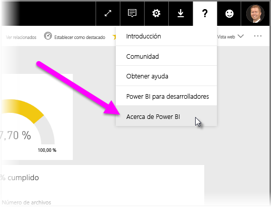

# Guía para la implementación de una puerta de enlace de datos para Power BI

[!INCLUDE [gateway-rewrite](includes/gateway-rewrite.md)]

En este artículo se proporcionan instrucciones y consideraciones para implementar una puerta de enlace de datos para Power BI en el entorno de red.

Para obtener información sobre cómo descargar, instalar, configurar y administrar la puerta de enlace de datos local, consulte [¿Qué es una puerta de enlace de datos local?](/data-integration/gateway/service-gateway-onprem). También puede obtener más información sobre la puerta de enlace de datos local y Power BI si visita el [blog de Microsoft Power](https://powerbi.microsoft.com/blog/) y el sitio de la [comunidad de Microsoft Power BI](https://community.powerbi.com/).

## Consideraciones para la instalación de la puerta de enlace de datos local

Antes de instalar la puerta de enlace de datos local para el servicio en la nube de Power BI, debe tener en cuenta algunas consideraciones. En las secciones siguientes se describen estas consideraciones.

### Número de usuarios

El número de usuarios que usan un informe que utiliza la puerta de enlace es una métrica importante para decidir dónde instalar la puerta de enlace. Estas son algunas preguntas a tomar en consideración:

* ¿Los usuarios utilizan estos informes en distintos momentos del día?
* ¿Qué tipos de conexiones utilizan (DirectQuery o importación)?
* ¿Todos los usuarios utilizan el mismo informe?

Si todos los usuarios tienen acceso a un informe determinado al mismo tiempo cada día, asegúrese de instalar la puerta de enlace en una máquina que sea capaz de controlar todas esas solicitudes. Consulte las secciones siguientes para ver los contadores de rendimiento y los requisitos mínimos que pueden ayudarle a determinar si una máquina es adecuada.

Una restricción en Power BI solo permite *una* puerta de enlace por *informe*. Incluso si un informe se basa en varios orígenes de datos, todos estos orígenes de datos deben pasar a través de una sola puerta de enlace. Si un panel se basa en *varios* informes, puede utilizar una puerta de enlace dedicada para cada informe contribuyente. De esta manera, se distribuye la carga de la puerta de enlace entre esos varios informes que contribuyen a ese panel único.

### Tipo de conexión

Power BI ofrece dos tipos de conexiones: DirectQuery e Importación. No todos los orígenes de datos admiten ambos tipos de conexión. Muchos factores pueden contribuir a elegir uno en lugar del otro, como los requisitos de seguridad, el rendimiento, los límites de datos y los tamaños de los modelos de datos. Para más información sobre los tipos de conexión y orígenes de datos admitidos, consulte la [lista de tipos de orígenes de datos disponibles](service-gateway-data-sources.md#list-of-available-data-source-types).

En función del tipo de conexión en uso, la utilización de la puerta de enlace puede ser diferente. Por ejemplo, intente separar los orígenes de datos de DirectQuery de los orígenes de datos de la actualización programada siempre que sea posible. Se supone que están en diferentes informes y se pueden separar. La separación de los orígenes evita que la puerta de enlace tenga miles de solicitudes de DirectQuery en cola, al mismo tiempo que la actualización programada de la mañana de un modelo de datos de gran tamaño que se usa para el panel principal de la compañía. 

Esto es lo que debe tener en cuenta para cada opción:

* **Actualización programada**: según el tamaño de la consulta y el número de actualizaciones que se producen al día, puede elegir entre permanecer con los requisitos mínimos de hardware recomendados o actualizar a una máquina de rendimiento superior. Si no se pliega una consulta determinada, las transformaciones se producen en la máquina de la puerta de enlace. Como resultado, la máquina de la puerta de enlace se beneficia de tener más RAM disponible.

* **DirectQuery**: se enviará una consulta cada vez que cualquier usuario abre el informe o examine datos. Si espera que más de 1000 usuarios accedan a los datos simultáneamente, asegúrese de que el equipo tiene componentes de hardware sólidos y eficaces. Más núcleos de CPU dan como resultado un mejor rendimiento para una conexión DirectQuery.

Para conocer los requisitos de instalación de la máquina, consulte los [requisitos de instalación](/data-integration/gateway/service-gateway-install#requirements) de la puerta de enlace de datos local.

### Ubicación

La ubicación de la instalación de la puerta de enlace puede tener un impacto significativo en el rendimiento de las consultas. Intente asegurarse de que la puerta de enlace, las ubicaciones de origen de datos y el inquilino de Power BI estén lo más cerca posible entre sí para reducir la latencia de red. Para determinar la ubicación del inquilino de Power BI, en el servicio Power BI seleccione el icono **?** en la esquina superior derecha. Después, seleccione **Acerca de Power BI**.

Si piensa usar la puerta de enlace de Power BI con Azure Analysis Services, asegúrese de que las regiones de datos coinciden en los dos. Para más información sobre cómo configurar las regiones de datos para varios servicios, vea este [vídeo](https://guyinacube.com/2018/01/power-bi-azure-analysis-services-gateway-data-region/).

## Pasos siguientes

* [Configuración de proxy](/data-integration/gateway/service-gateway-proxy)  
* [Solución de problemas de puertas de enlace: Power BI](service-gateway-onprem-tshoot.md)  
* [Preguntas más frecuentes sobre la puerta de enlace de datos local: Power BI](service-gateway-power-bi-faq.md)  

¿Tiene más preguntas? Consulte la [Comunidad de Power BI](https://community.powerbi.com/).

