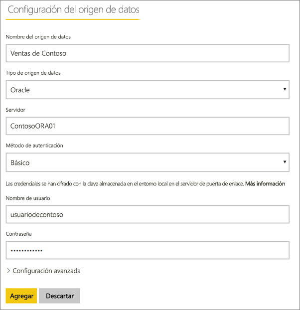
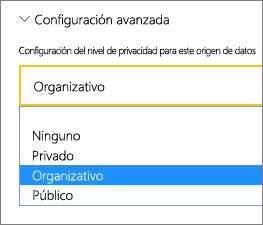
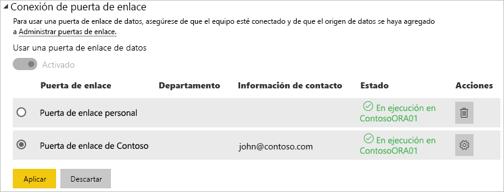

# Administrar el origen de datos: importación o actualización programada

[!INCLUDE [gateway-rewrite](includes/gateway-rewrite.md)]

Después de [instalar la puerta de enlace de datos local](/data-integration/gateway/service-gateway-install), tendrá que [agregar orígenes de datos](service-gateway-data-sources.md#add-a-data-source) que se puedan usar con ella. En este artículo se examina cómo trabajar con puertas de enlace y orígenes de datos que se usan para la actualización programada en lugar de DirectQuery o conexiones dinámicas.

## Elegir un origen de datos

Para más información sobre cómo agregar un origen de datos, consulte [Adición de un origen de datos](service-gateway-data-sources.md#add-a-data-source). Seleccione un tipo de origen de datos.

Todos los orígenes de datos enumerados se pueden usar para la actualización programada con la puerta de enlace de datos local. Analysis Services, SQL Server y SAP HANA se pueden usar para la actualización programada, o bien para DirectQuery o conexiones dinámicas.

Después, rellene la información del origen de datos, incluidas la información del origen y las credenciales que se usan para acceder al origen de datos.

> [!NOTE]
> Todas las consultas que se realicen al origen de datos se ejecutan con estas credenciales. Para más información sobre cómo se almacenan las credenciales, consulte [Almacenamiento de credenciales cifradas en la nube](service-gateway-data-sources.md#store-encrypted-credentials-in-the-cloud).

Para obtener una lista de tipos de orígenes de datos que se pueden usar con la actualización programada, vea [Lista de tipos de orígenes de datos disponibles](service-gateway-data-sources.md#list-of-available-data-source-types).

Después de rellenar todo, seleccione **Agregar**. Ahora puede usar este origen de datos para la actualización programada con sus datos locales. Si se realiza correctamente, verá el mensaje *Conexión correcta*.

### Configuración avanzada

Opcionalmente, puede configurar el nivel de privacidad del origen de datos. Esta configuración controla cómo se pueden combinar los datos. Solo se usa para la actualización programada. Para más información sobre los niveles de privacidad del origen de datos, vea [Niveles de privacidad (Power Query)](https://support.office.com/article/Privacy-levels-Power-Query-CC3EDE4D-359E-4B28-BC72-9BEE7900B540).

## Uso del origen de datos para actualización programada

Después de haber creado el origen de datos, estará disponible para usarse con conexiones DirectQuery, o bien a través de una actualización programada.

> [!NOTE]
> El nombre del servidor y de la base de datos deben coincidir entre Power BI Desktop y el origen de datos dentro de la puerta de enlace de datos local.

El vínculo entre el conjunto de datos y el origen de datos dentro de la puerta de enlace se basa en el nombre del servidor y en el nombre de la base de datos. Estos nombres deben coincidir. Por ejemplo, si proporciona una dirección IP para el nombre del servidor, dentro de Power BI Desktop, tendrá que usar la dirección IP del origen de datos dentro de la configuración de la puerta de enlace. Si usa *SERVIDOR\INSTANCIA* en Power BI Desktop, también tiene que usar lo mismo en el origen de datos configurado para la puerta de enlace.

Si aparece en la pestaña **Usuarios** del origen de datos configurado dentro de la puerta de enlace y los nombres del servidor y de la base de datos coinciden, verá la puerta de enlace como una opción para usar con la actualización programada.

> [!WARNING]
> Si el conjunto de datos contiene varios orígenes de datos, deberá agregar cada uno de los orígenes de datos dentro de la puerta de enlace. Si no se agrega uno o más orígenes de datos a la puerta de enlace, no la verá como disponible para la actualización programada.

## Limitaciones

OAuth no es un esquema de autenticación compatible con la puerta de enlace de datos local. No puede agregar orígenes de datos que requieran OAuth. Si el conjunto de datos tiene un origen de datos que requiere OAuth, no puede usar la puerta de enlace para la actualización programada.

## Pasos siguientes

* [Solución de problemas con la puerta de enlace de datos local](/data-integration/gateway/service-gateway-tshoot)
* [Solución de problemas de puertas de enlace: Power BI](service-gateway-onprem-tshoot.md)

¿Tiene más preguntas? Consulte la [Comunidad de Power BI](http://community.powerbi.com/).
