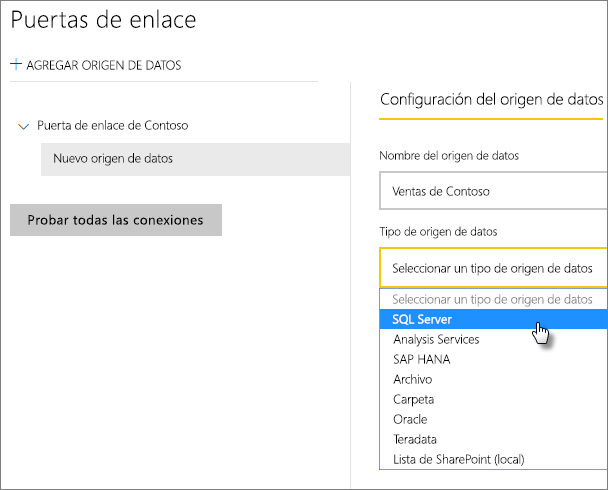
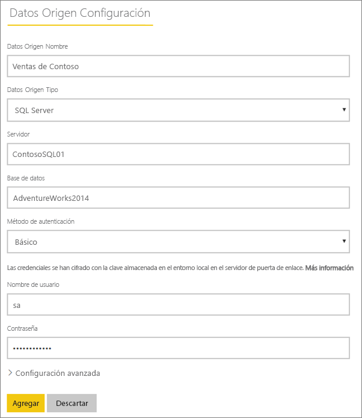
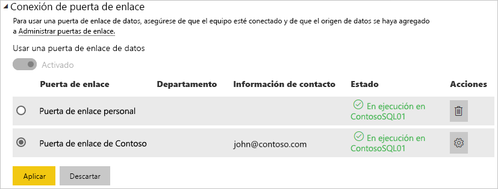

# Administrar el origen de datos: SQL Server

[!INCLUDE [gateway-rewrite](includes/gateway-rewrite.md)]

Después de [instalar la puerta de enlace de datos local](/data-integration/gateway/service-gateway-install), puede [agregar orígenes de datos](service-gateway-data-sources.md#add-a-data-source) que se pueden usar con la puerta de enlace. En este artículo se describe cómo trabajar con puertas de enlace y orígenes de datos de SQL Server que se usan para la actualización programada o para DirectQuery.

## Elegir un origen de datos

Para obtener información sobre cómo agregar un origen de datos, vea [Adición de un origen de datos](service-gateway-data-sources.md#add-a-data-source).

> [!NOTE]
> A la hora de usar DirectQuery, la puerta de enlace solo admite **SQL Server 2012 SP1** y versiones posteriores.

Después, deberá rellenar la información del origen de datos que incluye el **Servidor** y la **Base de datos**.  

También tendrá que elegir un **Método de autenticación**. Puede ser **Windows** o **Básico**. Le interesará elegir **Básico** si va a usar la autenticación de SQL en lugar de la de Windows. A continuación, escriba las credenciales que se usarán para este origen de datos.

> [!NOTE]
> Todas las consultas al origen de datos se ejecutarán con estas credenciales, a menos que se haya configurado el inicio de sesión único de Kerberos y esté habilitado para el origen de datos. Con el inicio de sesión único, los conjuntos de datos de importación usan las credenciales almacenadas, pero los conjuntos de datos de DirectQuery utilizan el usuario actual de Power BI para ejecutar las consultas mediante inicio de sesión único. Para más información, sobre cómo se almacenan las credenciales, vea [Almacenamiento de credenciales cifradas en la nube](service-gateway-data-sources.md#storing-encrypted-credentials-in-the-cloud), o bien el artículo en el que se describe el [Uso de Kerberos para el SSO (inicio de sesión único) de Power BI en orígenes de datos locales](service-gateway-sso-kerberos.md).

Seleccione **Agregar** después de que lo haya rellenado todo. A continuación, podrá usar este origen de datos para la actualización programada o para DirectQuery en una instancia de SQL Server que sea local. Si se realiza correctamente, verá el mensaje *Conexión correcta*.

### Configuración avanzada

Opcionalmente, puede configurar el nivel de privacidad del origen de datos. Esto controla cómo se pueden combinar los datos. Solo se usa para la actualización programada. No se aplica a DirectQuery. Para más información sobre los niveles de privacidad del origen de datos, vea [Niveles de privacidad (Power Query)](https://support.office.com/article/Privacy-levels-Power-Query-CC3EDE4D-359E-4B28-BC72-9BEE7900B540).

## Uso del origen de datos

Después de haber creado el origen de datos, estará disponible para usarse con conexiones DirectQuery, o bien a través de una actualización programada.

> [!NOTE]
> El nombre del servidor y de la base de datos deben coincidir entre Power BI Desktop y el origen de datos dentro de la puerta de enlace de datos local.

El vínculo entre el conjunto de datos y el origen de datos dentro de la puerta de enlace se basa en el nombre del servidor y en el nombre de la base de datos. Estos tienen que coincidir. Por ejemplo, si proporciona una dirección IP para el nombre del servidor, dentro de **Power BI Desktop**, tendrá que usar la dirección IP del origen de datos dentro de la configuración de la puerta de enlace. Si usa *SERVIDOR\INSTANCIA*, en Power BI Desktop, tendrá que usar lo mismo dentro del origen de datos configurado para la puerta de enlace.

Este es el caso tanto para DirectQuery como para actualización programada.

### Uso del origen de datos con conexiones de DirectQuery

Tendrá que asegurarse de que el nombre del servidor y de la base de datos coinciden entre **Power BI Desktop** y el origen de datos configurado para la puerta de enlace. También tendrá que asegurarse de que el usuario aparece en la pestaña **Usuarios** del origen de datos para poder publicar conjuntos de datos de DirectQuery. La selección, para DirectQuery, se produce dentro de Power BI Desktop al importar los datos por primera vez. Para más información sobre cómo usar DirectQuery, vea [Uso de DirectQuery en Power BI Desktop](desktop-use-directquery.md).

Después de publicar, ya sea desde Power BI Desktop o desde **Obtener datos**, los informes deben empezar a funcionar. La conexión puede tardar varios minutos en poderse usar después de crear el origen de datos dentro de la puerta de enlace.

### Uso del origen de datos con actualización programada

Si aparece en la pestaña **Usuarios** del origen de datos configurado dentro de la puerta de enlace y los nombres del servidor y de la base de datos coinciden, verá la puerta de enlace como una opción para usar con la actualización programada.

## Pasos siguientes

* [Conexión a datos locales en SQL Server](service-gateway-sql-tutorial.md)
* [Solución de problemas con la puerta de enlace de datos local](/data-integration/gateway/service-gateway-tshoot)
* [Solución de problemas de puertas de enlace: Power BI](service-gateway-onprem-tshoot.md)
* [Uso de Kerberos para el SSO (inicio de sesión único) de Power BI en orígenes de datos locales](service-gateway-sso-kerberos.md)

¿Tiene más preguntas? [Pruebe la comunidad de Power BI](http://community.powerbi.com/)

