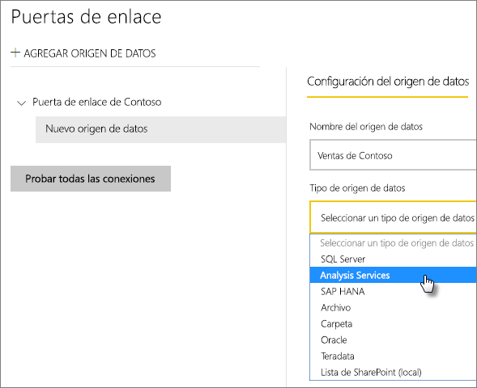
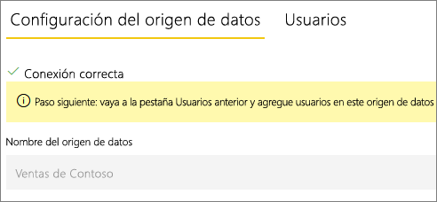
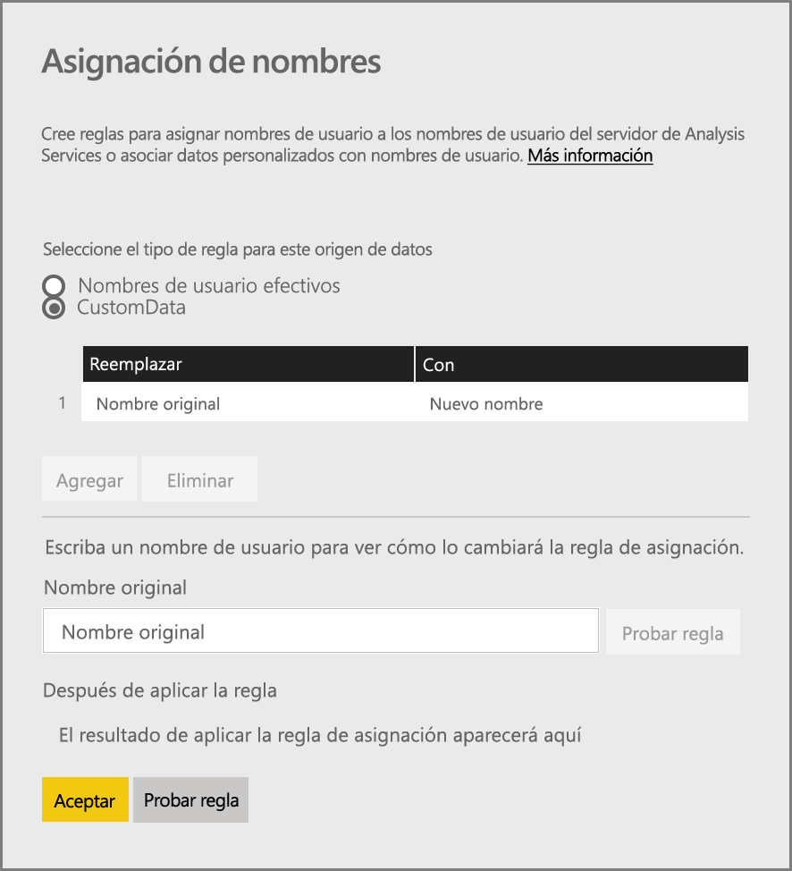
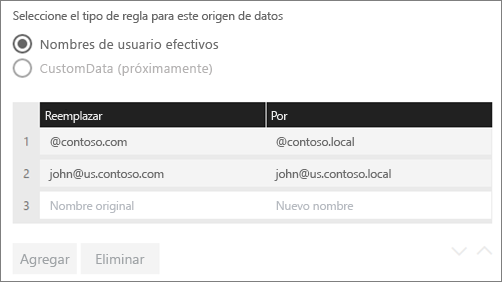
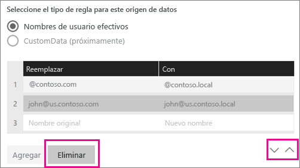
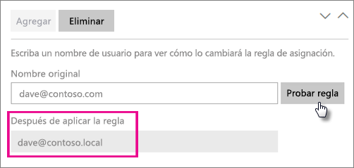
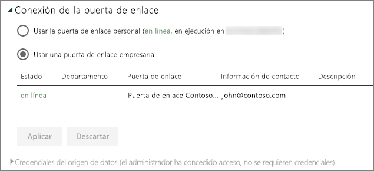

# <a name="manage-your-data-source---analysis-services"></a>Administrar el origen de datos: Analysis Services

[!INCLUDE [gateway-rewrite](includes/gateway-rewrite.md)]

Después de [instalar la puerta de enlace de datos local](/data-integration/gateway/service-gateway-install), tendrá que [agregar orígenes de datos](service-gateway-data-sources.md#add-a-data-source) que se puedan usar con ella. En este artículo, se describe cómo trabajar con puertas de enlace y orígenes de datos de SQL Server Analysis Services (SSAS) que se usan para la actualización programada o para conexiones dinámicas.

Para obtener más información sobre cómo configurar una conexión dinámica a Analysis Services, [vea este vídeo](https://www.youtube.com/watch?v=GPf0YS-Xbyo&feature=youtu.be).

> [!NOTE]
> Si tiene un origen de datos de Analysis Services, deberá instalar la puerta de enlace en un equipo unido al mismo bosque o dominio que el servidor de Analysis Services.

## <a name="add-a-data-source"></a>Elegir un origen de datos

Para obtener información sobre cómo agregar un origen de datos, vea [Adición de un origen de datos](service-gateway-data-sources.md#add-a-data-source). Seleccione **Analysis Services** para **Tipo de origen de datos** si se conecta a un servidor tabular o multidimensional.



Rellene la información del origen de datos, que incluye el **Servidor** y la **Base de datos**. La puerta de enlace usará la información escrita en **Nombre de usuario** y **Contraseña** para conectarse a la instancia de Analysis Services.

> [!NOTE]
> La cuenta de Windows que especifique debe tener permisos de administrador del servidor para la instancia con la que se va a conectar. Si la contraseña de la cuenta se configura para caducar, los usuarios podrían obtener un error de conexión si no se actualiza la contraseña para el origen de datos. Para más información sobre cómo se almacenan las credenciales, vea [Almacenamiento de credenciales cifradas en la nube](service-gateway-data-sources.md#store-encrypted-credentials-in-the-cloud).


Después de rellenar todo, seleccione **Agregar**. Ahora puede usar este origen de datos para la actualización programada o las conexiones dinámicas en una instancia de Analysis Services que sea local. Si se realiza correctamente, verá el mensaje *Se conectó correctamente*.



### <a name="advanced-settings"></a>Configuración avanzada

Opcionalmente, puede configurar el nivel de privacidad del origen de datos. Esta configuración controla cómo se pueden combinar los datos. Solo se usa para la actualización programada. La configuración del nivel de privacidad no se aplica a las conexiones dinámicas. Para más información sobre los niveles de privacidad del origen de datos, vea [Niveles de privacidad (Power Query)](https://support.office.com/article/Privacy-levels-Power-Query-CC3EDE4D-359E-4B28-BC72-9BEE7900B540).


## <a name="user-names-with-analysis-services"></a>Nombres de usuario con Analysis Services

<iframe width="560" height="315" src="https://www.youtube.com/embed/Qb5EEjkHoLg" frameborder="0" allowfullscreen></iframe>

Cada vez que un usuario interactúa con un informe conectado a Analysis Services, el nombre de usuario efectivo se envía a la puerta de enlace y después al servidor de Analysis Services local. La dirección de correo electrónico utilizada para iniciar sesión en Power BI se envía a Analysis Services como usuario efectivo. Se pasa en la propiedad de conexión [EffectiveUserName](https://msdn.microsoft.com/library/dn140245.aspx#bkmk_auth). 

La dirección de correo debe coincidir con un Nombre principal de usuario (UPN) definido en el dominio de Active Directory local. El UPN es una propiedad de una cuenta de Active Directory. La cuenta de Windows debe estar presente en un rol de Analysis Services. Si no se puede encontrar ninguna coincidencia en Active Directory, el inicio de sesión no será correcto. Para más información sobre Active Directory y los nombres de usuario, vea [Atributos de nombres de usuario](https://msdn.microsoft.com/library/ms677605.aspx).

También puede [asignar el nombre de inicio de sesión de Power BI con un UPN de directorio local](service-gateway-enterprise-manage-ssas.md#map-user-names-for-analysis-services-data-sources).

## <a name="map-user-names-for-analysis-services-data-sources"></a>Asignación de nombres de usuario a orígenes de datos de Analysis Services

<iframe width="560" height="315" src="https://www.youtube.com/embed/eATPS-c7YRU" frameborder="0" allowfullscreen></iframe>

Power BI permite asignar nombres de usuario a orígenes de datos de Analysis Services. Puede configurar reglas para asignar un nombre de usuario que ha iniciado sesión con Power BI a un nombre que se pasa para EffectiveUserName en la conexión de Analysis Services. La característica de asignación de nombres de usuario es una excelente solución alternativa cuando su nombre de usuario en Azure Active Directory (Azure AD) no coincide con un UPN en su instancia de Active Directory local. Por ejemplo, si su dirección de correo es nancy@contoso.onmicrsoft.com, podría asignarla a nancy@contoso.com, y ese valor se pasaría a la puerta de enlace.

Puede asignar nombres de usuario para Analysis Services de dos maneras diferentes:

* Reasignación manual del usuario
* Búsqueda de la propiedad de Active Directory local para reasignar los UPN de Azure AD a los usuarios de Active Directory (asignación de búsqueda de Active Directory)

Es posible realizar la asignación manual mediante el segundo enfoque, pero llevaría mucho tiempo y sería difícil de mantener. Es especialmente difícil cuando la coincidencia de patrones no es suficiente. Algunos ejemplos son los nombres de dominio distintos entre Azure AD y Active Directory locales o cuando los nombres de cuenta de usuario son diferentes entre Azure AD y Active Directory. Este es el motivo por el que no se recomienda la asignación manual con el segundo enfoque.

En las dos secciones siguientes, se describen estos dos enfoques por orden.

### <a name="manual-user-name-remapping"></a>Reasignación manual de nombres de usuario

Para orígenes de datos de Analysis Services, puede configurar reglas personalizadas para los UPN. Estas le ayudarán si los nombres de inicio de sesión del servicio Power BI no coinciden con su UPN del directorio local. Por ejemplo, si inicia sesión en Power BI mediante john@contoso.com, pero su directorio local UPN es john@contoso.local, puede configurar una regla de asignación para que john@contoso.local se pase a Analysis Services.

Para llegar a la pantalla de asignación de UPN, siga estos pasos.

1. Vaya al icono de engranaje y seleccione **Administrar puertas de enlace**.
2. Expanda la puerta de enlace que contiene el origen de datos de Analysis Services. O bien, si no ha creado el origen de datos de Analysis Services, puede hacerlo en este momento.
3. Seleccione el origen de datos y, luego, la pestaña **Usuarios**.
4. Seleccione **Asignar nombres de usuario**.

    

Verá las opciones para agregar reglas y probar con un usuario determinado.

> [!NOTE]
> Puede cambiar un usuario que no pretendía modificar. Por ejemplo, si **Reemplazar (valor original)** es contoso.com y **Por (nombre)** es @contoso.local, todos los usuarios con un inicio de sesión que contenga @contoso.com se reemplazarán por @contoso.local. Además, si **Reemplazar (nombre original)** es dave@contoso.com y su **Por (nombre)** es dave@contoso.local, un usuario con el inicio de sesión de v-dave@contoso.com se enviaría como v-dave@contoso.local.

### <a name="active-directory-lookup-mapping"></a>Asignación de búsqueda de Active Directory

Para realizar una búsqueda de la propiedad de Active Directory local para reasignar los UPN de Azure AD a los usuarios de Active Directory, siga los pasos descritos en esta sección. Para comenzar, revisemos su funcionamiento.

En el servicio Power BI, ocurre lo siguiente:

* Para cada consulta de un usuario de Azure AD de Power BI a un servidor SSAS local, se pasa una cadena de UPN, como firstName.lastName@contoso.com.

> [!NOTE]
> Las asignaciones manuales de UPN definidas en la configuración del origen de datos de Power BI se siguen aplicando *antes* de enviar la cadena de nombre de usuario a la puerta de enlace de datos local.

En la puerta de enlace de datos local con la asignación de un usuario personalizado configurable, siga estos pasos.

1. Localice Active Directory para buscar. Puede usar la opción automática o configurable.
2. Busque el atributo de la persona de Active Directory, como Correo electrónico, del servicio Power BI. El atributo se basa en una cadena de UPN entrante como firstName.lastName@contoso.com.
3. Si se produce un error en la búsqueda de Active Directory, intenta utilizar el UPN que se ha pasado como EffectiveUser a SSAS.
4. Si la búsqueda de Active Directory se realiza correctamente, recupera el valor UserPrincipalName de esa persona de Active Directory.
5. Pasa el correo electrónico UserPrincipalName como EffectiveUser a SSAS, como Alias@corp.on-prem.contoso.

Para configurar la puerta de enlace para realizar la búsqueda de Active Directory:

1. [Descargue e instale la puerta de enlace más reciente](/data-integration/gateway/service-gateway-install).

2. En la puerta de enlace, cambie el servicio de puerta de enlace de datos local para que se ejecute con una cuenta de dominio, en lugar de con una cuenta de servicio local. De lo contrario, la búsqueda de Active Directory no funcionará correctamente en tiempo de ejecución. Vaya a la [aplicación de puerta de enlace de datos local](/data-integration/gateway/service-gateway-app) en el equipo y, después, vaya a **Configuración del servicio** > **Cambiar cuenta de servicio**. Asegúrese de que tiene la clave de recuperación para esta puerta de enlace, ya que necesitará restaurarla en el mismo equipo, a menos que desee crear una puerta de enlace en su lugar. Reinicie el servicio de puerta de enlace para que el cambio surta efecto.

3. Vaya a la carpeta de instalación de la puerta de enlace, *C:\Archivos de programa\Puerta de enlace de datos local* como administrador, para asegurarse de que tiene permisos de escritura. Abra el archivo *Microsoft.PowerBI.DataMovement.Pipeline.GatewayCore.dll.config*.

4. Edite los dos valores de configuración siguientes según *sus* configuraciones de atributos de Active Directory para los usuarios de Active Directory. Los siguientes valores de configuración son ejemplos. Especifique los valores en función de la configuración de Active Directory. Estas configuraciones distinguen mayúsculas de minúsculas, por lo que asegúrese de que coinciden con los valores de Active Directory.

    

    Si no se proporciona ningún valor para la configuración de ADServerPath, la puerta de enlace usa el valor predeterminado del catálogo global. También puede especificar varios valores para ADServerPath. Cada valor debe estar separado por un punto y coma, como se muestra en el ejemplo siguiente:

    ```xml
    <setting name="ADServerPath" serializeAs="String">
        <value> >GC://serverpath1; GC://serverpath2;GC://serverpath3</value>
    </setting>
    ```

    La puerta de enlace analiza los valores de ADServerPath de izquierda a derecha hasta que encuentra una coincidencia. Si no se encuentra ninguna coincidencia, se usa el UPN original. Asegúrese de que la cuenta que ejecuta el servicio de puerta de enlace (PBIEgwService) tiene permisos de consulta en todos los servidores de Active Directory que especifique en ADServerPath.

    La puerta de enlace admite dos tipos de ADServerPath, como se muestra en los ejemplos siguientes:

    **WinNT**

    ```xml
    <value="WinNT://usa.domain.corp.contoso.com,computer"/>
    ```

    **GC**

    ```xml
    <value> GC://USA.domain.com </value>
    ```

5. Reinicie el servicio de puerta de enlace de datos local para que se aplique el cambio en la configuración.

### <a name="work-with-mapping-rules"></a>Trabajar con reglas de asignación

Para crear una regla de asignación, escriba un valor para **Nombre original** y **Nuevo nombre** y, después, seleccione **Agregar**.

| Campo | Descripción |
| --- | --- |
| Reemplazar (nombre original) |La dirección de correo electrónico que usó para iniciar sesión en Power BI. |
| Por (nuevo nombre) |Valor por el que se desea reemplazarla. El resultado de la sustitución es lo que se pasará a la propiedad EffectiveUserName para la conexión de Analysis Services. |



Cuando seleccione un elemento en la lista, puede reordenarlo utilizando los iconos angulares. También puede eliminar la entrada.



### <a name="use-a-wildcard"></a>Uso de un carácter comodín

Puede usar un carácter comodín (*) para su cadena **Reemplazar (nombre original)** . Únicamente se puede usar solo y no puede ir acompañado de ninguna otra parte de la cadena. Use un carácter comodín si desea usar todos los usuarios y pasar un valor único al origen de datos. Este enfoque es útil si quiere que todos los usuarios de su organización usen el mismo usuario en su entorno local.

### <a name="test-a-mapping-rule"></a>Prueba de una regla de asignación

Para validar con qué se reemplaza un nombre original, escriba un valor para **Nombre original**. Seleccione **Probar regla**.



> [!NOTE]
> Las reglas que se guardan tardan unos minutos antes de que el servicio empiece a usarlas. La regla funciona inmediatamente en el explorador.

### <a name="limitations-for-mapping-rules"></a>Limitaciones de las reglas de asignación

La asignación es para el origen de datos específico que se está configurando. No es una configuración global. Si tiene varios orígenes de datos de Analysis Services, tendrá que asignar los usuarios para cada origen de datos.

## <a name="authentication-to-a-live-analysis-services-data-source"></a>Autenticación a un origen de datos de Analysis Services activo

Cada vez que un usuario interactúa con Analysis Services, el nombre de usuario efectivo se envía a la puerta de enlace y después al servidor de Analysis Services local. El UPN, que suele ser la dirección de correo electrónico que se usa para iniciar sesión en la nube, se pasa a Analysis Services como usuario efectivo. El UPN se pasa en la propiedad de conexión EffectiveUserName. 

Esta dirección de correo debe coincidir con un UPN definido en el dominio de Active Directory local. El UPN es una propiedad de una cuenta de Active Directory. Esa cuenta de Windows debe estar presente en un rol de Analysis Services para acceder al servidor. Si no se encuentra ninguna coincidencia en Active Directory, el inicio de sesión no será correcto.

Analysis Services también puede proporcionar filtrado basado en esta cuenta. El filtrado puede realizarse con seguridad basada en roles o bien con seguridad de nivel de fila.

## <a name="role-based-security"></a>Seguridad basada en roles

Los modelos proporcionan seguridad basada en roles de usuario. Los roles para un proyecto de modelo determinado se definen durante la creación en SQL Server Data Tools – Business Intelligence, o después de que se implementa un modelo, mediante SQL Server Management Studio. Los roles contienen miembros por nombre de usuario o grupo de Windows. Los roles definen los permisos que un usuario tiene para consultar o realizar acciones en el modelo. La mayoría de los usuarios pertenecen a un rol con permisos de lectura. Otros roles están diseñados para los administradores con permisos para procesar elementos, administrar funciones de bases de datos y administrar otros roles.

## <a name="row-level-security"></a>Seguridad de nivel de fila

La seguridad de nivel de fila es específica de la seguridad de nivel de fila de Analysis Services. Los modelos pueden proporcionar seguridad dinámica de nivel de fila. A diferencia de tener al menos un rol al que pertenezcan los usuarios, la seguridad dinámica no es necesaria para cualquier modelo tabular. En un nivel avanzado, la seguridad dinámica define el acceso de lectura a datos de un usuario delimitado a una fila particular en una tabla específica. Similar a lo que ocurre con los roles, la seguridad dinámica de nivel de fila se basa en el nombre de usuario de Windows de un usuario.

La capacidad de un usuario para consultar y ver los datos del modelo viene determinada por:

- Los roles a los que pertenece su cuenta de usuario de Windows como miembro.
- La seguridad dinámica de nivel de fila, si está configurada.

La implementación de la seguridad dinámica de nivel de fila y de roles en los modelos queda fuera del ámbito de este artículo. Para más información, vea [Roles (SSAS tabular)](https://msdn.microsoft.com/library/hh213165.aspx) y [Roles de seguridad (Analysis Services - Datos multidimensionales)](https://msdn.microsoft.com/library/ms174840.aspx) en MSDN. Para ver una descripción más detallada de la seguridad de los modelos tabulares, descargue y lea el [documento técnico Protección del modelo semántico tabular de BI](https://msdn.microsoft.com/library/jj127437.aspx).

## <a name="what-about-azure-ad"></a>¿Qué ocurre con Azure AD?

Los servicios en la nube de Microsoft dejan la autenticación de los usuarios a cargo de [Azure AD](/azure/active-directory/fundamentals/active-directory-whatis). Azure AD es el inquilino que contiene grupos de nombres de usuario y seguridad. Normalmente, la dirección de correo con la que un usuario inicia sesión coincide con el UPN de la cuenta.

## <a name="what-is-the-role-of-my-local-active-directory-instance"></a>¿Cuál es el rol de mi instancia local de Active Directory?

Para que Analysis Services determine si un usuario que se conecta a él pertenece a un rol con permisos para leer los datos, el servidor debe convertir el nombre de usuario efectivo pasado de Azure AD a la puerta de enlace y de ahí al servidor de Analysis Services. El servidor de Analysis Services pasa el nombre de usuario efectivo a un controlador de dominio (DC) de Windows Active Directory. Después, el controlador de dominio de Active Directory valida que el nombre de usuario efectivo es un UPN válido en una cuenta local. Devuelve el nombre de usuario de Windows de ese usuario al servidor de Analysis Services.

No se puede usar EffectiveUserName en un servidor de Analysis Services que no esté unido a un dominio. El servidor de Analysis Services debe estar unido a un dominio para evitar errores de inicio de sesión.

## <a name="how-do-i-tell-what-my-upn-is"></a>¿Cómo sé cuál es mi UPN?

Es posible que no sepa cuál es su UPN y que no sea un administrador de dominio. Puede utilizar el siguiente comando en la estación de trabajo para averiguar el UPN de la cuenta.

    whoami /upn

El resultado es similar a una dirección de correo electrónico, pero se trata del UPN de la cuenta de dominio. Si usa un origen de datos de Analysis Services para las conexiones dinámicas, y si este UPN no coincide con la dirección de correo electrónico utilizada para iniciar sesión en Power BI, puede consultar la sección sobre [asignación de nombres de usuario](#map-user-names-for-analysis-services-data-sources).

## <a name="synchronize-an-on-premises-active-directory-with-azure-ad"></a>Sincronización de un servidor de Active Directory local con Azure AD

Si tiene previsto usar las conexiones dinámicas de Analysis Services, las cuentas de Active Directory locales deben coincidir con Azure AD. El UPN debe coincidir entre las cuentas.

Los servicios en la nube solo conocen las cuentas de Azure AD. No importa si ha agregado una cuenta en su instancia de Active Directory local. Si la cuenta no existe en Azure AD, no se puede usar. Hay diferentes formas para hacer coincidir las cuentas de Active Directory locales con Azure AD:

- Puede agregar manualmente cuentas a Azure AD.

   Puede crear una cuenta en Azure Portal o en el Centro de administración de Microsoft 365, y el nombre de la cuenta coincide con el UPN de la cuenta de Active Directory local.

- Puede usar la herramienta [Azure AD Connect](/azure/active-directory/hybrid/how-to-connect-sync-whatis) para sincronizar las cuentas locales con el inquilino de Azure AD.

   La herramienta Azure AD Connect proporciona opciones para la sincronización de directorios y la configuración de la autenticación. Entre las opciones se incluyen la sincronización de hash de las contraseñas, la autenticación de paso a través y la federación. Si no es un administrador de inquilinos o un administrador de dominio local, póngase en contacto con el administrador de TI para que le ayude con la configuración.

   El uso de Azure AD Connect garantiza que el UPN coincida entre Azure AD y la instancia de Active Directory local.

> [!NOTE]
> La sincronización de las cuentas con la herramienta Azure AD Connect crea cuentas dentro del inquilino de Azure AD.

## <a name="use-the-data-source"></a>Uso del origen de datos

Después de haber creado el origen de datos, estará disponible para usarse con conexiones dinámicas o a través de una actualización programada.

> [!NOTE]
> El nombre del servidor y de la base de datos deben coincidir entre Power BI Desktop y el origen de datos dentro de la puerta de enlace de datos local.

El vínculo entre el conjunto de datos y el origen de datos dentro de la puerta de enlace se basa en el nombre del servidor y en el nombre de la base de datos. Estos nombres deben coincidir. Por ejemplo, si proporciona una dirección IP para el nombre del servidor, dentro de Power BI Desktop, tendrá que usar la dirección IP del origen de datos dentro de la configuración de la puerta de enlace. Si usa *SERVER\INSTANCE* en Power BI Desktop, también tiene que usar lo mismo en el origen de datos configurado para la puerta de enlace.

Este requisito es el caso tanto para conexiones dinámicas como para la actualización programada.

### <a name="use-the-data-source-with-live-connections"></a>Uso del origen de datos con conexiones dinámicas

Asegúrese de que el nombre del servidor y de la base de datos coinciden entre Power BI Desktop y el origen de datos configurado para la puerta de enlace. También necesitará asegurarse de que el usuario aparece en la pestaña **Usuarios** del origen de datos para publicar conjuntos de datos de conexiones dinámicas. La selección, para conexiones dinámicas, se produce dentro de Power BI Desktop al importar los datos por primera vez.

Después de publicar, ya sea desde Power BI Desktop o desde **Obtener datos**, los informes deben empezar a funcionar. La conexión puede tardar varios minutos en poderse usar después de crear el origen de datos dentro de la puerta de enlace.

### <a name="use-the-data-source-with-scheduled-refresh"></a>Uso del origen de datos con la actualización programada

Si aparece en la pestaña **Usuarios** del origen de datos configurado dentro de la puerta de enlace y los nombres del servidor y de la base de datos coinciden, verá la puerta de enlace como una opción para usar con la actualización programada.



### <a name="limitations-of-analysis-services-live-connections"></a>Limitaciones de conexiones activas de Analysis Services

Puede usar una conexión activa con instancias tabulares o multidimensionales.

| **Versión del servidor** | **SKU necesario** |
| --- | --- |
| 2012 SP1 CU4 o posterior |SKU Business Intelligence y Enterprise |
| 2014 |SKU Business Intelligence y Enterprise |
| 2016 |SKU estándar o superior |

* Las características de formato de nivel de celda y traducción no se admiten.
* Las acciones y los conjuntos con nombre no se exponen en Power BI. Todavía puede conectarse a los cubos multidimensionales que también contengan acciones o conjuntos con nombre, y crear objetos visuales e informes.

## <a name="next-steps"></a>Pasos siguientes

* [Solución de problemas con la puerta de enlace de datos local](/data-integration/gateway/service-gateway-tshoot)
* [Solución de problemas de puertas de enlace: Power BI](service-gateway-onprem-tshoot.md)

¿Tiene más preguntas? Consulte la [Comunidad de Power BI](http://community.powerbi.com/).

