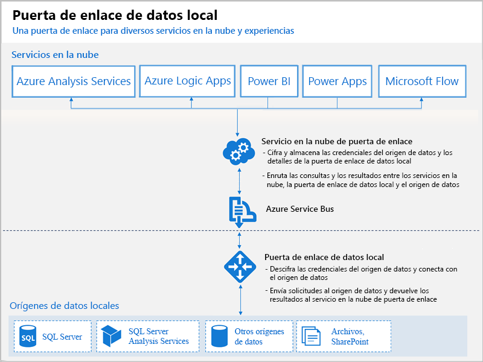

# ¿Qué son las puertas de enlace de Power BI?

Una puerta de enlace de Power BI es un software que se instala en una red local; facilita el acceso a los datos en esa red. Es similar a un guardián que atiende las solicitudes de conexión y las concede solo cuando las solicitudes de un usuario cumplen determinados criterios. Esto permite a las organizaciones mantener las bases de datos y otros orígenes de datos en sus redes locales, pero con un uso seguro de tales datos locales en informes y paneles de Power BI.

Una puerta de enlace se puede usar para un único origen de datos, o bien para varios. En el siguiente diagrama se muestra una vista básica, con la puerta de enlace controlando las solicitudes de la nube para tres equipos locales. Se ampliará más adelante en el artículo.

## Tipos de puertas de enlace

Power BI ofrece dos puertas de enlace, cada una para un escenario diferente:

* **Puerta de enlace de datos local (modo personal)**: permite que un usuario se conecte a los orígenes y no pueda compartirlos con otros usuarios. Solo puede utilizarse con Power BI. Esta puerta de enlace está diseñada especialmente para aquellos escenarios en que usted es la única persona que crea informes y no necesita compartir los orígenes de datos con otros usuarios.

* **Puerta de enlace de datos local**: permite que varios usuarios se conecten a varios orígenes de datos locales. Puede utilizarse en aplicaciones de Power BI, PowerApps, Flow, Azure Analysis Services y Azure Logic Apps, todas con una única instalación de la puerta de enlace. Esta puerta de enlace está diseñada especialmente para escenarios más complejos en los que varias personas acceden a varios orígenes de datos. 

## Uso de una puerta de enlace

Hay cuatro pasos principales para usar una puerta de enlace:

1. **Instalar la puerta de enlace** en un equipo local, utilizando el modo adecuado
2. **Agregar usuarios a la puerta de enlace**, para que puedan acceder a orígenes de datos locales
3. **Conectarse a orígenes de datos**, para que se puedan utilizar en los informes y paneles
4. **Actualizar datos locales**, para que los informes de Power BI estén actualizados

Puede instalar una puerta de enlace independiente o agregar una puerta de enlace a un *clúster*, que es la opción recomendada para lograr una alta disponibilidad.

## Cómo funcionan las puertas de enlace

La puerta de enlace instalada se ejecuta como un servicio de Windows, la **puerta de enlace de datos local**. Este servicio está registrado con el servicio en la nube de la puerta de enlace mediante Azure Service Bus. En el siguiente diagrama se muestra el flujo entre los datos locales y los servicios en la nube que usan la puerta de enlace.

Consultas y flujo de datos:

1. El servicio en la nube crea una consulta con las credenciales cifradas para el origen de datos local. Después se envía a una cola para que la puerta de enlace la procese.
2. El servicio en la nube de la puerta de enlace analiza la consulta e inserta la solicitud en Azure Service Bus. Power BI administra Service Bus de forma automática, por lo que no se necesitan costos adicionales ni pasos de configuración.
3. La puerta de enlace de datos local sondea Azure Service Bus en busca de solicitudes pendientes.
4. La puerta de enlace obtiene la consulta, descifra las credenciales y se conecta a los orígenes de datos con las mismas.
5. La puerta de enlace envía la consulta al origen de datos para su ejecución.
6. Los resultados se envían desde el origen de datos a la puerta de enlace y luego al servicio en la nube y al servidor.

## Pasos siguientes
[Instalación de la puerta de enlace de datos local](service-gateway-install.md)

¿Tiene más preguntas? [Pruebe la comunidad de Power BI](http://community.powerbi.com/)

