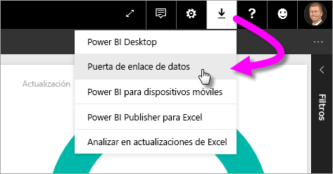
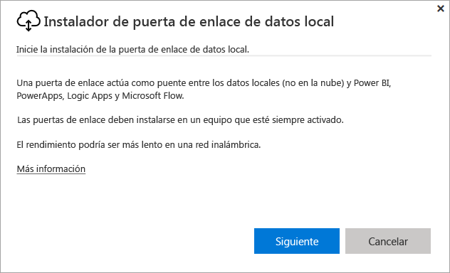
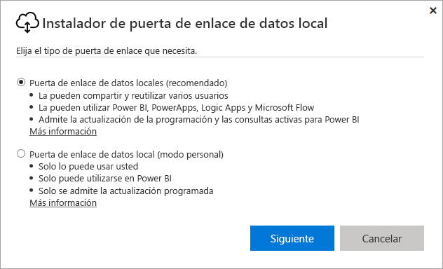
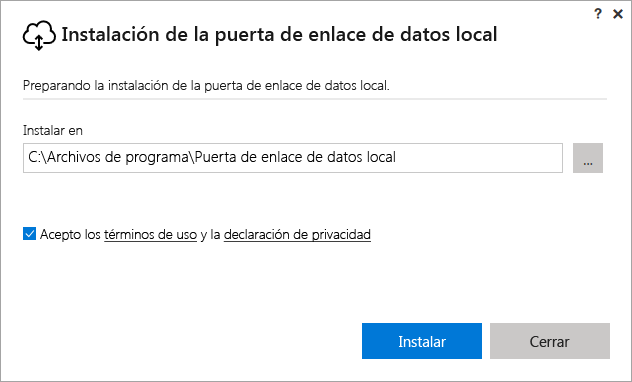
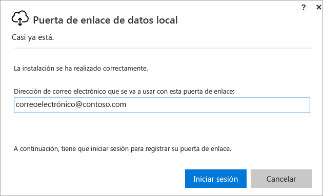
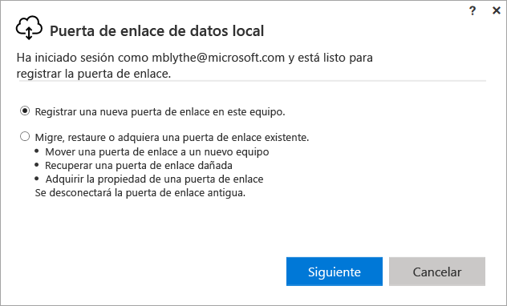
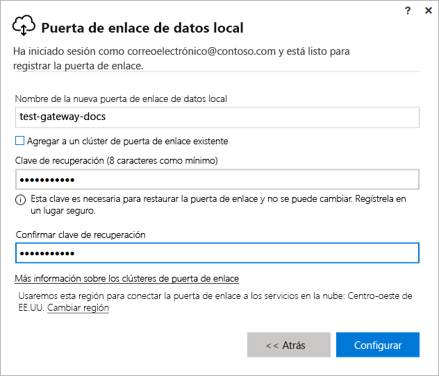
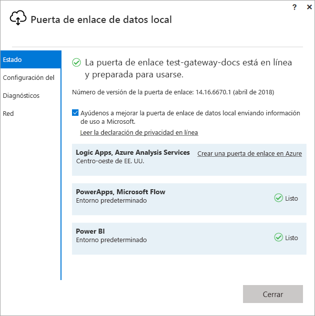
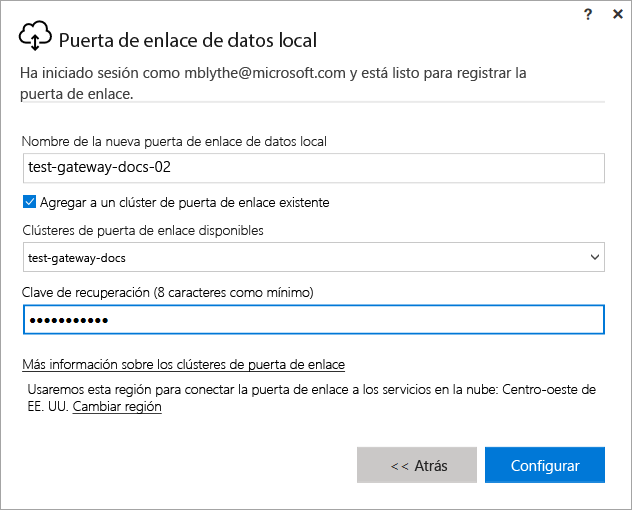

# Instalación de una puerta de enlace para Power BI

Una puerta de enlace de Power BI es un software que se instala en una red local; facilita el acceso a los datos en esa red. Como se describe en la [Introducción](service-gateway-getting-started.md), puede instalar una puerta de enlace en modo personal o en modo estándar (recomendado). En modo estándar, puede instalar una puerta de enlace independiente o agregar una puerta de enlace a un *clúster*, que es la opción recomendada para lograr una alta disponibilidad. En este artículo se explica cómo instalar una puerta de enlace estándar y cómo agregar después otra puerta de enlace para crear un clúster.

Si no está registrado en Power BI, [regístrese para obtener una evaluación gratuita](https://app.powerbi.com/signupredirect?pbi_source=web) antes de empezar.

## Descargar e instalar una puerta de enlace

La puerta de enlace se ejecuta en el equipo donde se instala; por lo tanto, asegúrese de que se instala en un equipo que siempre esté encendido. Para obtener mayor rendimiento y confiabilidad, se recomienda que el equipo esté en una red con cable, en lugar de en una inalámbrica.

1. En el servicio Power BI en la esquina superior derecha, seleccione el **icono de descarga**  > **Puerta de enlace de datos**.

    

2. En la página de descarga, seleccione el botón **Descargar puerta de enlace**.

3. Seleccione **Siguiente**.     

    

4. Seleccione **Puerta de enlace de datos local (recomendado)** > **Siguiente**.

    

5. Mantenga la ruta de instalación predeterminada y acepte los términos > **Instalar**.

    

6. Escriba la cuenta que usa para iniciar sesión en Power BI > **Iniciar sesión**.

    

    La puerta de enlace está asociada a su cuenta de Power BI, y puede administrar las puertas de enlace desde el servicio Power BI. Ahora ha iniciado sesión en su cuenta.

7. Seleccione **Registre una puerta de enlace nueva en este equipo** > **Siguiente**.

    

8. Escriba un nombre para la puerta de enlace (debe ser único en el inquilino) y una clave de recuperación. Necesitará esta clave si alguna vez desea recuperar o mover la puerta de enlace. Seleccione **Configurar**.

    

    Tenga en cuenta la opción **Agregar a un clúster de puerta de enlace existente**. Vamos a usar esta opción en la siguiente sección del artículo.

9. Revise la información en la ventana final. Tenga en cuenta que la puerta de enlace está disponible para Power BI y también PowerApps y Flow, porque se usa la misma cuenta para los tres. Seleccione **Cerrar**.

    

Ahora que ha instalado correctamente una puerta de enlace, puede agregar otra puerta de enlace para crear un clúster.

## Adición de otra puerta de enlace para crear un clúster

Un clúster permite a los administradores de la puerta de enlace evitar tener un único punto de error para el acceso a los datos locales. Si la puerta de enlace principal no está disponible, se enrutan las solicitudes de datos a la segunda puerta de enlace que agregue, y así sucesivamente. Puede instalar solo una puerta de enlace estándar en un mismo equipo, por lo que debe instalar la segunda puerta de enlace para el clúster en un equipo diferente. Esto tiene sentido porque desea redundancia en el clúster.

Los clústeres de puertas de enlace de alta disponibilidad requieren puertas de enlace de datos locales con la actualización de noviembre de 2017 o posteriores.

1. Descargue la puerta de enlace en otro equipo e instálela.

2. Una vez que ha iniciado sesión en su cuenta de Power BI, registre la puerta de enlace. Seleccione **Agregar a un clúster existente**. En **Clústeres de puerta de enlace disponibles**, seleccione la primera puerta de enlace que se ha instalado (la *puerta de enlace principal*) y escriba la clave de recuperación de esa puerta de enlace. Seleccione **Configurar**.

    

## Pasos siguientes

[Administración de una puerta de enlace de Power BI](service-gateway-manage.md)

¿Tiene más preguntas? [Pruebe la comunidad de Power BI](http://community.powerbi.com/)