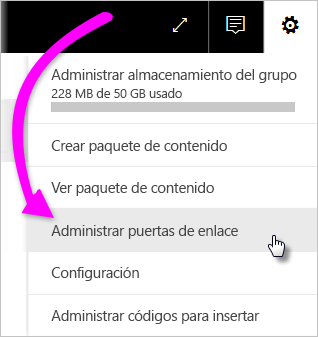
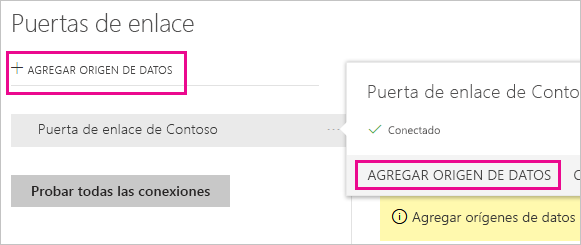
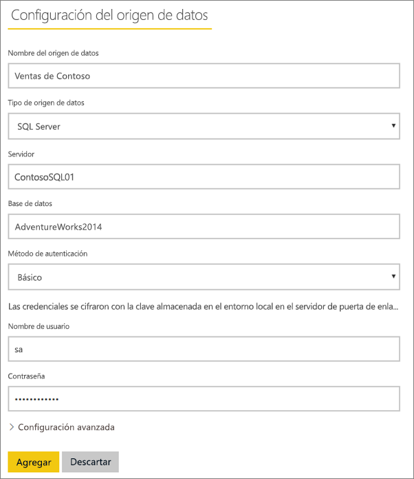
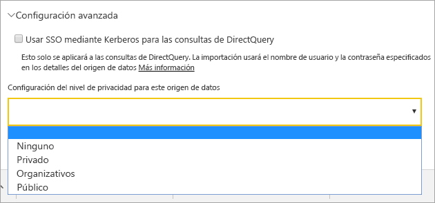
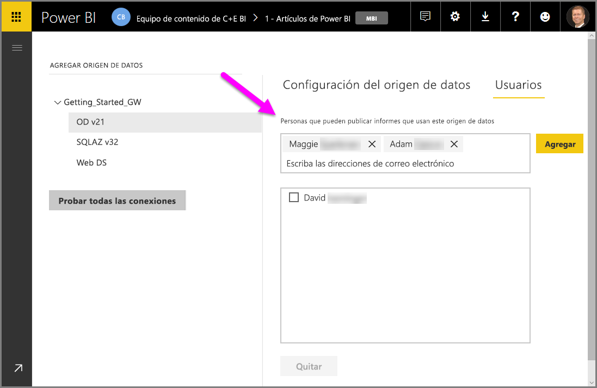
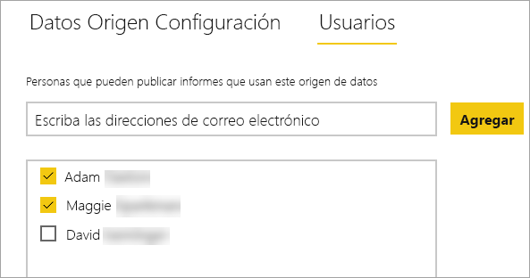
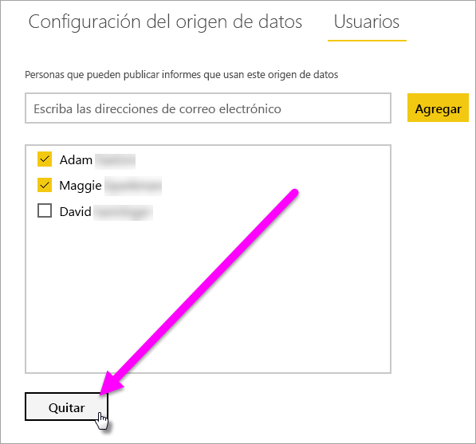
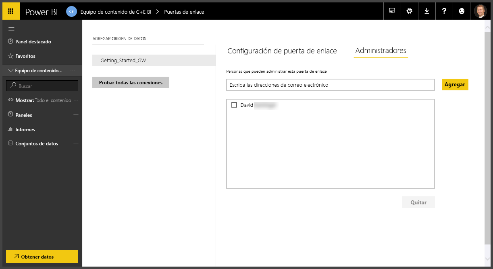
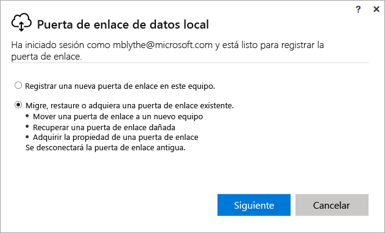
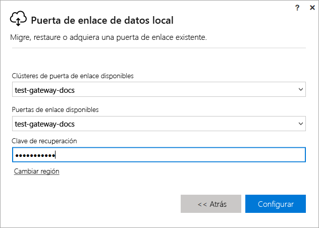

# Administración de una puerta de enlace de Power BI

Después de [instalar una puerta de enlace de datos de Power BI](service-gateway-install.md), la puede administrar según sus requisitos. En este tema, obtendrá información sobre cómo: agregar y quitar orígenes de datos y usuarios; reiniciar una puerta de enlace; y migrar, restaurar, controlar y quitar una puerta de enlace. 

Puede administrar una puerta de enlace en el área **Administrar puertas de enlace** del servicio Power BI, en la aplicación de puerta de enlace del equipo local y con los scripts de PowerShell. Este artículo se centra en el servicio Power BI. 

Si acaba de instalar una puerta de enlace, se recomienda que después [agregue un origen de datos](#add-a-data-source) y luego [agregue usuarios](#add-users-to-a-data-source), para que puedan acceder al origen de datos.

## Administración de orígenes de datos

Power BI admite muchos orígenes de datos locales, y cada uno tiene sus propios requisitos. Una puerta de enlace se puede usar para un único origen de datos, o bien para varios. En este ejemplo, vamos a mostrarle cómo agregar SQL Server como un origen de datos, pero los pasos son similares para otros orígenes de datos.

### Elegir un origen de datos

1. En la esquina superior derecha del servicio Power BI, seleccione el icono del engranaje  > **Administrar puertas de enlace**.

    

2. Seleccione una puerta de enlace > **Agregar origen de datos** o vaya a Puertas de enlace > **Agregar origen de datos**.

    

3. Seleccione el **tipo de origen de datos**.

    

4. Escriba la información del origen de datos. En este ejemplo, es **Servidor**, **Base de datos** y otra información.  

    

5. Para SQL Server, elegiría un **Método de autenticación** de **Windows** o **Básico** (Autenticación de SQL).  Si elige **Básico**, escriba las credenciales del origen de datos.

6. En **Configuración avanzada**, si quiere puede configurar el [nivel de privacidad](https://support.office.com/article/Privacy-levels-Power-Query-CC3EDE4D-359E-4B28-BC72-9BEE7900B540) del origen de datos (no se aplica a [DirectQuery](desktop-directquery-about.md)).

    

7. Seleccione **Agregar**. Si el proceso se completa correctamente, verá el mensaje *Conexión correcta*.

    

Ahora puede usar este origen de datos para incluir los datos de SQL Server en los informes y paneles de Power BI.

### Quitar un origen de datos

Puede quitar un origen de datos si ya no lo usa. Tenga en cuenta que, si quita un origen de datos, se interrumpirá cualquier panel e informe que se base en dicho origen.

Para quitar un origen de datos, vaya al origen de datos y luego seleccione **Quitar**.

## Administración de usuarios y administradores

Después de agregar un origen de datos a una puerta de enlace, conceda acceso a los usuarios y grupos de seguridad al origen de datos específico (no a toda la puerta de enlace). La lista de usuarios del origen de datos controla solo a quién se le permite publicar informes que incluyen datos del origen de datos. Los propietarios de informes pueden crear paneles, paquetes de contenido y aplicaciones y compartirlos con otros usuarios.

También puede conceder acceso administrativo a los usuarios y grupos de seguridad a la puerta de enlace.

### Adición de usuarios a un origen de datos

1. En la esquina superior derecha del servicio Power BI, seleccione el icono del engranaje  > **Administrar puertas de enlace**.

2. Seleccione el origen de datos en el que desea agregar usuarios.

3. Seleccione **Usuarios** y especifique un usuario de su organización a quien desea conceder acceso al origen de datos seleccionado. En la siguiente pantalla, puede ver que se ha agregado a Maggie y a Adam.

    

4. Seleccione **Agregar**, y el miembro agregado se muestra en el cuadro.

    

Y eso es todo. Recuerde que debe agregar usuarios a cada origen de datos al que desea conceder acceso. Cada origen de datos tiene una lista separada de usuarios y debe agregar los usuarios por separado para cada origen de datos.

### Eliminación de usuarios de un origen de datos

En la pestaña **Usuarios** del origen de datos, puede quitar usuarios y grupos de seguridad que usan este origen de datos.

### Adición y eliminación de administradores

En la pestaña **Administradores** de la puerta de enlace, agregue y quite usuarios o grupos de seguridad que pueden administrar la puerta de enlace.

## Administración de un clúster de puertas de enlace

Una vez creado un clúster con dos o más puertas de enlace, todas las operaciones de administración de puertas de enlace, tales como agregar un origen de datos o conceder permisos administrativos a una puerta de enlace, se aplicarán a todas las puertas de enlace que formen parte del clúster. 

Cuando los administradores usan la opción **Administrar puertas de enlace**, situada en el icono de engranaje del **servicio Power BI**, verán la lista de los clúteres registrados o las puertas de enlace individuales, pero no verán las instancias de puerta de enlace individuales que forman parte del clúster.

Todas las solicitudes de **Actualización programada** y las operaciones de DirectQuery se enrutan automáticamente a la instancia principal de un clúster de puertas de enlace determinado. Si la instancia de la puerta de enlace principal no está conectada, la solicitud se enruta a otra instancia de puerta de enlace del clúster.

## Compartir una puerta de enlace

Una puerta de enlace no se puede *compartir* por sí misma, pero se pueden agregar administradores a la puerta de enlace y usuarios a los orígenes de datos de la puerta de enlace. 

Después de instalar una puerta de enlace, de forma predeterminada se convertirá en el administrador de esa puerta de enlace. Como se mostró anteriormente, puede agregar otros usuarios como administradores. Estos administradores pueden agregar orígenes de datos y configurar y quitar la puerta de enlace.

También puede asignar usuarios a los orígenes de datos que cree en cada una de las puertas de enlace. Después, los usuarios pueden usar esos orígenes de datos para actualizar los informes de Power BI. Pero no podrán cambiar ninguno de los orígenes de datos ni la configuración de la puerta de enlace.

## Migración, restauración o control de una puerta de enlace

Ejecute el instalador de la puerta de enlace en el equipo donde desea migrarla, restaurarla o controlarla.

1. Descargue la puerta de enlace e instálela.

2. Una vez que ha iniciado sesión en su cuenta de Power BI, registre la puerta de enlace. Seleccione **Migrar, restaurar o tomar el control de una puerta de enlace existente** > **Siguiente**.

    

3. Seleccione el clúster y la puerta de enlace de entre las opciones disponibles y escriba la clave de recuperación de la puerta de enlace seleccionada. Seleccione **Configurar**.

    

## Reinicio de una puerta de enlace

La puerta de enlace se ejecuta como un servicio de Windows. Al igual que cualquier servicio de Windows, hay varias maneras de iniciarlo y detenerlo. Así es cómo se puede hacer desde el símbolo del sistema.

1. En el equipo en el que se ejecuta la puerta de enlace, inicie un símbolo del sistema con privilegios de administrador.

2. Escriba `net stop PBIEgwService` para detener el servicio.

3. Escriba `net start PBIEgwService` para reiniciar el servicio.

## Quitar una puerta de enlace

Puede quitar una puerta de enlace si ya no la usa. Pero tenga en cuenta que la eliminación de una puerta de enlace elimina todos los orígenes de datos asociados a ella. A su vez, se interrumpirá cualquier panel e informe que dependa de esos orígenes de datos.

1. En la esquina superior derecha del servicio Power BI, seleccione el icono del engranaje  > **Administrar puertas de enlace**.

2. Seleccione la puerta de enlace > **Quitar**.
   
   

## Pasos siguientes

[Instrucciones para implementar una puerta de enlace de datos](service-gateway-deployment-guidance.md)

¿Tiene más preguntas? [Pruebe la comunidad de Power BI](http://community.powerbi.com/)
