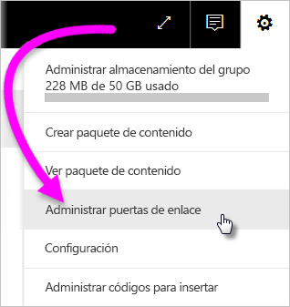
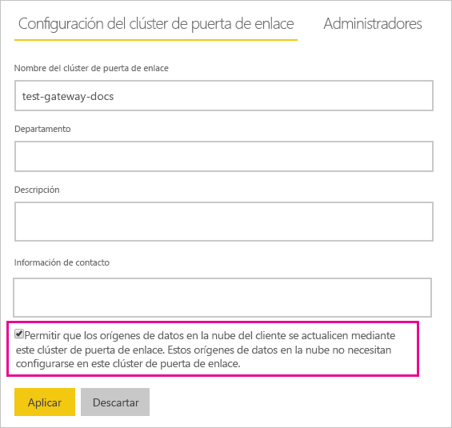
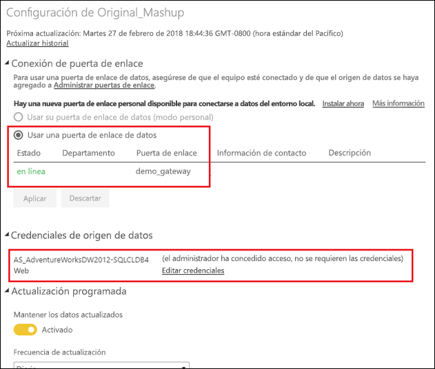

# Combinar o anexar orígenes de datos locales o en la nube

[!INCLUDE [gateway-rewrite](includes/gateway-rewrite.md)]

Use la puerta de enlace de datos local para combinar o anexar orígenes de datos locales o en la nube en la misma consulta. Esta solución es útil cuando se quieren combinar datos de varios orígenes sin tener que usar consultas independientes.

>[!NOTE]
>Este artículo solo se aplica a los conjuntos de datos que tienen orígenes de datos locales y en la nube combinados o anexados en una sola consulta. Para los conjuntos de datos que tienen consultas separadas (una que se conecta a un origen de datos local y otra a un origen de datos en la nube), la puerta de enlace no ejecuta la consulta del origen de datos en la nube.

## Requisitos previos

- Una [puerta de enlace instalada](/data-integration/gateway/service-gateway-install) en un equipo local.
- Un archivo de Power BI Desktop con consultas que combinan orígenes de datos locales y en la nube.

>[!NOTE]
>Para acceder a orígenes de datos en la nube, debe asegurarse de que la puerta de enlace tenga acceso a esos orígenes de datos.

1. En la esquina superior derecha del servicio Power BI, seleccione el icono del engranaje  > **Administrar puertas de enlace**.

    

2. Seleccione la puerta de enlace que quiere configurar.

3. En **Configuración del clúster de puerta de enlace**, seleccione **Allow user's cloud data sources to refresh through this gateway cluster** (Permitir que los orígenes de datos en la nube del cliente se actualicen mediante este clúster de puerta de enlace)  > **Aplicar**.

    

4. En este clúster de puerta de enlace, agregue cualquier [origen de datos local](service-gateway-enterprise-manage-scheduled-refresh.md#add-a-data-source) empleado en las consultas. No es necesario agregar aquí los orígenes de datos de nube.

5. Cargue en el servicio Power BI el archivo de Power BI Desktop con las consultas que combinan orígenes de datos locales y en la nube.

6. En la página **Configuración del conjunto de datos** del conjunto de datos nuevo:

   - Para el origen local, seleccione la puerta de enlace asociada a este origen de datos.
   - En **Credenciales de origen de datos**, edite las credenciales del origen de datos en la nube según sea necesario.

    Asegúrese de que los niveles de privacidad de los orígenes de datos locales y en la nube están configurados correctamente para asegurarse de que las combinaciones se administran de forma segura.

     

7. Con el conjunto de credenciales de nube, ahora puede actualizar el conjunto de datos con la opción **Actualizar ahora**. O bien puede programarlo para que se actualice periódicamente.

## Pasos siguientes

Para más información sobre la actualización de datos para las puertas de enlace, vea [Uso del origen de datos para actualización programada](service-gateway-enterprise-manage-scheduled-refresh.md#use-the-data-source-for-scheduled-refresh).
