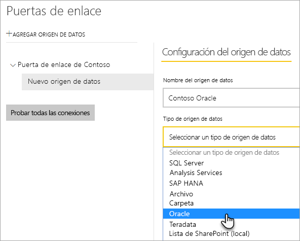

# <a name="manage-your-data-source---oracle"></a>Administrar el origen de datos: Oracle

[!INCLUDE [gateway-rewrite](includes/gateway-rewrite.md)]

Una vez que haya [instalado la puerta de enlace de datos local](/data-integration/gateway/service-gateway-install), tendrá que [agregar orígenes de datos](service-gateway-data-sources.md#add-a-data-source) que se puedan usar con ella. En este artículo se describe cómo trabajar con puertas de enlace y orígenes de datos de Oracle para la actualización programada o para DirectQuery.

## <a name="installing-the-oracle-client"></a>Instalación del cliente de Oracle

Para que la puerta de enlace pueda conectarse a su servidor de Oracle, el proveedor de datos de Oracle para .NET (ODP.NET) debe estar instalado y configurado. Esto forma parte de Oracle Data Access Components (ODAC).

En el caso de las versiones de **32 bits** de Power BI Desktop, use el vínculo siguiente para descargar e instalar el cliente de **32 bits** de Oracle:

* [Oracle Data Access Components (ODAC) de 32 bits con Oracle Developer Tools para Visual Studio (12.1.0.2.4)](http://www.oracle.com/technetwork/topics/dotnet/utilsoft-086879.html)

En el caso de las versiones de **64 bits** de Power BI Desktop o en el de la puerta de enlace de datos local, use el siguiente vínculo para descargar e instalar el cliente de Oracle de **64 bits**:

* [ODAC 12.2c versión 1 (12.2.0.1.0) de 64 bits para Windows x64](http://www.oracle.com/technetwork/database/windows/downloads/index-090165.html)

Una vez instalado, tendrá que configurar el archivo tnsnames.ora con la información adecuada para la base de datos. Power BI Desktop y la puerta de enlace se activarán mediante el parámetro net_service_name definido en el archivo tnsnames.ora. Si no está configurado, no se podrá conectar. La ruta de acceso predeterminada para tnsnames.ora es `[Oracle Home Directory]\Network\Admin\tnsnames.ora`. Para obtener más información sobre cómo configurar los archivos tnsnames.ora, consulte [Oracle: Local Naming Parameters (tnsnames.ora)](https://docs.oracle.com/cd/B28359_01/network.111/b28317/tnsnames.htm) (Oracle: parámetros para nombres locales [tnsnames.ora]).

### <a name="example-tnsnamesora-file-entry"></a>Ejemplo de entrada de archivo tnsnames.ora

El formato básico de una entrada en tnsname.ora es el siguiente.

```
net_service_name=
 (DESCRIPTION=
   (ADDRESS=(protocol_address_information))
   (CONNECT_DATA=
     (SERVICE_NAME=service_name)))
```

Aquí tiene un ejemplo que incluye la información del servidor y los puertos.

```
CONTOSO =
  (DESCRIPTION =
    (ADDRESS = (PROTOCOL = TCP)(HOST = oracleserver.contoso.com)(PORT = 1521))
    (CONNECT_DATA =
      (SERVER = DEDICATED)
      (SERVICE_NAME = CONTOSO)
    )
  )
```

## <a name="add-a-data-source"></a>Elegir un origen de datos

Para obtener información sobre cómo agregar un origen de datos, vea [Adición de un origen de datos](service-gateway-data-sources.md#add-a-data-source). Seleccione Oracle para **Tipo de origen de datos**.



Una vez que haya seleccionado el tipo de origen de datos Oracle, rellenará su información, que incluye el **Servidor** y la **Base de datos**.  

También tendrá que elegir un **Método de autenticación**.  Puede ser **Windows** o **Básico**.  Le interesará elegir **Básico** si va a usar una cuenta creada en Oracle, en lugar de la autenticación de Windows. A continuación, escriba las credenciales que se usarán para este origen de datos.

> [!NOTE]
> Todas las consultas que se realicen al origen de datos se ejecutarán con estas credenciales. Para más información sobre cómo se almacenan las credenciales, vea [Almacenamiento de credenciales cifradas en la nube](service-gateway-data-sources.md#storing-encrypted-credentials-in-the-cloud).


Seleccione **Agregar** después de que lo haya rellenado todo. A continuación, podrá usar este origen de datos para la actualización programada o para DirectQuery en un servidor de Oracle local. Si se realiza correctamente, verá el mensaje *Conexión correcta*.


### <a name="advanced-settings"></a>Configuración avanzada

Opcionalmente, puede configurar el nivel de privacidad del origen de datos. Esto controla cómo se pueden combinar los datos. Solo se usa para la actualización programada. No se aplica a DirectQuery. Para más información sobre los niveles de privacidad del origen de datos, vea [Niveles de privacidad (Power Query)](https://support.office.com/article/Privacy-levels-Power-Query-CC3EDE4D-359E-4B28-BC72-9BEE7900B540).


## <a name="using-the-data-source"></a>Uso del origen de datos

Después de haber creado el origen de datos, estará disponible para usarse con conexiones DirectQuery o a través de una actualización programada.

> [!WARNING]
> El nombre del servidor y de la base de datos deben coincidir entre Power BI Desktop y el origen de datos dentro de la puerta de enlace de datos local.

El vínculo entre el conjunto de datos y el origen de datos dentro de la puerta de enlace se basa en el nombre del servidor y en el nombre de la base de datos. Estos tienen que coincidir. Por ejemplo, si proporciona una dirección IP para el nombre del servidor, dentro de Power BI Desktop, tendrá que usar la dirección IP del origen de datos dentro de la configuración de la puerta de enlace. Este nombre también tiene que coincidir con un alias definido en el archivo tnsnames.ora. Para obtener más información sobre el archivo tnsnames.ora, consulte [Instalación del cliente de Oracle](#installing-the-oracle-client).

Este es el caso tanto para DirectQuery como para actualización programada.

### <a name="using-the-data-source-with-directquery-connections"></a>Uso del origen de datos con conexiones de DirectQuery

Tendrá que asegurarse de que el nombre del servidor y de la base de datos coinciden entre Power BI Desktop y el origen de datos configurado para la puerta de enlace. También tendrá que asegurarse de que el usuario aparece en la pestaña **Usuarios** del origen de datos para poder publicar conjuntos de datos de DirectQuery. La selección, para DirectQuery, se produce dentro de Power BI Desktop al importar los datos por primera vez. Para más información sobre cómo usar DirectQuery, vea [Uso de DirectQuery en Power BI Desktop](desktop-use-directquery.md).

Después de publicar, ya sea desde Power BI Desktop o desde **Obtener datos**, los informes deben empezar a funcionar. La conexión puede tardar varios minutos en poderse usar después de crear el origen de datos dentro de la puerta de enlace.

### <a name="using-the-data-source-with-scheduled-refresh"></a>Uso del origen de datos con actualización programada

Si aparece en la pestaña **Usuarios** del origen de datos configurado dentro de la puerta de enlace y los nombres del servidor y de la base de datos coinciden, verá la puerta de enlace como una opción para usar con la actualización programada.


## <a name="troubleshooting"></a>Solución de problemas

Es posible que se produzcan varios errores en Oracle si la sintaxis de los nombres no es correcta o no está configurada correctamente.

* ORA-12154: TNS: could not resolve the connect identifier specified (TNS: no se pudo resolver el identificador de conexión especificado)  
* ORA-12514: TNS listener does not currently know of service requested in connect descriptor (el agente de escucha de TNS no conoce actualmente el servicio solicitado en el descriptor de conexión)  
* ORA-12541: TNS: no listener (TNS: no hay ningún agente de escucha)  
* ORA-12170: TNS:Connect timeout occurred (TNS: se ha superado el tiempo de espera de conexión)  
* ORA-12504: TNS listener was not given the SERVICE_NAME in CONNECT_DATA (no se ha proporcionado el parámetro SERVICE_NAME de CONNECT_DATA al agente de escucha de TNS)  

Estos errores se pueden producir si el cliente de Oracle no está instalado o si no está configurado correctamente. Si está instalado, querrá comprobar que el archivo tnsnames.ora esté configurado correctamente y que usa el parámetro net_service_name adecuado. También tendrá que asegurarse de que net_service_name sea el mismo en el equipo en el que se usa Power BI Desktop y el que ejecuta la puerta de enlace. Para obtener más información, consulte [Instalación del cliente de Oracle](#installing-the-oracle-client).

> [!NOTE]
> También es posible que se produzca un problema debido a incompatibilidades entre la versión del servidor y la del cliente de Oracle. Normalmente deberían coincidir.

Para más información acerca de la solución de problemas relativos a la puerta de enlace, consulte [Solución de problemas con la puerta de enlace de datos local](/data-integration/gateway/service-gateway-tshoot).

## <a name="next-steps"></a>Pasos siguientes

* [Solución de problemas de puertas de enlace: Power BI](service-gateway-onprem-tshoot.md)
* [Power BI Premium](service-premium.md)

¿Tiene más preguntas? [Pruebe a preguntar a la comunidad de Power BI](http://community.powerbi.com/)

