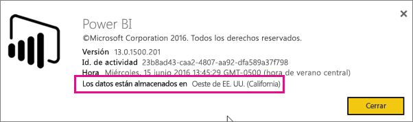
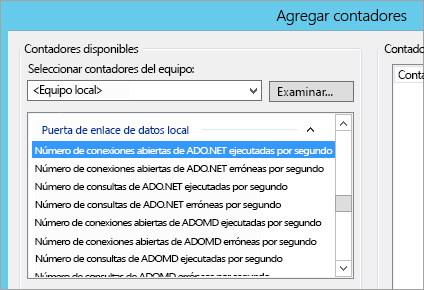
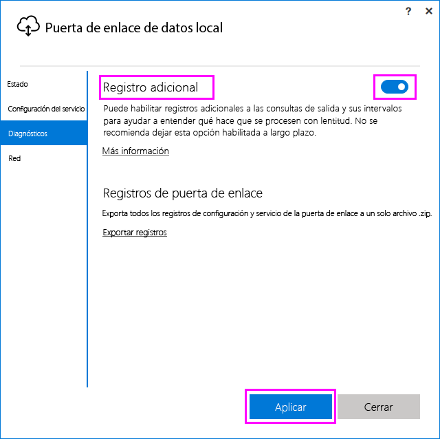
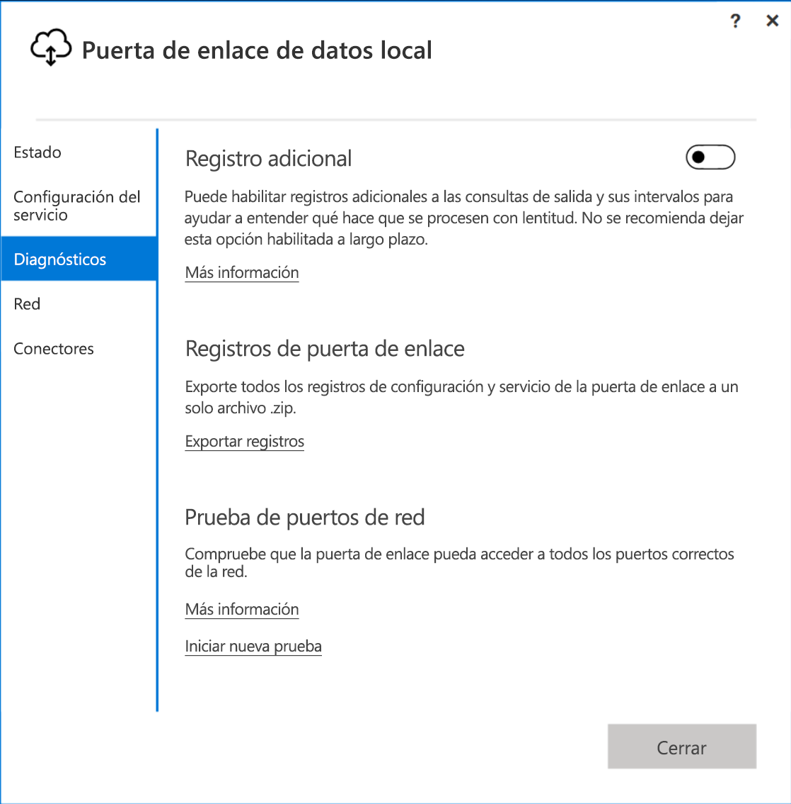
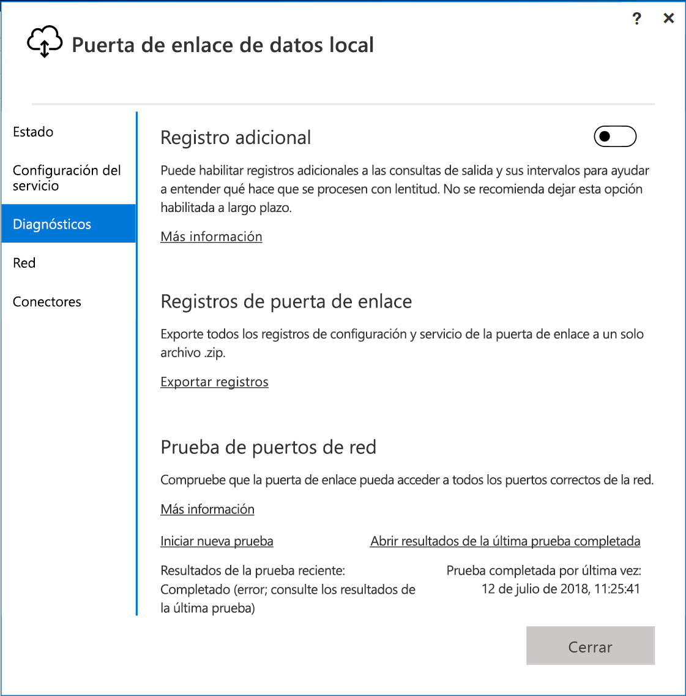
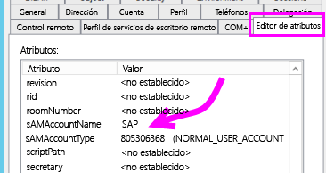
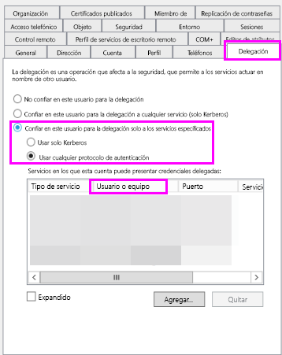
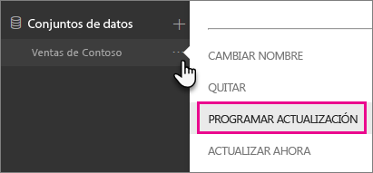
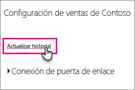
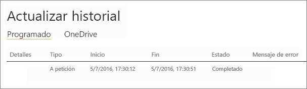

# <a name="troubleshooting-the-on-premises-data-gateway"></a>Solución de problemas con la puerta de enlace de datos local

En este artículo se examinan algunos problemas comunes del uso de la **puerta de enlace de datos local**.

<!-- Shared Community & support links Include -->
[!INCLUDE [gateway-onprem-tshoot-support-links-include](./includes/gateway-onprem-tshoot-support-links-include.md)]

<!-- Shared Troubleshooting Install Include -->
[!INCLUDE [gateway-onprem-tshoot-install-include](./includes/gateway-onprem-tshoot-install-include.md)]

## <a name="configuration"></a>Configuración

### <a name="how-to-restart-the-gateway"></a>Cómo reiniciar la puerta de enlace

La puerta de enlace se ejecuta como un servicio de Windows, por lo que puede iniciarla y detenerla de varias maneras. Por ejemplo, puede abrir un símbolo del sistema con permisos elevados en el equipo en el que se está ejecutando la puerta de enlace y después ejecutar cualquiera de estos comandos:

* Para detener el servicio, ejecute este comando:

    ```
    net stop PBIEgwService
    ```

* Para iniciar el servicio, ejecute este comando:

    ```
    net start PBIEgwService
    ```

### <a name="log-file-configuration"></a>Configuración del archivo de registro

Los registros del servicio de puerta de enlace se clasifican en tres categorías: información, error y red. Esta categorización proporciona una mejor experiencia de solución de problemas que le permite centrarse en un área específica, según el error o problema. Puede ver las tres categorías en el siguiente fragmento del archivo de configuración de puerta de enlace: `GatewayInfo.log,GatewayErrors.log,GatewayNetwork.log`.

```xml
  <system.diagnostics>
    <trace autoflush="true" indentsize="4">
      <listeners>
        <remove name="Default" />
        <add name="ApplicationFileTraceListener"
             type="Microsoft.PowerBI.DataMovement.Pipeline.Common.Diagnostics.RotatableFilesManagerTraceListener, Microsoft.PowerBI.DataMovement.Pipeline.Common"
             initializeData="%LOCALAPPDATA%\Microsoft\On-premises data gateway\,GatewayInfo.log,GatewayErrors.log,GatewayNetwork.log,20,50" />
      </listeners>
    </trace>
  </system.diagnostics>
```

Este archivo se encuentra de forma predeterminada en: *\Archivos de programa\Puerta de enlace de datos local\Microsoft.PowerBI.EnterpriseGateway.exe.config*. Para configurar el número de archivos de registro que conservar, cambie el primer número (20, en este ejemplo): `GatewayInfo.log,GatewayErrors.log,GatewayNetwork.log,20,50`.

### <a name="error-failed-to-create-a-gateway-try-again"></a>Error: No se pudo crear una puerta de enlace. Inténtelo de nuevo.

Todos los detalles están disponibles, pero la llamada al servicio Power BI devolvió un error. Se muestran el error y un identificador de actividad. Esto puede producirse por diferentes motivos. Para obtener más detalles, puede recopilar y revisar los registros, tal y como se menciona más abajo.

Esto también podría deberse a problemas de configuración de proxy. Ahora la interfaz de usuario no permite la configuración de proxy. Puede obtener más información sobre la realización de [cambios de configuración de proxy](service-gateway-proxy.md).

### <a name="error-failed-to-update-gateway-details-please-try-again"></a>Error: no se pudieron actualizar los detalles de la puerta de enlace. Inténtelo de nuevo

Se ha recibido información desde el servicio Power BI a la puerta de enlace. La información se pasó al servicio de Windows local, pero no se pudo devolver. O bien, no se pudo generar la clave simétrica. La excepción interna se muestra en **Mostrar detalles**. Para obtener más detalles, puede recopilar y revisar los registros, tal y como se menciona a continuación.

### <a name="error-power-bi-service-reported-local-gateway-as-unreachable-restart-the-gateway-and-try-again"></a>Error: el servicio Power BI informó de que no se puede acceder a la puerta de enlace local. Reinicie la puerta de enlace e inténtelo de nuevo

Cuando finalice la configuración, se vuelve a llamar al servicio Power BI para validar la puerta de enlace. El servicio Power BI no informa de que la puerta de enlace sea *dinámica*. El reinicio del servicio de Windows puede permitir que la comunicación se realice correctamente. Para obtener más detalles, puede recopilar y revisar los registros, tal y como se menciona más abajo.

### <a name="script-error-during-sign-into-power-bi"></a>Error de script durante el inicio de sesión en Power BI

Es posible que aparezca un error de script al iniciar sesión en Power BI como parte de la configuración de la puerta de enlace de datos local. La instalación de la siguiente actualización de seguridad resuelve el problema. Puede instalarla a través de Windows Update.

[MS16-051: Actualización de seguridad para Internet Explorer: 10 de mayo de 2016 (KB 3154070)](https://support.microsoft.com/kb/3154070)

### <a name="gateway-configuration-failed-with-a-null-reference-exception"></a>Error en la configuración de la puerta de enlace con una excepción de referencia nula

Puede encontrar un error similar al siguiente.

        Failed to update gateway details.  Please try again.
        Error updating gateway configuration.

Esto incluye un seguimiento de la pila y ese seguimiento puede incluir el siguiente mensaje.

        Microsoft.PowerBI.DataMovement.Pipeline.Diagnostics.CouldNotUpdateGatewayConfigurationException: Error updating gateway configuration. ----> System.ArgumentNullException: Value cannot be null.
        Parameter name: serviceSection

Si va a actualizar una puerta de enlace anterior, conservamos el archivo de configuración. Es posible que falte una sección. Cuando la puerta de enlace intenta leerla, podemos obtener la excepción de referencia nula anterior.

Para corregir este problema, siga estos pasos.

1. Desinstale la puerta de enlace.
2. Elimine la siguiente carpeta.

        c:\Program Files\On-premises data gateway
3. Vuelva a instalar la puerta de enlace.
4. Opcionalmente, aplique la clave de recuperación para restaurar una puerta de enlace existente.

## <a name="support-for-tls-12"></a>Compatibilidad con TLS 1.2

De forma predeterminada, la puerta de enlace de datos local usa la seguridad de capa de transporte (TLS) 1.2 para comunicarse con el servicio Power BI. Para asegurarse de que todo el tráfico de puerta de enlace usa TLS 1.2, es posible que deba agregar o modificar las siguientes claves del Registro en la máquina que ejecuta el servicio de puerta de enlace:

```
[HKEY_LOCAL_MACHINE\SOFTWARE\Microsoft\.NETFramework\v4.0.30319]"SchUseStrongCrypto"=dword:00000001
[HKEY_LOCAL_MACHINE\SOFTWARE\Wow6432Node\Microsoft\.NETFramework\v4.0.30319]"SchUseStrongCrypto"=dword:00000001
```

> [!NOTE]
> Agregar o modificar estas claves de registro permite aplicar el cambio a todas las aplicaciones. NET. Para más información acerca de los cambios del registro que afectan a TLS para otras aplicaciones, consulte [Configuración del registro de seguridad de la capa (TLS) de transporte](https://docs.microsoft.com/windows-server/security/tls/tls-registry-settings).

## <a name="data-sources"></a>Orígenes de datos

### <a name="error-unable-to-connect-details-invalid-connection-credentials"></a>Error: No se puede conectar. Detalles: "Credenciales de conexión no válidas"

En **Mostrar detalles**, se muestra el mensaje de error recibido desde el origen de datos. En el caso de SQL Server, se ve algo parecido a lo siguiente.

    Login failed for user 'username'.

Compruebe que tenga el nombre de usuario y la contraseña correctos. Además, compruebe que esas credenciales puedan conectarse correctamente con el origen de datos. Asegúrese de que la cuenta que se usa coincide con el **método de autenticación**.

### <a name="error-unable-to-connect-details-cannot-connect-to-the-database"></a>Error: No se puede conectar. Detalles: "No se puede conectar con la base de datos"

Pudimos conectarnos al servidor, pero no a la base de datos proporcionada. Compruebe el nombre de la base de datos y que la credencial del usuario tenga el permiso adecuado para tener acceso a esa base de datos.

En **Mostrar detalles**, se muestra el mensaje de error recibido desde el origen de datos. En el caso de SQL Server, se ve algo parecido a lo siguiente.

    Cannot open database "AdventureWorks" requested by the login. The login failed. Login failed for user 'username'.

### <a name="error-unable-to-connect-details-unknown-error-in-data-gateway"></a>Error: No se puede conectar. Detalles: "Error desconocido en la puerta de enlace de datos"

Este error puede producirse por diferentes motivos. Asegúrese de validar que puede conectarse al origen de datos desde la máquina que hospeda la puerta de enlace. Esto podría deberse a la imposibilidad de acceder al servidor.

En **Mostrar detalles**, puede ver el código de error **DM_GWPipeline_UnknownError**.

Para más información, también puede mirar en Registros de eventos > **Registros de aplicaciones y servicios** > **Servicio de puerta de enlace de datos local**.

### <a name="error-we-encountered-an-error-while-trying-to-connect-to-server-details-we-reached-the-data-gateway-but-the-gateway-cant-access-the-on-premises-data-source"></a>Error: Se encontró un error al intentar conectarse a <server>. Detalles: "Se conectó con una puerta de enlace de datos, pero esta no puede acceder al origen de datos en el entorno local".

No se pudo establecer la conexión al origen de datos especificado. Asegúrese de validar la información proporcionada para ese origen de datos.

En **Mostrar detalles**, puede ver el código de error **DM_GWPipeline_Gateway_DataSourceAccessError**.

Si el mensaje de error subyacente es similar al siguiente, significa que la cuenta que usa para el origen de datos no es un administrador del servidor para esa instancia de Analysis Services. [Más información](https://docs.microsoft.com/sql/analysis-services/instances/grant-server-admin-rights-to-an-analysis-services-instance)

    The 'CONTOSO\account' value of the 'EffectiveUserName' XML for Analysis property is not valid.

Si el mensaje de error subyacente es similar al siguiente, podría significar que en la cuenta de servicio para Analysis Services es posible que falte el atributo de directorio [token-groups-global-and-universal](https://msdn.microsoft.com/library/windows/desktop/ms680300.aspx) (TGGAU).

    The username or password is incorrect.

Los dominios con acceso de compatibilidad de versiones anteriores a Windows 2000 tienen el atributo TGGAU habilitado. En cambio, los dominios creados más recientemente no habilitan este atributo de forma predeterminada. Puede obtener más información al respecto [aquí](https://support.microsoft.com/kb/331951).

Puede confirmarlo haciendo lo siguiente.

1. Conéctese con el equipo de Analysis Services en SQL Server Management Studio. En las propiedades avanzadas de conexión, incluya EffectiveUserName para el usuario en cuestión y compruebe si reproduce el error.
2. Puede usar la herramienta dsacls de Active Directory para comprobar si se muestra el atributo. Esta herramienta se encuentra en un controlador de dominio. Debe saber cuál es el nombre de dominio distintivo de la cuenta y pasarlo a la herramienta.

        dsacls "CN=John Doe,CN=UserAccounts,DC=contoso,DC=com"

    En los resultados querrá ver algo parecido a lo siguiente.

            Allow BUILTIN\Windows Authorization Access Group
                                          SPECIAL ACCESS for tokenGroupsGlobalAndUniversal
                                          READ PROPERTY

Para corregir este problema, debe habilitar TGGAU en la cuenta usada para el servicio de Windows de Analysis Services.

#### <a name="another-possibility-for-username-or-password-incorrect"></a>Otra posibilidad es que el nombre de usuario o la contraseña no sean correctos

Este error también se puede producir si el servidor de Analysis Services está en un dominio diferente al de los usuarios y no hay una confianza bidireccional establecida.

Tiene que trabajar con los administradores del dominio para verificar la relación de confianza entre dominios.

#### <a name="unable-to-see-the-data-gateway-data-sources-in-the-get-data-experience-for-analysis-services-from-the-power-bi-service"></a>Unable to see the data gateway data sources in the 'Get Data' experience for Analysis Services from the Power BI service (No se pueden ver orígenes de datos de la puerta de enlace de datos en la experiencia "Obtener datos" para Analysis Services desde el servicio Power BI)

Asegúrese de que su cuenta aparece en la ficha **Usuarios** del origen de datos dentro de la configuración de puerta de enlace. Si no tiene acceso a la puerta de enlace, póngase en contacto con el administrador de la puerta de enlace y pídale que realice la comprobación. Solo las cuentas de la lista **Usuarios** pueden ver el origen de datos enumerado en la lista de Analysis Services.

### <a name="error-you-dont-have-any-gateway-installed-or-configured-for-the-data-sources-in-this-dataset"></a>Error: No tiene ninguna puerta de enlace instalada o configurada para los orígenes de datos de este conjunto de datos

Asegúrese de que haya agregado al menos un origen de datos a la puerta de enlace, tal como se describe en [Agregar un origen de datos](service-gateway-manage.md#add-a-data-source). Si la puerta de enlace no se muestra en **Administrar puertas de enlace** en el portal de administración, intente borrar la memoria caché del explorador o cerrar sesión en el servicio. Después, vuelva a iniciar sesión.

## <a name="datasets"></a>Conjuntos de datos

### <a name="error-there-is-not-enough-space-for-this-row"></a>Error: No hay suficiente espacio para esta fila

Esto ocurre si tiene una sola fila que ocupe más de 4 MB. Debe determinar de qué fila del origen de datos se trata e intentar filtrarla o reducir su tamaño.

### <a name="error-the-server-name-provided-doesnt-match-the-server-name-on-the-sql-server-ssl-certificate"></a>Error: El nombre del servidor proporcionado no coincide con el nombre del servidor en el certificado SSL de SQL Server

Esto puede ocurrir cuando el nombre común del certificado es para el nombre de dominio completo (FQDN) del servidor, pero solo se ha proporcionado el nombre NETBIOS para el servidor. Esto provoca un error de coincidencia del certificado. Para resolver este problema, debe hacer que el nombre del servidor dentro del origen de datos de la puerta de enlace y del archivo PBIX use el FQDN del servidor.

### <a name="i-dont-see-the-on-premises-data-gateway-present-when-configuring-scheduled-refresh"></a>No veo la puerta de enlace de datos local al configurar la actualización programada

Esto se puede deber a diversos escenarios.

1. El nombre del servidor y de la base de datos no coinciden con lo que se especificó en Power BI Desktop y el origen de datos configurado para la puerta de enlace. Estos valores deben ser iguales. No distinguen mayúsculas de minúsculas.
2. La cuenta no aparece en la pestaña **Usuarios** del origen de datos dentro de la configuración de puerta de enlace. Debe ponerse en contacto con el administrador de la puerta de enlace para que lo agregue a la lista.
3. El archivo de Power BI Desktop contiene varios orígenes de datos y no todos están configurados con la puerta de enlace de datos. Debe hacer que cada origen de datos esté definido con la puerta de enlace para que esta aparezca en la actualización programada.

### <a name="error-the-received-uncompressed-data-on-the-gateway-client-has-exceeded-the-limit"></a>Error: Los datos no comprimidos recibidos en el cliente de la puerta de enlace han superado el límite

El límite exacto es de 10 GB de datos sin comprimir por tabla. Si surge este problema, existen opciones para optimizar y evitar el problema. En concreto, puede reducir el uso de valores de cadena muy repetitivos y largos; en su lugar, use una clave normalizada o quite la columna (si no está en uso).

## <a name="reports"></a>Informes

### <a name="report-could-not-access-the-data-source-because-you-do-not-have-access-to-our-data-source-via-an-on-premises-data-gateway"></a>El informe no pudo acceder al origen de datos porque no tiene acceso a nuestro origen de datos a través de una puerta de enlace de datos local

Esto puede deberse a uno de los siguientes motivos.

1. La información del origen de datos no coincide con la del conjunto de datos subyacente. El servidor y el nombre de la base de datos deben coincidir con el origen de datos definido para la puerta de enlace de datos local y con lo que se suministra en Power BI Desktop. Si usa una dirección IP en Power BI Desktop, el origen de datos, para la puerta de enlace de datos local, también debe usar una dirección IP.
2. No hay ningún origen de datos disponible en ninguna puerta de enlace en su organización. Puede configurar el origen de datos en una puerta de enlace de datos local nueva o existente.

### <a name="error-data-source-access-error-please-contact-the-gateway-administrator"></a>Error: Error de acceso al origen datos. Póngase en contacto con el administrador de la puerta de enlace

Si este informe usa una conexión activa de Analysis Services, podría producirse un problema con un valor que se pasa a EffectiveUserName y que no es válido o bien no tiene permisos en el equipo de Analysis Services. Normalmente, un problema de autenticación se debe a que el valor que se pasa para EffectiveUserName no coincide con un nombre principal de usuario local (UPN).

Para confirmarlo, haga lo siguiente.

1. Busque el nombre de usuario efectivo en los [registros de puerta de enlace](#logs).
2. Después de obtener el valor que se pasa, compruebe que es correcto. Si es su usuario, puede usar el siguiente comando desde un símbolo del sistema para ver el UPN. Su aspecto es parecido a una dirección de correo electrónico.

        whoami /upn

También puede ver qué obtiene Power BI de Azure Active Directory.

1. Vaya a [https://developer.microsoft.com/graph/graph-explorer](https://developer.microsoft.com/graph/graph-explorer).
2. Seleccione **Iniciar sesión** en la esquina superior derecha.
3. Ejecute la siguiente consulta. Verá una respuesta JSON bastante grande.

        https://graph.windows.net/me?api-version=1.5
4. Busque **userPrincipalName**.

Si el UPN de Azure Active Directory no coincide con el UPN local de Active Directory, puede usar la característica [Asignar nombres de usuario](service-gateway-enterprise-manage-ssas.md#map-user-names) para cambiarlo por un valor válido. O bien, puede ponerse en contacto con su administrador de inquilinos o administrador de Active Directory local para que cambie el UPN.

<!-- Shared Troubleshooting Firewall/Proxy Include -->
[!INCLUDE [gateway-onprem-tshoot-firewall-include](./includes/gateway-onprem-tshoot-firewall-include.md)]

Para buscar la región del centro de datos en la que se encuentra, haga lo siguiente:

1. Seleccione **?** en la esquina superior derecha del servicio Power BI.
2. Seleccione **Acerca de Power BI**.
3. La región de datos se muestra en **Los datos están almacenados en**.

    

Si no consigue resultados, intente obtener un seguimiento de red mediante una herramienta como [fiddler](#fiddler) o netsh, aunque son métodos avanzados de recolección y puede que necesite asistencia para analizar los datos recopilados. Puede ponerse en contacto con [soporte técnico](https://support.microsoft.com) para obtener ayuda.

## <a name="performance"></a>Rendimiento

<iframe width="560" height="315" src="https://www.youtube.com/embed/IJ_DJ30VNk4?showinfo=0" frameborder="0" allowfullscreen></iframe>

### <a name="performance-counters"></a>Contadores de rendimiento

Hay una serie de contadores de rendimiento que se pueden usar para medir las actividades de la puerta de enlace. Pueden ser útiles para entender si se tiene una gran carga de actividad y se tiene que crear una puerta de enlace. Estos contadores no reflejan cuánto tiempo tarda algo.

Se puede acceder a ellos mediante la herramienta Monitor de rendimiento de Windows.



Hay agrupaciones generales de estos contadores.

| Tipo de contador | Descripción |
| --- | --- |
| ADO.NET |Se usa para las conexiones de DirectQuery. |
| ADOMD |Se usa para Analysis Services 2014 y versiones anteriores. |
| OLEDB |Lo usan algunos orígenes de datos. Incluye SAP HANA y Analysis Services 2016 o versiones posteriores. |
| Mashup |Incluye cualquier origen de datos importado. Si va a programar una actualización o realizar una actualización a petición, pasa a través del motor de mashup. |

Aquí se muestra una lista de los contadores de rendimiento disponibles.

| Contador | Descripción |
| --- | --- |
| Número de conexiones abiertas de ADO.NET ejecutadas por segundo |Número de acciones de conexión abierta de ADO.NET ejecutadas por segundo (correctas o erróneas). |
| Número de conexiones abiertas de ADO.NET erróneas por segundo |Número de acciones de conexiones abiertas de ADO.NET erróneas por segundo. |
| Número de consultas de ADO.NET ejecutadas por segundo |Número de consultas de ADO.NET ejecutadas por segundo (correctas o erróneas). |
| Número de consultas de ADO.NET erróneas por segundo |Número de consultas erróneas de ADO.NET ejecutadas por segundo. |
| Número de conexiones abiertas de ADOMD ejecutadas por segundo |Número de acciones de conexión abierta de ADOMD ejecutadas por segundo (correctas o erróneas). |
| Número de conexiones abiertas de ADOMD erróneas por segundo |Número de acciones de conexión abierta de ADOMD erróneas por segundo. |
| Número de consultas de ADOMD ejecutadas por segundo |Número de consultas de ADOMD ejecutadas por segundo (correctas o erróneas). |
| Número de consultas de ADOMD erróneas por segundo |Número de consultas erróneas de ADOMD ejecutadas por segundo. |
| Número de todas las conexiones abiertas ejecutadas por segundo |Número de acciones de conexión abierta ejecutadas por segundo (correctas o erróneas). |
| Número de todas las conexiones abiertas erróneas por segundo |Número de acciones de conexión abierta erróneas ejecutadas por segundo. |
| Número de todas las consultas ejecutadas por segundo |Número de consultas ejecutadas por segundo (correctas o erróneas). |
| Número de elementos del grupo de conexiones de ADO.NET |Número de elementos del grupo de conexiones de ADO.NET. |
| Número de elementos del grupo de conexiones de OLEDB |Número de elementos del grupo de conexiones de OLEDB. |
| Número de elementos del grupo de Service Bus |Número de elementos del grupo de Service Bus. |
| Número de conexiones abiertas de Mashup ejecutadas por segundo |Número de acciones de conexión abierta de Mashup ejecutadas por segundo (correctas o erróneas). |
| Número de conexiones abiertas de Mashup erróneas por segundo |Número de acciones de conexión abierta de Mashup erróneas por segundo. |
| Número de consultas de Mashup ejecutadas por segundo |Número de consultas de Mashup ejecutadas por segundo (correctas o erróneas). |
| Número de consultas de Mashup erróneas por segundo |Número de consultas erróneas de Mashup ejecutadas por segundo |
| Número de consultas de varios conjuntos de resultados de OLEDB erróneas por segundo |Número de conjuntos de múltiples resultados de consultas de OLEDB erróneas ejecutadas por segundo. |
| Número de conjuntos de múltiples resultados de OLEDB de consultas ejecutadas por segundo |Número de conjuntos de múltiples resultados de OLEDB de consultas ejecutadas por segundo (correctas o erróneas). |
| Número de conexiones abiertas de OLEDB ejecutadas por segundo |Número de acciones de conexión abierta de OLEDB ejecutadas por segundo (correctas o erróneas). |
| Número de conexiones abiertas de OLEDB erróneas por segundo |Número de acciones de conexión abierta de OLEDB erróneas por segundo. |
| Número de consultas de OLEDB ejecutadas por segundo |Número de conjuntos de múltiples resultados de OLEDB de consultas ejecutadas por segundo (correctas o erróneas). |
| Número de consultas de OLEDB erróneas por segundo |Número de conjuntos de múltiples resultados de OLEDB de consultas erróneas ejecutadas por segundo. |
| Número de consultas de conjunto de resultados único de OLEDB ejecutadas por segundo |Número de consultas de conjunto de resultados único de OLEDB ejecutadas por segundo (correctas o erróneas). |
| Número de consultas erróneas por segundo |Número de consultas erróneas ejecutadas por segundo. |
| Número de consultas de OLEDB de conjunto de resultados único erróneas por segundo |Número de consultas de OLEDB de conjunto de resultados único erróneas ejecutadas por segundo. |

## <a name="reviewing-slow-performing-queries"></a>Revisar las consultas que se procesan con lentitud

Puede que la respuesta a través de la puerta de enlace sea lenta. Esto podría ocurrir con las consultas de DirectQuery o al actualizar el conjunto de datos importado. Puede habilitar registros adicionales a las consultas de salida y sus intervalos para ayudar a entender qué hace que se procesen con lentitud. Si encuentra una consulta de larga ejecución, puede requerir modificaciones adicionales en el origen de datos para optimizar el rendimiento de la consulta. Por ejemplo, ajustar los índices para una consulta de SQL Server.

Debe modificar dos archivos de configuración para determinar la duración de una consulta.

### <a name="microsoftpowerbidatamovementpipelinegatewaycoredllconfig"></a>Microsoft.PowerBI.DataMovement.Pipeline.GatewayCore.dll.config

En el archivo *Microsoft.PowerBI.DataMovement.Pipeline.GatewayCore.dll.config*, cambie el valor `EmitQueryTraces` de `False` a `True`. Este archivo se encuentra, de forma predeterminada, en *C:\Archivos de programa\Puerta de enlace de datos local*. Si habilita `EmitQueryTraces`, se empiezan a registrar las consultas que se envían desde la puerta de enlace a un origen de datos.

> [!IMPORTANT]
> Habilitar EmitQueryTraces podría aumentar el tamaño del registro considerablemente, en función del uso de la puerta de enlace. Una vez que haya terminado de revisar los registros, puede que tenga que establecer EmitQueryTraces en False. No se recomienda dejar esta opción habilitada a largo plazo.

```xml
<setting name="EmitQueryTraces" serializeAs="String">
    <value>True</value>
</setting>
```

**Entrada de consulta de ejemplo**

```
DM.EnterpriseGateway Information: 0 : 2016-09-15T16:09:27.2664967Z DM.EnterpriseGateway    4af2c279-1f91-4c33-ae5e-b3c863946c41    d1c77e9e-3858-4b21-3e62-1b6eaf28b176    MGEQ    c32f15e3-699c-4360-9e61-2cc03e8c8f4c    FF59BC20 [DM.GatewayCore] Executing query (timeout=224) "<pi>
SELECT
TOP (1000001) [t0].[ProductCategoryName],[t0].[FiscalYear],SUM([t0].[Amount])
 AS [a0]
FROM
(
(select [$Table].[ProductCategoryName] as [ProductCategoryName],
    [$Table].[ProductSubcategory] as [ProductSubcategory],
    [$Table].[Product] as [Product],
    [$Table].[CustomerKey] as [CustomerKey],
    [$Table].[Region] as [Region],
    [$Table].[Age] as [Age],
    [$Table].[IncomeGroup] as [IncomeGroup],
    [$Table].[CalendarYear] as [CalendarYear],
    [$Table].[FiscalYear] as [FiscalYear],
    [$Table].[Month] as [Month],
    [$Table].[OrderNumber] as [OrderNumber],
    [$Table].[LineNumber] as [LineNumber],
    [$Table].[Quantity] as [Quantity],
    [$Table].[Amount] as [Amount]
from [dbo].[V_CustomerOrders] as [$Table])
)
 AS [t0]
GROUP BY [t0].[ProductCategoryName],[t0].[FiscalYear] </pi>"
```

### <a name="microsoftpowerbidatamovementpipelinediagnosticsdllconfig"></a>Microsoft.PowerBI.DataMovement.Pipeline.Diagnostics.dll.config

En el archivo *Microsoft.PowerBI.DataMovement.Pipeline.Diagnostics.dll.config*, cambie el valor `TracingVerbosity` de `4` a `5`. Este archivo se encuentra, de forma predeterminada, en *C:\Archivos de programa\Puerta de enlace de datos local*. Al cambiar esta configuración, se comienzan a registrar entradas detalladas en el registro de la puerta de enlace. Esto incluye entradas que muestran la duración. También puede habilitar entradas detalladas si habilita el botón "Registro adicional" en la aplicación de puerta de enlace local.

   

> [!IMPORTANT]
> Si habilita TracingVerbosity en `5`, podría aumentar el tamaño del registro considerablemente, en función del uso de la puerta de enlace. Una vez que haya terminado de revisar los registros, debe establecer TraceVerbosity en `4`. No se recomienda dejar esta opción habilitada a largo plazo.

```xml
<setting name="TracingVerbosity" serializeAs="String">
    <value>5</value>
</setting>
```

<a name="activities"></a>

### <a name="activity-types"></a>Tipos de actividades

| Tipo de actividad | Descripción |
| --- | --- |
| MGEQ |Consultas ejecutadas en ADO.NET. Se incluyen orígenes de datos de DirectQuery. |
| MGEO |Consultas ejecutadas en OLEDB. Se incluyen SAP HANA y Analysis Services 2016. |
| MGEM |Consultas ejecutadas desde el motor de Mashup. Se usa con conjuntos de datos importados que utilizan la actualización programada o la actualización a petición. |

### <a name="determine-the-duration-of-a-query"></a>Determinar la duración de una consulta
Para determinar el tiempo que se ha tardado en consultar el origen de datos, puede hacer lo siguiente.

1. Abra el registro de la puerta de enlace.
2. Busque un [Tipo de actividad](#activities) para encontrar la consulta. Un ejemplo sería MGEQ.
3. Apunte el segundo GUID, ya que es el identificador de la solicitud.
4. Siga buscando MGEQ hasta que encuentre la entrada de FireActivityCompletedSuccessfullyEvent con la duración. Puede comprobar que la entrada tenga el mismo identificador de solicitud. La duración está en milisegundos.

        DM.EnterpriseGateway Verbose: 0 : 2016-09-26T23:08:56.7940067Z DM.EnterpriseGateway    baf40f21-2eb4-4af1-9c59-0950ef11ec4a    5f99f566-106d-c8ac-c864-c0808c41a606    MGEQ    21f96cc4-7496-bfdd-748c-b4915cb4b70c    B8DFCF12 [DM.Pipeline.Common.TracingTelemetryService] Event: FireActivityCompletedSuccessfullyEvent (duration=5004)

   > [!NOTE]
   > FireActivityCompletedSuccessfullyEvent es una entrada detallada. Esta entrada no se registra a menos que TraceVerbosity esté en el nivel 5.

## <a name="firewall-or-proxy"></a>Firewall o proxy

Para más información acerca de cómo proporcionar información de proxy para una puerta de enlace, consulte [Configuración de proxy para la puerta de enlace de datos local](service-gateway-proxy.md).

Puede comprobar si el firewall o el proxy están bloqueando las conexiones. Para ello, ejecute [Test-NetConnection](https://docs.microsoft.com/powershell/module/nettcpip/test-netconnection) mediante un símbolo del sistema de PowerShell. De esta forma, se prueba la conectividad con Azure Service Bus. Esto solo prueba la conectividad de red y no tiene nada que ver con el servicio de servidor en la nube o la puerta de enlace. Ayuda a determinar si el equipo realmente puede obtener acceso a Internet.

    Test-NetConnection -ComputerName watchdog.servicebus.windows.net -Port 9350

> [!NOTE]
> Test-NetConnection solo está disponible en Windows Server 2012 R2 y versiones posteriores. También está disponible en Windows 8.1 y versiones posteriores. En versiones anteriores del sistema operativo, puede usar Telnet para probar la conectividad de puertos.

Los resultados tienen un aspecto similar al siguiente. La diferencia es con TcpTestSucceeded. Si **TcpTestSucceeded** no es *true*, puede estar bloqueado por un firewall.

    ComputerName           : watchdog.servicebus.windows.net
    RemoteAddress          : 70.37.104.240
    RemotePort             : 5672
    InterfaceAlias         : vEthernet (Broadcom NetXtreme Gigabit Ethernet - Virtual Switch)
    SourceAddress          : 10.120.60.105
    PingSucceeded          : False
    PingReplyDetails (RTT) : 0 ms
    TcpTestSucceeded       : True

Si quiere ser exhaustivo, sustituya los valores de **ComputerName** y **Port** por los que se enumeran para los [puertos](https://docs.microsoft.com/power-bi/service-gateway-onprem#ports).

El firewall también puede estar bloqueando las conexiones que Azure Service Bus realiza a los centros de datos de Azure. En ese caso, le interesa agregar a la lista de permitidos (desbloquear) todas las direcciones IP de su región para esos centros de datos. Puede obtener una lista de direcciones IP de Azure [aquí](https://www.microsoft.com/download/details.aspx?id=41653).

### <a name="network-ports-test"></a>Prueba de puertos de red

La prueba de puertos de red es una herramienta para comprobar si la puerta de enlace puede acceder a los puertos correctos para todos los servidores remotos que necesita la puerta de enlace para la transferencia de datos. Si la prueba de puertos de red no puede conectarse a alguno de los puertos, la puerta de enlace puede tener problemas de red. Si actualmente tiene problemas de red con la puerta de enlace, ejecute una prueba de puertos de red para asegurarse de que tiene el entorno de red óptimo.  

#### <a name="start-a-new-test"></a>Iniciar una prueba nueva

Para ejecutar una nueva prueba de puertos de red, acceda a la interfaz de usuario de la puerta de enlace de datos local.



Al ejecutar la prueba de puertos de red, la puerta de enlace recupera una lista de puertos y servidores de Azure Service Bus y después intenta conectarse a todos los servidores y puertos. Cuando vuelve a aparecer el vínculo Iniciar nueva prueba, la prueba de puertos de red ha terminado de ejecutarse.  

#### <a name="test-results"></a>Resultados de la prueba

Se puede ver un resumen de la prueba debajo del vínculo Iniciar nueva prueba, en Resultados de la prueba reciente. Los dos resultados son Completado (correcto) y Completado (error, consulte los resultados de la última prueba). Si la prueba se ha realizado correctamente, la puerta de enlace se ha conectado correctamente con todos los puertos necesarios. Si la prueba ha producido algún error, el entorno de red puede estar bloqueando estos servidores y puertos necesarios. 



Para ver los resultados de la última prueba completada, haga clic en el vínculo Abrir resultados de la última prueba completada, tal como se muestra a continuación. Los resultados de la prueba se abren en el editor de texto predeterminado de Windows.  

En los resultados de la prueba aparecen todos los servidores, puertos y direcciones IP que necesita la puerta de enlace. Si los resultados de la prueba muestran Cerrado para alguno de los puertos, tal como se muestra a continuación, asegúrese de que el entorno de red no esté bloqueando la conexión. Es posible que deba ponerse en contacto con su administrador de red para abrir los puertos necesarios.


## <a name="kerberos"></a>Kerberos

Si el servidor de base de datos subyacente y la puerta de enlace de datos local no están configurados correctamente para la [Delegación restringida de Kerberos](service-gateway-sso-kerberos.md), habilite el [registro detallado](#microsoftpowerbidatamovementpipelinediagnosticsdllconfig) en la puerta de enlace e investigue en función de los errores o seguimientos de los archivos de registro de la puerta de enlace como punto de partida para solucionar problemas.

### <a name="impersonationlevel"></a>ImpersonationLevel

ImpersonationLevel está relacionado con la configuración del SPN o la configuración de directiva local.

```
[DataMovement.PipeLine.GatewayDataAccess] About to impersonate user DOMAIN\User (IsAuthenticated: True, ImpersonationLevel: Identification)
```

**Solución**

Siga estos pasos para solucionar el problema:
1. Configuración de un SPM para la puerta de enlace local
2. Configuración de la delegación restringida en Active Directory (AD)

### <a name="failedtoimpersonateuserexception-failed-to-create-windows-identity-for-user-userid"></a>FailedToImpersonateUserException: No se pudo crear la identidad de Windows para el userid del usuario

Se produce la excepción FailedToImpersonateUserException si no se puede suplantar a otro usuario. También puede ocurrir si la cuenta que intenta suplantar es de un dominio distinto del dominio en que está el servicio de puerta de enlace (es una limitación).

**Solución**

* Compruebe que la configuración sea correcta según los pasos descritos en la sección ImpersonationLevel anterior.
* Asegúrese de que el userId que intenta suplantar es una cuenta de AD válida.

### <a name="general-error-1033-error-while-parsing-the-protocol"></a>Error general, error 1033 al analizar el protocolo

Recibe el error 1033 cuando el identificador externo que está configurado en SAP HANA no coincide con el inicio de sesión si el usuario se suplanta con el UPN (alias@domain.com). En los registros, aparece el UPN original "alias@domain.com" reemplazado por un UPN "alias@domain.com" nuevo en la parte superior de los registros de errores, como se muestra a continuación.

```
[DM.GatewayCore] SingleSignOn Required. Original UPN 'alias@domain.com' replaced with new UPN 'alias@domain.com.'
```

**Solución**

* SAP HANA requiere que el usuario suplantado use el atributo sAMAccountName en AD (alias de usuario). Si esto no es correcto, aparece el error 1033.

    

* En los registros aparece el sAMAccountName (alias) y no el UPN, que es el alias seguido del dominio (alias@doimain.com).

    

```xml
      <setting name="ADUserNameReplacementProperty" serializeAs="String">
        <value>sAMAccount</value>
      </setting>
      <setting name="ADServerPath" serializeAs="String">
        <value />
      </setting>
      <setting name="CustomASDataSource" serializeAs="String">
        <value />
      </setting>
      <setting name="ADUserNameLookupProperty" serializeAs="String">
        <value>AADEmail</value>
```

### <a name="sap-aglibodbchdb-dllhdbodbc-communication-link-failure-10709-connection-failed-rte-1-kerberos-error-major-miscellaneous-failure-851968-minor-no-credentials-are-available-in-the-security-package"></a>[SAP AG][LIBODBCHDB DLL][HDBODBC] Communication link failure;-10709 Connection failed (RTE:[-1] Kerberos error. Principal: "Miscellaneous failure [851968]" (Error diverso [851968]), secundario: "No credentials are available in the security package" (No hay credenciales disponibles en el paquete de seguridad)

Recibe el mensaje de error -10709 Error de conexión si la delegación no está configurada correctamente en AD.

**Solución**

* Asegúrese de tener el servidor SAP HANA en la pestaña de delegación en AD para la cuenta de servicio de puerta de enlace.

   

<!-- Shared Troubleshooting tools Include -->
[!INCLUDE [gateway-onprem-tshoot-tools-include](./includes/gateway-onprem-tshoot-tools-include.md)]

### <a name="refresh-history"></a>Actualizar historial

Si usa la puerta de enlace para realizar una actualización programada, **Actualizar historial** puede ayudarle a ver los errores que se han producido, así como proporcionar datos útiles en caso de que deba crear una solicitud de soporte técnico. Puede ver ambas actualizaciones programadas, así como a petición. Le mostramos cómo puede tener acceso a **Actualizar historial**.

1. En el panel de navegación de Power BI, en **Conjuntos de datos**, seleccione un conjunto de datos &gt; menú Abrir &gt; **Programar actualización**.

    
2. En **Configuración de...** &gt; **Programar actualización**, seleccione **Actualizar historial**.

    

    

Para obtener más información sobre cómo solucionar problemas de escenarios de actualización, consulte el artículo [Solución de problemas de escenarios de actualización](refresh-troubleshooting-refresh-scenarios.md).

## <a name="next-steps"></a>Pasos siguientes
[Configuración de proxy para Power BI Gateways](service-gateway-proxy.md)  
[On-premises Data Gateway (Puerta de enlace de datos local)](service-gateway-onprem.md)  
[Detalles sobre la puerta de enlace de datos local](service-gateway-onprem-indepth.md)  
[Administrar el origen de datos: Analysis Services](service-gateway-enterprise-manage-ssas.md)  
[Administrar el origen de datos: SAP HANA](service-gateway-enterprise-manage-sap.md)  
[Administrar el origen de datos: SQL Server](service-gateway-enterprise-manage-sql.md)  
[Administrar el origen de datos: importación o actualización programada](service-gateway-enterprise-manage-scheduled-refresh.md)  
¿Tiene más preguntas? [Pruebe la comunidad de Power BI](http://community.powerbi.com/)
