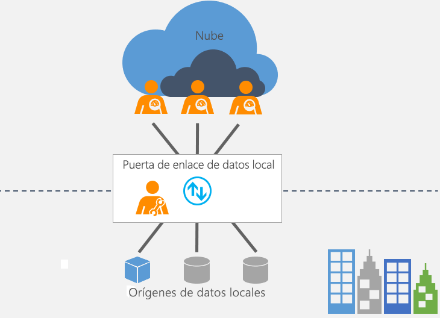

# ¿Qué es una puerta de enlace de datos local?

[!INCLUDE [gateway-rewrite](includes/gateway-rewrite.md)]

Una puerta de enlace de datos local actúa como un puente, para proporcionar una transferencia de datos rápida y segura entre los datos locales (los datos que no se encuentran en la nube) y varios servicios en la nube de Microsoft. Estos servicios en la nube incluyen Power BI, PowerApps, Power Automate, Azure Analysis Services y Azure Logic Apps. Al usar una puerta de enlace, las organizaciones pueden mantener bases de datos y otros orígenes de datos en sus redes locales, pero usar de forma segura esos datos locales en servicios en la nube.

## Cómo funciona la puerta de enlace

Para más información sobre cómo funciona la puerta de enlace, vea [Arquitectura de puerta de enlace de datos local](/data-integration/gateway/service-gateway-onprem-indepth).

## Tipos de puertas de enlace

Hay dos tipos de puertas de enlace diferentes, cada una para un escenario distinto:

* **Puerta de enlace de datos local**: permite que varios usuarios se conecten a varios orígenes de datos locales. Puede usar una puerta de enlace de datos local con todos los servicios admitidos, con una sola instalación de puerta de enlace. Esta puerta de enlace está diseñada especialmente para escenarios complejos en los que varios usuarios acceden a varios orígenes de datos.

* **Puerta de enlace de datos local (modo personal)** : permite que un usuario se conecte a los orígenes y no pueda compartirlos con otros usuarios. Una puerta de enlace de datos local (modo personal) solo se puede usar con Power BI. Esta puerta de enlace está diseñada especialmente para los escenarios en los que usted es el único que crea informes y no necesita compartir ningún origen de datos con otros usuarios.

## Uso de una puerta de enlace

Hay cuatro pasos principales para usar una puerta de enlace.

1. [Descargar e instalar la puerta de enlace](/data-integration/gateway/service-gateway-install) en un equipo local.
1. [Configurar](/data-integration/gateway/service-gateway-app) la puerta de enlace según el firewall y otros requisitos de red.
1. [Agregar administradores de puerta de enlace](/data-integration/gateway/service-gateway-manage) que también pueden administrar otros requisitos de red.
1. [Usar la puerta de enlace](service-gateway-sql-tutorial.md) para actualizar un origen de datos local.
1. [Solucionar los problemas](service-gateway-onprem-tshoot.md) de la puerta de enlace en caso de errores.

## Pasos siguientes

* [Instalación de la puerta de enlace de datos local](/data-integration/gateway/service-gateway-install)

¿Tiene más preguntas? [Pruebe la comunidad de Power BI](https://community.powerbi.com/)
