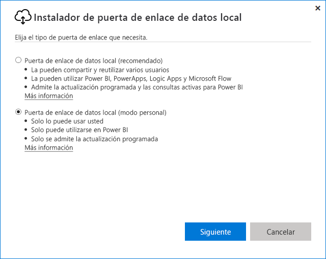
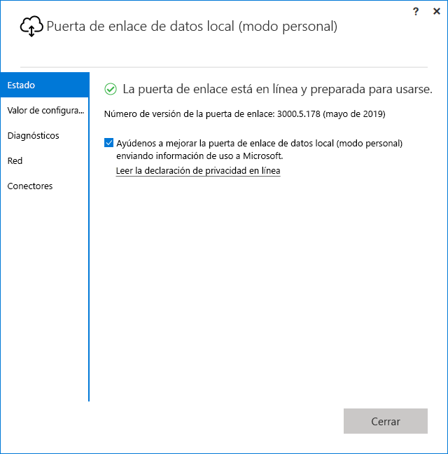

# <a name="use-personal-gateways-in-power-bi"></a>Uso de puertas de enlace personales en Power BI

[!INCLUDE [gateway-rewrite](includes/gateway-rewrite.md)]

La puerta de enlace de datos local (modo personal) es una versión de la puerta de enlace de datos local que solo funciona con Power BI. Puede usar una puerta de enlace personal para instalarla en su propio equipo y obtener acceso a los datos locales.

> [!NOTE]
> Solo puede tener una puerta de enlace en modo personal en ejecución por cada usuario de Power BI. Si instala otra puerta de enlace en modo personal para el mismo usuario, incluso en un equipo diferente, la instalación más reciente reemplazará la ya existente.

## <a name="on-premises-data-gateway-vs-on-premises-data-gateway-personal-mode"></a>Diferencias entre la puerta de enlace de datos de local y la puerta de enlace de datos local (modo personal)

En la tabla siguiente se describen las diferencias entre una puerta de enlace de datos local y una puerta de enlace de datos local (modo personal).

|   |Puerta de enlace de datos local | Puerta de enlace de datos local (modo personal) |
| ---- | ---- | ---- |
|Servicios en la nube compatibles |Power BI, PowerApps, Azure Logic Apps, Microsoft Flow, Azure Analysis Services, flujos de datos |Power BI |
|Se ejecuta |Según la configuración de los usuarios que tienen acceso a la puerta de enlace |Como usted para la autenticación de Windows y según haya configurado para otros tipos de autenticación |
|Solo se puede instalar como administrador del equipo |Sí |No |
|Administración centralizada de orígenes de datos y puertas de enlace |Sí |No |
|Importación de datos y programación de actualización |Sí |Sí |
|Compatibilidad con DirectQuery |Sí |No |
|Compatibilidad con LiveConnect para Analysis Services |Sí |No |

## <a name="install-the-on-premises-data-gateway-personal-mode"></a>Instalación de la puerta de enlace de datos local (modo personal)

Para instalar la puerta de enlace de datos local (modo personal):

1. [Descargue la puerta de enlace de datos local](https://go.microsoft.com/fwlink/?LinkId=820925&clcid=0x409).

2. En el instalador, seleccione la puerta de enlace de datos local (modo personal) y, después, seleccione **Siguiente**.

   

Los archivos de puerta de enlace se instalan en _"%LocalAppData%\Microsoft\Puerta de enlace de datos local (modo personal)_ . Después de finalizada la instalación correctamente e iniciada la sesión, verá la pantalla siguiente.



## <a name="use-fast-combine-with-the-personal-gateway"></a>Uso de Combinación rápida con la puerta de enlace personal

Combinación rápida en una puerta de enlace personal ayuda a omitir niveles de privacidad especificados mientras se ejecutan consultas. Para habilitar Combinación rápida para que funcione con la puerta de enlace de datos local (modo personal):

1. Con el Explorador de archivos, abra el archivo siguiente:

   `%localappdata%\Microsoft\On-premises data gateway (personal mode)\Microsoft.PowerBI.DataMovement.Pipeline.GatewayCore.dll.config`

2. En la parte inferior del archivo, agregue el siguiente texto:

    ```xml
    <setting name="EnableFastCombine" serializeAs="String">
       <value>true</value>
    </setting>
    ```

3. Una vez finalizado, la configuración surte efecto en aproximadamente un minuto. Para comprobar que funciona correctamente, pruebe una actualización a petición en el servicio Power BI para confirmar que Combinación rápida funciona.

## <a name="frequently-asked-questions-faq"></a>Preguntas más frecuentes (P+F)

**Pregunta:** ¿Se puedo ejecutar la puerta de enlace de datos local (modo personal) en paralelo con la puerta de enlace de datos local (conocida anteriormente como la versión Enterprise de la puerta de enlace)?
  
**Respuesta:** Sí, ambas puertas de enlace se pueden ejecutar simultáneamente.

**Pregunta:** ¿Se puede ejecutar la puerta de enlace de datos local (modo personal) como un servicio?
  
**Respuesta:** No. La puerta de enlace de datos local (modo personal) solo puede ejecutarse como una aplicación. Si necesita ejecutar la puerta de enlace como un servicio o en modo de administrador, tiene que considerar la [puerta de enlace de datos local](/data-integration/gateway/service-gateway-onprem) (conocida anteriormente como puerta de enlace Enterprise).

**Pregunta:** ¿Con qué frecuencia se actualiza la puerta de enlace de datos local (modo personal)?
  
**Respuesta:** Tenemos previsto actualizar cada mes la puerta de enlace personal.

**Pregunta:** ¿Por qué se me pide actualizar mis credenciales?
  
**Respuesta:** Muchas situaciones pueden desencadenar una solicitud de credenciales. La más común es que haya vuelto a instalar la puerta de enlace de datos local (modo personal) en un equipo diferente la puerta de enlace Power BI personal. También podría haber ocurrido un problema en el origen de datos y Power BI no pudo realizar una conexión de prueba, o se ha agotado el tiempo de espera o se produjo un error del sistema. Para actualizar las credenciales en el servicio Power BI, seleccione el icono de engranaje y seleccione **Configuración** > **Conjuntos de datos**. Busque el conjunto de datos que desee y seleccione **Credenciales de origen de datos**.

**Pregunta:** ¿Durante cuánto tiempo estará sin conexión mi puerta de enlace personal anterior durante la actualización?
  
**Respuesta:** La actualización de la puerta de enlace personal a la nueva versión solo tarda unos minutos.

**Pregunta:** Uso scripts de R y Python. ¿Se admiten?
  
**Respuesta:** Los scripts de R y Python son compatibles con el modo personal.

## <a name="next-steps"></a>Pasos siguientes

* [Configuración de los valores del proxy para la puerta de enlace de datos local](/data-integration/gateway/service-gateway-proxy)  

¿Tiene más preguntas? Consulte la [Comunidad de Power BI](https://community.powerbi.com/).
