# <a name="tutorial-connect-to-on-premises-data-in-sql-server"></a>Tutorial: Conexión a datos locales en SQL Server

Una puerta de enlace de datos local es un software que se instala en una red local; facilita el acceso a los datos en esa red. En este tutorial creará un informe en Power BI Desktop basado en datos de ejemplo importados desde SQL Server. A continuación, publicará el informe en el servicio Power BI y configurará una puerta de enlace para que el servicio pueda acceder a los datos locales. Este acceso significa que el servicio puede actualizar los datos para mantener actualizado el informe.

En este tutorial, obtendrá información sobre cómo:
> [!div class="checklist"]
> * Crear un informe a partir de datos de SQL Server
> * Publicar el informe en el servicio Power BI
> * Agregar SQL Server como un origen de datos de la puerta de enlace
> * Actualizar los datos en el informe

Si no está registrado en Power BI, [regístrese para obtener una evaluación gratuita](https://app.powerbi.com/signupredirect?pbi_source=web) antes de empezar.


## <a name="prerequisites"></a>Requisitos previos

* [Instalar Power BI Desktop](https://powerbi.microsoft.com/desktop/)
* [Instalar SQL Server](https://docs.microsoft.com/sql/database-engine/install-windows/install-sql-server) en un equipo local 
* [Instalar una puerta de enlace de datos local](service-gateway-install.md) en el mismo equipo local (en producción, normalmente sería un equipo diferente)


## <a name="set-up-sample-data"></a>Configuración de datos de ejemplo

Primero debe agregar los datos de ejemplo a SQL Server, para poder usarlos en el resto del tutorial.

1. En SQL Server Management Studio (SSMS), conéctese a la instancia de SQL Server y cree una base de datos de prueba.

    ```sql
    CREATE DATABASE TestGatewayDocs
    ```

2. En la base de datos que creó, agregue una tabla e inserte los datos.

    ```sql
    USE TestGatewayDocs

    CREATE TABLE Product (
        SalesDate DATE,
        Category  VARCHAR(100),
        Product VARCHAR(100),
        Sales MONEY,
        Quantity INT
    )

    INSERT INTO Product VALUES('2018-05-05','Accessories','Carrying Case',9924.60,68)
    INSERT INTO Product VALUES('2018-05-06','Accessories','Tripod',1350.00,18)
    INSERT INTO Product VALUES('2018-05-11','Accessories','Lens Adapter',1147.50,17)
    INSERT INTO Product VALUES('2018-05-05','Accessories','Mini Battery Charger',1056.00,44)
    INSERT INTO Product VALUES('2018-05-06','Accessories','Telephoto Conversion Lens',1380.00,18)
    INSERT INTO Product VALUES('2018-05-06','Accessories','USB Cable',780.00,26)
    INSERT INTO Product VALUES('2018-05-08','Accessories','Budget Movie-Maker',3798.00,9)
    INSERT INTO Product VALUES('2018-05-09','Digital video recorder','Business Videographer',10400.00,13)
    INSERT INTO Product VALUES('2018-05-10','Digital video recorder','Social Videographer',3000.00,60)
    INSERT INTO Product VALUES('2018-05-11','Digital','Advanced Digital',7234.50,39)
    INSERT INTO Product VALUES('2018-05-07','Digital','Compact Digital',10836.00,84)
    INSERT INTO Product VALUES('2018-05-08','Digital','Consumer Digital',2550.00,17)
    INSERT INTO Product VALUES('2018-05-05','Digital','Slim Digital',8357.80,44)
    INSERT INTO Product VALUES('2018-05-09','Digital SLR','SLR Camera 35mm',18530.00,34)
    INSERT INTO Product VALUES('2018-05-07','Digital SLR','SLR Camera',26576.00,88)
    ```

3. Seleccione los datos de la tabla para verificarlos.

    ```sql
    SELECT * FROM Product
    ```

    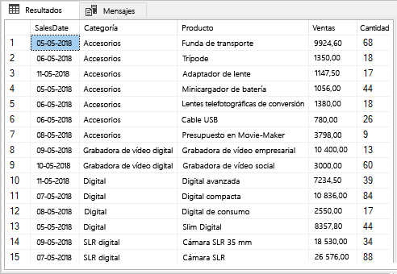


## <a name="build-and-publish-a-report"></a>Compilación y publicación de un informe

Ahora que ya tiene datos de ejemplo con los que trabajar, conéctese a SQL Server en Power BI Desktop y genere un informe basado en los datos. Después, publique el informe en el servicio Power BI.

1. En Power BI Desktop, en la pestaña **Inicio**, seleccione **Obtener datos** > **SQL Server**.

2. En **Servidor**, escriba el nombre del servidor y, en **Base de datos**, escriba "TestGatewayDocs". Seleccione **Aceptar**. 

    

3. Verifique sus credenciales y luego seleccione **Conectar**.

4. En **Navegador**, seleccione la tabla **Product** y después seleccione **Cargar**.

    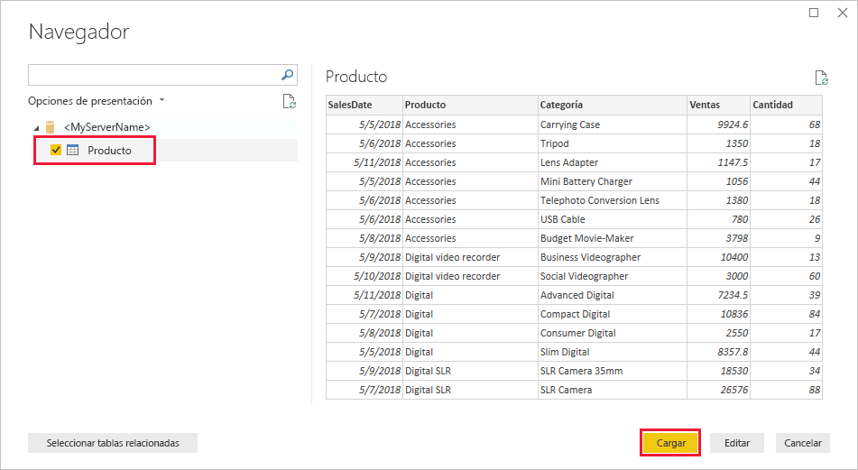

5. En la vista **Informe** de Power BI Desktop del panel **Visualizaciones**, seleccione **Gráfico de columnas apiladas**.

    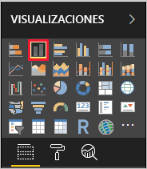    

6. Con el gráfico de columnas seleccionado en el lienzo del informe, en el panel **Campos**, seleccione los campos **Categoría** y **Ventas**.  

    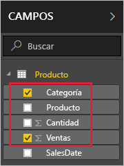

    Ahora el gráfico debería parecerse al siguiente.

    

    Tenga en cuenta que **SLR Camera** es el líder de ventas actual. Esto cambiará al actualizar los datos y el informe más adelante en este tutorial.

7. Guarde el informe con el nombre "TestGatewayDocs.pbix".

8. En la pestaña **Inicio**, seleccione **Publicar** > **Mi área de trabajo** > **Seleccionar**. Inicie sesión en el servicio Power BI si se le pide que lo haga. 

    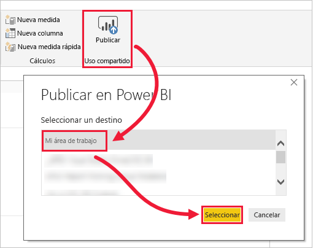

9. En la pantalla **Correcto**, seleccione **Abrir "TestGatewayDocs.pbix" en Power BI**.


## <a name="add-sql-server-as-a-gateway-data-source"></a>Agregar SQL Server como un origen de datos de la puerta de enlace

En Power BI Desktop, conéctese directamente a SQL Server, pero el servicio Power BI requiere que una puerta de enlace actúe como un puente. Ahora agregue la instancia de SQL Server como origen de datos para la puerta de enlace que creó en un artículo anterior (se enumera en [Requisitos previos](#prereqisites)). 

1. En la esquina superior derecha del servicio Power BI, seleccione el icono del engranaje  > **Administrar puertas de enlace**.

    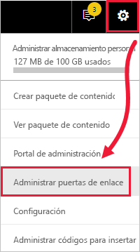

2. Seleccione **Agregar origen de datos** y escriba "test-sql-source" en **Nombre del origen de datos**.

    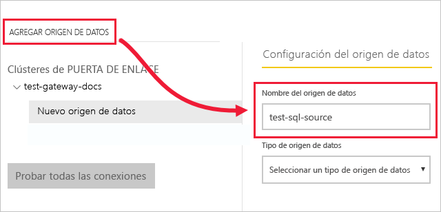

3. Seleccione un **Tipo de origen de datos** de **SQL Server** y luego escriba otros valores tal como se muestra.

    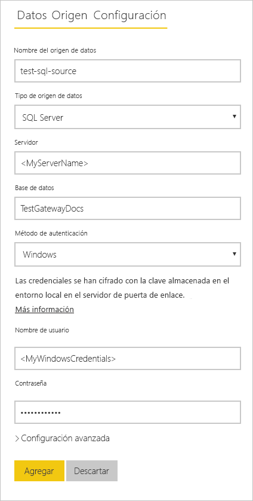

    | Opción | Valor |
    | ---    | ---   |
    | **Nombre del origen de datos**       | test-sql-source      |
    | **Tipo de origen de datos**       | SQL Server      |
    | **Servidor**       |  El nombre de la instancia de SQL Server (debe ser idéntico al especificado en Power BI Desktop)    |
    | **Base de datos**       | TestGatewayDocs      |
    | **Método de autenticación**       | Windows      |
    | **Nombre de usuario**        |  La cuenta, como michael@contoso.com, usada para conectarse a SQL Server     |
    | **Contraseña**       |  La contraseña de la cuenta que utilice para conectarse a SQL Server    |

4. Seleccione **Agregar**. Si el proceso se completa correctamente, verá el mensaje *Conexión correcta*.

    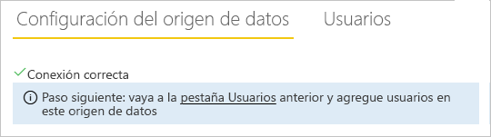

    Ahora puede usar este origen de datos para incluir los datos de SQL Server en los informes y paneles de Power BI.


## <a name="configure-and-use-data-refresh"></a>Configuración y uso de la actualización de datos

Tiene un informe publicado en el servicio Power BI y el origen de datos de SQL Server configurado. Con esto, ahora realice un cambio en la tabla Product y, de esta forma, se cambia el flujo a través de la puerta de enlace hasta el informe publicado. Configure también la actualización programada para controlar los futuros cambios.

1. En SSMS, actualice los datos en la tabla Product.

    ```sql
    UPDATE Product
    SET Sales = 32508, Quantity = 252
    WHERE Product='Compact Digital'     

    ```

2. En el panel de navegación izquierdo del servicio Power BI, seleccione **Mi área de trabajo**.

3. En **Conjuntos de datos**, en el conjunto de datos **TestGatewayDocs**, seleccione **más** (**. . .**) > **Actualizar ahora**.

    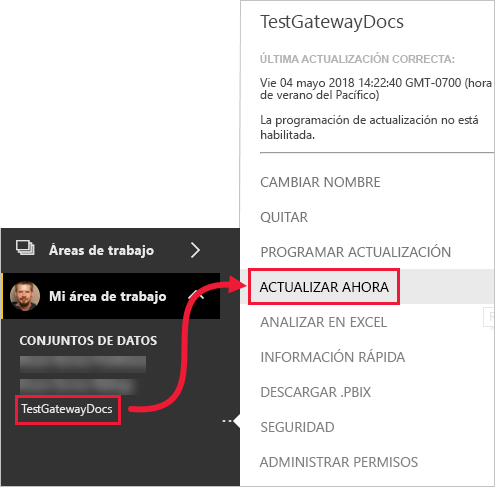

4. Seleccione **Mi área de trabajo** > **Informes** > **TestGatewayDocs**. Observe el flujo de la actualización, y ahora el líder de ventas pasa a ser **Compact Digital**. 

    

5. Seleccione **Mi área de trabajo** > **Informes** > **TestGatewayDocs**. Seleccione **más** (**. . .**) > **Programar actualización**.

6. En **Programar actualización**, establezca la actualización en **Activada** y después seleccione **Aplicar**. El conjunto de datos se actualiza diariamente de forma predeterminada.

    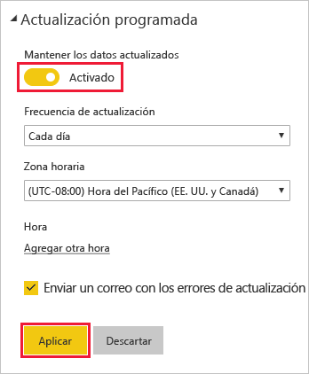

## <a name="clean-up-resources"></a>Limpieza de recursos
Si no desea volver a utilizar los datos de ejemplo, ejecute `DROP DATABASE TestGatewayDocs` en SSMS. Si no desea usar el origen de datos de SQL Server, [quite el origen de datos](service-gateway-manage.md#remove-a-data-source). 


## <a name="next-steps"></a>Pasos siguientes
En este tutorial, ha obtenido información sobre cómo:
> [!div class="checklist"]
> * Crear un informe a partir de datos de SQL Server
> * Publicar el informe en el servicio Power BI
> * Agregar SQL Server como un origen de datos de la puerta de enlace
> * Actualizar los datos en el informe

Avance hasta el artículo siguiente para obtener más información.
> [!div class="nextstepaction"]
> [Administración de una puerta de enlace de Power BI](service-gateway-manage.md)

