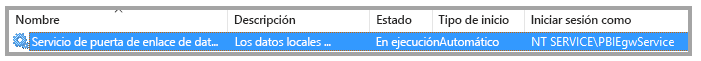
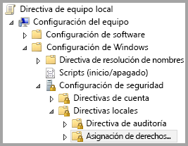
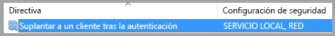
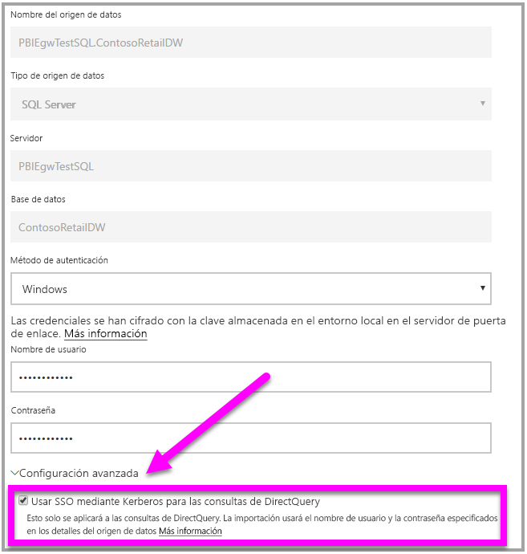

# <a name="use-resource-based-kerberos-for-single-sign-on-sso-from-power-bi-to-on-premises-data-sources"></a>Uso de Kerberos basado en recursos para el inicio de sesión único (SSO) de Power BI a orígenes de datos locales

Use la [delegación restringida de Kerberos basada en recursos](/windows-server/security/kerberos/kerberos-constrained-delegation-overview) para habilitar la conectividad de inicio de sesión único de Windows Server 2012 y versiones posteriores, que permite a los servicios front-end y back-end estar en dominios diferentes. Para que esto funcione, el dominio del servicio back-end debe confiar en el dominio del servicio front-end.

## <a name="preparing-for-resource-based-kerberos-constrained-delegation"></a>Preparación de la delegación restringida de Kerberos basada en recursos

Deben configurarse varios elementos para que la delegación restringida de Kerberos funcione correctamente, incluidos los _nombres principales de servicio_ (SPN) y la configuración de delegación de cuentas de servicio.

### <a name="prerequisite-1-operating-system-requirements"></a>Requisito previo 1: requisitos del sistema operativo

La delegación restringida basada en recursos solo puede configurarse en un controlador de dominio que ejecute Windows Server 2012 R2 o Windows Server 2012 o superior.

### <a name="prerequisite-2-install-and-configure-the-on-premises-data-gateway"></a>Requisito previo 2: instalación y configuración de la puerta de enlace de datos local

La puerta de enlace de datos local admite la actualización local, así como la _adquisición de la configuración_ de las puertas de enlace existentes.

### <a name="prerequisite-3-run-the-gateway-windows-service-as-a-domain-account"></a>Requisito previo 3: ejecución del servicio de Windows de puerta de enlace como cuenta de dominio

En una instalación estándar, la puerta de enlace se ejecuta como una cuenta de servicio de la máquina local (en concreto, _NT Service\PBIEgwService_) como se muestra en la siguiente imagen:



Para habilitar la **delegación restringida de Kerberos, debe ejecutar la puerta de enlace como una cuenta de dominio, a menos que Azure AD ya esté sincronizado con su Active Directory local (mediante Azure AD DirSync o Azure AD Connect). Si necesita cambiar la cuenta a una cuenta de dominio, vea [Cambio de la cuenta de servicio de puerta de enlace](/data-integration/gateway/service-gateway-service-account).

Si Azure AD DirSync / Connect está configurado y las cuentas de usuario están sincronizadas, el servicio de puerta de enlace no necesita realizar búsquedas de AD locales en tiempo de ejecución. Puede usar al SID de servicio local (en lugar de requerir una cuenta de dominio) para el servicio de puerta de enlace. Los pasos de configuración de la delegación restringida de Kerberos que se describen en este artículo son los mismos que esa configuración (simplemente se aplican al objeto informático de la puerta de enlace de Active Directory, en lugar de la cuenta de dominio).

### <a name="prerequisite-4-have-domain-admin-rights-to-configure-spns-setspn-and-kerberos-constrained-delegation-settings"></a>Requisito previo 4: tener derechos de administrador de dominio para configurar los SPN (SetSPN) y la configuración de la delegación restringida de Kerberos

Aunque es técnicamente posible para un administrador de dominio otorgar derechos temporales o permanentes a otra persona para configurar SPN y la delegación de Kerberos sin necesidad de derechos de administrador de dominio, no es el enfoque recomendado. En la sección siguiente, se tratan detenidamente los pasos de configuración necesarios para el **Requisito previo 3**.

## <a name="configuring-kerberos-constrained-delegation-for-the-gateway-and-data-source"></a>Configuración de la delegación restringida de Kerberos para el origen de datos y la puerta de enlace

Para configurar correctamente el sistema, es necesario configurar o validar los dos elementos siguientes:

* Si es necesario, configure un SPN para la cuenta de dominio del servicio de puerta de enlace.

* Configure las opciones de delegación en la cuenta de dominio del servicio de puerta de enlace.

Tenga en cuenta que debe ser un administrador de dominio para realizar esos dos pasos de configuración.

En las siguientes secciones se describen estos pasos.

### <a name="configure-an-spn-for-the-gateway-service-account"></a>Configuración de un SPN para la cuenta de servicio de la puerta de enlace

En primer lugar, determine si ya se ha creado un SPN para la cuenta de dominio que se usa como cuenta de servicio de la puerta de enlace, pero siguiendo estos pasos:

1. Como administrador de dominio, inicie **Usuarios y equipos de Active Directory**.

1. Haga clic con el botón derecho en el dominio, seleccione **Buscar** y escriba el nombre de la cuenta de servicio de la puerta de enlace.

1. En el resultado de la búsqueda, haga clic con el botón derecho en la cuenta de servicio de la puerta de enlace y seleccione **Propiedades**.

1. Si la pestaña **Delegación** es visible en el cuadro de diálogo **Propiedades**, ya se ha creado un SPN y puede pasar a la subsección siguiente sobre cómo [configurar la delegación](#configure-delegation-settings).

    Si no hay pestaña **Delegación** en el cuadro de diálogo **Propiedades**, puede crear manualmente un SPN en dicha cuenta, lo cual agrega la pestaña **Delegación** (esa es la manera más fácil de configurar la delegación). Puede crear un SPN utilizando la [herramienta setspn](https://technet.microsoft.com/library/cc731241.aspx) que viene con Windows (necesita derechos de administrador de dominio para crear el SPN).

    Imagine, por ejemplo, que la cuenta de servicio de la puerta de enlace es "PBIEgwTest\GatewaySvc" y el nombre del equipo que ejecuta el servicio de puerta de enlace es **Machine1**. Para establecer el SPN para la cuenta de servicio de la puerta de enlace para esa máquina en este ejemplo, ejecutaría el comando siguiente:

      

    Con ese paso completado, podemos continuar con la configuración de las opciones de delegación.

### <a name="configure-delegation-settings"></a>Configuración de los parámetros de delegación

En los pasos siguientes, se asume que disponemos de un entorno local con dos equipos en dominios diferentes: un equipo de puerta de enlace y un servidor de bases de datos que ejecuta SQL Server. Para este ejemplo, supongamos también la configuración y los nombres siguientes:

* Nombre de la máquina de la puerta de enlace: **PBIEgwTestGW**
* Cuenta de servicio de puerta de enlace: **PBIEgwTestFrontEnd\GatewaySvc** (nombre para mostrar de la cuenta: Gateway Connector)
* Nombre de la máquina del origen de datos de SQL Server: **PBIEgwTestSQL**
* Cuenta de servicio del origen de datos de SQL Server: **PBIEgwTestBackEnd\SQLService**

Con esos nombres y configuración de ejemplo, use estos los pasos de configuración:

1. Al utilizar **Equipos y usuarios de Active Directory**, que es un complemento de Microsoft Management Console (MMC), en el controlador de dominios para el dominio **PBIEgwTestFront-end**, asegúrese de que no se aplica la configuración de delegación para la cuenta de servicio de la puerta de enlace.

    

1. Al utilizar **Equipos y usuarios de Active Directory** en el controlador de dominios para el dominio **PBIEgwTestBack-end**, asegúrese de que no se aplica la configuración de delegación para la cuenta de servicio de back-end. Además, asegúrese de que el atributo "msDS-AllowedToActOnBehalfOfOtherIdentity" tampoco está configurado para esta cuenta. Puede encontrar este atributo en el "Editor de atributos", tal como se muestra en la siguiente imagen:

    

1. Cree un grupo en **Equipos y usuarios de Active Directory**, en el controlador de dominios para el dominio **PBIEgwTestBack-end**. Agregue la cuenta de servicio de puerta de enlace a este grupo como se muestra en la siguiente imagen. La imagen muestra un nuevo grupo denominado _ResourceDelGroup_ y la cuenta de servicio de puerta de enlace **GatewaySvc** agregada a este grupo.

    

1. Abra un símbolo del sistema y ejecute los comandos siguientes en el controlador de dominio para el dominio **PBIEgwTestBack final** para actualizar el atributo msDS-AllowedToActOnBehalfOfOtherIdentity de la cuenta de servicio de back-end:

    ```powershell
    $c = Get-ADGroup ResourceDelGroup
    Set-ADUser SQLService -PrincipalsAllowedToDelegateToAccount $c
    ```

1. Puede comprobar que la actualización se refleja en la pestaña "Editor de atributos" en las propiedades de la cuenta de servicio de back-end en **Equipos y usuarios de Active Directory**.

Por último, en la máquina que ejecuta el servicio de puerta de enlace (**PBIEgwTestGW** en nuestro ejemplo), la cuenta de servicio de la puerta de enlace debe tener la directiva local "Suplantar a un cliente tras la autenticación". Puede realizar y comprobar esto con el Editor de directivas de grupo local (**gpedit**).

1. En el equipo de puerta de enlace, ejecute: _gpedit.msc_.

1. Vaya a **Directiva de equipo Local > Configuración del equipo > Configuración de Windows > Configuración de seguridad > Directivas locales > Asignación de derechos de usuario**, como se muestra en la siguiente imagen.

    

1. En la lista de directivas en **Asignación de derechos de usuario**, seleccione **Suplantar a un cliente tras la autenticación**.

    

1. Haga clic con el botón derecho y abra las **Propiedades** de **Suplantar a un cliente tras la autenticación** y compruebe la lista de cuentas. Debe incluir la cuenta de servicio de la puerta de enlace (**PBIEgwTestFront-end**  **\GatewaySvc**).

1. En la lista de directivas en **Asignación de derechos de usuario**, seleccione **Actuar como parte del sistema operativo (SeTcbPrivilege)** . Asegúrese también de que la cuenta de servicio de la puerta de enlace está incluida en la lista de cuentas.

1. Reinicie el proceso del servicio de la **puerta de enlace de datos local**.

## <a name="running-a-power-bi-report"></a>Ejecución de un informe de Power BI

Después de completar todos los pasos de configuración que se describen anteriormente en este artículo, puede utilizar la página **Administrar puerta de enlace** en Power BI para configurar el origen de datos. Posteriormente, en su **Configuración avanzada**, habilite SSO y publique los enlaces de los conjuntos de datos y los informes al origen de datos.



Esta configuración funciona en la mayoría de los casos. Sin embargo, con Kerberos puede haber distintas configuraciones en función de su entorno. Si todavía no se pudo cargar el informe, debe ponerse en contacto con el administrador de dominio para investigar en profundidad.

## <a name="next-steps"></a>Pasos siguientes

Para más información acerca de la **puerta de enlace de datos local** y **DirectQuery**, consulte los recursos siguientes:

* [¿Qué es una puerta de enlace de datos local?](/data-integration/gateway/service-gateway-onprem)
* [DirectQuery en Power BI](desktop-directquery-about.md)
* [Orígenes de datos compatibles con DirectQuery](desktop-directquery-data-sources.md)
* [DirectQuery y SAP BW](desktop-directquery-sap-bw.md)
* [DirectQuery y SAP HANA](desktop-directquery-sap-hana.md)
