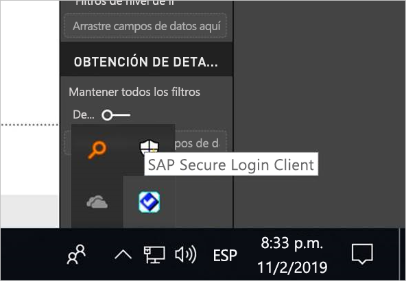
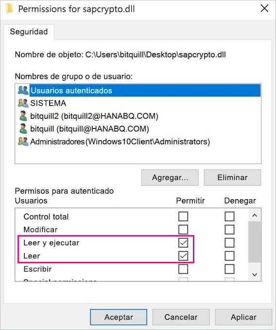
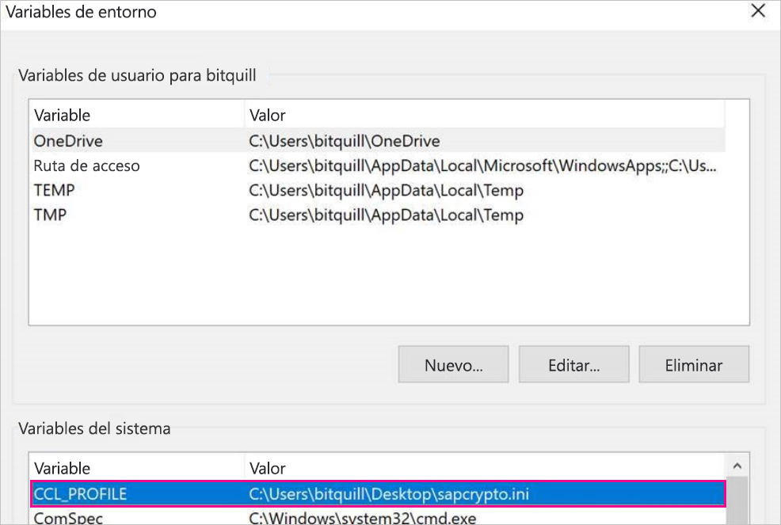
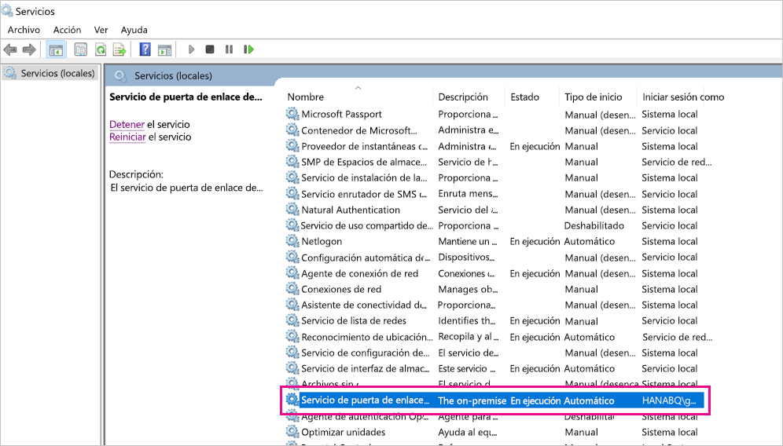
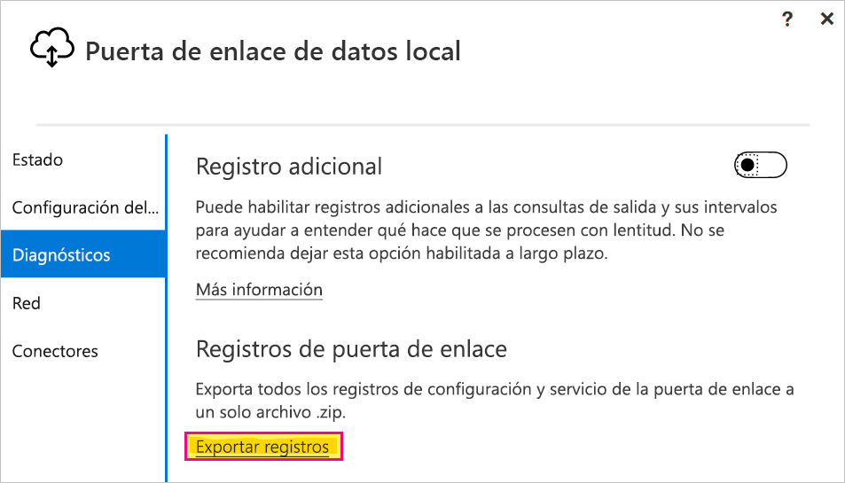

# <a name="use-kerberos-single-sign-on-for-sso-to-sap-bw-using-commoncryptolib-sapcryptodll"></a>Uso del inicio de sesión único de Kerberos para el SSO en SAP BW con CommonCryptoLib (sapcrypto.dll)

En este artículo se describe cómo configurar el origen de datos de SAP BW para habilitar el inicio de sesión único del servicio Power BI mediante CommonCryptoLib (sapcrypto.dll).

> [!NOTE]
> Complete los pasos de este artículo junto con los pasos de [configuración del SSO de Kerberos](service-gateway-sso-kerberos.md) antes de intentar actualizar un informe basado en SAP BW que use el SSO de Kerberos. El uso de CommonCryptoLib como la biblioteca de SNC permite establecer conexiones SSO tanto a los servidores de aplicaciones de SAP BW como a los servidores de mensajería de SAP BW.

## <a name="configure-sap-bw-to-enable-sso-using-commoncryptolib"></a>Configuración de SAP BW para habilitar el SSO mediante CommonCryptoLib

> [!NOTE]
> La puerta de enlace de datos local es software de 64 bits, por lo que se requiere la versión de 64 bits de CommonCryptoLib (sapcrypto.dll) para realizar el SSO de BW. Si planea probar la conexión de SSO al servidor de SAP BW en la GUI de SAP antes de intentar una conexión de SSO a través de la puerta de enlace (recomendado), también necesitará la versión de 32 bits de CommonCryptoLib, porque la GUI de SAP es software de 32 bits.

1. Asegúrese de que el servidor de BW está configurado correctamente para el SSO de Kerberos con CommonCryptoLib. Si es así, debería poder usar SSO para acceder al servidor de BW (ya sea de manera directa o a través de un servidor de mensajería de SAP BW) con una herramienta de SAP como la GUI de SAP que se configuró para usar CommonCryptoLib. Para obtener más información sobre los pasos de configuración, consulte [SAP Single Sign-On: Authenticate with Kerberos/SPNEGO](https://blogs.sap.com/2017/07/27/sap-single-sign-on-authenticate-with-kerberosspnego/) (Inicio de sesión único de SAP: Autenticarse con Kerberos/SPNEGO). El servidor de BW debe usar CommonCryptoLib como biblioteca de SNC y tener un nombre de SNC que empiece por "CN =", como "CN=BW1". Para más información sobre los requisitos de nombre de SNC, consulte el artículo sobre los [parámetros de SNC para la configuración de Kerberos](https://help.sap.com/viewer/df185fd53bb645b1bd99284ee4e4a750/3.0/en-US/360534094511490d91b9589d20abb49a.html) (en concreto, el parámetro snc/identity/as).

1. Si aún no lo ha hecho, instale la versión x64 del [conector .NET de SAP](https://support.sap.com/en/product/connectors/msnet.html) en el equipo en el que se ha instalado la puerta de enlace. Puede comprobar si el componente se ha instalado si se intenta conectar al servidor de BW en Power BI Desktop desde el equipo de puerta de enlace. Si no se puede conectar con la implementación 2.0, el conector .NET no está instalado o no se ha instalado en la caché global de ensamblados.

1. Asegúrese de que Secure Login Client (SLC) de SAP no se esté ejecutando en el equipo en el que está instalada la puerta de enlace. SLC almacena en caché los vales de Kerberos de forma que puede interferir con la posibilidad de que la puerta de enlace use Kerberos para SSO. Si SLC está instalado, desinstálelo o asegúrese de salir de SAP Secure Login Client: haga clic con el botón derecho en el icono de la bandeja del sistema y seleccione Log Out and Exit (Cerrar sesión y Salir) antes de intentar una conexión SSO mediante la puerta de enlace. No se admite el uso de SLC en máquinas con Windows Server. Para obtener más información, consulte la [nota 2780475 de SAP](https://launchpad.support.sap.com/#/notes/2780475) (se requiere s-user).

    

    Si desinstala SLC o selecciona **Log Out** (Cerrar sesión) y **Exit** (Salir), abra una ventana de comandos y escriba `klist purge` para borrar cualquier vale de Kerberos almacenado en caché antes de intentar una conexión SSO a través de la puerta de enlace.

1. Descargue la versión **8.5.25 o posterior** de CommonCryptoLib (sapcrypto.dll) de 64 bits desde SAP Launchpad y cópiela en una carpeta de la máquina de la puerta de enlace. En el mismo directorio donde copió sapcrypto.dll, cree un archivo denominado sapcrypto.ini con el siguiente contenido:

    ```
    ccl/snc/enable_kerberos_in_client_role = 1
    ```

    El archivo .ini contiene información de configuración requerida por CommonCryptoLib para habilitar el inicio de sesión único en el escenario de puerta de enlace.

    > [!NOTE]
    > Estos archivos se deben almacenar en la misma ubicación; en otras palabras, _/path/to/sapcrypto/_ debe contener tanto sapcrypto.ini como sapcrypto.dll.

    Tanto el usuario del servicio de puerta de enlace como el usuario de Active Directory (AD) que el usuario del servicio va a suplantar necesitan permisos de lectura y ejecución para ambos archivos. Se recomienda conceder permisos para los archivos .ini y .dll al grupo de usuarios autenticados. A efectos de prueba, también puede conceder estos permisos explícitamente al usuario del servicio de la puerta de enlace y al usuario de Active Directory que usará para hacer la prueba. En la captura de pantalla siguiente se ha concedido al grupo de usuarios autenticados permisos de **lectura y ejecución** en sapcrypto.dll:

    

1. Si todavía no tiene un origen de datos de SAP BW asociado a la puerta de enlace a través de la que quiere que se transmita la conexión de SSO, agregue uno en la página **Administrar puertas de enlace** del servicio Power BI. Si ya tiene este tipo de origen de datos, prepárese para editarlo. Elija **SAP Business Warehouse** como el **tipo de origen de datos** si quiere crear una conexión SSO a un servidor de aplicaciones de BW. Seleccione **Servidor de mensajería de SAP Business Warehouse** si quiere crear una conexión SSO a un servidor de mensajería de BW.

    Como **Biblioteca de SNC**, seleccione la variable de entorno **SNC\_LIB o SNC\_LIB\_64** o **Personalizada**. Si selecciona la opción **SNC\_LIB**, debe establecer el valor de la variable de entorno **SNC\_LIB\_64** del equipo de la puerta de enlace en la ruta de acceso absoluta de la copia de sapcrypto.dll de 64 bits en el equipo de la puerta de enlace como, por ejemplo, *C:\Usuarios\Test\Desktop\sapcrypto.dll*. Si elige **Personalizada**, pegue la ruta de acceso absoluta al archivo sapcrypto.dll en el campo Ruta de biblioteca SNC personalizada que aparece en la página **Administrar puertas de enlace**. En **Nombre de asociado de SNC**, escriba el nombre de SNC del servidor de BW. En **Configuración avanzada**, asegúrese de que la opción **Usar SSO mediante Kerberos para las consultas de DirectQuery** esté activada. Los demás campos se deben rellenar como si se estuviera estableciendo una conexión de autenticación de Windows desde PBI Desktop.

1. Cree una variable de entorno del sistema **CCL\_PROFILE** y apúntela a sapcrypto.ini:

    

    Recuerde que los archivos .dll e .ini de sapcrypto deben estar en la misma ubicación. En el ejemplo mostrado anteriormente, donde sapcrypto.ini se encuentra en el escritorio, sapcrypto.dll también se debe encontrar en el escritorio.

1. Reinicie el servicio de puerta de enlace:

    

1. [Ejecución de un informe de Power BI](service-gateway-sso-kerberos.md#run-a-power-bi-report)

## <a name="troubleshooting"></a>Solución de problemas

Si no puede actualizar el informe en el servicio Power BI, puede usar el seguimiento de puerta de enlace, el seguimiento de CPIC y de CommonCryptoLib para ayudar a diagnosticar el problema. El seguimiento de CPIC y CommonCryptoLib son productos de SAP, por lo que Microsoft no puede ofrecer ninguna compatibilidad directa con ellos. En el caso de usuarios de Active Directory a los que se concederá acceso SSO a BW, algunas configuraciones de Active Directory podrían requerir que los usuarios sean miembros del grupo de administradores en la máquina donde está instalada la puerta de enlace.

1. **Registros de puerta de enlace:** Simplemente reproduzca el problema, abra la [aplicación de puerta de enlace](https://docs.microsoft.com/data-integration/gateway/service-gateway-app), vaya a la pestaña **Diagnóstico** y seleccione **Exportar registros**:

    

1. **Seguimiento de CPIC:** Para habilitar el seguimiento de CPIC, establezca dos variables de entorno: **CPIC\_TRACE** y **CPIC\_TRACE\_DIR**. La primera variable establece el nivel de seguimiento y la segunda el directorio del archivo de seguimiento. El directorio debe ser una ubicación en la que puedan escribir los miembros del grupo de usuarios autenticados. Establezca **CPIC\_TRACE** en 3 y **CPIC\_TRACE\_DIR** en el directorio en el que quiere que se escriban los archivos de seguimiento. P. ej.:

    

    Reproduzca el problema y compruebe que CPIC\_TRACE\_DIR contiene archivos de seguimiento.

1. **Seguimiento de CommonCryptoLib:** Active el seguimiento de CommonCryptoLib agregando dos líneas al archivo sapcrypto.ini que creó anteriormente:

    ```
    ccl/trace/level=5
    ccl/trace/directory=<drive>:\logs\sectrace
    ```

    Asegúrese de cambiar la opción _ccl/trace/directory_ por una ubicación en la que los miembros del grupo usuarios autenticados pueden escribir. También puede crear otro archivo .ini para cambiar este comportamiento. En el mismo directorio en que están sapcrypto.ini y sapcrypto.dll, cree un archivo denominado sectrace.ini con el contenido siguiente. Reemplace la opción **DIRECTORY** por una ubicación del equipo en la que los miembros del grupo **Usuarios autenticados** puedan escribir:

    ```
    LEVEL = 5
    DIRECTORY = <drive>:\logs\sectrace
    ```

    Ahora, reproduzca el problema y compruebe que la ubicación a la que apunta **DIRECTORY** contiene archivos de seguimiento. Asegúrese de desactivar el seguimiento de CPIC y CCL cuando haya terminado.

    Para obtener más información sobre el seguimiento de CommonCryptoLib, consulte la [nota 2491573 de SAP](https://launchpad.support.sap.com/#/notes/2491573) (se requiere s-user).

## <a name="next-steps"></a>Pasos siguientes

Para más información acerca de la **puerta de enlace de datos local** y **DirectQuery**, consulte los recursos siguientes:

* [¿Qué es una puerta de enlace de datos local?](/data-integration/gateway/service-gateway-onprem)
* [DirectQuery en Power BI](desktop-directquery-about.md)
* [Orígenes de datos compatibles con DirectQuery](desktop-directquery-data-sources.md)
* [DirectQuery y SAP BW](desktop-directquery-sap-bw.md)
* [DirectQuery y SAP HANA](desktop-directquery-sap-hana.md)
