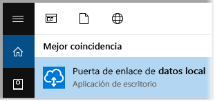
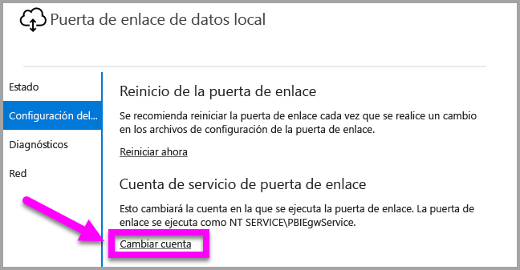
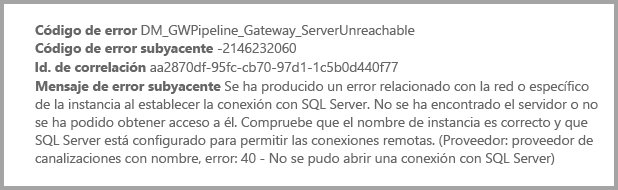

# <a name="use-kerberos-for-single-sign-on-sso-from-power-bi-to-on-premises-data-sources"></a>Uso de Kerberos para el inicio de sesión único (SSO) de Power BI a orígenes de datos locales

Use la [delegación restringida de Kerberos](/windows-server/security/kerberos/kerberos-constrained-delegation-overview) para habilitar la conectividad directa de inicio de sesión único (SSO). La habilitación de SSO facilita la tarea de los paneles y los informes de Power BI para actualizar los datos de orígenes locales.

## <a name="supported-data-sources"></a>Orígenes de datos compatibles

Actualmente se admiten estos orígenes de datos:

* SQL Server
* SAP HANA
* SAP BW
* Teradata
* Spark
* Impala

También ofrecemos compatibilidad para SAP HANA con [SAML (Lenguaje de marcado de aserción de seguridad)](service-gateway-sso-saml.md).

### <a name="sap-hana"></a>SAP HANA

Para habilitar SSO para SAP HANA, primero siga estos pasos:

* Asegúrese de que el servidor de SAP HANA ejecuta la versión mínima requerida, que depende del nivel de plataforma de su servidor de SAP HANA:
  * [HANA 2 SPS 01 Rev 012.03](https://launchpad.support.sap.com/#/notes/2557386)
  * [HANA 2 SPS 02 Rev 22](https://launchpad.support.sap.com/#/notes/2547324)
  * [HANA 1 SP 12 Rev 122.13](https://launchpad.support.sap.com/#/notes/2528439)
* En el equipo de puerta de enlace, instale el controlador ODBC de HANA más reciente de SAP.  La versión mínima es HANA ODBC versión 2.00.020.00, de agosto de 2017.

Para obtener más información sobre cómo configurar SSO para SAP HANA mediante Kerberos, vea [Single Sign-on Using Kerberos](https://help.sap.com/viewer/b3ee5778bc2e4a089d3299b82ec762a7/2.0.03/1885fad82df943c2a1974f5da0eed66d.html) (Inicio de sesión único con Kerberos) en la Guía de seguridad de SAP HANA. Consulte también los vínculos de esa página, en particular SAP Note 1837331 – HOWTO HANA DBSSO Kerberos/Active Directory.

## <a name="prepare-for-kerberos-constrained-delegation"></a>Preparación de la delegación restringida de Kerberos

Debe configurar varios elementos para que la delegación restringida de Kerberos funcione correctamente, como los *nombres de entidad de seguridad de servicio* (SPN) y la configuración de delegación de las cuentas de servicio.

### <a name="prerequisite-1-install-and-configure-the-microsoft-on-premises-data-gateway"></a>Requisito previo 1: instalar y configurar la puerta de enlace de datos local de Microsoft

Esta versión de la puerta de enlace de datos local admite la actualización in situ, así como la adquisición de la configuración de las puertas de enlace existentes.

### <a name="prerequisite-2-run-the-gateway-windows-service-as-a-domain-account"></a>Requisito previo 2: ejecución del servicio de Windows de puerta de enlace como cuenta de dominio

En una instalación estándar, la puerta de enlace se ejecuta como una cuenta de servicio de la máquina local (en concreto, *NT Service\PBIEgwService*).


Para habilitar la delegación restringida de Kerberos, debe ejecutar la puerta de enlace como una cuenta de dominio, a menos que su instancia de Azure Active Directory (Azure AD) ya esté sincronizada con su instancia de Active Directory local (mediante Azure AD DirSync o Azure AD Connect). Para cambiar a una cuenta de dominio, consulte [Cambio de la puerta de enlace a una cuenta de dominio](#switch-the-gateway-to-a-domain-account), más adelante en este artículo.

> [!NOTE]
> Si Azure AD Connect está configurado y las cuentas de usuario están sincronizadas, el servicio de puerta de enlace no necesita realizar búsquedas de Azure AD locales en tiempo de ejecución. Puede usar al SID de servicio local (en lugar de requerir una cuenta de dominio) para el servicio de puerta de enlace. Los pasos de configuración de la delegación restringida de Kerberos que se describen en este artículo son los mismos que esa configuración. Simplemente se aplican al objeto de equipo de la puerta de enlace de Azure AD, en lugar de la cuenta de dominio.

### <a name="prerequisite-3-have-domain-admin-rights-to-configure-spns-setspn-and-kerberos-constrained-delegation-settings"></a>Requisito previo 3: tener derechos de administrador de dominio para configurar los SPN (SetSPN) y la configuración de la delegación restringida de Kerberos

No se recomienda que un administrador de dominio otorgue derechos temporales o permanentes a otra persona para configurar SPN y la delegación de Kerberos sin necesidad de derechos de administrador de dominio. En la siguiente sección, trataremos con más detalle los pasos de configuración recomendados.

## <a name="configure-kerberos-constrained-delegation-for-the-gateway-and-data-source"></a>Configuración de la delegación restringida de Kerberos para la puerta de enlace y el origen de datos

Con su rol de administrador de dominio, configure un SPN para la cuenta de dominio del servicio de la puerta de enlace y configure la delegación en esa cuenta.

### <a name="configure-an-spn-for-the-gateway-service-account"></a>Configuración de un SPN para la cuenta de servicio de la puerta de enlace

En primer lugar, determine si ya se ha creado un nombre de entidad de seguridad de servicio para la cuenta de dominio que se usa como la cuenta de servicio de la puerta de enlace:

1. Con su rol de administrador de dominio, abra **Usuarios y equipos de Active Directory**.

2. Haga clic con el botón derecho en el dominio, seleccione **Buscar** y escriba el nombre de la cuenta de servicio de la puerta de enlace.

3. En el resultado de la búsqueda, haga clic con el botón derecho en la cuenta de servicio de la puerta de enlace y seleccione **Propiedades**.

4. Si la pestaña **Delegación** está visible en el cuadro de diálogo **Propiedades**, significa que ya se ha creado un SPN. Puede avanzar a la configuración de la delegación.

    Si no hay ninguna pestaña **Delegación** en el cuadro de diálogo **Propiedades**, puede crear manualmente un SPN en esa cuenta. De este modo, se agrega la pestaña **Delegación**. Use la [herramienta setspn](https://technet.microsoft.com/library/cc731241.aspx) que viene con Windows (necesita derechos de administrador de dominio para crear el SPN).

    Imagine, por ejemplo, que la cuenta de servicio de la puerta de enlace es "PBIEgwTest\GatewaySvc" y el nombre del equipo que ejecuta el servicio de puerta de enlace es **Machine1**. Para establecer el SPN de la cuenta de servicio de la puerta de enlace en la máquina del ejemplo, ejecute el comando siguiente:

    

    Con ese paso completado, podemos continuar con la configuración de las opciones de delegación.

### <a name="configure-delegation-settings-on-the-gateway-service-account"></a>Configuración de los valores de delegación en la cuenta de servicio de la puerta de enlace

El segundo requisito de la configuración es la configuración de la delegación en la cuenta de servicio de la puerta de enlace. Hay varias herramientas que puede usar para realizar estos pasos. Aquí utilizaremos Usuarios y equipos de Active Directory, que es un complemento de Microsoft Management Console (MMC) que puede usar para administrar y publicar información en el directorio. Está disponible en los controladores de dominio de forma predeterminada. También puede habilitarlo a través de la configuración de las Características de Windows en otros equipos.

Es necesario configurar la delegación restringida de Kerberos con tránsito de protocolo. Con la delegación restringida, debe ser explícito acerca de los servicios que quiere delegar. Por ejemplo, solo SQL Server o el servidor de SAP HANA aceptan llamadas de delegación de la cuenta de servicio de la puerta de enlace.

En esta sección se da por supuesto que ya ha configurado los SPN de los orígenes de datos subyacentes (como SQL Server, SAP HANA, Teradata y Spark). Para obtener información sobre cómo configurar los SPN del servidor del origen de datos, consulte la documentación técnica para el servidor de bases de datos respectivo. También puede ver la entrada de blog [What SPN does your app require?](https://blogs.msdn.microsoft.com/psssql/2010/06/23/my-kerberos-checklist/) (¿Qué SPN requiere su aplicación?).

En los pasos siguientes, se asume que disponemos de un entorno local con dos equipos: un equipo de puerta de enlace y un servidor de bases de datos que ejecuta SQL Server. Para este ejemplo, también asumiremos la configuración y los nombres siguientes:

* Nombre de la máquina de la puerta de enlace: **PBIEgwTestGW**
* Cuenta de servicio de puerta de enlace: **PBIEgwTest\GatewaySvc** (nombre para mostrar de la cuenta: Gateway Connector)
* Nombre de la máquina del origen de datos de SQL Server: **PBIEgwTestSQL**
* Cuenta de servicio del origen de datos de SQL Server: **PBIEgwTest\SQLService**

Aquí le mostramos cómo configurar las opciones de delegación:

1. Con derechos de administrador de dominio, abra **Usuarios y equipos de Active Directory**.

2. Haga clic con el botón derecho en la cuenta de servicio de la puerta de enlace (**PBIEgwTest\GatewaySvc**) y haga clic en **Propiedades**.

3. Seleccione la ficha **Delegación**.

4. Seleccione **Confiar en este equipo para la delegación solo a los servicios especificados** > **Usar cualquier protocolo de autenticación**.

6. En **Servicios en los que esta cuenta puede presentar credenciales delegadas**, haga clic en **Agregar**.

7. En el cuadro de diálogo nuevo, seleccione **Usuarios o equipos**.

8. Escriba la cuenta de servicio para el servicio de base de datos de SQL Server (**PBIEgwTest\SQLService**) y haga clic en **Aceptar**.

9. Seleccione el SPN que ha creado para el servidor de base de datos. En nuestro ejemplo, el SPN empieza por **MSSQLSvc**. Si ha agregado tanto el SPN de FQDN como el de NetBIOS, seleccione ambos. Puede que solo vea uno.

10. Seleccione **Aceptar**. Ahora debería ver el SPN en la lista.

    Si quiere, puede seleccionar **Expandido** para mostrar el SPN de FQDN y el de NetBIOS. El cuadro de diálogo debe ser similar al siguiente si ha seleccionado **Expandido**. Seleccione **Aceptar**.

    

Por último, en la máquina que ejecuta el servicio de puerta de enlace (**PBIEgwTestGW** en nuestro ejemplo), la cuenta de servicio de la puerta de enlace debe tener la directiva local **Suplantar a un cliente tras la autenticación**. Puede realizar y verificar esto con el Editor de directivas de grupo local (**gpedit**).

1. En el equipo de puerta de enlace, ejecute: *gpedit.msc*.

1. Vaya a **Directiva de equipo local** > **Configuración del equipo** > **Configuración de Windows** > **Configuración de seguridad** > **Directivas locales** > **Asignación de derechos de usuario**.

    

1. En la lista de directivas de **Asignación de derechos de usuario**, seleccione **Suplantar a un cliente tras la autenticación**.

    

    Haga clic con el botón derecho y abra **Propiedades**. Compruebe la lista de cuentas. Debe incluir la cuenta de servicio de la puerta de enlace (**PBIEgwTest\GatewaySvc**).

1. En la lista de directivas de **Asignación de derechos de usuario**, seleccione **Actuar como parte del sistema operativo (SeTcbPrivilege)**. Asegúrese también de que la cuenta de servicio de la puerta de enlace está incluida en la lista de cuentas.

1. Reinicie el proceso del servicio de la **puerta de enlace de datos local**.

Si usa SAP HANA, se recomienda seguir estos pasos adicionales, que pueden comportar una pequeña mejora de rendimiento.

1. En el directorio de instalación de la puerta de enlace, busque y abra este archivo de configuración: *Microsoft.PowerBI.DataMovement.Pipeline.GatewayCore.dll.config*.

1. Busque la propiedad *FullDomainResolutionEnabled* y cambie su valor a *True*.

    ```xml
    <setting name=" FullDomainResolutionEnabled " serializeAs="String">
          <value>True</value>
    </setting>
    ```

## <a name="run-a-power-bi-report"></a>Ejecutar un informe de Power BI

Después de completar todos los pasos de configuración, puede utilizar la página **Administrar puerta de enlace** en Power BI para configurar el origen de datos. Posteriormente, en su **Configuración avanzada**, habilite SSO y publique los enlaces de los conjuntos de datos y los informes al origen de datos.


Esta configuración funciona en la mayoría de los casos. Sin embargo, con Kerberos puede haber distintas configuraciones en función de su entorno. Si todavía no se pudo cargar el informe, póngase en contacto con el administrador del dominio para investigar en profundidad.

## <a name="switch-the-gateway-to-a-domain-account"></a>Cambio de la puerta de enlace a una cuenta de dominio

En caso necesario, en la interfaz de usuario de la **puerta de enlace de datos local**, puede cambiar la puerta de enlace de una cuenta de servicio local para que se ejecute como una cuenta de dominio. Le mostramos cómo:

1. Abra la herramienta de configuración **Puerta de enlace de datos local**.

   

2. Seleccione el botón **Inicio de sesión** situado en la página principal e inicie sesión con su cuenta de Power BI.

3. Una vez completado el inicio de sesión, seleccione la pestaña **Configuración del servicio**.

4. Haga clic en **Cambiar cuenta** para iniciar el tutorial guiado.

   

## <a name="configure-sap-bw-for-sso"></a>Configuración de SAP BW para SSO

Ahora que comprende el funcionamiento de Kerberos con una puerta de enlace, puede configurar SSO para SAP Business Warehouse (SAP BW). En los siguientes pasos se asume que está [preparado para la delegación restringida de Kerberos](#prepare-for-kerberos-constrained-delegation), tal como se describe anteriormente en este artículo.

Esta guía trata de ser lo más completa posible. Si ya ha completado algunos de estos pasos, puede omitirlos. Por ejemplo, es posible que ya haya creado un usuario del servicio para el servidor SAP BW y que le haya asignado un SPN, o bien que ya haya instalado la biblioteca `gsskrb5`.

### <a name="set-up-gsskrb5-on-client-machines-and-the-sap-bw-server"></a>Configuración de gsskrb5 en equipos clientes y en el servidor SAP BW

> [!NOTE]
> SAP ya no ofrece soporte técnico activo para `gsskrb5`. Para obtener más información, consulte la [nota 352295 de SAP](https://launchpad.support.sap.com/#/notes/352295). Tenga en cuenta también que `gsskrb5` no permite conexiones SSO entre la puerta de enlace de datos y los servidores de mensajería SAP BW. Solo es posible establecer la conexión con los servidores de aplicaciones SAP BW.

`gsskrb5` debe estar en uso en el cliente y el servidor para completar una conexión SSO a través de la puerta de enlace. La biblioteca común de criptografía (sapcrypto) no se admite actualmente.

1. Descargue `gsskrb5` - `gx64krb5` desde [SAP Note 2115486](https://launchpad.support.sap.com/) (es necesario ser usuario-s de SAP). Asegúrese de que tiene al menos la versión 1.0.11.x de gsskrb5.dll y gx64krb5.dll.

1. Coloque la biblioteca en una ubicación en el equipo de puerta de enlace a la cual pueda acceder la instancia de puerta de enlace (y también la GUI de SAP, si quiere probar la conexión SSO con el inicio de sesión de SAP).

1. Coloque otra copia en equipo servidor SAP BW en una ubicación a la cual pueda acceder el servidor de SAP BW.

1. En los equipos cliente y servidor, establezca las variables de entorno `SNC\_LIB` y `SNC\_LIB\_64` para que apunten a las ubicaciones de gx64krb5.dll y gx64krb5.dll, respectivamente.

### <a name="create-a-sap-bw-service-user-and-enable-snc-communication"></a>Creación de un usuario de servicio de SAP BW y habilitación de la comunicación SNC

Además de la configuración de puerta de enlace que ya ha realizado, hay algunos pasos adicionales específicos de SAP BW. La sección [Configuración de los valores de delegación en la cuenta de servicio de la puerta de enlace](#configure-delegation-settings-on-the-gateway-service-account) de la documentación asume que ya se han configurado los SPN de los orígenes de datos subyacentes. Para completar esta configuración para SAP BW:

1. En un servidor del Controlador de dominio de Active Directory, cree un usuario de servicio (en principio, un usuario simple de Active Directory) para el servidor de aplicaciones de SAP BW en su entorno de Active Directory. A continuación, asígnele un SPN.

    SAP recomienda iniciar SPN con `SAP/`, pero también deben admitirse otros prefijos como `HTTP/`. Lo que viene después de `SAP/` depende de usted; una opción es usar el nombre del usuario del servicio del servidor de SAP BW. Por ejemplo, si crea `BWServiceUser@\<DOMAIN\>` como usuario del servicio, puede usar el SPN `SAP/BWServiceUser`. Una manera de establecer la asignación de SPN es el comando setspn. Por ejemplo, para establecer el SPN en el usuario del servicio que acabamos de crear, ejecutaremos el comando siguiente desde una ventana cmd en un equipo del controlador de dominio: `setspn -s SAP/ BWServiceUser DOMAIN\ BWServiceUser`. Para más información, consulte la documentación sobre SAP BW.

1. Otorgue al usuario del servicio acceso al servidor de aplicaciones de SAP BW:

    1. En el equipo servidor de SAP BW, agregue el usuario del servicio al grupo Administrador local del servidor de SAP BW. Abra el programa Administración de equipos y haga doble clic en el grupo Administrador local del servidor.

        

    1. Haga doble clic en el grupo Administrador local y haga clic en **Agregar** para agregar el usuario del servicio al grupo. Haga clic en **Comprobar nombres** para asegurarse de que ha escrito el nombre correctamente. Seleccione **Aceptar**.

1. Establezca el usuario del servicio del servidor de SAP BW como el usuario que inicia el servicio en el equipo servidor de SAP BW.

    1. Abra **Ejecutar** y escriba "Services.msc". Busque el servicio que corresponde a la instancia de servidor de aplicaciones de SAP BW. Haga clic con el botón derecho en él y seleccione **Propiedades**.

        

    1. Cambie a la pestaña **Inicio de sesión** y sustituya el usuario por el usuario del servicio de SAP BW. Escriba la contraseña del usuario y haga clic en **Aceptar**.

1. Inicie sesión el servidor en el inicio de sesión de SAP y establezca los siguientes parámetros de perfil mediante la transacción RZ10:

    1. Establezca el parámetro de perfil snc/identity/as en p:\<el usuario del servicio de SAP BW que ha creado\>, como p:BWServiceUser@MYDOMAIN.COM. Tenga en cuenta que la p: precede al UPN del usuario del servicio. No es p:CN= como cuando se usa la biblioteca común de criptografía como la biblioteca SNC.

    1. Establezca el parámetro de perfil snc/gssapi\_lib en \<ruta de acceso a gsskrb5.dll/gx64krb5.dll en el equipo servidor (la biblioteca que se va a usar depende del valor de bits del sistema operativo)\>. Recuerde colocar la biblioteca en una ubicación a la cual pueda tener acceso el servidor de aplicaciones de SAP BW.

    1. Establezca también los siguientes parámetros de perfil adicionales, cambiando los valores según sea necesario para ajustarse a sus necesidades. Tenga en cuenta que las últimas cinco opciones permiten a los clientes conectarse al servidor de SAP BW mediante el inicio de sesión de SAP sin necesidad de tener SNC configurado.

        | **Configuración** | **Valor** |
        | --- | --- |
        | snc/data\_protection/max | 3 |
        | snc/data\_protection/min | 1 |
        | snc/data\_protection/use | 9 |
        | snc/accept\_insecure\_cpic | 1 |
        | snc/accept\_insecure\_gui | 1 |
        | snc/accept\_insecure\_r3int\_rfc | 1 |
        | snc/accept\_insecure\_rfc | 1 |
        | snc/permit\_insecure\_start | 1 |

    1. Establezca la propiedad snc/enable en 1.

1. Después de establecer estos parámetros de perfil, abra la consola de administración de SAP en el equipo servidor y reinicie la instancia de SAP BW. Si no se inicia el servidor, confirme que ha establecido correctamente los parámetros de perfil. Para obtener más información sobre la configuración de parámetros de perfil, vea la [documentación de SAP](https://help.sap.com/saphelp_nw70ehp1/helpdata/en/e6/56f466e99a11d1a5b00000e835363f/frameset.htm). Si tiene problemas, también puede consultar la información de solución de problemas más adelante en esta sección.

### <a name="map-a-sap-bw-user-to-an-active-directory-user"></a>Asignación de un usuario de SAP BW a un usuario de Active Directory

Asigne un usuario de Active Directory a un usuario del servidor de aplicaciones de SAP BW y pruebe la conexión SSO en el inicio de sesión de SAP.

1. Inicie sesión el servidor de SAP BW mediante el inicio de sesión de SAP. Ejecute la transacción SU01.

1. Para **Usuario**, escriba el usuario de SAP BW para el cual quiere habilitar las conexiones SSO (en la captura de pantalla anterior se establecen los permisos para BIUSER). Haga clic en el icono **Editar** (la imagen de un lápiz) situado cerca de la parte superior izquierda de la ventana de inicio de sesión de SAP.

    

1. Seleccione la pestaña **SNC**. En el cuadro de entrada del nombre de SNC, escriba p:\<su usuario de Active Directory\>@\<su dominio\>. Tenga en cuenta la p: obligatoria debe preceder al UPN del usuario de Active Directory. El usuario de Active Directory que especifique debe pertenecer a la persona u organización para la cual quiere habilitar el acceso SSO al servidor de aplicaciones de SAP BW. Por ejemplo, si quiere habilitar el acceso SSO para el usuario [testuser@TESTDOMAIN.COM](mailto:testuser@TESTDOMAIN.COM), escriba p:testuser@TESTDOMAIN.COM.

    

1. Haga clic en el icono **Guardar** (la imagen del disquete) cerca de la parte superior izquierda de la pantalla.

### <a name="test-sign-in-by-using-sso"></a>Prueba del inicio de sesión con SSO

Compruebe que puede iniciar sesión en el servidor. Inicie sesión de SAP mediante SSO con el usuario de Active Directory para el que se acaba de habilitar el acceso SSO.

1. Con el usuario de Active Directory para el cual acaba de habilitar el acceso SSO, inicie sesión en el equipo en el que está instalado el inicio de sesión de SAP. Inicie el inicio de sesión de SAP y cree una conexión nueva.

1. En la pantalla **Crear nueva entrada del sistema**, haga clic en **Sistema especificado del usuario** > **Siguiente**.

    

1. Rellene los detalles adecuados en la siguiente página, incluidos el servidor de aplicaciones, el número de instancia y el ID del sistema. A continuación, haga clic en **Finalizar**.

1. Haga clic con el botón derecho en la conexión nueva y seleccione **Propiedades**. Seleccione la pestaña **Red**. En el cuadro de texto **Nombre de SNC**, escriba p:\<UPN del usuario del servicio de SAP BW\>, como p:BWServiceUser@MYDOMAIN.COM. Después, seleccione **Aceptar**.

    

1. Haga doble clic en la conexión que acaba de crear para intentar una conexión SSO al servidor SAP BW. Si esta conexión se realiza correctamente, continúe con el paso siguiente. En caso contrario, revise los pasos anteriores en este documento para asegurarse de que se ha completado correctamente, o consulte la siguiente sección de solución de problemas. Tenga en cuenta que si no se puede conectar al servidor de SAP BW mediante SSO en este contexto, no podrá conectarse al servidor de SAP BW mediante SSO en el contexto de la puerta de enlace.

### <a name="troubleshoot-installation-and-connections"></a>Solución de problemas de instalación y de las conexiones

Si detecta algún problema, siga estos pasos para solucionar problemas de instalación de gsskrb5 y de las conexiones SSO desde el inicio de sesión de SAP.

- La visualización de los registros del servidor (...work\dev\_w0 en el equipo servidor) puede ser útil para solucionar los errores que se producen al completar los pasos de configuración de gsskrb5, especialmente si el servidor de SAP BW no se inicia tras cambiar los parámetros de perfil.

- Si no puede iniciar el servicio de SAP BW debido a un error de inicio de sesión, quizás haya proporcionado una contraseña incorrecta al establecer el usuario de SAP BW utilizado para el inicio. Compruebe la contraseña iniciando sesión en un equipo en el entorno de Active Directory como usuario del servicio de SAP BW.

- Si recibe errores relacionados con las credenciales de SQL que impiden que se inicie el servidor, compruebe que se le ha concedido el acceso de usuario del servicio a la base de datos de SAP BW.

- Es posible que obtenga el siguiente mensaje: "El destino especificado de (GSS-API) es desconocido o no está disponible". Normalmente, esto significa que se ha especificado un nombre de SNC incorrecto. Asegúrese de usar "p:" únicamente, no "p:CN=" o cualquier otra descripción en la aplicación cliente, que no sea el UPN del usuario del servicio.

- Es posible que obtenga el siguiente mensaje: "(GSS-API) Se ha suministrado un nombre no válido". Asegúrese de que "p:" está en el valor del parámetro de perfil de identidad SNC del servidor.

- Es posible que obtenga el siguiente mensaje: "(Error de SNC) No se ha encontrado el módulo especificado". Esto puede deberse a que se ha colocado `gsskrb5.dll/gx64krb5.dll` en algún sitio que requiere privilegios elevados (derechos de administrador) para el acceso.

### <a name="add-registry-entries-to-the-gateway-machine"></a>Adición de entradas del Registro a la máquina de puerta de enlace

Agregue las entradas del registro necesarias en el registro del equipo en el cual está instalada la puerta de enlace. Estos son los comandos que hay que ejecutar:

1. REG ADD HKLM\SOFTWARE\Wow6432Node\SAP\gsskrb5 /v ForceIniCredOK /t REG\_DWORD /d 1 /f

1. REG ADD HKLM\SOFTWARE\SAP\gsskrb5 /v ForceIniCredOK /t REG\_DWORD /d 1 /f

### <a name="set-configuration-parameters-on-the-gateway-machine"></a>Definición de los parámetros de configuración de la máquina de puerta de enlace

Hay dos opciones para establecer los parámetros de configuración, en función de si Azure AD Connect está configurado para que los usuarios puedan iniciar sesión en el servicio Power BI como un usuario de Azure AD.

Si Azure AD Connect está configurado, siga estos pasos.

1. Abra el archivo de configuración de la puerta de enlace principal, `Microsoft.PowerBI.DataMovement.Pipeline.GatewayCore.dll`. Este archivo se almacena, de forma predeterminada, en C:\Archivos de programa\Puerta de enlace de datos local.

1. Asegúrese de que la propiedad **FullDomainResolutionEnabled** está establecida en **True** y que **SapHanaSsoRemoveDomainEnabled** está establecida en **False**.

1. Guarde el archivo de configuración.

1. En la pestaña **Servicios** del Administrador de tareas, haga clic con el botón derecho en el servicio de puerta de enlace y, después, haga clic en **Reiniciar**.

    

Si Azure AD Connect no está configurado, siga estos pasos para cada usuario del servicio Power BI que desee asignar a un usuario de Azure AD. Estos pasos sirven para vincular manualmente un usuario del servicio Power BI a un usuario de Active Directory con permisos para iniciar sesión en SAP BW.

1. Abra el archivo de configuración de la puerta de enlace principal, `Microsoft.PowerBI.DataMovement.Pipeline.GatewayCore.dll`. Este archivo se almacena, de forma predeterminada, en C:\Archivos de programa\Puerta de enlace de datos local.

1. Establezca **ADUserNameLookupProperty** en `msDS-cloudExtensionAttribute1` y **ADUserNameReplacementProperty** en `SAMAccountName`. Guarde el archivo de configuración.

1. En la pestaña **Servicios** del Administrador de tareas, haga clic con el botón derecho en el servicio de puerta de enlace y, después, haga clic en **Reiniciar**.

    

1. Establezca la propiedad `msDS-cloudExtensionAttribute1` del usuario de Active Directory. Este es el usuario que ha asignado a un usuario de SAP BW. Establezca la propiedad en el usuario del servicio Power BI para el que desea habilitar el SSO de Kerberos. Una manera de establecer la propiedad `msDS-cloudExtensionAttribute1` es mediante el complemento MMC de Equipos y usuarios de Active Directory. (También puede usar otros métodos).

    1. Inicie sesión como usuario administrador en un equipo del controlador de dominio.

    1. Abra la carpeta **Usuarios** en la ventana del complemento y haga doble clic en el usuario de Active Directory que ha asignado a un usuario de SAP BW.

    1. Seleccione la pestaña **Editor de atributos**.

        Si no ve esta pestaña, deberá buscar instrucciones sobre cómo habilitarla o utilizar otro método para establecer la propiedad. Seleccione uno de los atributos y, después, haga clic en la tecla M para ir a las propiedades de Active Directory que empiezan por esa letra. Localice la propiedad `msDS-cloudExtensionAttribute1` y haga doble clic en ella. Establezca el valor en el nombre de usuario que se utilizará para iniciar sesión en el servicio Power BI, con el formato YourUser@YourDomain.

    1. Seleccione **Aceptar**.

        

    1. Seleccione **Aplicar**. Compruebe que se ha establecido el valor correcto en la columna **Valor**.

### <a name="add-a-new-sap-bw-application-server-data-source-to-the-power-bi-service"></a>Adición de un nuevo origen de datos de servidor de aplicaciones de SAP BW al servicio Power BI

Para agregar el origen de datos de SAP BW a la puerta de enlace, siga las instrucciones que aparecen anteriormente en este artículo acerca de la [ejecución de un informe](#run-a-power-bi-report).

1. En la ventana de configuración del origen de datos, especifique el **nombre de host**, el **número del sistema** y el **ID de cliente** del servidor de aplicaciones tal como lo haría para iniciar sesión el servidor de SAP BW desde Power BI Desktop. Para el **Método de autenticación**, seleccione **Windows**.

1. En el campo **Nombre de asociado de SNC**, escriba p: \<el SPN asignado al usuario del servicio SAP BW\>. Por ejemplo, si el SPN es SAP/BWServiceUser@MYDOMAIN.COM, debe escribir p:SAP/BWServiceUser@MYDOMAIN.COM en el campo **Nombre de asociado de SNC**.

1. Para la biblioteca de SNC, seleccione **SNC\_LIB** o **SNC\_LIB\_64**.

1. El **nombre de usuario** y la **contraseña** deben ser los de un usuario de Active Directory con permiso para iniciar sesión en el servidor de SAP BW con inicio de sesión único. En otras palabras, las credenciales deben pertenecer a un usuario de Active Directory que se ha asignado a un usuario de SAP BW a través de la transacción SU01. Estas credenciales se usarán solo si la casilla **Usar SSO mediante Kerberos para las consultas de DirectQuery** no está activada.

1. Seleccione la casilla **Usar SSO mediante Kerberos para las consultas de DirectQuery** y, después, haga clic en **Aplicar**. Si la conexión de prueba no es correcta, compruebe que los pasos de instalación y configuración anteriores se hayan completado correctamente.

    La puerta de enlace siempre usa las credenciales que escribió para establecer una conexión de prueba con el servidor y para realizar actualizaciones programadas de informes basados en la importación. La puerta de enlace solo intenta establecer una conexión de inicio de sesión único si el cuadro **Usar SSO mediante Kerberos para las consultas de DirectQuery** está seleccionado, y el usuario accede a un conjunto de datos o a un informe basado en DirectQuery.

### <a name="test-your-setup"></a>Comprobación de la configuración

Para probar la configuración, use Power BI Desktop para publicar un informe de DirectQuery en el servicio Power BI. Asegúrese de haber iniciado sesión en el servicio Power BI como usuario de Azure AD o como un usuario asignado a la propiedad `msDS-cloudExtensionAttribute1` de un usuario de Azure AD. Si la configuración se ha completado correctamente, debería poder crear un informe basado en el conjunto de datos publicado en el servicio Power BI. También debería poder extraer datos mediante los objetos visuales del informe.

### <a name="troubleshoot-gateway-connectivity-issues"></a>Solución de problemas de conectividad de la puerta de enlace

1. Compruebe los registros de la puerta de enlace. Abra la aplicación de configuración de la puerta de enlace y haga clic en **Diagnósticos** > **Exportar registros**. Los errores más recientes están en la parte inferior de los archivos de registro que examine.

    

1. Active el seguimiento de SAP BW y revise los archivos de registro generados. Hay varios tipos de seguimiento de SAP BW disponibles. Para obtener más información, consulte la documentación de SAP.

## <a name="errors-from-an-insufficient-kerberos-configuration"></a>Errores de una configuración de Kerberos incompleta

Si el servidor de base de datos y la puerta de enlace subyacentes no están configurados correctamente para la delegación restringida de Kerberos, puede recibir el mensaje de error siguiente sobre la imposibilidad de cargar los datos:


Los detalles técnicos asociados con el mensaje de error (DM_GWPipeline_Gateway_ServerUnreachable) pueden ser similares a los siguientes:



El resultado es que la puerta de enlace no puede suplantar al usuario de origen correctamente y el intento de conexión a la base de datos produce un error.

## <a name="next-steps"></a>Pasos siguientes

Para más información sobre la **Puerta de enlace de datos local** y **DirectQuery**, consulte los recursos siguientes:

* [On-premises Data Gateway (Puerta de enlace de datos local)](service-gateway-onprem.md)
* [DirectQuery en Power BI](desktop-directquery-about.md)
* [Orígenes de datos compatibles con DirectQuery](desktop-directquery-data-sources.md)
* [DirectQuery y SAP BW](desktop-directquery-sap-bw.md)
* [DirectQuery y SAP HANA](desktop-directquery-sap-hana.md)
