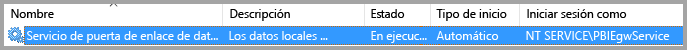
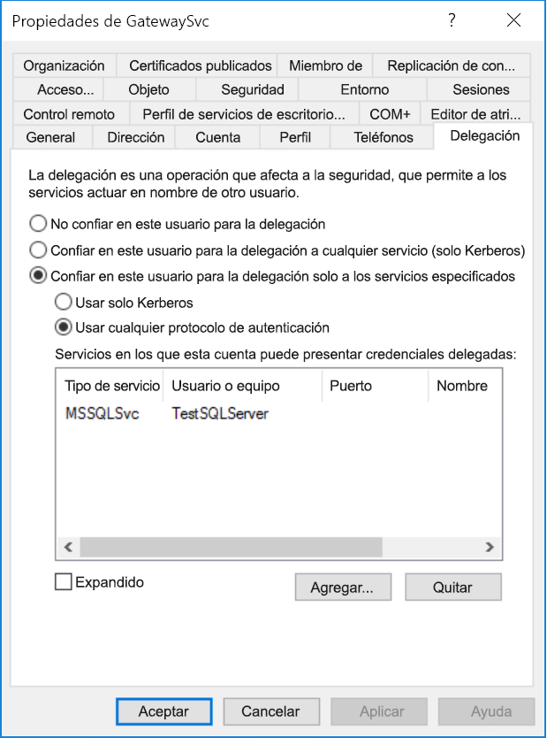
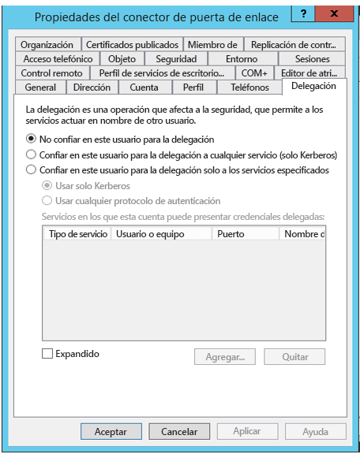
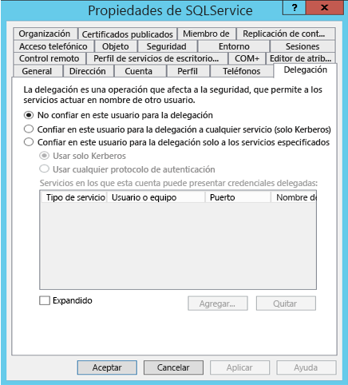
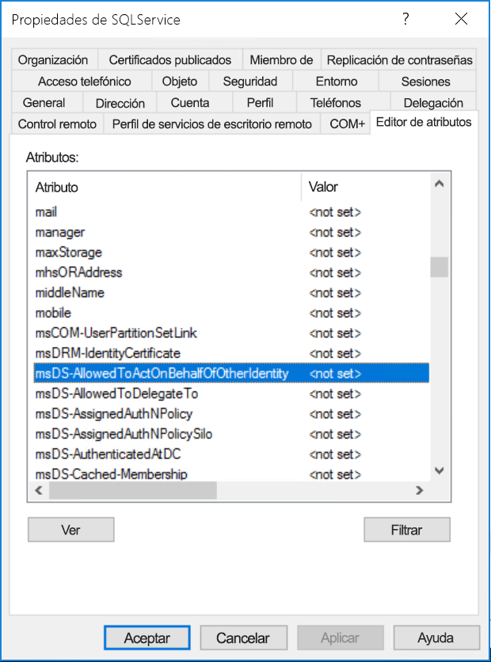
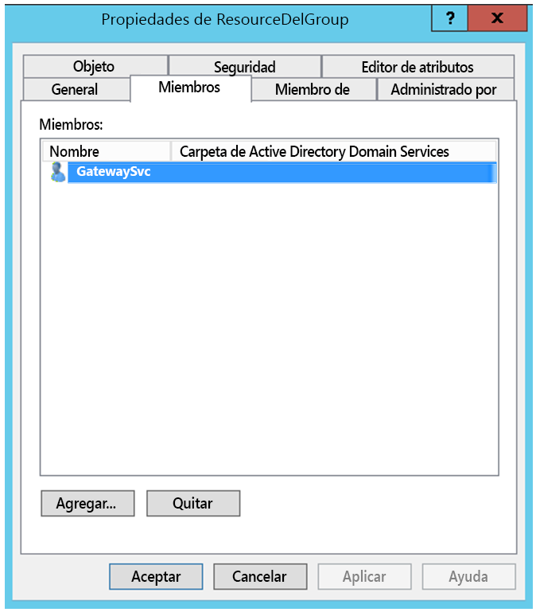
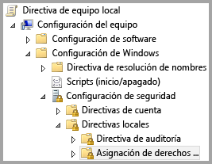
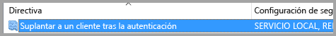
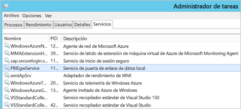
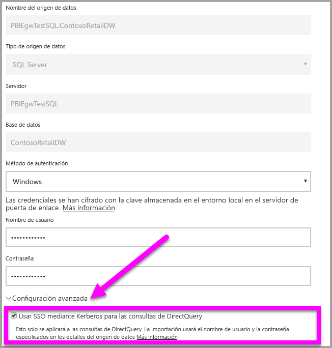

# <a name="configure-kerberos-based-sso-from-power-bi-service-to-on-premises-data-sources"></a>Configuración del SSO basado en Kerberos desde el servicio Power BI a los orígenes de datos locales

La habilitación de SSO facilita la tarea de los informes y paneles de Power BI de actualizar los datos de orígenes locales al tiempo que se respetan los permisos de nivel de usuario configurados en esos orígenes. Use la [delegación restringida de Kerberos](/windows-server/security/kerberos/kerberos-constrained-delegation-overview) para habilitar la conectividad directiva del SSO. 

## <a name="prerequisites"></a>Requisitos previos

Deben configurarse varios elementos para que la delegación restringida de Kerberos funcione correctamente, incluidos los _nombres de entidad de seguridad de servicio (SPN)_ y la configuración de delegación de cuentas de servicio.

### <a name="install-and-configure-the-microsoft-on-premises-data-gateway"></a>instalar y configurar la puerta de enlace de datos local de Microsoft

La puerta de enlace de datos local admite la actualización local, así como la _adquisición de la configuración_ de las puertas de enlace existentes.

### <a name="run-the-gateway-windows-service-as-a-domain-account"></a>ejecución del servicio de Windows de puerta de enlace como cuenta de dominio

En una instalación estándar, la puerta de enlace se ejecuta como una cuenta de servicio de la máquina local (**NT Service\PBIEgwService**).



Para habilitar la delegación restringida de Kerberos, debe ejecutar la puerta de enlace como una cuenta de dominio, a menos que su instancia de Azure Active Directory (Azure AD) ya esté sincronizada con su instancia de Active Directory local (mediante Azure AD DirSync o Azure AD Connect). Para cambiar a una cuenta de dominio, consulte [Cambio de la cuenta de servicio de puerta de enlace](/data-integration/gateway/service-gateway-service-account).

> [!NOTE]
> Si Azure AD Connect está configurado y las cuentas de usuario están sincronizadas, el servicio de puerta de enlace no necesita realizar búsquedas de Azure AD locales en tiempo de ejecución. En su lugar, puede usar simplemente el SID de servicio local para que el servicio de puerta de enlace complete toda la configuración necesaria en Azure AD. Los pasos de configuración de la delegación restringida de Kerberos que se describen en este artículo son los mismos que los pasos de configuración necesarios en el contexto de Azure AD. Se aplican al objeto de equipo de la puerta de enlace (como lo identifica el SID de servicio local) en Azure AD, en lugar de la cuenta de dominio.

## <a name="obtain-domain-admin-rights-to-configure-spns-setspn-and-kerberos-constrained-delegation-settings"></a>Obtención de derechos de administrador de dominio para configurar los SPN (SetSPN) y la delegación restringida de Kerberos

Para configurar los SPN y la delegación de Kerberos, un administrador de dominio debe evitar conceder derechos a alguien que no tenga derechos de administrador de dominio. En la siguiente sección, trataremos con más detalle los pasos de configuración recomendados.

## <a name="configure-kerberos-constrained-delegation-for-the-gateway-and-data-source"></a>Configuración de la delegación restringida de Kerberos para la puerta de enlace y el origen de datos

Si es necesario, configure un SPN para la cuenta de dominio del servicio de la puerta de enlace como administrador de dominio y configure la delegación en esa cuenta.

### <a name="configure-an-spn-for-the-gateway-service-account"></a>Configuración de un SPN para la cuenta de servicio de la puerta de enlace

En primer lugar, determine si ya se ha creado un nombre de entidad de seguridad de servicio para la cuenta de dominio que se usa como la cuenta de servicio de la puerta de enlace:

1. Como administrador de dominio, inicie el complemento **Equipos y usuarios de Active Directory** de Microsoft Management Console (MMC).

2. En el panel izquierdo, haga clic con el botón derecho en el nombre del dominio, seleccione **Buscar** y escriba el nombre de la cuenta de servicio de la puerta de enlace.

3. En el resultado de la búsqueda, haga clic con el botón derecho en la cuenta de servicio de la puerta de enlace y seleccione **Propiedades**.

4. Si la pestaña **Delegación** aparece en el cuadro de diálogo **Propiedades**, ya se creó un SPN y es posible pasar directamente a [Elección del tipo de delegación restringida de Kerberos que usar](#decide-on-the-type-of-kerberos-constrained-delegation-to-use).

5. Si no hay ninguna pestaña **Delegación** en el cuadro de diálogo **Propiedades**, puede crear manualmente un SPN en la cuenta para su habilitación. Use la [herramienta setspn](https://technet.microsoft.com/library/cc731241.aspx) que viene con Windows (necesita derechos de administrador de dominio para crear el SPN).

   Por ejemplo, imagine que la cuenta de servicio de puerta de enlace es **Contoso\GatewaySvc** y que el nombre de la máquina donde se ejecuta el servicio de puerta de enlace es **MyGatewayMachine**. Para establecer el SPN de la cuenta de servicio de puerta de enlace, debe ejecutar el comando siguiente:

   ```setspn -a gateway/MyGatewayMachine Contoso\GatewaySvc```

   También puede establecer el SPN mediante el complemento MMC de **Equipos y usuarios de Active Directory**.
   
### <a name="add-gateway-service-account-to-windows-authorization-and-access-group-if-required"></a>Incorporación de una cuenta de servicio de la puerta de enlace al grupo de autorización y acceso de Windows si es necesario

En ciertos escenarios, la cuenta de servicio de la puerta de enlace se debe agregar al grupo de autorización y acceso de Windows. Estos escenarios incluyen la protección de la seguridad del entorno de Active Directory y cuando la cuenta de servicio de la puerta de enlace y las cuentas de usuario que la puerta de enlace va a suplantar se encuentran en dominios o bosques independientes. También puede agregar la cuenta de servicio de la puerta de enlace al grupo de autorización y acceso de Windows en situaciones donde el dominio y el bosque no están protegidos, pero no es necesario.

Para más información, consulte la sección sobre el [grupo de autorización y acceso de Windows](/windows/security/identity-protection/access-control/active-directory-security-groups#bkmk-winauthaccess).

Para completar este paso de configuración, en cada dominio que contenga usuarios de Active Directory usuarios que quiere que la cuenta de servicio de la puerta de enlace pueda suplantar haga lo siguiente:
1. Inicie sesión en un equipo del dominio e inicie el complemento MMC de Equipos y usuarios de Active Directory.
2. Busque el grupo **Grupo de autorización y acceso de Windows**, que por lo general está en el contenedor **Builtin**.
3. Haga doble clic en el grupo y, luego, haga clic en la pestaña **Miembros**.
4. Haga clic en **Agregar** y cambie la ubicación del dominio al dominio donde reside la cuenta de servicio de la puerta de enlace.
5. Escriba el nombre de la cuenta de servicio de la puerta de enlace y haga clic en **Comprobar nombres** para comprobar que es posible acceder a la cuenta de servicio de la puerta de enlace.
6. Haga clic en **Aceptar**.
7. Haga clic en **Aplicar**.
8. Reinicie el servicio de puerta de enlace.

### <a name="decide-on-the-type-of-kerberos-constrained-delegation-to-use"></a>Elección del tipo de delegación restringida de Kerberos que usar

Es posible configurar la delegación tanto para una delegación restringida de Kerberos estándar como para una delegación restringida de Kerberos basada en recurso. Use la delegación basada en recurso (requiere Windows Server 2012 o posterior) si el origen de datos pertenece a un dominio diferente al de la puerta de enlace. Para más información sobre las diferencias entre ambos enfoques para la delegación, consulte la [página de información general sobre la delegación restringida de Kerberos](/windows-server/security/kerberos/kerberos-constrained-delegation-overview).

 En función del enfoque que desee usar, continúe con una de las siguientes secciones. No complete ambas secciones:
 - [Configuración de la cuenta de servicio de la puerta de enlace para la delegación restringida de Kerberos estándar](#configure-the-gateway-service-account-for-standard-kerberos-constrained-delegation)
- [Configuración de la cuenta de servicio de la puerta de enlace para la delegación restringida de Kerberos basada en recurso](#configure-the-gateway-service-account-for-resource-based-kerberos-constrained-delegation) 

## <a name="configure-the-gateway-service-account-for-standard-kerberos-constrained-delegation"></a>Configuración de la cuenta de servicio de la puerta de enlace para la delegación restringida de Kerberos estándar

> [!NOTE]
> Complete los pasos de esta sección si desea habilitar la [delegación restringida de Kerberos estándar](/windows-server/security/kerberos/kerberos-constrained-delegation-overview). Si, por el contrario, quiere habilitar la delegación restringida de Kerberos basada en recurso, complete los pasos de [Configuración de la cuenta de servicio de la puerta de enlace para la delegación restringida de Kerberos basada en recurso](#configure-the-gateway-service-account-for-resource-based-kerberos-constrained-delegation).

Ahora estableceremos la configuración de delegación para la cuenta de servicio de la puerta de enlace. Hay varias herramientas que puede usar para realizar estos pasos. Aquí utilizaremos el complemento de MMC **Usuarios y equipos de Active Directory** para administrar y publicar información en el directorio. Está disponible en los controladores de dominio de manera predeterminada; en otras máquinas, se puede habilitar mediante la configuración de características de Windows.

Es necesario configurar la delegación restringida de Kerberos con tránsito de protocolo. Con la delegación restringida, debe ser explícito con respecto a qué servicios permitirá que la puerta de enlace presente credenciales delegadas. Por ejemplo, solo SQL Server o el servidor de SAP HANA aceptan llamadas de delegación de la cuenta de servicio de la puerta de enlace.

En esta sección se da por supuesto que ya ha configurado los SPN de los orígenes de datos subyacentes (como SQL Server, SAP HANA, SAP BW, Teradata o Spark). Para obtener información sobre cómo configurar esos SPN de servidor de orígenes de datos, consulte la documentación técnica del servidor de base de datos correspondiente y vea la sección *What SPN does your app require?* (¿Qué SPN requiere la aplicación) de la entrada de blog [My Kerberos Checklist](https://techcommunity.microsoft.com/t5/SQL-Server-Support/My-Kerberos-Checklist-8230/ba-p/316160) (Mi lista de comprobación de Kerberos).

En los pasos siguientes, se asume que hay un entorno local con dos equipos en el mismo dominio: un equipo de la puerta de enlace y un servidor de base de datos que ejecuta SQL Server que ya está configurado para el SSO basado en Kerberos. Los pasos se pueden adoptar para uno de los otros orígenes de datos admitidos, siempre y cuando el origen de datos ya se haya configurado para el inicio de sesión único basado en Kerberos. En este ejemplo, vamos a usar la configuración siguiente:

* Dominio de Active Directory (NetBIOS): **Contoso**
* Nombre de la máquina de la puerta de enlace: **MyGatewayMachine**
* Cuenta de servicio de puerta de enlace: **Contoso\GatewaySvc**
* Nombre de la máquina del origen de datos de SQL Server: **TestSQLServer**
* Cuenta de servicio del origen de datos de SQL Server: **Contoso\SQLService**

Aquí le mostramos cómo configurar las opciones de delegación:

1. Con derechos de administrador de dominio, abra el complemento de MMC **Usuarios y equipos de Active Directory**.

2. Haga clic con el botón derecho en la cuenta de servicio de la puerta de enlace (**Contoso\GatewaySvc**) y seleccione **Propiedades**.

3. Seleccione la ficha **Delegación**.

4. Seleccione **Confiar en este equipo para la delegación solo a los servicios especificados** > **Usar cualquier protocolo de autenticación**.

5. En **Servicios en los que esta cuenta puede presentar credenciales delegadas**, haga clic en **Agregar**.

6. En el cuadro de diálogo nuevo, seleccione **Usuarios o equipos**.

7. Escriba la cuenta de servicio para el origen de datos y, a continuación, seleccione **Aceptar**.

   Por ejemplo, un origen de datos de SQL Server puede tener una cuenta de servicio como *Contoso\SQLService*. Ya se debe haber establecido un SPN adecuado para el origen de datos en esta cuenta. 

8. Seleccione el SPN que ha creado para el servidor de base de datos. 

   En nuestro ejemplo, el SPN empieza por *MSSQLSvc*. Si ha agregado tanto el SPN de FQDN como el de NetBIOS, seleccione ambos. Es posible que solo vea uno.

9. Seleccione **Aceptar**. 

   Ahora debería ver el SPN en la lista de servicios a los que la cuenta de servicio de puerta de enlace puede presentar credenciales delegadas.

    

10. Para continuar con el proceso de configuración, vaya a [Concesión de derechos de directiva local a la cuenta de servicio de la puerta de enlace en la máquina de la puerta de enlace](#grant-the-gateway-service-account-local-policy-rights-on-the-gateway-machine).

## <a name="configure-the-gateway-service-account-for-resource-based-kerberos-constrained-delegation"></a>Configuración de la cuenta de servicio de la puerta de enlace para la delegación restringida de Kerberos basada en recurso

> [!NOTE]
> Complete los pasos de esta sección si desea habilitar la [delegación restringida de Kerberos basada en recurso](/windows-server/security/kerberos/kerberos-constrained-delegation-overview#resource-based-constrained-delegation-across-domains). Si, por el contrario, quiere habilitar la delegación restringida de Kerberos estándar, complete los pasos de [Configuración de la cuenta de servicio de la puerta de enlace para la delegación restringida de Kerberos estándar](#configure-the-gateway-service-account-for-standard-kerberos-constrained-delegation).

La [delegación restringida de Kerberos basada en recursos](/windows-server/security/kerberos/kerberos-constrained-delegation-overview#resource-based-constrained-delegation-across-domains) se usa para habilitar la conectividad de inicio de sesión único de Windows Server 2012 y versiones posteriores. Este tipo de delegación permite a los servicios front-end y back-end estar en dominios diferentes. Para que esto funcione, el dominio del servicio back-end debe confiar en el dominio del servicio front-end.

En los pasos siguientes, se asume que disponemos de un entorno local con dos equipos en distintos dominios: un equipo de puerta de enlace y un servidor de bases de datos que ejecuta SQL Server que ya está configurado para el SSO basado en Kerberos. Estos pasos se pueden adoptar para uno de los otros orígenes de datos admitidos, siempre y cuando el origen de datos ya se haya configurado para el inicio de sesión único basado en Kerberos. En este ejemplo, vamos a usar la configuración siguiente:

* Dominio de front-end de Active Directory (NetBIOS): **ContosoFrontEnd**
* Dominio de back-end de Active Directory (NetBIOS): **ContosoBackEnd**
* Nombre de la máquina de la puerta de enlace: **MyGatewayMachine**
* Cuenta de servicio de puerta de enlace: **ContosoFrontEnd\GatewaySvc**
* Nombre de la máquina del origen de datos de SQL Server: **TestSQLServer**
* Cuenta de servicio del origen de datos de SQL Server: **ContosoBackEnd\SQLService**

Complete los siguientes pasos de configuración:

1. Use el complemento de MMC **Equipos y usuarios de Active Directory** en el controlador de dominio para el dominio **ContosoFrontEnd** y asegúrese de que no se aplica ninguna configuración de delegación para la cuenta de servicio de la puerta de enlace.

    

2. Use **Equipos y usuarios de Active Directory** en el controlador de dominio para el dominio **ContosoBackEnd** y asegúrese de que no se aplica ninguna configuración de delegación para la cuenta de servicio de back-end.

    

3. En la pestaña **Editor de atributos** de las propiedades de la cuenta, compruebe que el atributo **msDS-AllowedToActOnBehalfOfOtherIdentity** no está establecido.

    

4. En **Equipos y usuarios de Active Directory**, cree un grupo en el controlador de dominio para el dominio **ContosoBackEnd**. Agregue la cuenta de servicio de puerta de enlace **GatewaySvc** al grupo **ResourceDelGroup**. 

    

5. Abra un símbolo del sistema y ejecute los comandos siguientes en el controlador de dominio para el dominio **ContosoBackEnd** para actualizar el atributo **msDS-AllowedToActOnBehalfOfOtherIdentity** de la cuenta de servicio de back-end:

    ```powershell
    $c = Get-ADGroup ResourceDelGroup
    Set-ADUser SQLService -PrincipalsAllowedToDelegateToAccount $c
    ```

6. En **Equipos y usuarios de Active Directory**, compruebe que la actualización se refleja en la pestaña **Editor de atributos** en las propiedades de la cuenta de servicio de back-end. 

## <a name="grant-the-gateway-service-account-local-policy-rights-on-the-gateway-machine"></a>Concesión de derechos de directiva local a la cuenta de servicio de la puerta de enlace en la máquina de la puerta de enlace

Por último, en la máquina en la que se ejecuta el servicio de puerta de enlace (**MyGatewayMachine** en el ejemplo), conceda a la cuenta de servicio de la puerta de enlace las directivas locales **Suplantar a un cliente tras la autenticación** y **Actuar como parte del sistema operativo (SeTcbPrivilege)** . Realice esta configuración con el Editor de directivas de grupo local (**gpedit.msc**).

1. En la máquina de puerta de enlace, ejecute **gpedit.msc**.

2. Vaya a **Directiva de equipo Local** &gt; **Configuración del equipo** &gt; **Configuración de Windows** &gt; **Configuración de seguridad** &gt; **Directivas locales** &gt; **Asignación de derechos de usuario**.

    

3. En la lista de directivas de **Asignación de derechos de usuario**, seleccione **Suplantar a un cliente tras la autenticación**.

    
    
4. Haga clic con el botón derecho en la directiva, abra **Propiedades**y, a continuación, vea la lista de cuentas. 

    La lista debe incluir la cuenta de servicio de puerta de enlace (**Contoso\GatewaySvc** o **ContosoFrontEnd\GatewaySvc** según el tipo de delegación restringida).

5. En **Asignación de derechos de usuario**, seleccione **Actuar como parte del sistema operativo (SeTcbPrivilege)** en la lista de directivas. Asegúrese de que la cuenta de servicio de la puerta de enlace está incluida en la lista de cuentas.

6. Reinicie el proceso del servicio de la **puerta de enlace de datos local**.

### <a name="set-user-mapping-configuration-parameters-on-the-gateway-machine-if-necessary"></a>Establecimiento de los parámetros de configuración de la asignación de usuario en la máquina de la puerta de enlace (si es necesario)

Si no tiene configurado Azure AD Connect, siga estos pasos para asignar un usuario del servicio Power BI a un usuario de Active Directory local. Cada usuario de Active Directory asignado de este modo debe tener permisos de SSO para el origen de datos. Para más información, consulte este [vídeo de Guy in a Cub](https://www.youtube.com/watch?v=NG05PG9aiRw).

1. Abra el archivo de configuración de puerta de enlace principal Microsoft.PowerBI.DataMovement.Pipeline.GatewayCore.dll. Este archivo se almacena, de forma predeterminada, en C:\Archivos de programa\Puerta de enlace de datos local.

1. Establezca la propiedad **ADUserNameLookupProperty** en un atributo de Active Directory sin usar. Usaremos `msDS-cloudExtensionAttribute1` en los pasos siguientes. Este atributo solo está disponible en Windows Server 2012 y versiones posteriores. 

1. Establezca **ADUserNameReplacementProperty** en `SAMAccountName` y, a continuación, guarde el archivo de configuración.

1. En la pestaña **Servicios** del Administrador de tareas, haga clic con el botón derecho en el servicio de puerta de enlace y, después, haga clic en **Reiniciar**.

    

1. Para cada usuario del servicio Power BI para el que desee habilitar el SSO de Kerberos, establezca la propiedad `msDS-cloudExtensionAttribute1` de un usuario de Active Directory local (con permiso de SSO para el origen de datos) en el nombre de usuario completo (UPN) del usuario del servicio Power BI. Por ejemplo, si inicia sesión en el servicio Power BI como test@contoso.com y quiere asignar este usuario a un usuario de Active Directory local con permisos de SSO, como test@LOCALDOMAIN.COM, establezca el atributo `msDS-cloudExtensionAttribute1` del usuario en test@contoso.com.

    Puede establecer la propiedad `msDS-cloudExtensionAttribute1` mediante el complemento MMC de Equipos y usuarios de Active Directory:
    
    1. Como administrador de dominio, inicie **Usuarios y equipos de Active Directory**.
    
    1. Haga clic con el botón derecho en el nombre del dominio, seleccione **Buscar** y escriba el nombre de la cuenta del usuario de Active Directory local que asignar.
    
    1. Seleccione la pestaña **Editor de atributos**.
    
        Localice la propiedad `msDS-cloudExtensionAttribute1` y haga doble clic en ella. Establezca el valor en el nombre de usuario completo (UPN) del usuario que usa para iniciar sesión en el servicio Power BI.
    
    1. Seleccione **Aceptar**.
    
        
    
    1. Seleccione **Aplicar**. Compruebe que se ha establecido el valor correcto en la columna **Valor**.

## <a name="complete-data-source-specific-configuration-steps"></a>Finalización de los pasos de configuración específicos para el origen de datos

SAP HANA y SAP BW tienen requisitos de configuración específicos de origen de datos adicionales y requisitos previos que deben cumplirse para poder establecer una conexión de SSO a través de la puerta de enlace a estos orígenes de datos. Para más información, consulte [la configuración de SAP HANA](service-gateway-sso-kerberos-sap-hana.md) y [la página de configuración de SAP BW: CommonCryptoLib (sapcrypto.dll)](service-gateway-sso-kerberos-sap-bw-commoncryptolib.md). Aunque es posible [configurar SAP BW para su uso con la biblioteca gx64krb5 de SNC](service-gateway-sso-kerberos-sap-bw-gx64krb.md), no se recomienda usar esta biblioteca porque ya no es compatible con SAP. Debe usar CommonCryptoLib _o_ gx64krb5 como su biblioteca de SNC. No complete los pasos de configuración para ambas bibliotecas.

> [!NOTE]
> Aunque otras bibliotecas de SNC también podrían servir para el inicio de sesión único de BW, no son compatibles oficialmente con Microsoft.

## <a name="run-a-power-bi-report"></a>Ejecutar un informe de Power BI

Después de completar todos los pasos de configuración, use la página **Administrar puerta de enlace** en Power BI para configurar el origen de datos que usará para el SSO. Si tiene varias puertas de enlace, asegúrese de seleccionar la que ya configuró para el SSO de Kerberos. Después, en **Configuración avanzada** del origen de datos, asegúrese de que la opción **Usar un SSO mediante Kerberos en las consultas de DirectQuery** esté activada.



 Publique un informe basado en DirectQuery desde Power BI Desktop. Este informe debe utilizar datos que sean accesibles para el usuario que está asignado al usuario de Azure Active Directory que inicia sesión en el servicio Power BI. Debido a la forma en que funciona la actualización, debe usar DirectQuery en lugar de la importación. Cuando la puerta de enlace actualice los informes basados en la importación, usa las credenciales especificadas en los campos **Nombre de usuario** y **Contraseña** al crear el origen de datos. En otras palabras, *no* se usa el SSO de Kerberos. Al publicar, seleccione la puerta de enlace que ha configurado para el SSO si tiene varias puertas de enlace. En el servicio Power BI, ahora podrá actualizar el informe o crear un informe basado en el conjunto de datos publicado.

Esta configuración funciona en la mayoría de los casos. Sin embargo, con Kerberos puede haber distintas configuraciones en función de su entorno. Si no se carga el informe, póngase en contacto con el administrador del dominio para investigar en profundidad. Si el origen de datos es SAP BW, consulte las secciones de solución de problemas de las páginas de configuración específicas del origen de datos para [CommonCryptoLib](service-gateway-sso-kerberos-sap-bw-commoncryptolib.md#troubleshooting) y [gx64krb5/gsskrb5](service-gateway-sso-kerberos-sap-bw-gx64krb.md#troubleshooting), en función de la biblioteca de SNC que haya elegido.

## <a name="next-steps"></a>Pasos siguientes

Para más información sobre la puerta de enlace de datos local y DirectQuery, consulte los recursos siguientes:

* [¿Qué es una puerta de enlace de datos local?](/data-integration/gateway/service-gateway-onprem)
* [DirectQuery en Power BI](desktop-directquery-about.md)
* [Orígenes de datos compatibles con DirectQuery](desktop-directquery-data-sources.md)
* [DirectQuery y SAP BW](desktop-directquery-sap-bw.md)
* [DirectQuery y SAP HANA](desktop-directquery-sap-hana.md)
