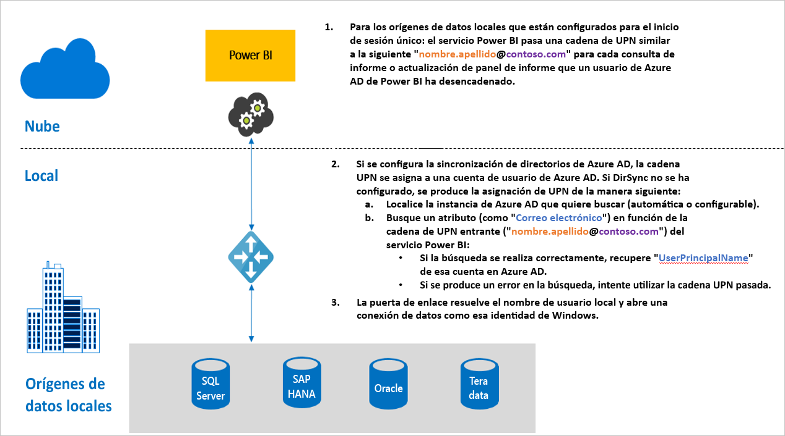

# Introducción al inicio de sesión único (SSO) para puertas de enlace de Power BI

Puede lograr una conectividad de inicio de sesión único directa con la habilitación de la actualización de los informes y paneles de Power BI en tiempo real desde datos locales, si configura la puerta de enlace de datos local con la delegación restringida de Kerberos o con SAML (Lenguaje de marcado de aserción de seguridad). La puerta de enlace de datos local admite el inicio de sesión único mediante DirectQuery, que es lo que usa para conectarse a los orígenes de datos locales.

Actualmente se admiten estos orígenes de datos:

* SQL Server ([Kerberos](service-gateway-sso-kerberos.md))
* SAP HANA ([Kerberos](service-gateway-sso-kerberos.md) y [SAML](service-gateway-sso-saml.md))
* Servidor de aplicaciones de SAP BW ([Kerberos](service-gateway-sso-kerberos.md))
* Servidor de mensajes de SAP BW ([Kerberos](service-gateway-sso-kerberos.md)), versión preliminar pública
* Oracle ([Kerberos](service-gateway-sso-kerberos.md)), versión preliminar pública
* Teradata ([Kerberos](service-gateway-sso-kerberos.md))
* Spark ([Kerberos](service-gateway-sso-kerberos.md))
* Impala ([Kerberos](service-gateway-sso-kerberos.md))

En la actualidad no se admite SSO para [extensiones de M](https://github.com/microsoft/DataConnectors/blob/master/docs/m-extensions.md).

Cuando un usuario interactúa con un informe de DirectQuery en el servicio Power BI, cada operación de filtro cruzado, división, ordenación y edición de informes puede dar lugar a consultas que se ejecutan en vivo en el origen de datos local subyacente. Cuando se configura SSO para el origen de datos, las consultas se ejecutan bajo la identidad del usuario que interactúa con Power BI (es decir, a través de la experiencia web o aplicaciones móviles de Power BI). Por lo tanto, cada usuario ve los datos para los que tiene permisos en el origen de datos subyacente: con el inicio de sesión único configurado, no hay ningún almacenamiento en caché de datos compartido entre distintos usuarios.

## Pasos de consulta cuando se ejecuta SSO

Una consulta que se ejecuta con SSO consta de tres pasos, tal como se muestra en el diagrama siguiente.

Estos son los detalles adicionales sobre estos pasos:

1. Para cada consulta, el **servicio Power BI** incluye el *nombre principal de usuario* (UPN, es decir, el nombre de usuario completo del usuario que ha iniciado sesión actualmente en servicio Power BI) al enviar una solicitud de consulta a la puerta de enlace configurada.

2. La puerta de enlace debe asignar el UPN de Azure Active Directory a una identidad de Active Directory local.

   a.  Si Azure AD DirSync (también conocido como *Azure AD Connect*) está configurado, la asignación funciona automáticamente en la puerta de enlace.

   b.  En caso contrario, la puerta de enlace puede buscar y asignar el UPN de Azure AD a un usuario de AD local mediante la realización de una búsqueda en el dominio local de Active Directory.

3. El proceso del servicio de puerta de enlace suplanta al usuario local asignado, abre la conexión a la base de datos subyacente y envía la consulta. No es necesario que la puerta de enlace esté instalada en el mismo equipo que la base de datos.

## Pasos siguientes

Ahora que ya entiende los conceptos básicos del SSO a través de la puerta de enlace, lea información más detallada sobre Kerberos y SAML:

* [Inicio de sesión único (SSO): Kerberos](service-gateway-sso-kerberos.md)
* [Inicio de sesión único (SSO): SAML](service-gateway-sso-saml.md)
