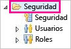
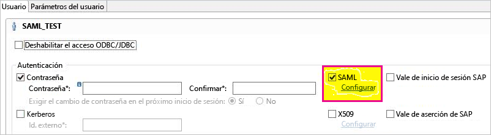
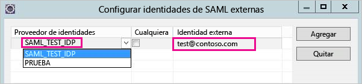
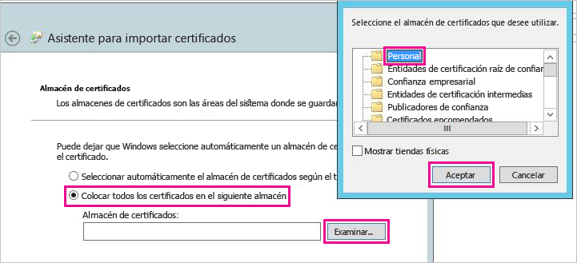
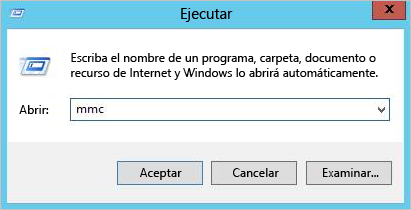
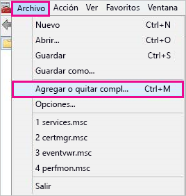
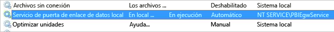
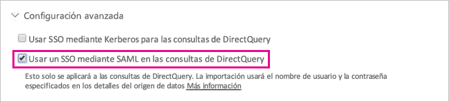

# <a name="use-security-assertion-markup-language-saml-for-single-sign-on-sso-from-power-bi-to-on-premises-data-sources"></a>Uso de SAML (Lenguaje de marcado de aserción de seguridad) para el inicio de sesión único (SSO) de Power BI a orígenes de datos locales

Use [SAML (Lenguaje de marcado de aserción de seguridad)](https://www.onelogin.com/pages/saml) para habilitar la conectividad de inicio de sesión único directa. La habilitación de SSO facilita la tarea de los paneles y los informes de Power BI para actualizar los datos de orígenes locales.

## <a name="supported-data-sources"></a>Orígenes de datos compatibles

Actualmente se admite SAP HANA con SAML. Para obtener más información acerca de cómo instalar y configurar el inicio de sesión único para SAP HANA con SAML, consulte el tema acerca de [SSO de SAML para la plataforma de BI a HANA](https://wiki.scn.sap.com/wiki/display/SAPHANA/SAML+SSO+for+BI+Platform+to+HANA) en la documentación de SAP HANA.

Se admiten orígenes de datos adicionales con [Kerberos](service-gateway-sso-kerberos.md).

Tenga en cuenta que para HANA es **altamente** recomendable que el cifrado se habilite antes de establecer una conexión de SSO de SAML (es decir, debe configurar el servidor HANA para que acepte conexiones cifradas y además configurar la puerta de enlace para que use cifrado al comunicarse con el servidor HANA). El controlador ODBC de HANA **no** puede cifrar las aserciones de SAML de forma predeterminada y, si el cifrado no está activado, la aserción de SAML firmada se envía desde la puerta de enlace al servidor HANA sin cifrar y es vulnerable a la intercepción y reutilización por parte de terceros.

## <a name="configuring-the-gateway-and-data-source"></a>Configuración del origen de datos y la puerta de enlace

Para usar SAML, debe establecer una relación de confianza entre los servidores HANA para los que quiere habilitar SSO y la puerta de enlace, que actúa como proveedor de identidades de SAML (IdP) en este escenario. Hay varias maneras de establecer esta relación, como importar el certificado x509 del IdP de la puerta de enlace en el almacén de confianza de los servidores HANA, o bien hacer que una entidad de certificación (CA) raíz de confianza para los servidores HANA firme el certificado X509 de la puerta de enlace. El primer método se explica en esta guía, pero puede usar otro si le resulta más cómodo.

Además, tenga en cuenta que, aunque esta guía usa OpenSSL como proveedor de servicios criptográficos del servidor HANA, SAP recomienda usar la biblioteca de cifrado de SAP (también conocida como CommonCryptoLib o sapcrypto), en lugar de OpenSSL, para realizar los pasos de configuración donde se establece la relación de confianza. Vea la documentación oficial de SAP para obtener más información.

En los pasos siguientes se explica cómo establecer una relación de confianza entre un servidor HANA y el IdP de la puerta de enlace mediante la firma del certificado X509 del IdP de la puerta de enlace con una entidad de certificación raíz de confianza para el servidor HANA.

1. Cree el certificado X509 de la CA raíz y la clave privada. Por ejemplo, para crear el certificado X509 de la CA raíz y la clave privada en formato .pem:

   ```
   openssl req -new -x509 -newkey rsa:2048 -days 3650 -sha256 -keyout CA_Key.pem -out CA_Cert.pem -extensions v3_ca
   ```
  Asegúrese de que el certificado de la entidad de certificación raíz está protegido correctamente; si cae en manos de terceros, lo podrían usar para obtener acceso no autorizado al servidor HANA. 

  Agregue el certificado (por ejemplo, CA_Cert.pem) al almacén de confianza del servidor HANA para que este confíe en los certificados firmados por la CA raíz que acaba de crear. Puede encontrar la ubicación del almacén de confianza del servidor HANA si examina la opción de configuración **ssltruststore**. Si ha seguido la documentación de SAP que trata de cómo configurar OpenSSL, es posible que el servidor HANA ya confíe en una CA raíz que pueda reutilizar. Para obtener detalles, vea [How to Configure Open SSL for SAP HANA Studio to SAP HANA Server](https://archive.sap.com/documents/docs/DOC-39571) (Procedimientos para configurar Open SSL para SAP HANA Studio en un servidor SAP HANA). Si tiene varios servidores HANA para los que quiera habilitar SSO de SAML, asegúrese de que todos los servidores confíen en esta CA raíz.

1. Cree el certificado X509 del IdP de la puerta de enlace. Por ejemplo, para crear una solicitud de firma de certificado (IdP_Req.pem) y una clave privada (IdP_Key.pem) que sean válidos durante un año, ejecute el siguiente comando:

   ```
   openssl req -newkey rsa:2048 -days 365 -sha256 -keyout IdP_Key.pem -out IdP_Req.pem -nodes
   ```

   Firme la solicitud de firma de certificado mediante la CA raíz en la que confían los servidores HANA. Por ejemplo, para firmar IdP_Req.pem mediante CA_Cert.pem y CA_Key.pem (el certificado y la clave de la CA raíz), ejecute el siguiente comando:

   ```
   openssl x509 -req -days 365 -in IdP_Req.pem -sha256 -extensions usr_cert -CA CA_Cert.pem -CAkey CA_Key.pem -CAcreateserial -out IdP_Cert.pem
   ```

El certificado de IdP resultante es válido durante un año (vea la opción de días). Ahora, importe el certificado de IdP en HANA Studio para crear un nuevo proveedor de identidades de SAML.

1. En SAP HANA Studio, haga clic con el botón derecho en el servidor de SAP HANA y, a continuación, vaya a **Seguridad** > **Abrir consola de seguridad** > **Proveedor de identidades de SAML** > **Biblioteca de cifrado de OpenSSL**.

    

1. Seleccione **Importar**, vaya a IdP_Cert.pem e impórtelo.

1. En SAP HANA Studio, seleccione la carpeta **Seguridad**.

    

1. Expanda **Usuarios** y, a continuación, seleccione el usuario al cual quiere asignar su usuario de Power BI.

1. Seleccione **SAML** y, a continuación, **Configurar**.

    

1. Seleccione el proveedor de identidades que creó en el paso 2. En **Identidad externa**, escriba el UPN del usuario de Power BI (normalmente, la dirección de correo electrónico con la que el usuario inicia sesión en Power BI) y, después, seleccione **Agregar**. Tenga en cuenta que si ha configurado la puerta de enlace para que use la opción de configuración *ADUserNameReplacementProperty*, tendrá que escribir el valor que reemplazará el UPN original del usuario de Power BI. Por ejemplo, si ha establecido *ADUserNameReplacementProperty* en **SAMAccountName**, tendrá que escribir el valor **SAMAccountName** del usuario.

    

Ahora que tiene el certificado y la identidad de la puerta de enlace configurados, convertirá el certificado a un formato pfx y configurará el equipo de puerta de enlace para usarlo.

1. Para convertir el certificado al formato pfx, ejecute el comando siguiente. Tenga en cuenta que este comando establece "raíz" como contraseña del archivo .pfx.

    ```
    openssl pkcs12 -export -out samltest.pfx -in IdP_Cert.pem -inkey IdP_Key.pem -passin pass:root -passout pass:root
    ```

1. Copie el archivo pfx en el equipo de puerta de enlace:

    1. Haga doble clic en samltest.pfx y, a continuación, seleccione **Máquina Local** > **Siguiente**.

    1. Escriba la contraseña y, a continuación, seleccione **Siguiente**.

    1. Seleccione **Colocar todos los certificados en el siguiente almacén** y, a continuación, **Examinar** > **Personal** > **Aceptar**.

    1. Seleccione **Siguiente** y, a continuación, **Finalizar**.

    

1. Conceda a la cuenta de servicio de la puerta de enlace acceso a la clave privada del certificado:

    1. En el equipo de puerta de enlace, ejecute Microsoft Management Console (MMC).

        

    1. En **Archivo** , seleccione **Agregar o quitar complemento**.

        

    1. Seleccione **Certificados** > **Agregar** y, a continuación, seleccione **Cuenta de equipo** > **Siguiente**.

    1. Seleccione **Equipo local** > **Finalizar** > **Aceptar**.

    1. Expanda **Certificados** > **Personal** > **Certificados** y busque el certificado.

    1. Haga clic con el botón derecho en el certificado y vaya a **Todas las tareas** > **Administrar claves privadas**.

        

    1. Agregue la cuenta de servicio de la puerta de enlace a la lista. De forma predeterminada, la cuenta es **NT SERVICE\PBIEgwService.** Puede averiguar qué cuenta ejecuta el servicio de puerta de enlace si ejecuta **services.msc** y busca el **Servicio de puerta de enlace de datos local**.

        

Por último, siga estos pasos para agregar la huella digital del certificado a la configuración de puerta de enlace.

1. Ejecute el siguiente comando de PowerShell para enumerar los certificados en el equipo.

    ```powershell
    Get-ChildItem -path cert:\LocalMachine\My
    ```
1. Copie la huella digital del certificado que ha creado.

1. Navegue hasta el directorio de la puerta de enlace, cuyo valor predeterminado es C:\Archivos de programa\Puerta de enlace de datos local.

1. Abra PowerBI.DataMovement.Pipeline.GatewayCore.dll.config y busque la sección \*SapHanaSAMLCertThumbprint\*. Pegue la huella digital que ha copiado.

1. Reinicie el servicio de puerta de enlace.

## <a name="running-a-power-bi-report"></a>Ejecución de un informe de Power BI

Ahora puede usar la página **Administrar puerta de enlace** en Power BI para configurar el origen de datos y, en su **Configuración avanzada** , habilitar SSO. A continuación, puede publicar los enlaces de los conjuntos de datos y los informes al origen de datos.



## <a name="troubleshooting"></a>Solución de problemas

Después de configurar el SSO, es posible que vea el siguiente error en el portal de Power BI: "The credentials provided cannot be used for the SapHana source." (Las credenciales proporcionadas no se pueden usar para el código de SapHana). Este error indica que SAP HANA ha rechazado la credencial SAML.

Los seguimientos de autenticación del lado servidor proporcionan información detallada para solucionar problemas de credenciales en SAP HANA. Siga estos pasos para configurar el seguimiento para su servidor de SAP HANA.

1. En el servidor SAP HANA, active el seguimiento de la autenticación ejecutando la siguiente consulta.

    ```
    ALTER SYSTEM ALTER CONFIGURATION ('indexserver.ini', 'SYSTEM') set ('trace', 'authentication') = 'debug' with reconfigure 
    ```

1. Reproduzca el problema que ha tenido.

1. En HANA Studio, abra la consola de administración y vaya a la pestaña **Diagnosis Files** (Archivos de diagnóstico).

1. Abra el último seguimiento de indexserver y busque SAMLAuthenticator.cpp.

    Debería encontrar un mensaje de error en el que se indica la causa raíz, como en el siguiente ejemplo.

    ```
    [3957]{-1}[-1/-1] 2018-09-11 21:40:23.815797 d Authentication   SAMLAuthenticator.cpp(00091) : Element '{urn:oasis:names:tc:SAML:2.0:assertion}Assertion', attribute 'ID': '123123123123123' is not a valid value of the atomic type 'xs:ID'.
    [3957]{-1}[-1/-1] 2018-09-11 21:40:23.815914 i Authentication   SAMLAuthenticator.cpp(00403) : No valid SAML Assertion or SAML Protocol detected
    ```

1. Cuando haya terminado la solución de problemas, desactive el seguimiento de la autenticación ejecutando la siguiente consulta.

    ```
    ALTER SYSTEM ALTER CONFIGURATION ('indexserver.ini', 'SYSTEM') UNSET ('trace', 'authentication');
    ```

## <a name="next-steps"></a>Pasos siguientes

Para más información acerca de la **puerta de enlace de datos local** y **DirectQuery**, consulte los recursos siguientes:

* [¿Qué es una puerta de enlace de datos local?](/data-integration/gateway/service-gateway-onprem)
* [DirectQuery en Power BI](desktop-directquery-about.md)
* [Orígenes de datos compatibles con DirectQuery](desktop-directquery-data-sources.md)
* [DirectQuery y SAP BW](desktop-directquery-sap-bw.md)
* [DirectQuery y SAP HANA](desktop-directquery-sap-hana.md)
