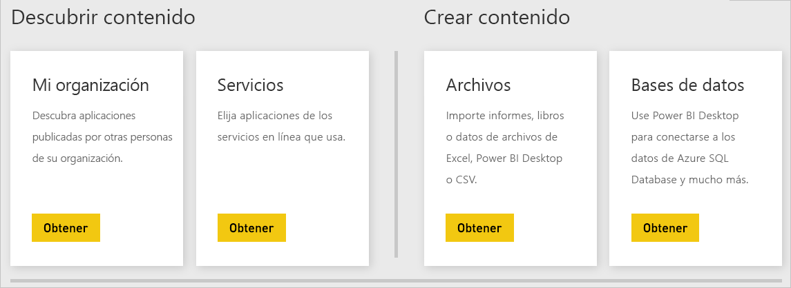

# Orígenes de datos del servicio Power BI
Los datos son la esencia de Power BI. Supongamos que va a explorar datos. Puede hacerlo creando gráficos y paneles o planteando preguntas con **preguntas y respuestas**. Las visualizaciones y respuestas que vea obtienen los datos subyacentes de un conjunto de datos. Pero, ¿de dónde procede ese conjunto de datos? Proceden de un origen de datos.

En este artículo, vamos a examinar los tipos de orígenes de datos a los que puede conectarse desde el servicio Power BI. Tenga en cuenta que hay muchos otros tipos de orígenes de datos de los que también puede obtener datos. Si elige estos orígenes de datos, primero deberá usar las características avanzadas de consulta y modelado de datos de Power BI Desktop o Excel. Después veremos estas opciones con más detalle. Por ahora, echemos un vistazo a los distintos tipos de orígenes de datos disponibles directamente desde el sitio del servicio Power BI.

Para obtener datos de cualquiera de los orígenes de datos de Power BI, puede seleccionar **Obtener datos** en la esquina inferior izquierda de la página.

 

Después de seleccionar **Obtener datos**, puede elegir los datos a los que desea tener acceso.

## Descubrir contenido

La sección **Descubrir contenido** incluye todos los datos e informes que necesita ya preparados. Hay dos tipos de paquetes de contenido en Power BI: organizativos y servicios. 

**Organizativos**: si usted y otros usuarios de su organización tienen una cuenta de Power BI Pro, puede crear, compartir y usar paquetes de contenido. Para más información, consulte [Introducción a los paquetes de contenido organizativos](service-organizational-content-pack-introduction.md).

**Servicios**: literalmente, existen decenas de servicios con paquetes de contenido para Power BI, y se agregan más continuamente. La mayoría de los servicios requiere que tenga una cuenta. Para más información, consulte [Conexión a los servicios que usa con Power BI](service-connect-to-services.md).

## Crear contenido

La sección **Crear contenido** contiene las opciones que necesita para crear e importar contenido por sí mismo. En Power BI, hay dos maneras de crear o importar su contenido: archivos y bases de datos. 

### Archivos

**Excel** ( *.xlsx*, *.xlsm*): en Excel, un libro puede incluir diferentes tipos de datos. Por ejemplo, puede incluir datos que ha escrito usted mismo en hojas de cálculo. También puede incluir los datos que ha consultado y cargado de orígenes de datos externos mediante Power Query. Power Query está disponible mediante **Obtener y transformar** en Excel 2016 o Power Pivot. Puede importar datos de tablas en hojas de cálculo o importar datos de un modelo de datos. Para más información, consulte [Obtener datos de archivos en Power BI](service-get-data-from-files.md).

**Power BI Desktop** ( *.pbix*): puede usar Power BI Desktop para consultar y cargar datos desde orígenes de datos externos, y para crear informes. También puede ampliar el modelo de datos con medidas y relaciones, o importar el archivo de Power BI Desktop en su sitio de Power BI. Power BI Desktop está más indicado para los usuarios más avanzados. Normalmente, estos usuarios conocen bien sus orígenes de datos. También conocen los conceptos de consulta, transformación y modelado de los datos. Para más información, consulte [Conectarse a los datos en Power BI Desktop](desktop-connect-to-data.md).

**Valores separados por comas** ( *.csv*): son archivos de texto simples con filas de datos. Cada fila puede contener uno o varios valores, separados por punto y coma. Por ejemplo, un *.csv* que contiene datos de nombres y direcciones puede tener muchas filas. Cada fila puede tener valores de nombre, apellido, calle, ciudad, estado y así sucesivamente. No puede importar datos en un archivo *.csv*, pero muchas aplicaciones, como Excel, pueden guardar datos de tabla simples como un archivo *.csv*.

Para otros tipos de archivo, como Tabla XML ( *.xml*) o archivos de texto ( *.txt*), puede usar primero **Obtener y transformar** para consultar, transformar y cargar los datos en un archivo de Excel o Power BI Desktop. Después, puede importar el archivo de Excel o Power BI Desktop en Power BI.

El lugar donde se almacenan los archivos supone una diferencia muy significativa. OneDrive para la Empresa proporciona la máxima flexibilidad e integración con Power BI. Está bien para mantener los archivos en la unidad local. Sin embargo, si necesita actualizar los datos, hay algunos pasos adicionales. Para más información, consulte los artículos siguientes.

### Bases de datos

**Bases de datos en la nube**: desde el servicio Power BI, puede conectar dinámicamente con:

* Azure SQL Database
* Azure SQL Data Warehouse
* Spark en HDInsight de Azure

Las conexiones desde Power BI a estas bases de datos son dinámicas. Supongamos que se conecta a una base de datos de Azure SQL Database. Después, crea informes en Power BI para empezar a explorar sus datos. Cada vez que segmente los datos o agregue otro campo a una visualización, Power BI realiza una consulta directamente a la base de datos. Para más información, consulte [Azure y Power BI](service-azure-and-power-bi.md).

**Bases de datos locales**: desde el servicio Power BI, puede conectarse directamente a las bases de datos modelo tabulares de SQL Server Analysis Services. Para ello, necesitará una puerta de enlace de Power BI Enterprise. Si no está seguro de cómo conectarse a la base de datos modelo tabular de su organización, consulte con el administrador o el departamento de TI. Para más información, consulte [Datos activos de SQL Server Analysis Services en Power BI](sql-server-analysis-services-tabular-data.md).

Para otros tipos de bases de datos de su organización, deberá usar Power BI Desktop o Excel para conectarse a los datos, consultarlos y cargarlos en un modelo de datos. Después, puede importar el archivo en Power BI, donde existe un conjunto de datos. Si configura la actualización programada, Power BI usará esa configuración y la información de conexión del archivo para conectarse directamente al origen de datos y consultar las actualizaciones. Después, Power BI carga las actualizaciones en el conjunto de datos. Para más información, consulte [Conectarse a los datos en Power BI Desktop](desktop-connect-to-data.md).

## ¿Qué ocurre si mi datos proceden de un origen diferente?
Existen cientos de diferentes orígenes de datos que puede usar con Power BI. Independientemente de dónde obtenga los datos, estos tienen que estar en un formato que el servicio Power BI pueda consumir. Con estos datos consumibles, el servicio Power BI puede crear informes y paneles, responder preguntas con **preguntas y respuestas**, y así sucesivamente.

Algunos orígenes de datos ya tienen los datos con el formato para el servicio Power BI. Estos orígenes son como paquetes de contenido de proveedores de servicios como Google Analytics y Twilio. Las bases de datos modelo tabulares de SQL Server Analysis Services también están listas para su uso. Puede conectar dinámicamente con bases de datos en la nube, tales como Azure SQL Database y Spark en HDInsight.

En otros casos, podría ser necesario consultar y cargar los datos que desee en un archivo. Por ejemplo, supongamos que tiene datos de logística en su organización. Estos datos se almacenan en una base de datos del almacén de datos en un servidor. En el servicio Power BI, no puede conectar con esa base de datos y empezar a explorar sus datos (a menos que sea una base de datos modelo tabular). Sin embargo, puede usar Power BI Desktop o Excel para consultar y cargar los datos de logística en un modelo de datos y guardarlos como un archivo. Después, puede importar el archivo en Power BI, donde existe un conjunto de datos.

Probablemente esté pensando: "Los datos de logística de esa base de datos cambian cada día. ¿Cómo actualizo mi conjunto de datos de Power BI?" Al importar los datos en el conjunto de datos, también importa la información de conexión del archivo de Excel o Power BI Desktop.

Supongamos que configura una actualización programada o realiza una actualización manual del conjunto de datos. Power BI usa la información de conexión del conjunto de datos, además de otras opciones, para conectarse directamente a la base de datos. A continuación, busca actualizaciones y las carga en el conjunto de datos. Hay que indicar que es probable que necesite una puerta de enlace de Power BI para proteger las transferencias de datos entre el servidor local y Power BI. Una vez completada la transferencia, las visualizaciones en los informes y paneles se actualizan automáticamente.

Que no pueda conectar con el origen de datos directamente desde el servicio Power BI no significa que no pueda obtener esos datos en Power BI. Tal vez se requieran algunos pasos más y la ayuda del departamento de TI. Consulte [Orígenes de datos en Power BI Desktop](desktop-data-sources.md) para más información.

## Algunos detalles más
Verá que los términos "conjunto de datos" y "origen de datos" se usan mucho en Power BI. A menudo se usan como sinónimos. Sin embargo, son dos cosas distintas aunque guarden relación.

Los **conjuntos de datos** se crean automáticamente en Power BI al usar **Obtener datos**. Con **Obtener datos**, se conecta a los datos y se importan desde un paquete de contenido, archivo o conexión a un origen de datos en directo. Un conjunto de datos contiene información sobre el origen de datos y las credenciales del origen de datos. En muchos casos, también incluye un subconjunto de los datos copiados desde el origen de datos. Al crear visualizaciones en informes y paneles, se consultan los datos del conjunto de datos.

Un **origen de datos** es la ubicación de donde proceden los datos del conjunto de datos. Por ejemplo, los datos podrían proceder de:

* Un servicio en línea como Google Analytics o QuickBooks.
* Una base de datos en la nube como Azure SQL Database.
* Una base de datos o un archivo en un equipo o servidor local en su propia organización

## Actualización de datos
Quizás guarde los archivos en su unidad local o una unidad en algún lugar de su organización. Tal vez necesite una puerta de enlace de Power BI para poder actualizar el conjunto de datos en Power BI. El equipo que almacena el archivo debe estar activado cuando se produce una actualización. También puede volver a importar el archivo o usar Publicar desde Excel o Power BI Desktop, pero estos no son procesos automatizados.

Si guarda los archivos en OneDrive para la Empresa o en sitios de grupo de SharePoint, después podrá conectarse a Power BI o importarlos a Power BI. De esa forma, el conjunto de datos, los informes y el panel siempre estarán actualizados. Como OneDrive y Power BI están en la nube, Power BI puede conectarse directamente al archivo guardado. Se conecta una vez cada hora aproximadamente y comprueba si hay actualizaciones. El conjunto de datos y las visualizaciones se actualizan automáticamente si hay actualizaciones.

Los paquetes de contenido de los servicios se actualizan automáticamente. En la mayoría de los casos, se actualizan una vez al día. Puede actualizarlos manualmente, pero si ve o no los datos actualizados dependerá del proveedor de servicios. Las actualizaciones de paquetes de contenido de las personas de su organización dependerán de los orígenes de datos utilizados. También dependerán de cómo ha configurado la actualización la persona que creó el paquete de contenido.

Azure SQL Database, Azure SQL Data Warehouse y Spark en HDInsight de Azure son orígenes de datos en la nube. El servicio Power BI también está en la nube por lo que puede conectarse a ellos dinámicamente mediante **DirectQuery**. Lo que ve en Power BI está siempre sincronizado y no es necesario programar la actualización.

Cuando se conecta a SQL Server Analysis Services desde Power BI, se trata de una conexión dinámica, igual que una base de datos de Azure en la nube. La diferencia es que la base de datos está en un servidor de su organización. Este tipo de conexión requiere una puerta de enlace de Power BI, que normalmente configura un departamento de TI.

La actualización de los datos es una parte muy importante de Power BI, y es un tema demasiado extenso para tratarlo aquí. Si quiere obtener una descripción completa, consulte [Actualizar datos en Power BI](refresh-data.md).

## Consideraciones y limitaciones
Las siguientes consideraciones y limitaciones se aplican a todos los orígenes de datos que se usan en el servicio Power BI. Hay otras limitaciones que atañen a determinadas características, pero la siguiente lista es válida para todo el servicio Power BI:

* **Límite de tamaño del conjunto de datos**: los conjuntos de datos del servicio Power BI almacenados en capacidades compartidas tienen un límite de 1 GB. Si necesita conjuntos de datos de mayor tamaño, puede usar [Power BI Premium](service-premium-what-is.md).

* **Valores distintos en una columna**: cuando se almacenan datos en caché en un conjunto de datos de Power BI (a veces denominado modo "de importación"), el número de valores distintos que se pueden almacenar en una columna es de 1 999 999 997.

* **Límite de filas** : cuando se usa **DirectQuery**, Power BI impone un límite en los resultados de consulta que se envían al origen de datos subyacente. Si la consulta enviada al origen de datos devuelve más de un millón de filas, verá un error y la consulta no se tramitará. En cambio, los datos subyacentes sí pueden contener más de un millón de filas. No es probable que se encuentre con este límite, ya que la mayoría de los informes agregan los datos en conjuntos de resultados más pequeños.

* **Límite de columnas**: el número máximo de columnas que se permiten en un conjunto de datos, en todas las tablas del conjunto de datos, es 16 000 columnas. Este límite se aplica al servicio Power BI y a los conjuntos de datos que se usan en Power BI Desktop. Power BI realiza un seguimiento del número de columnas y tablas del conjunto de registros de esta manera, lo que significa que el número máximo de columnas es 16 000 menos uno por cada tabla del conjunto de datos.

