# Tutorial: Introducción al servicio Power BI (app.powerbi.com)
Este tutorial le ayudará a empezar a trabajar con el ***servicio Power BI***. Para entender cómo encaja el servicio Power BI con las otras ofertas de Power BI, se recomienda que lea primero [¿Qué es Power BI?](power-bi-overview.md).

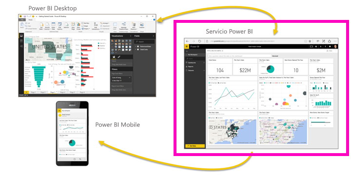

En este tutorial, realizaremos los siguientes pasos:

> [!div class="checklist"]
> * Encontrar otros contenidos de introducción al servicio Power BI
> * Iniciar sesión en la cuenta de Power BI en línea (o registrar una, si no tiene ninguna)
> * Abrir el servicio Power BI
> * Obtener algunos datos y abrirlos en la vista de informe
> * Usar los datos para crear visualizaciones y guardarlo todo en un informe
> * Crear un panel anclando iconos desde un informe
> * Agregar otra visualización al panel mediante la herramienta de lenguaje natural Preguntas y respuestas
> * Limpiar los recursos eliminando el conjunto de datos, el informe y el panel

## Suscribirse al servicio Power BI
Si no se ha registrado en Power BI, [hágalo para obtener una versión de prueba gratuita de Power BI Pro](https://app.powerbi.com/signupredirect?pbi_source=web).

Si ya tiene una cuenta, abra un explorador y escriba app.powerbi.com para abrir el servicio Power BI. 

Si desea obtener ayuda con Power BI Desktop, consulte [Introducción a Power BI Desktop](desktop-getting-started.md). Si desea obtener ayuda con Power BI en el móvil, consulte [Aplicaciones de Power BI para dispositivos móviles](consumer/mobile/mobile-apps-for-mobile-devices.md).

> [!TIP]
> ¿Prefiere un curso autodidáctico? [Inscríbase en el curso sobre análisis y visualización de datos en EdX](http://aka.ms/edxpbi).

Visite nuestra [lista de reproducción en YouTube](https://www.youtube.com/playlist?list=PL1N57mwBHtN0JFoKSR0n-tBkUJHeMP2cP). Un buen vídeo para comenzar es la introducción al servicio Power BI:
> 
> <iframe width="560" height="315" src="https://www.youtube.com/embed/B2vd4MQrz4M" frameborder="0" allowfullscreen></iframe>
> 

## ¿Qué es el servicio Power BI?
El servicio Microsoft Power BI se denomina en ocasiones Power BI en línea o app.powerbi.com. Power BI le permite a mantenerse al día con la información más importante para usted.  Los ***paneles*** del servicio Power BI le ayudan a captar el pulso de su negocio.  Los paneles muestran ***iconos*** en los que puede abrir ***informes*** para seguir explorando.  Conéctese a varios ***conjuntos de datos*** para reunir todos los datos relevantes en un solo lugar. ¿Necesita ayuda para comprender los bloques de creación que conforman Power BI?  Consulte [Power BI: conceptos básicos](consumer/end-user-basic-concepts.md).

Si tiene datos importantes en archivos de Excel o CSV, puede crear un panel de Power BI para mantenerse informado en cualquier lugar y compartir recomendaciones con otros usuarios.  ¿Tiene una suscripción a una aplicación de SaaS como Salesforce?  Arranque con ventaja conectándose a Salesforce para crear automáticamente un panel a partir de los datos, o bien [compruebe todas las demás aplicaciones de SaaS](service-get-data.md) a las que pueda conectarse. Si forma parte de una organización, consulte si se ha publicado alguna [aplicación](consumer/end-user-create-apps.md) para usted.

Obtenga información sobre todas las demás formas de [obtener datos para Power BI](service-get-data.md).

## Paso 1: Obtener datos
Este es un ejemplo de obtención de datos de un archivo CSV. ¿Desea seguir este tutorial? [Descargue este archivo CSV de ejemplo](http://go.microsoft.com/fwlink/?LinkID=521962).

1. [Inicie sesión en Power BI](http://www.powerbi.com/). ¿No tiene una cuenta? No se preocupe, puede registrarse para obtener una versión de prueba gratuita.
2. Power BI se abre en el explorador. Seleccione **Obtener datos** en la parte inferior de la barra de navegación izquierda.
   
   
3. Seleccione **Archivos**. 
   
   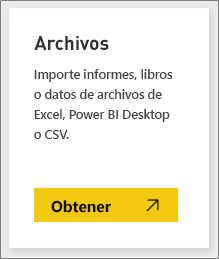
4. Busque el archivo en el equipo y elija **Abrir**. Si lo ha guardado en OneDrive para la Empresa, seleccione esa opción. Si lo ha guardado localmente, seleccione **Archivo local**. 
   
   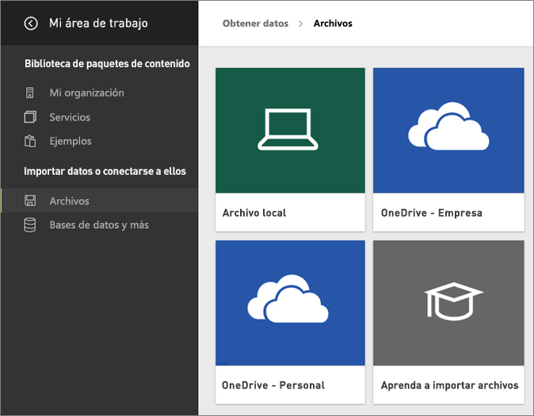
5. Para este tutorial vamos a seleccionar **Importar** para agregar el archivo de Excel como un conjunto de datos que, después, se puede usar para crear informes y paneles. Si selecciona **Cargar**, se carga todo el libro de Excel en Power BI, donde lo puede abrir y editar en Excel en línea.
   
   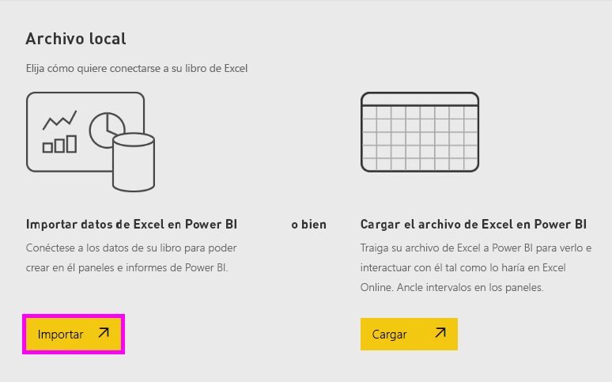
6. Una vez preparado el conjunto de datos, seleccione **Ver conjunto de datos** para abrirlo en el editor de informes. 

    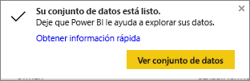

    Puesto que aún no hemos creado ninguna visualización, el lienzo del informe estará en blanco.

    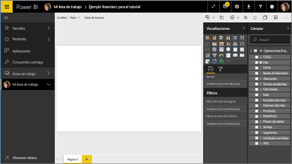

6. Eche un vistazo a la barra de menús superior y observe que hay una opción para **Vista de lectura**. Como dispone de una opción para Vista de lectura, eso significa que se encuentra actualmente en la **vista de edición**. 

    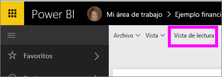

    Mientras está en la vista de edición puede crear y modificar los informes ya que usted es el *propietario* del informe; es un *creador*. Cuando comparte el informe con compañeros de trabajo, estos solo podrán interactuar con el informe en la vista de lectura; ellos son los *consumidores*. Obtenga más información sobre la [vista de lectura y de edición](consumer/end-user-reading-view.md).
    
    Una excelente manera de familiarizarse con el editor de informes es [dar un paseo](service-the-report-editor-take-a-tour.md)
   > 
 

## Paso 2: Empezar a explorar el conjunto de datos
Ahora que se ha conectado a los datos, empiece a explorar.  Cuando encuentre algo interesante, puede crear un panel para supervisarlo y ver cómo cambia con el tiempo. Veamos cómo funciona eso.
    
1. En el editor de informes, use el panel **Campos** situado en el lado derecho de la página para crear una visualización.  Seleccione la casilla situada junto a **Ventas brutas** y **Fecha**.
   
   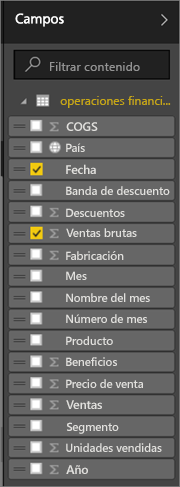

2. Power BI analiza los datos y crea una visualización.  Si seleccionó **Fecha** en primer lugar, verá una tabla.  Si seleccionó **Ventas brutas** en primer lugar, verá un gráfico. Cambie a una forma diferente de mostrar los datos. Veamos estos datos como un gráfico de líneas. En el **panel Visualizaciones**, seleccione el icono de gráfico de líneas (conocido también como una plantilla).
   
   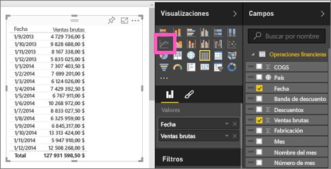

3. Esto parece interesante, así que lo vamos a *anclar* a un panel. Mantenga el mouse encima de la visualización y seleccione el icono **Anclar**.  Al anclar la visualización, esta se almacenará en el panel y se mantendrá actualizada para que pueda comprobar sus valores más recientes de un vistazo.
   
   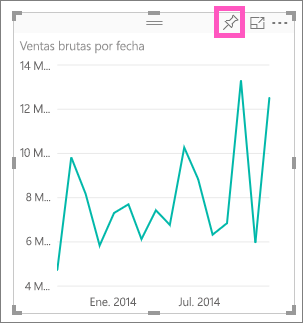

4. Como se trata de un nuevo informe, se le pedirá que lo guarde antes de poder anclar una visualización a un panel. Asigne un nombre a un informe (p. ej., *Ventas de un período*) y seleccione **Guardar y continuar**. 
   
   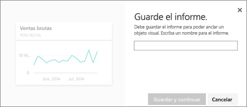
   
5. Vamos a anclar el gráfico de líneas al nuevo panel y a asignarle el nombre "Ejemplo financiero para el tutorial". 
   
   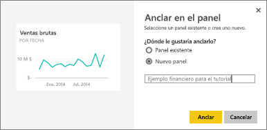
   
1. Seleccione **Anclar**.
   
    Un mensaje de confirmación (cerca de la esquina superior derecha) le permitirá saber que se ha agregado la visualización al panel como un icono.
   
    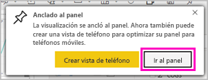

6. Seleccione **Ir al panel** para ver el gráfico de líneas anclado, como un icono, a su nuevo panel. Para mejorar el aspecto del panel aún más, agregue más iconos de visualización y [cámbiele el nombre o el tamaño, vincúlelo y reubique los iconos](service-dashboard-edit-tile.md).
   
   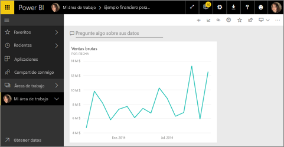
   
   Seleccione el nuevo icono del panel para volver al informe en cualquier momento. Power BI le devuelve al editor de informes en la vista de lectura. Para volver a la vista de edición, seleccione **Editar informe** en la barra de menús superior. Una vez en la vista de edición, siga explorando y anclando iconos. 

## Paso 3: Continuar la exploración con Preguntas y respuestas (consultas en lenguaje natural)
1. Para realizar una exploración rápida de los datos, pruebe a formular una pregunta en el cuadro Preguntas y respuestas. El cuadro de Preguntas y respuestas se encuentra en la parte superior del panel (**Pregunte algo sobre sus datos**) y en la barra de menús superior del informe (**Hacer una pregunta**). Por ejemplo, pruebe a escribir "qué segmento obtuvo más ingresos".
   
   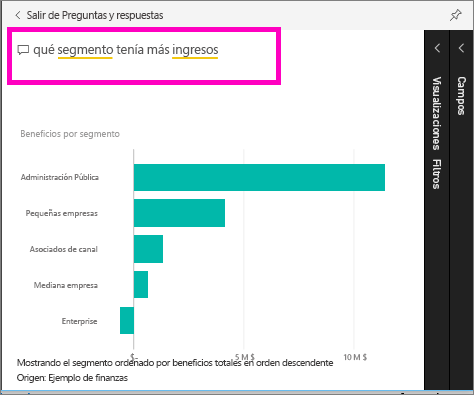

2. Preguntas y respuestas busca una respuesta y la presenta en forma de una visualización. Seleccione el icono de anclaje  para mostrar esta visualización también en el panel.
3. Ancle la visualización al panel "Ejemplo financiero para el tutorial".
   
    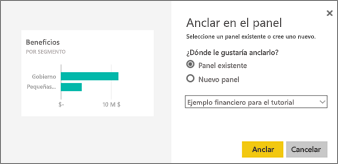

4. Vuelva al panel, donde verá el nuevo icono.

   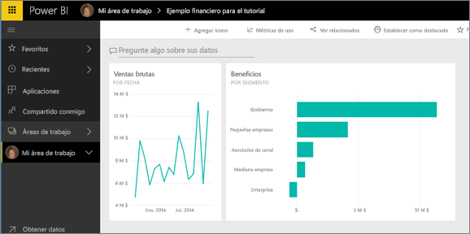

## Limpieza de recursos
Ahora que ya hemos finalizado el tutorial, podemos eliminar el conjunto de datos, el informe y el panel. 

1. Seleccione **Mi área de trabajo** en la barra de navegación izquierda.
2. Seleccione la pestaña **Conjuntos de datos** y, luego, busque el conjunto de datos que ha importado en el tutorial.  
3. Seleccione el botón de los puntos suspensivos (...) > **Eliminar**.

    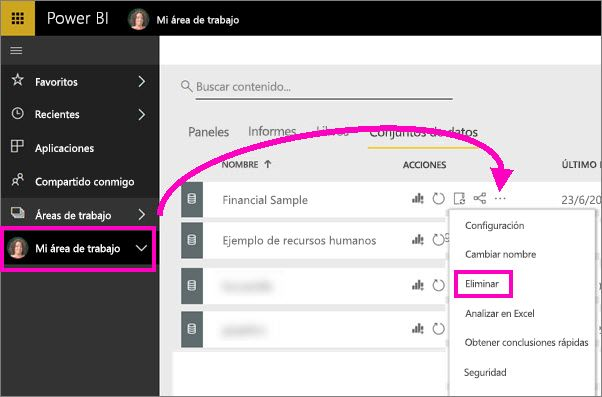

    Al eliminar el conjunto de datos, también se eliminarán el informe y el panel. 

## Pasos siguientes
¿Listo para probar más cosas?  Estas son formas estupendas de explorar Power BI.

> [!div class="nextstepaction"]
> [Conexión a los servicios que usa](consumer/end-user-connect-to-services.md)

