# Tutorial: Introducción al servicio Power BI
Este tutorial es una introducción a algunas de las características del *servicio Power BI*. En este servicio se conecta a los datos, se crea un informe y un panel y se formulan preguntas de los datos. Puede hacer mucho más en el servicio Power BI; este tutorial es solo para abrir boca. Para entender cómo encaja el servicio Power BI con otras ofertas de Power BI, es recomendable leer primero [¿Qué es Power BI?](power-bi-overview.md).

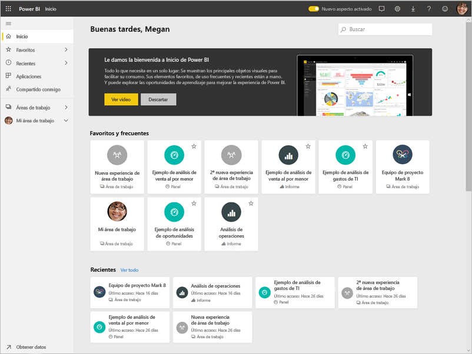

En este tutorial, realizaremos los siguientes pasos:

> [!div class="checklist"]
> * Iniciar sesión en la cuenta de Power BI en línea (o bien registrarse, si todavía no tiene una).
> * Abrir el servicio Power BI.
> * Obtener algunos datos y abrirlos en la vista de informe.
> * Usar esos datos para crear visualizaciones y guardarlos como un informe.
> * Crear un panel anclando iconos desde el informe.
> * Agregar otras visualizaciones al panel mediante la herramienta de lenguaje natural Preguntas y respuestas.
> * Cambiar el tamaño, reorganizar e interactuar con los iconos en el panel.
> * Limpiar los recursos mediante la eliminación del conjunto de datos, el informe y el panel.

> [!TIP]
> ¿Prefiere un curso autodidáctico? [Inscríbase en el curso sobre análisis y visualización de datos en EdX](http://aka.ms/edxpbi).

## Suscribirse al servicio Power BI
Si no tiene una cuenta de Power BI, [regístrese para obtener una versión de prueba gratuita de Power BI Pro](https://app.powerbi.com/signupredirect?pbi_source=web) antes de empezar.

Después de conseguir una cuenta, escriba *app.powerbi.com* en el explorador para abrir el servicio Power BI. 

## Paso 1: Obtener datos

A menudo, cuando quiere crear un informe de Power BI, empieza en Power BI Desktop. Esta vez, vamos a empezar desde cero creando un informe en el servicio Power BI.

En este tutorial, obtenemos los datos de un archivo CSV. ¿Desea seguir adelante? [Descarga del archivo CSV de ejemplos financieros](http://go.microsoft.com/fwlink/?LinkID=521962).

1. [Inicie sesión en Power BI](http://www.powerbi.com/). ¿No tiene una cuenta? No se preocupe, puede registrarse para obtener una versión de prueba gratuita.
2. Power BI se abre en el explorador. Seleccione **Obtener datos** en la parte inferior de la barra de navegación de la izquierda.

    Se abre la página **Obtener datos**.   

3. En la sección **Crear contenido**, seleccione **Archivos**. 
   
   
4.  Seleccione **Archivo local**.
   
    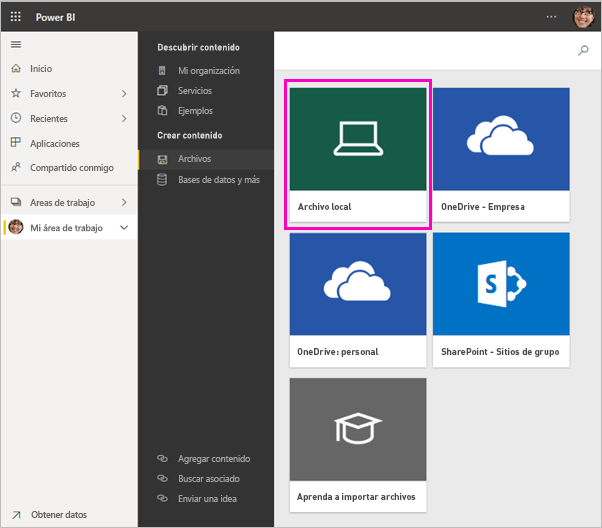

5. Busque el archivo en el equipo y elija **Abrir**.

5. En este tutorial, seleccionamos **Importar** para agregar el archivo de Excel como un conjunto de datos, que después se puede usar para crear informes y paneles. Si selecciona **Cargar**, se carga todo el libro de Excel en Power BI, donde lo puede abrir y editar en Excel en línea.
   
   
6. Cuando el conjunto de datos esté listo, seleccione **Conjuntos de datos** y luego **Crear informe**, junto al **Ejemplo financiero** del conjunto de datos, para abrir el editor de informes. 

    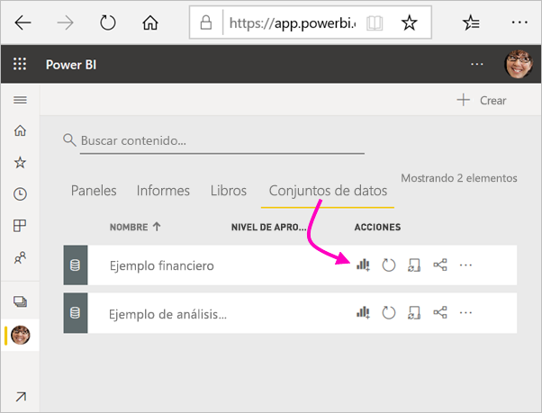

    El lienzo del informe está en blanco. En el lado derecho se ven los paneles **Filtros**, **Visualizaciones** y **Campos**.

    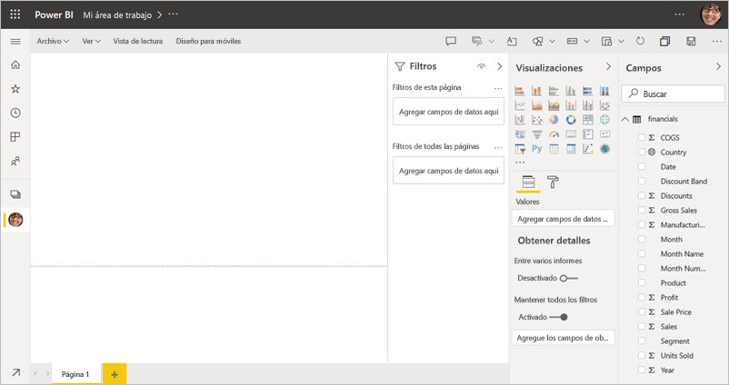

7. Observe que en la barra de navegación superior hay una opción **Vista de lectura**. Como tiene esta opción, significa que actualmente se encuentra en la vista de edición. Una excelente manera de familiarizarse con el editor de informes es [dar un paseo](service-the-report-editor-take-a-tour.md).

    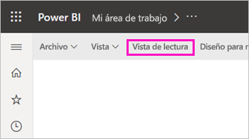

    En la vista de edición puede crear y modificar los informes, ya que es el *propietario* del informe. Es decir, es un *creador*. Cuando comparte el informe con compañeros de trabajo, ellos solo pueden interactuar con el informe en la vista de lectura; son los *consumidores*. Obtenga más información sobre la [vista de lectura y de edición](consumer/end-user-reading-view.md).

## Paso 2: Crear un gráfico en un informe
Ahora que se ha conectado a los datos, empiece a explorar.  Cuando encuentre algo interesante, puede crear un panel para supervisarlo y ver cómo cambia con el tiempo. Veamos cómo funciona eso.
    
1. En el editor de informes, para compilar una visualización se empieza en el panel **Campos**, situado en el lado derecho de la página. Seleccione las casillas **Ventas brutas** y **Fecha**.
   
   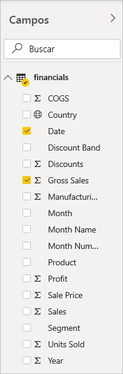

    Power BI analiza los datos y crea una visualización. Si primero ha seleccionado **Fecha**, verá una tabla. Si primero se ha seleccionado **Ventas brutas**, se verá un gráfico de columnas. 

2. Cambie a una forma diferente de mostrar los datos. Veamos estos datos como un gráfico de líneas. En el panel **Visualizaciones**, seleccione el icono de gráfico de líneas.
   
   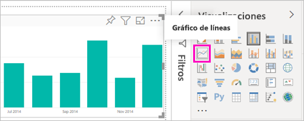

3. Este gráfico parece interesante, así que lo vamos a *anclar* a un panel. Mantenga el mouse sobre la visualización y seleccione el icono Anclar. Al anclar esta visualización, se almacena en el panel y se mantiene actualizada para que pueda comprobar el valor más reciente de un vistazo.
   
   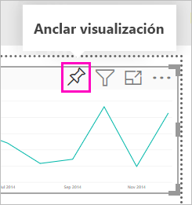

4. Como se trata de un informe nuevo, se le pide que lo guarde antes de poder anclar una visualización a un panel. Asigne un nombre al informe (por ejemplo, *Ventas históricas*) y, después, seleccione **Guardar**. 

5. Seleccione **Nuevo panel** y asígnele el nombre *Ejemplo financiero para el tutorial*. 
   
   
   
6. Seleccione **Anclar**.
   
    Un mensaje de confirmación (junto a la esquina superior derecha) indica que la visualización se ha agregado al panel como un icono.
   
    

7. Seleccione **Ir al panel** para ver el panel nuevo con el gráfico de líneas que se ha anclado al mismo como un icono. 
   
   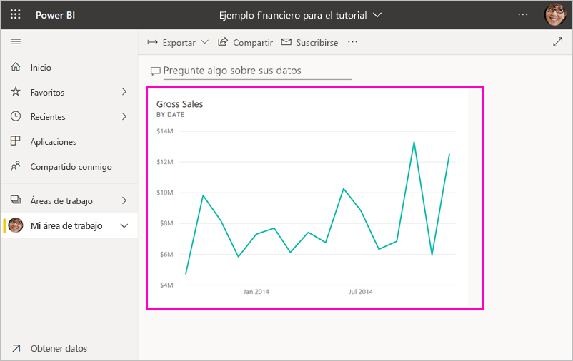
   
8. Seleccione el nuevo icono en el panel para volver al informe. Power BI le devuelve al informe en la vista de lectura. 

1. Para volver a la vista de edición, seleccione los puntos suspensivos (...) en la barra de navegación superior > **Editar**. Una vez en la vista de edición, puede seguir explorando y anclando iconos.

    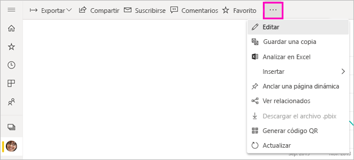

## Paso 3: Explorar con Preguntas y respuestas

Para realizar una exploración rápida de los datos, pruebe a formular una pregunta en el cuadro Preguntas y respuestas. Preguntas y respuestas crea consultas en lenguaje natural sobre los datos. En un panel, el cuadro de Preguntas y respuestas se encuentra en la parte superior (**Pregunte algo sobre sus datos**). En un informe, está en la barra de navegación superior (**Hacer una pregunta**).

1. Para volver al panel, seleccione **Mi área de trabajo** en la barra negra de **Power BI**.

    

1. En la pestaña **Paneles**, seleccione el panel.

    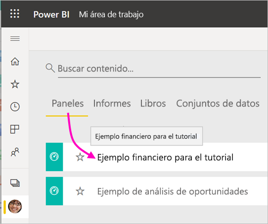

1. Seleccione **Pregunte algo sobre sus datos**. Preguntas y respuestas ofrece automáticamente un número de sugerencias.

    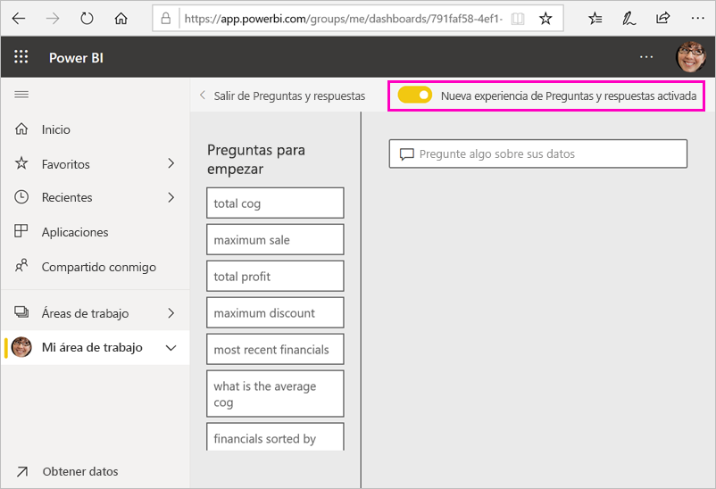

    > [!NOTE]
    > Si no ve las sugerencias, active la opción **Nueva experiencia de Preguntas y respuestas**.

2. Algunas de las sugerencias devuelven un valor único. Por ejemplo, seleccione **ventas máximas**.

    Preguntas y respuestas busca una respuesta y la presenta en forma de visualización de una *tarjeta*.

    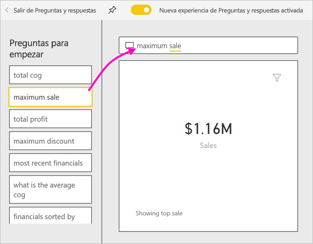

3. Seleccione el icono de anclaje  para mostrar esta visualización al panel Ejemplo financiero para el tutorial.

1. Desplácese hacia abajo en la lista **Preguntas para empezar** y seleccione **promedio de coste de mercancías vendidas de cada mes**. 

    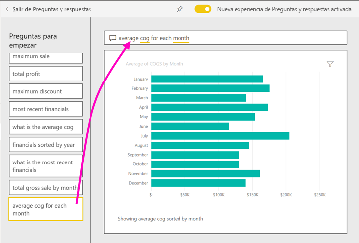

1. Ancle también el gráfico de barras al panel **Ejemplo financiero para el tutorial**.

1. En el cuadro Preguntas y respuestas, coloque el cursor después de *por mes* y escriba *como línea*. Seleccione **línea (Tipo de visualización)**. 

    

4. Seleccione **Salir de preguntas y respuestas** para volver al panel, donde verá los nuevos iconos que se han creado. 

   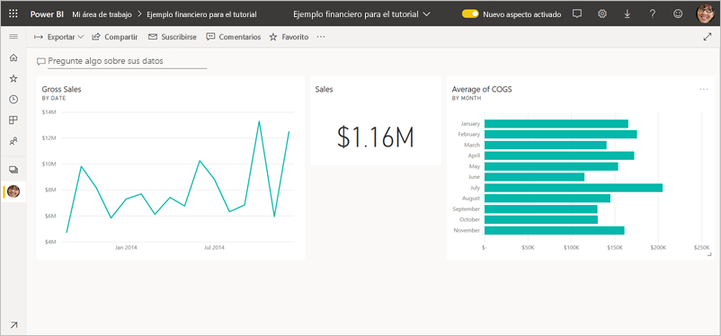

   Verá que, aunque se haya cambiado el gráfico a un gráfico de líneas, el icono sigue siendo un gráfico de barras porque eso es lo que era al anclarlo. 

## Paso 4: Cambiar la posición de los iconos

El panel es amplio. Podemos reorganizar los iconos para mejorar el uso del espacio del panel.

1. Arrastre la esquina inferior derecha del icono del gráfico de líneas *Ventas brutas* hacia arriba, hasta que se ajuste a la misma altura que el icono de ventas y, después, suéltelo.

    

    Ahora los dos iconos tienen la misma altura.

    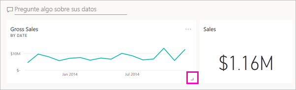

1. Arrastre el icono del gráfico de barras *Promedio de coste de mercancías vendidas* hasta que quepa en el gráfico de líneas *Ventas brutas*.

    Esto ya se ve mejor.

    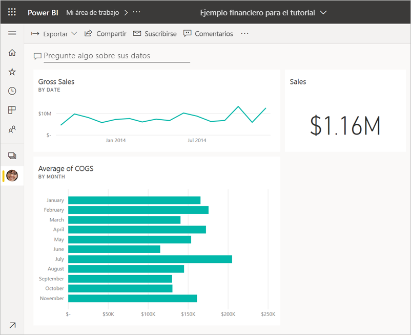

## Paso 5: Interactuar con los iconos

Aquí tiene última interacción que observar, antes de empezar a crear sus propios paneles e informes. La selección de los distintos iconos proporciona resultados distintos. 

1. En primer lugar, seleccione el icono de gráfico de líneas *Ventas brutas* que se ha anclado desde el informe. 

    Power BI abre el informe en la vista de lectura. 

2. Seleccione el botón atrás del explorador. 

1. Ahora, seleccione el icono del gráfico de barras *Promedio de coste de mercancías vendidas* que se ha creado en Preguntas y respuestas. 

    Power BI no abre el informe. En su lugar, se abre Preguntas y respuestas, ya que se ha creado este gráfico ahí.

## Limpieza de recursos
Ahora que ya hemos finalizado el tutorial, podemos eliminar el conjunto de datos, el informe y el panel. 

1. En la barra de navegación izquierda, asegúrese de que se encuentra en **Mi área de trabajo**.
2. Seleccione la pestaña **Conjuntos de datos** y, luego, busque el conjunto de datos que ha importado en el tutorial.  
3. Seleccione el botón de puntos suspensivos (...) > **Eliminar**.

    

    Cuando se elimine el conjunto de datos, verá una advertencia que indica que **También se eliminarán todos los iconos del panel y los informes que contengan datos de este conjunto de datos**.

4. Seleccione **Eliminar**.

## Pasos siguientes

Para mejorar el aspecto de los paneles aún más, agregue más iconos de visualización y [cámbieles el nombre o el tamaño, vincúlelos y reubíquelos](service-dashboard-edit-tile.md).

