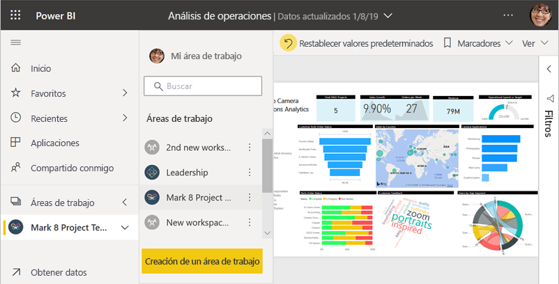
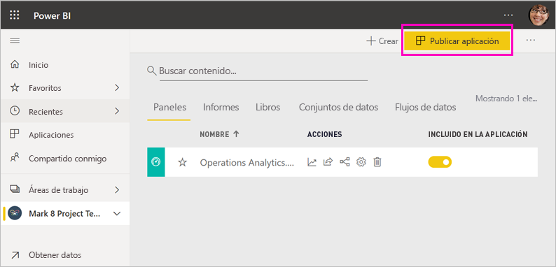
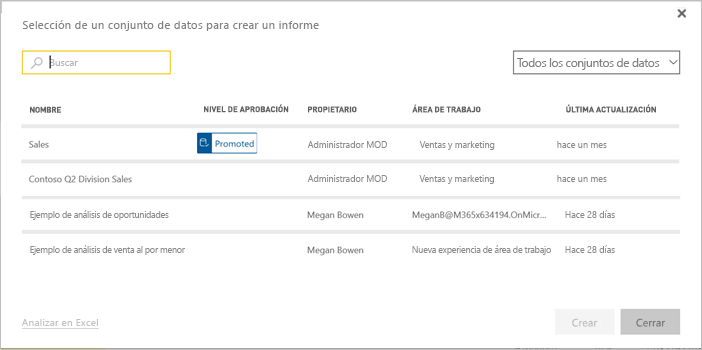
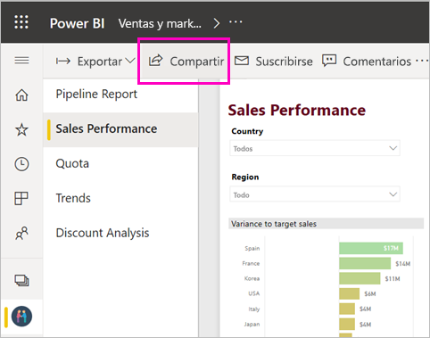
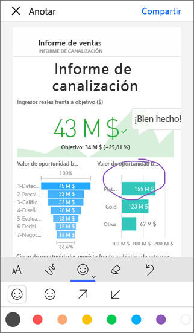

# Formas de compartir el trabajo en Power BI

Ha creado paneles e informes, quizá incluso haya colaborado en ellos con sus compañeros. Ahora quiere que otros usuarios tengan acceso a ellos. ¿Cuál es la mejor manera de distribuirlos? En este artículo, comparamos estas opciones de colaboración y uso compartido en Power BI:

* Colaborar con sus compañeros para crear informes y paneles significativos en *áreas de trabajo*.
* Agrupar los paneles e informes en *aplicaciones* y distribuirlas en un grupo más grande o en toda la organización.
* Crear *conjuntos de datos compartidos* que sus compañeros de trabajo pueden usar como base para sus propios informes, en sus propias áreas de trabajo.
* Crear una *aplicación de plantilla* que se puede distribuir a usuarios externos de Power BI mediante Microsoft AppSource.
* Compartir paneles o informes con algunas personas desde el servicio o las aplicaciones móviles de Power BI.
* Imprimir informes.
* *Insertar* informes en portales seguros o sitios web públicos.

Con independencia de la opción que se elija, para compartir el contenido se necesita una [licencia de Power BI Pro](service-features-license-type.md) o que el contenido esté en una [capacidad Premium](service-premium-what-is.md). Los requisitos de licencia para los compañeros que ven su contenido varían en función de la opción que elija. En las secciones siguientes puede encontrar más detalles. 

*Aplicaciones en el servicio Power BI*

## Colaboración en un área de trabajo

Cuando los equipos trabajan juntos, necesitan tener acceso a los mismos documentos para poder colaborar con rapidez. En las áreas de trabajo de Power BI, los equipos se reúnen para compartir la propiedad y administración de paneles, informes, conjuntos de datos y libros. A veces, los usuarios de Power BI organizan sus áreas de trabajo según las estructuras de la organización, mientras que otras veces las crean para proyectos específicos. Además, otras organizaciones usan varias áreas de trabajo para almacenar diferentes versiones de los informes o paneles que usan. 

Las áreas de trabajo proporcionan roles que determinan los permisos que tienen sus compañeros de trabajo. Puede usar esos roles para determinar quién puede administrar toda el área de trabajo, editar su contenido y distribuirlo.

Naturalmente, podría colocar contenido en Mi área de trabajo y compartirlo desde allí. Pero las áreas de trabajo son mejores para la colaboración que Mi área de trabajo, ya que permiten compartir la propiedad del contenido. Usted y todo su equipo pueden realizar actualizaciones o asignar acceso a otros usuarios fácilmente. Es mejor que Mi área de trabajo lo usen usuarios para contenido personal o de uso único.

Imaginemos que ha terminado un panel que tiene que compartir con sus compañeros. ¿Cuál es la mejor manera para concederles acceso a él? La respuesta depende de una serie de factores. 

- Si sus compañeros necesitan mantener actualizado el panel o necesitan tener acceso a todo el contenido del área de trabajo, considere la posibilidad de agregarlos al área de trabajo. 
- Si sus compañeros solo necesitan ver ese panel y no todo el contenido del área de trabajo, hay otras alternativas. Si algunas personas necesitan solo ese panel, compartirlo podría ser la mejor solución.
- No obstante, si el panel forma parte de un conjunto mayor de contenido que necesita distribuir a muchos compañeros, probablemente la mejor opción sea publicar una *aplicación*.

Power BI tiene una nueva experiencia de áreas de trabajo. Consulte [Creación de las nuevas áreas de trabajo](service-create-the-new-workspaces.md) para ver cómo han cambiado las áreas de trabajo. 

## Distribución de información en una aplicación

Supongamos que desea distribuir el panel a un público amplio en la organización. Junto con sus compañeros ha creado un *área de trabajo* y luego ha creado y refinado en ella paneles, informes y conjuntos de datos. Ahora seleccionará los paneles e informes que desee y los publicará como una aplicación, para un grupo o para toda la organización.

Es muy fácil buscar e instalar aplicaciones en el servicio Power BI ([https://app.powerbi.com](https://app.powerbi.com)). Puede enviar a los usuarios de la empresa un vínculo directo a la aplicación, o bien pueden buscarla en AppSource. Si el administrador de Power BI le concede permisos, puede instalar una aplicación automáticamente en las cuentas de Power BI de sus compañeros de trabajo. Obtenga más información sobre cómo [publicar aplicaciones](service-create-distribute-apps.md).

Después de instalar una aplicación, pueden verla en sus exploradores o dispositivos móviles.

Para que los usuarios vean la aplicación, deben tener también una licencia de Power BI Pro o la aplicación debe estar almacenada en una capacidad de Power BI Premium. Para más información, lea [What is Power BI Premium?](service-premium-what-is.md) (¿Qué es Power BI Premium?)

También puede publicar aplicaciones para personas que no pertenecen a su organización. Pueden ver el contenido de la aplicación e interactuar con él, pero no pueden compartirlo con otros usuarios. Ahora puede crear *aplicaciones de plantilla* e implementarlas en cualquier cliente de Power BI.

## Compartir un conjunto de datos

Siendo realistas, algunas personas están más especializadas en la creación de modelos de datos de alta calidad y bien diseñados en sus informes. Tal vez sea usted esa persona. Toda la organización puede beneficiarse del uso de dichos modelos de datos bien diseñados. Los *conjuntos de datos compartidos* cumplen ese rol. Cuando se crea un informe con un modelo de datos que debería usar todo el mundo, puede guardar dicho informe en el servicio Power BI y dar permiso para usarlo a las personas adecuadas. A continuación, estas personas pueden crear sus informes a partir del conjunto de datos. De este modo, todos los usuarios basan sus informes en los mismos datos y ven la misma "versión de la verdad".

Más información sobre la [creación y uso de conjuntos de datos compartidos](service-datasets-across-workspaces.md).

## Compartir los paneles e informes

Supongamos que ha finalizado un panel y un informe en su propia área de trabajo o en un área de trabajo y quiere que otras personas tengan acceso a ellos. Una manera de hacerlo es *compartirlo*. 

Para compartir el contenido necesitará una licencia de Power BI Pro (y aquellos con quienes lo comparta, también) o que el contenido esté en un área de trabajo de una [capacidad Premium](service-premium-what-is.md). Cuando comparte un panel o un informe con otras personas, los destinatarios pueden verlo e interactuar con él, pero no pueden modificarlo. Ellos ven los mismos datos que usted ve en el panel y en los informes, a menos que se aplique la seguridad de nivel de fila (RLS) al conjunto de datos subyacente. Los compañeros con los que los comparte pueden compartirlos a su vez con sus propios compañeros, si tienen permiso para hacerlo. 

También puede compartir con usuarios que no pertenezcan a su organización. Pueden ver el panel o el informe e interactuar con él, pero no pueden compartirlo. 

Más información sobre cómo [compartir paneles e informes](service-share-dashboards.md) desde el servicio Power BI. También puede agregar un filtro a un vínculo y [compartir una vista filtrada del informe](service-share-reports.md).

## Anotación y uso compartido de un panel desde aplicaciones móviles de Power BI

En las aplicaciones móviles de Power BI para dispositivos iOS y Android, puede anotar un icono, un informe o un objeto visual, y después compartirlo con otros usuarios por correo electrónico.

Estará compartiendo una instantánea del icono, el informe o el objeto visual, y los destinatarios lo verán exactamente igual que cuando envió el correo. El correo electrónico también contiene un vínculo al panel o el informe. Si tienen una licencia de Power BI Pro, o el contenido ya está en una [capacidad premium](service-premium-what-is.md), y ya ha compartido el objeto con ellos, pueden abrirlo. Puede enviar instantáneas de iconos a cualquier persona, no solo a compañeros del mismo dominio de correo electrónico.

Más información sobre cómo [anotar y compartir iconos, informes y objetos visuales](consumer/mobile/mobile-annotate-and-share-a-tile-from-the-mobile-apps.md) desde aplicaciones móviles de iOS y Android.

También puede [compartir una instantánea de un icono](consumer/mobile/mobile-windows-10-phone-app-get-started.md) desde la aplicación de Power BI para dispositivos Windows 10.

## Imprimir o guardar como PDF u otro formato de archivo estático

Puede imprimir todo un panel, un icono de panel, una página de informe o una visualización de informe (o guardarlo como PDF u otro formato de archivo estático) desde el servicio Power BI. Solo se puede imprimir una página de informe a la vez; no es posible imprimir todo el informe de una vez. Obtenga más información sobre cómo [imprimir o guardar como archivo estático](consumer/end-user-print.md).

## Inserción de informes en portales seguros o sitios web públicos

### Inserción en portales seguros

Puede insertar informes de Power BI en portales o sitios web en los que los usuarios esperan encontrarlos.  
Las opciones **Insertar en SharePoint Online** e **Insertar** del servicio Power BI permiten insertar informes para los usuarios internos de forma segura. 

- **Insertar en SharePoint Online** funciona con el elemento web de Power BI para SharePoint Online. Proporciona una experiencia de inicio de sesión único con control sobre cómo se inserta el informe. 
- **Insertar** funciona en cualquier portal o sitio web que sea compatible con la inserción de contenido mediante una dirección URL o un iFrame. 

En cualquier opción que elija, Power BI aplica todos los permisos y la seguridad de los datos antes de que los usuarios puedan ver el contenido. La persona que consulta el informe necesita la licencia pertinente. Más información sobre [Insertar en SharePoint Online](service-embed-report-spo.md) y la opción [Insertar](service-embed-secure.md) de Power BI.

### Publicación en sitios web públicos

Con la opción **Publicar en la Web**, puede publicar informes de Power BI en todo Internet mediante la inserción de visualizaciones interactivas en entradas de blog, sitios web, redes sociales y otras comunicaciones en línea, en cualquier dispositivo. Todos los usuarios de Internet pueden ver los informes y no se puede controlar quién puede ver lo que ha publicado. No necesitan una licencia de Power BI. La publicación en la Web está disponible solo para los informes que puede editar. No se pueden publicar informes en la Web si están compartidos con usted o si se encuentran en una aplicación. Más información sobre la [publicación en la Web](service-publish-to-web.md).

>[!Warning]
>Use [Publicar en la Web](service-publish-to-web.md) solo para compartir el contenido públicamente, no para uso compartido interno.

## Creación e implementación de aplicaciones de plantilla

Las *aplicaciones de plantilla* han sido diseñadas para su distribución pública, a menudo en Microsoft AppSource. Usted crea una aplicación y, con poca o ninguna codificación, puede implementarla en cualquier cliente de Power BI. Los clientes se conectan a sus propios datos y crean instancias de sus propias cuentas. Más información sobre las [Aplicaciones de plantilla de Power BI](service-template-apps-overview.md).

## Pasos siguientes

* [Compartir paneles e informes con compañeros y otros usuarios](service-share-dashboards.md)
* [Creación y publicación de una aplicación en Power BI](service-create-distribute-apps.md)
* [Inserción de informes en un sitio web o portal seguros](service-embed-secure.md)

¿Quiere hacer algún comentario? Vaya al [sitio de la comunidad de Power BI](https://community.powerbi.com/) para efectuar sus sugerencias.

¿Tiene más preguntas? [Pruebe la comunidad de Power BI](https://community.powerbi.com/)
