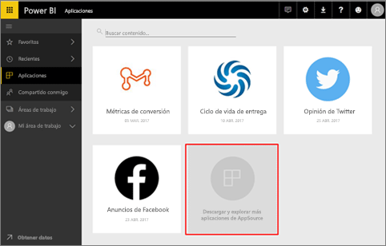
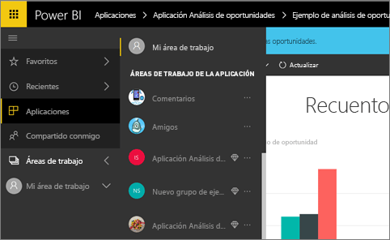
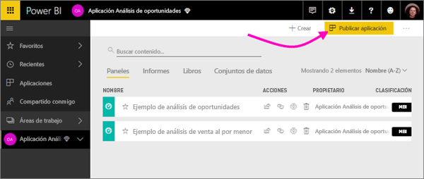
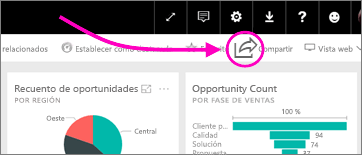

# ¿Cómo debo colaborar y compartir en Power BI?

Ha creado paneles e informes, colabora en ellos con sus compañeros, puede que luego desee que otros usuarios tengan también acceso a ellos. ¿Cuál es la mejor manera de distribuirlos?

En este artículo, compararemos estas opciones de colaboración y uso compartido en Power BI: 

* Colaborar con compañeros para crear informes y paneles significativos en *áreas de trabajo de la aplicación*.
* Agrupar esos paneles e informes en *aplicaciones* y publicarlas en un grupo más grande o en toda la organización.
* Compartir paneles o informes con algunas personas desde el servicio o las aplicaciones móviles de Power BI.
- Imprimir informes.
* Publicar en la Web para sitios web públicos, donde cualquier persona del mundo puede ver e interactuar con él.

Con independencia de la opción que se elija, para compartir un panel se necesita una [licencia de Power BI Pro](service-free-vs-pro.md) o que el contenido esté en una [capacidad premium](service-premium.md). Los requisitos de licencia para los compañeros que ven sus paneles varían en función de la opción que elija. En las secciones siguientes puede encontrar más detalles. 

*Aplicaciones en el servicio Power BI*

## Colaboración con compañeros en un área de trabajo de aplicación

Cuando los equipos trabajan juntos, necesitan tener acceso a los mismos documentos para que puedan colaborar con rapidez. Las áreas de trabajo de la aplicación de Power BI proporcionan un lugar donde los equipos se reúnen para compartir la propiedad y administración de paneles, informes, conjuntos de datos y libros que son importantes para ellos. A veces, los usuarios de Power BI organizan sus áreas de trabajo según las estructuras de la organización, mientras que otras veces las crean para proyectos específicos. Además, otras organizaciones usan varias áreas de trabajo para almacenar diferentes versiones de los informes o paneles que usan. 

Las áreas de trabajo de aplicación proporcionan roles que determinan los permisos que tienen sus compañeros de trabajo. Puede usar esos roles para determinar quién puede administrar toda el área de trabajo, o simplemente proporcionar contenido en ella.

Algunos usuarios simplemente colocan contenido en Mi área de trabajo y lo comparten. Las áreas de trabajo de la aplicación son mejores para la colaboración que Mi área de trabajo, ya que proporcionan copropiedad de contenido. Usted y todo su equipo pueden realizar actualizaciones o asignar acceso a otros usuarios fácilmente. Es mejor que Mi área de trabajo lo usen usuarios para contenido personal o de uso único.

Imaginemos que ha terminado un panel que tiene que compartir con sus compañeros. ¿Cuál es la mejor manera para concederles acceso a él? La respuesta depende de una serie de factores. Si un compañero de trabajo específico necesita ser propietario del panel y mantenerlo actualizado, o si debe tener acceso a todo el contenido del área de trabajo de aplicación, puede que sea mejor agregarlo al área de trabajo. Si su compañero solo necesita ver ese panel y no todo el contenido del área de trabajo, también puede elegir entre un conjunto de alternativas. Si el panel forma parte de un conjunto mayor de contenido que necesita distribuir a muchos compañeros, entonces, probablemente la mejor opción sea publicar una aplicación. Pero si su compañero solo necesita ese panel, entonces lo mejor sería compartir el panel. 

Obtenga más información sobre la [creación de áreas de trabajo de la aplicación](service-create-workspaces.md).

**¿Sabía qué?** Power BI está realizando una versión preliminar de una nueva experiencia de áreas de trabajo. Lea [Crear nuevas áreas de trabajo (versión preliminar)](service-create-the-new-workspaces.md) para ver cómo cambiarán las áreas de trabajo en el futuro. 

## Distribuir datos e información mediante la creación de una aplicación

Supongamos que desea distribuir el panel a un público amplio. Junto con sus compañeros ha creado un *área de trabajo de la aplicación* y luego ha creado y refinado en ella paneles, informes y conjuntos de datos. Ahora ya puede seleccionar los paneles e informes que desee y publicarlos como una aplicación &#151; para un grupo para toda la organización. 

Es muy fácil buscar e instalar aplicaciones en el servicio Power BI ([https://powerbi.com](https://powerbi.com)). Puede enviar a los usuarios de la empresa un vínculo directo a la aplicación, o bien pueden buscarla en AppSource. Si el administrador de Power BI le concede permisos, puede instalar una aplicación automáticamente en las cuentas de Power BI de sus compañeros de trabajo. Obtenga más información sobre cómo [publicar aplicaciones](service-create-distribute-apps.md). 

Después de instalar una aplicación, pueden verla en sus exploradores o dispositivos móviles.

Para que los usuarios vean la aplicación, deben tener también una licencia de Power BI Pro o la aplicación debe estar almacenada en una capacidad de Power BI Premium. Para más información, lea [What is Power BI Premium?](service-premium.md) (¿Qué es Power BI Premium?)

También puede publicar aplicaciones para aquellos que no pertenecen a su organización. Pueden ver el contenido de la aplicación e interactuar con él, pero no pueden compartirlo con otros usuarios.

## Compartir los paneles e informes
Supongamos que ha finalizado un panel y un informe en su propia área de trabajo o en un área de trabajo de la aplicación y quiere que otras personas tengan acceso a ellos. Una manera de hacerlo es *compartirlo*. 

Para compartir el contenido necesitará una licencia de Power BI Pro (y aquellos con quienes lo comparta, también) o que el contenido esté en un área de trabajo de una [capacidad Premium](service-premium.md). Cuando comparte un panel o un informe con otras personas, los destinatarios pueden verlo e interactuar con él, pero no pueden modificarlo. Ellos ven los mismos datos que usted ve en el panel y en los informes, a menos que se aplique la seguridad de nivel de fila (RLS) al conjunto de datos subyacente. Los compañeros con los que los comparte pueden compartirlos a su vez con sus propios compañeros, si tienen permiso para hacerlo. 

También puede compartir con usuarios que no pertenezcan a su organización. Pueden ver el panel o el informe e interactuar con él, pero no pueden compartirlo. 

Más información sobre cómo [compartir paneles e informes](service-share-dashboards.md) desde el servicio Power BI. También puede agregar un filtro a un vínculo y [compartir una vista filtrada del informe](service-share-reports.md).

## Anotación y uso compartido de un panel desde aplicaciones móviles de Power BI
En las aplicaciones móviles de Power BI para dispositivos iOS y Android, puede anotar un icono, un informe o un objeto visual, y después compartirlo con otros usuarios por correo electrónico. 

Estará compartiendo una instantánea del icono, el informe o el objeto visual, y los destinatarios lo verán exactamente igual que cuando envió el correo. El correo electrónico también contiene un vínculo al panel o el informe. Si tienen una licencia de Power BI Pro, o el contenido ya está en una [capacidad premium](service-premium.md), y ya ha compartido el objeto con ellos, pueden abrirlo. Puede enviar instantáneas de iconos a cualquier persona, no solo a compañeros del mismo dominio de correo electrónico.

Más información sobre cómo [anotar y compartir iconos, informes y objetos visuales](consumer/mobile/mobile-annotate-and-share-a-tile-from-the-mobile-apps.md) desde aplicaciones móviles de iOS y Android.

También puede [compartir una instantánea de un icono](consumer/mobile/mobile-windows-10-phone-app-get-started.md) desde la aplicación de Power BI para dispositivos Windows 10.

## Imprimir o guardar como PDF u otro formato de archivo estático
Puede imprimir todo un panel, un icono de panel, una página de informe o una visualización de informe (o guardarlo como PDF u otro formato de archivo estático) desde el servicio Power BI. Solo se puede imprimir una página de informe a la vez; no es posible imprimir todo el informe de una vez. Obtenga más información sobre cómo [imprimir o guardar como archivo estático](service-print.md).

## Publicar en Web

> [!WARNING]
> Use **Publicar en la Web** solo para compartir el contenido públicamente, no para uso compartido interno.

Puede publicar informes de Power BI en todo Internet mediante la inserción de visualizaciones interactivas en entradas de blog, sitios web, redes sociales y otras comunicaciones en línea, en cualquier dispositivo. Todos los usuarios de Internet pueden ver los informes y no se puede controlar quién puede ver lo que ha publicado. No necesitan una licencia de Power BI. La publicación en la Web está disponible solo para los informes que puede editar. No se pueden publicar informes en la Web si están compartidos con usted o si se encuentran en una aplicación. Más información sobre la [publicación en la Web](service-publish-to-web.md).

## Pasos siguientes
* [Compartir paneles e informes con compañeros y otros usuarios](service-share-dashboards.md)
* [Creación y publicación de una aplicación en Power BI](service-create-distribute-apps.md)
* ¿Quiere hacer algún comentario? Vaya al [sitio de la comunidad de Power BI](https://community.powerbi.com/) para efectuar sus sugerencias.
* ¿Tiene más preguntas? [Pruebe la comunidad de Power BI](http://community.powerbi.com/).

