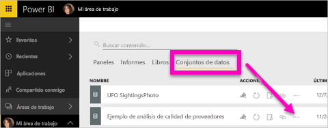
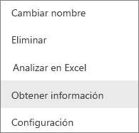
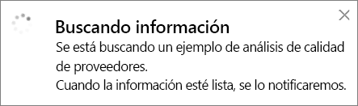
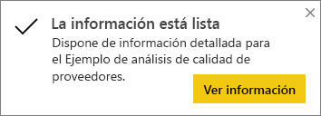
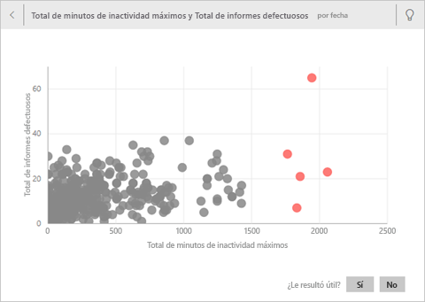
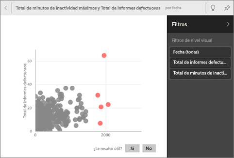
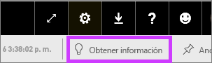
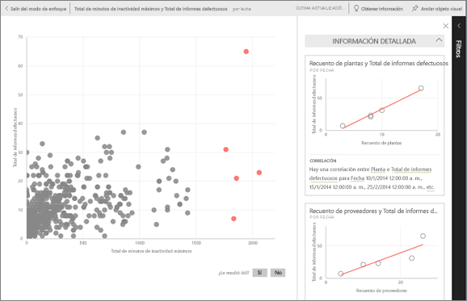
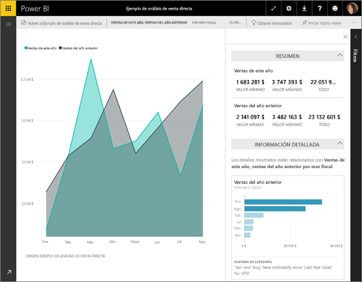

# Generación automática de conclusiones de datos con Power BI
¿Tiene un conjunto de datos nuevo y no está muy seguro de por dónde empezar?  ¿Necesita crear un panel rápidamente?  ¿Quiere buscar información que puede que le falte?

Extraiga información rápida para generar visualizaciones interactivas interesantes basadas en los datos. Se puede extraer información detallada de un conjunto de datos completo (información rápida) o del icono de un panel específico (información con ámbito). Puede incluso extraer información detallada a partir de información detallada.

> [!NOTE]
> Información detallada no funciona con DirectQuery, solo con los datos cargados en Power BI.
> 

La característica de información detallada se basa en un creciente [conjunto de algoritmos de análisis avanzados](service-insight-types.md) desarrollado en combinación con Microsoft Research, que vamos a seguir usando para que más personas encuentren información en sus datos de formas nuevas e intuitivas.

## Extracción de información rápida de un conjunto de datos
Vea a Amanda extraer información rápida de un conjunto de datos, abrir la información en modo de enfoque, anclar una de estas piezas de información como un icono en su panel y, por último, obtener información detallada de un icono del panel.

<iframe width="560" height="315" src="https://www.youtube.com/embed/et_MLSL2sA8" frameborder="0" allowfullscreen></iframe>

Ahora es su turno. Explore la característica de información detallada mediante el [Ejemplo de análisis de calidad de proveedores](sample-supplier-quality.md).

1. En la pestaña **Conjuntos de datos**, seleccione el botón **Más opciones** (...) y elija **Obtener información rápida**.
   
    
   
    
2. Power BI usa [distintos algoritmos](service-insight-types.md) para buscar tendencias en el conjunto de datos.
   
    
3. Su información está lista en cuestión de segundos.  Seleccione **Ver información** para mostrar visualizaciones.
   
    
   
    > [!NOTE]
    > Algunos conjuntos de datos no pueden generar información porque los datos no son estadísticamente significativos.  Para más información, consulte [Optimización de los datos para información detallada](service-insights-optimize.md).
    > 
    
4. Las visualizaciones se muestran en un lienzo especial de **información rápida** con un máximo 32 tarjetas de información independientes. Cada tarjeta tiene un gráfico o un gráfico con una breve descripción.
   
    

## Interacción con las tarjetas de información

1. Mantenga el puntero sobre una tarjeta y seleccione el icono de anclaje para agregar la visualización a un panel.

2. Mantenga el puntero sobre una tarjeta, seleccione **Más opciones** (...) y elija **Ver información**. 

    Se abre la pantalla de información en modo de enfoque.
   
    
3. En el Modo enfocado, puede:
   
   * Filtrar las visualizaciones. Si el panel **Filtros** todavía no está abierto, seleccione la flecha situada en el lado derecho de la ventana para expandirlo.

       
   * Para anclar la tarjeta de información a un panel, seleccione **Anclar objeto visual**.
   * Ejecute información en la propia tarjeta, lo que a menudo se conoce como *información con ámbito*. En la esquina superior derecha, seleccione el icono de bombilla  u **Obtener información**.
     
       
     
     A la izquierda, se muestra la información y, a la derecha, nuevas tarjetas basadas solo en los datos de esa única información.
     
       
4. Para volver al lienzo original de información, en la esquina superior izquierda, seleccione **Salir del modo de enfoque**.

## Información en un icono del panel
En lugar de buscar información en un conjunto de datos entero, limite la búsqueda para obtener información con ámbito de los datos usados para crear un único icono de panel. 

1. Abra un panel.
2. Mantenga el puntero encima de un icono. Seleccione **Más opciones** (...) y elija **Ver información**. El icono se abre en [modo de enfoque](service-focus-mode.md) con las tarjetas de información a la derecha.    
   
        
3. ¿Alguna información capta su interés? Seleccione esa tarjeta de información para profundizar aún más. A la izquierda, se muestra la información seleccionada y, a la derecha, nuevas tarjetas de información, basadas solo en los datos de esa única información.    
4. Siga profundizando en los datos y, cuando encuentre una información interesante, ancle esta al panel mediante la selección de **Anclar objeto visual** en la esquina superior derecha.

## Pasos siguientes
- Si es propietario de un conjunto de datos, [optimícelo para Conclusiones rápidas](service-insights-optimize.md).
- Obtenga información sobre los [tipos de Conclusiones rápidas disponibles](service-insight-types.md).

¿Tiene más preguntas? [Pruebe la comunidad de Power BI](https://community.powerbi.com/).

