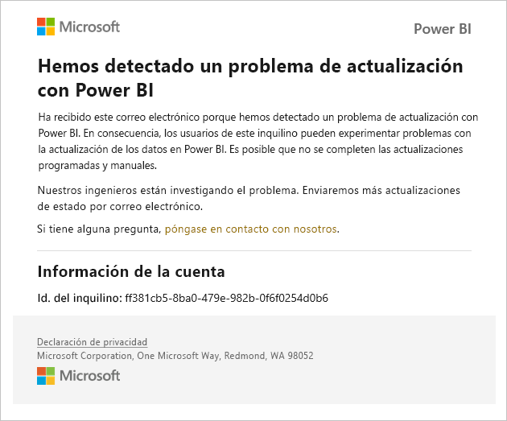
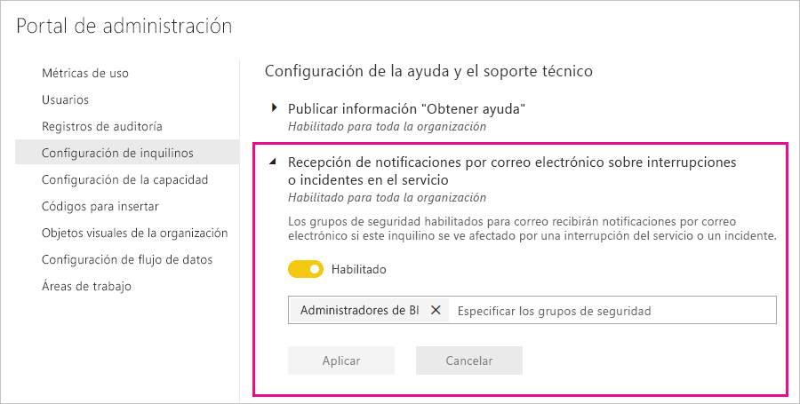

# Notificaciones de interrupción del servicio

Es fundamental tener información sobre la disponibilidad de las aplicaciones empresariales críticas. Power BI proporciona una notificación de incidentes para que pueda recibir mensajes de correo electrónico si se produce una interrupción o degradación del servicio. Aunque el Acuerdo de Nivel de Servicio (SLA) del 99,9 % de Power BI hace que estas repeticiones sean poco frecuentes, queremos asegurarnos de que esté informado. En la captura de pantalla siguiente se muestra el tipo de correo electrónico que recibirá si habilita las notificaciones:

En este momento, se envían mensajes de correo electrónico para los siguientes _escenarios de confiabilidad_:

- Confiabilidad de apertura del informe
- Confiabilidad de actualización del modelo
- Confiabilidad de actualización de consultas

Las notificaciones se envían cuando se produce un _retraso prolongado_ en las operaciones (por ejemplo, al abrir un informe, al actualizar conjuntos de datos o al ejecutar consultas). Una vez que se ha resuelto un incidente, recibirá un correo electrónico de seguimiento.

> [!NOTE]
> En la actualidad, esta característica solo está disponible para capacidades dedicadas en Power BI Premium. No está disponible para la capacidad compartida o insertada.

## Habilitación de notificaciones

Un administrador de inquilinos de Power BI habilita las notificaciones en el portal de administración:

1. Identifique o cree un grupo de seguridad habilitado para correo electrónico que deba recibir notificaciones.

1. En el portal de administración, seleccione **Configuración de inquilinos**. En **Configuración de ayuda y soporte técnico**, expanda **Recepción de notificaciones por correo electrónico sobre interrupciones o incidentes en el servicio**.

1. Habilite las notificaciones, escriba un grupo de seguridad y seleccione **Aplicar**.

    

> [!NOTE]
> Power BI envía notificaciones desde la cuenta no-reply-powerbi@microsoft.com. Asegúrese de que esta cuenta esté en la lista de permitidas para que las notificaciones no terminen en una carpeta de correo no deseado.

## Pasos siguientes

[Opciones de soporte técnico de Power BI Pro y Power BI Premium](service-support-options.md)

¿Tiene más preguntas? [Pruebe la comunidad de Power BI](https://community.powerbi.com/)
