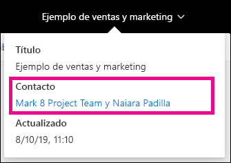
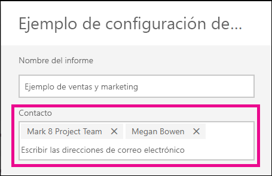
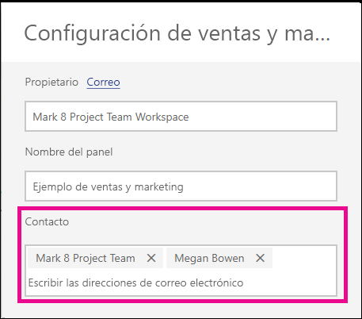

# Establecimiento de la información de contacto para paneles e informes en el servicio Power BI
En este artículo se explica cómo establecer la información de contacto para un panel o informe en el servicio Power BI.

> [!NOTE]
> Se puede establecer la información de contacto para los elementos de un área de trabajo clásica o nueva. No se puede establecer la información de contacto para los elementos de Mi área de trabajo. La tarjeta de información se muestra al ver un informe o un panel con el [nuevo aspecto](service-new-look.md).

Puede agregar varios usuarios o grupos al contacto para un elemento. Pueden ser:
* Una persona
* Un grupo de Office 365
* Un grupo de seguridad habilitado para correo electrónico
* Una lista de distribución

De forma predeterminada, la persona que crea un nuevo informe o panel será la que figure como su contacto. Si establece un valor, este invalida el valor predeterminado. Por supuesto, puede quitar todas las personas o grupos de la lista de contactos. Al hacerlo, en las áreas de trabajo clásicas, se mostrará el grupo de Office 365 para el área de trabajo. En el caso de las nuevas experiencias de área de trabajo, se usará la [lista de contactos del área de trabajo](service-create-the-new-workspaces.md#workspace-contact-list). Si no se establece la lista de contactos del área de trabajo, se muestran los administradores del área de trabajo.

La información de contacto se muestra a los usuarios que ven el elemento. 

 

Al hacer clic en la lista de contactos, se crea un correo electrónico para que pueda hacer preguntas u obtener ayuda. 

 
 
La información de la lista de contactos también se utiliza en otros lugares. Por ejemplo, se muestra en algunos escenarios de error en el cuadro de diálogo de error. Los mensajes de correo electrónico automatizados relacionados con el elemento, como las solicitudes de acceso, se envían a la lista de contactos. 

> [!NOTE]
> Al publicar una aplicación, la información de contacto establecida en elementos individuales se establece en función de la persona que publicó o actualizó la aplicación. Puede configurar la dirección URL de soporte técnico de la aplicación para que los usuarios de la aplicación obtengan la ayuda que necesitan.

## Configuración de la información de contacto para un informe
1. En el área de trabajo, seleccione la pestaña **Informes**.
2. Busque el informe que desee y seleccione el icono **Configuración**.
3. Busque el campo de entrada **Contacto** y establezca un valor.

     

## Configuración de la información de contacto para un panel
1. En el área de trabajo, seleccione la pestaña **Paneles**.
2. Busque el panel deseado y seleccione el icono **Configuración**.
3. Busque el campo de entrada **Contacto** y establezca un valor.

     

## Limitaciones y consideraciones
* El contacto se establece automáticamente para los nuevos elementos creados en el servicio Power BI. Los elementos existentes mostrarán el valor predeterminado del área de trabajo.
* Puede establecer cualquier usuario o grupo de la lista de contactos, pero no se les concederá permiso para el elemento automáticamente. Recurra al uso compartido o proporcione acceso al área de trabajo al usuario que lo necesite el a través de un rol. 
* La lista de contactos de nivel de elemento no se inserta en las aplicaciones cuando se publican. La nueva experiencia de navegación de la aplicación proporciona una dirección URL de soporte técnico que configura para ayudar a administrar los comentarios de un gran número de usuarios de la aplicación.

## Pasos siguientes

¿Tiene más preguntas? [Pruebe la comunidad de Power BI](https://community.powerbi.com/)
