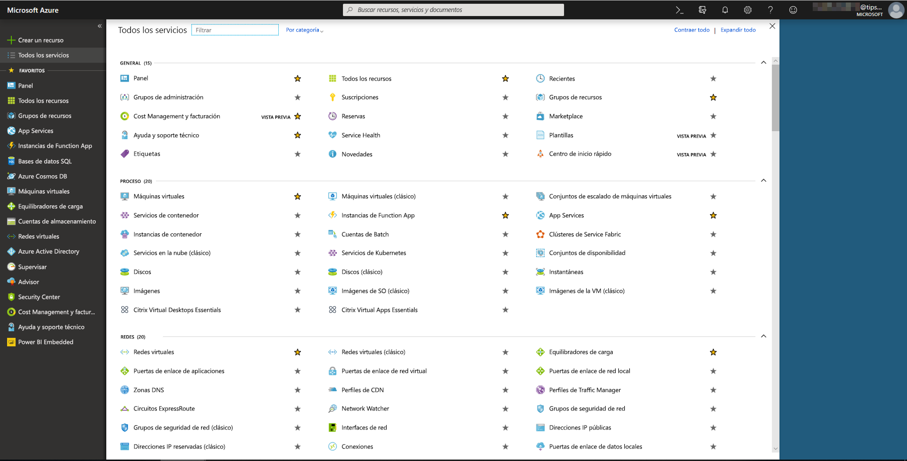
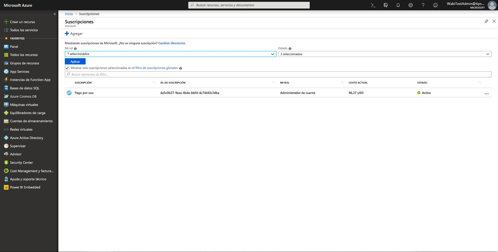
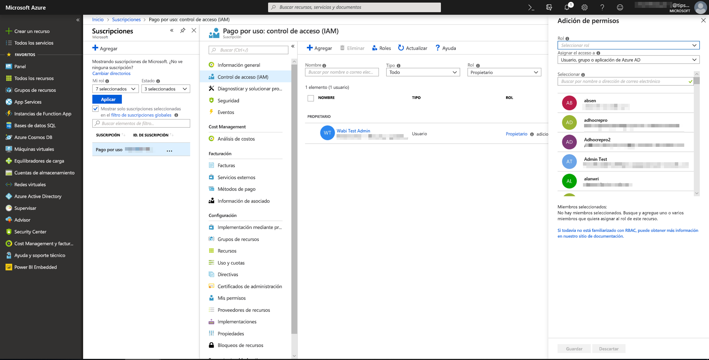
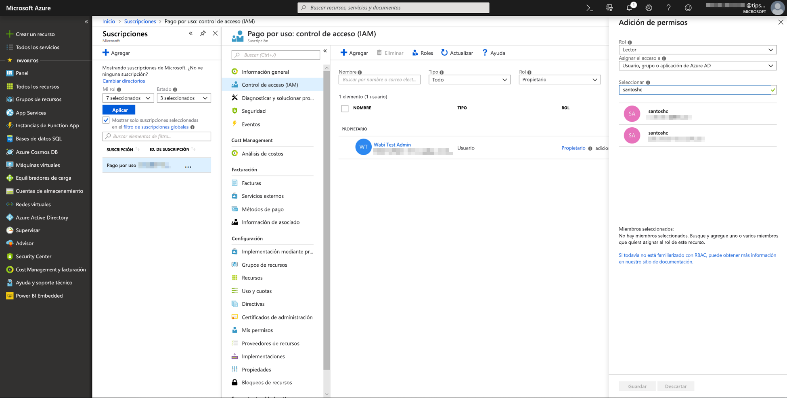
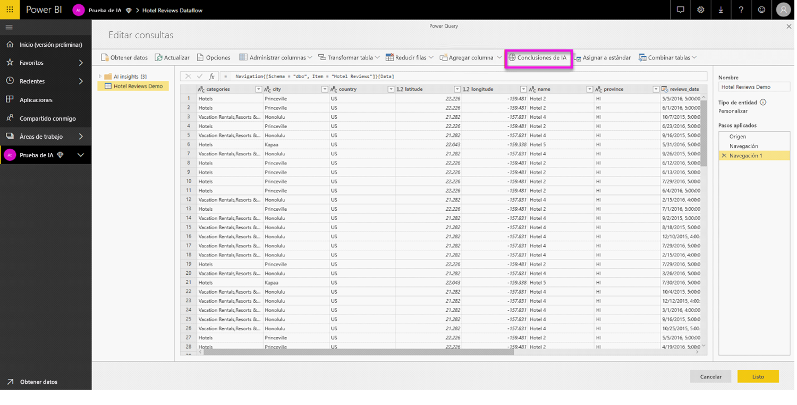
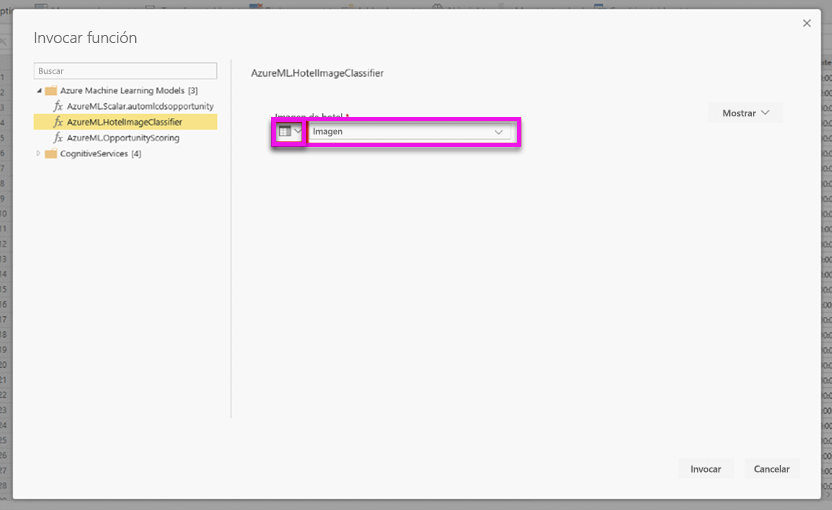
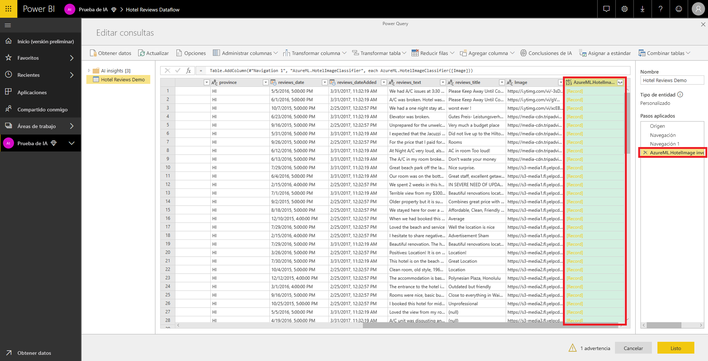
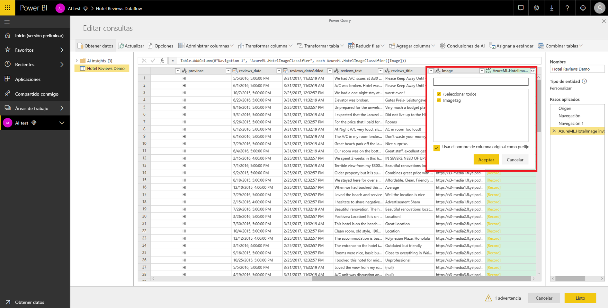

# Integración de Azure Machine Learning en Power BI (versión preliminar)

Numerosas organizaciones usan modelos de **Machine Learning** para obtener mejores conclusiones y predicciones sobre sus negocios. La capacidad de visualizar e invocar conclusiones de estos modelos en sus informes, paneles y otros análisis puede ayudar a divulgar estas conclusiones a los usuarios profesionales que más lo necesiten.  Ahora, Power BI facilita la incorporación de las conclusiones de modelos hospedados en el servicio Azure Machine Learning mediante movimientos de apuntar y hacer clic sencillos.

Para usar esta funcionalidad, un científico de datos puede conceder acceso al modelo de Azure ML al analista de BI simplemente mediante Azure Portal.  A continuación, al inicio de cada sesión, Power Query detecta todos los modelos de Azure ML a los que tiene acceso el usuario y los expone como funciones de Power Query dinámicas.  Después, el usuario puede invocar esas funciones obteniendo acceso a ellas desde la cinta de opciones del Editor de Power Query o invocando la función M directamente. Power BI también procesa por lotes las solicitudes de acceso de forma automática al invocar el modelo de Azure ML para que un conjunto de filas logre un mejor rendimiento.

Actualmente, esta funcionalidad solo es compatible con los flujos de datos de Power BI y con Power Query en línea en el servicio Power BI.

Para más información sobre los flujos de datos, consulte [Preparación de datos de autoservicio en Power BI](service-dataflows-overview.md).

Para obtener más información sobre Azure Machine Learning, consulte:

- Información general:  [¿Qué es el servicio Azure Machine Learning?](https://docs.microsoft.com/azure/machine-learning/service/overview-what-is-azure-ml)
- Guías de inicio rápido y tutoriales de Azure Machine Learning:  [Documentación de Azure Machine Learning](https://docs.microsoft.com/azure/machine-learning/)

## Concesión de acceso al modelo de Azure ML a un usuario de Power BI

Para obtener acceso a un modelo de Azure ML desde Power BI, el usuario debe tener acceso de **lectura** a la suscripción a Azure.  Asimismo:

- En los modelos de Machine Learning Studio, obtenga acceso de **lectura** al servicio web Machine Learning Studio
- En los modelos de Machine Learning Service, obtenga acceso de **lectura** al área de trabajo del servicio Machine Learning

En los pasos de este artículo se describe cómo conceder un acceso de usuario de Power BI a un modelo hospedado en el servicio Azure ML de modo que pueda tener acceso a este modelo como función de Power Query.  Para más detalles, consulte [Manage access using RBAC and the Azure portal](https://docs.microsoft.com/azure/role-based-access-control/role-assignments-portal) (Administrar el acceso mediante RBAC y Azure Portal).

1. Inicie sesión en [Azure Portal](https://portal.azure.com).

2. Vaya a la página **Suscripciones**. Encontrará la página **Suscripciones** a través de la lista **Todos los servicios** del menú de navegación izquierdo de Azure Portal.

    

3. Seleccione su suscripción.

    

4. Seleccione **Control de acceso (IAM)** y, a continuación, seleccione el botón **Agregar**.

    

5. Seleccione **Lector** como rol. Seleccione el usuario de Power BI a quien desea conceder acceso al modelo de Azure ML.

    

6. Seleccione **Guardar**.

7. Repita los pasos del tres al seis para conceder acceso de **lectura** al usuario para el servicio web Machine Learning Studio específico, *o bien* el área de trabajo del servicio Machine Learning que hospeda el modelo.

## Detección de esquema para los modelos de Machine Learning Service

Los científicos de datos usan principalmente Python para desarrollar e incluso implementar sus modelos de Machine Learning para el servicio Machine Learning Service.  A diferencia de Machine Learning Studio, que ayuda a automatizar la tarea de creación de un archivo de esquema para el modelo, en el caso del servicio Machine Learning Service, el científico de datos debe generar explícitamente el archivo de esquema mediante Python.

Este archivo de esquema se debe incluir en el servicio web implementado para los modelos del servicio Machine Learning. Para generar de forma automática el esquema para el servicio web, debe proporcionar un ejemplo de la entrada y salida en el script de entrada para el modelo implementado. Vea la subsección sobre Generación automática de esquemas de Swagger (opcional) en los modelos de implementación con la documentación del servicio Azure Machine Learning. El vínculo incluye el script de entrada de ejemplo con las instrucciones para la generación de esquemas. 

En concreto, las funciones *@input_schema* y *@output_schema* del script de entrada hacen referencia a los formatos de ejemplo de entrada y salida de las variables *input_sample* y *output_sample*, y usan estos ejemplos para generar una especificación OpenAPI (Swagger) para el servicio web durante la implementación.

Estas instrucciones para la generación de esquemas mediante la actualización del script de entrada también se deben aplicar a los modelos creados mediante experimentos automatizados de aprendizaje automático con el SDK de Azure Machine Learning.

> [!NOTE]
> Actualmente, en los modelos creados con la interfaz visual del servicio Azure Machine Learning (versión preliminar) no se admite la generación de esquemas, pero lo harán en versiones posteriores. 

## Invocación del modelo de Azure ML en Power BI

Puede invocar cualquier modelo de Azure ML al que se le haya concedido acceso directamente desde el Editor de Power Query de su flujo de datos. Para obtener acceso a los modelos de Azure ML, seleccione el botón **Editar** para la entidad que quiera enriquecer con conclusiones de su modelo de Azure ML, como se muestra en la siguiente imagen.

Al seleccionar el botón **Editar** se abre el Editor de Power Query para las entidades de su flujo de datos.

Seleccione el botón **Conclusiones de AI** de la cinta de opciones y, a continuación, seleccione la carpeta _Modelos de Azure Machine Learning_ en el menú de navegación izquierdo. Todos los modelos de Azure ML a los que tiene acceso se recogen aquí como funciones de Power Query. Asimismo, los parámetros de entrada para el modelo de Azure ML se asignan automáticamente como parámetros de la función de Power Query correspondiente.

Para invocar un modelo de Azure ML, puede especificar cualquiera de las columnas de la entidad seleccionadas como entrada del menú desplegable. También puede especificar un valor constante que se va a usar como entrada cambiando el icono de la columna a la izquierda del cuadro de diálogo de entrada.

Seleccione **Invocar** para ver la versión preliminar del resultado del modelo de Azure ML como nueva columna en la tabla de entidades. También verá la invocación de modelos como paso aplicado para la consulta.

Si el modelo devuelve varios parámetros de salida, se agrupan como registro en la columna de salida. Puede expandir la columna para producir parámetros de salida individuales en columnas independientes.

Una vez que guarde su flujo de datos, el modelo se invocará automáticamente al actualizarse el flujo de datos, para cualquier fila nueva o actualizada de la tabla de entidades.

## Pasos siguientes

En este artículo se proporcionaba información general de la integración de Machine Learning en el servicio Power BI. Los siguientes artículos también podrían ser interesantes y útiles. 

* [Tutorial: Invocación de un modelo de Machine Learning Studio en Power BI (versión preliminar)](service-tutorial-invoke-machine-learning-model.md)
* [Tutorial: Uso de Cognitive Services en Power BI](service-tutorial-use-cognitive-services.md)
* [Cognitive Services en Power BI (versión preliminar)](service-cognitive-services.md)

Para más información sobre los flujos de datos, puede leer estos artículos:
* [Creación y uso de flujos de datos en Power BI](service-dataflows-create-use.md)
* [Uso de entidades calculadas en Power BI Premium](service-dataflows-computed-entities-premium.md)
* [Uso de flujos de datos con orígenes de datos locales](service-dataflows-on-premises-gateways.md)
* [Recursos para desarrolladores sobre flujos de datos de Power BI](service-dataflows-developer-resources.md)
* [Integración de flujos de datos y Azure Data Lake (versión preliminar)](service-dataflows-azure-data-lake-integration.md)

