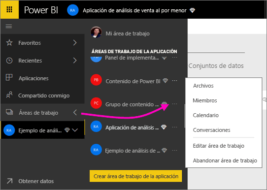
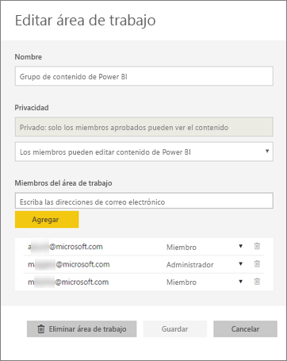
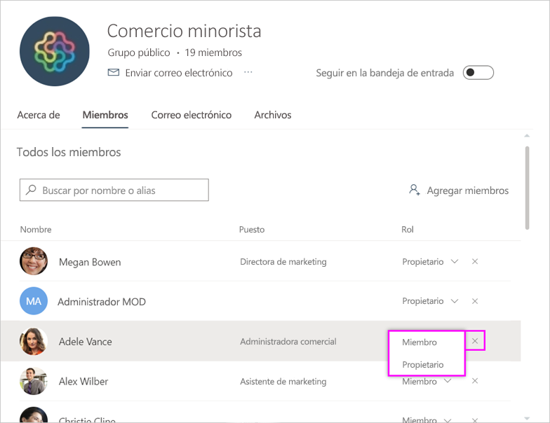
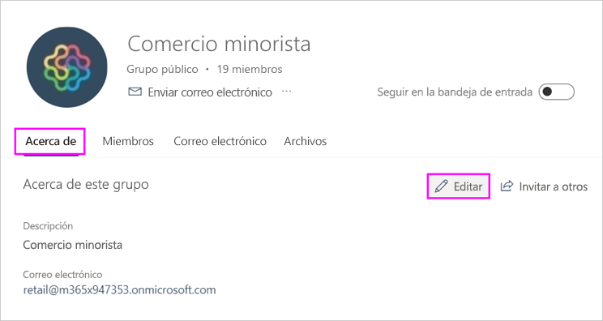
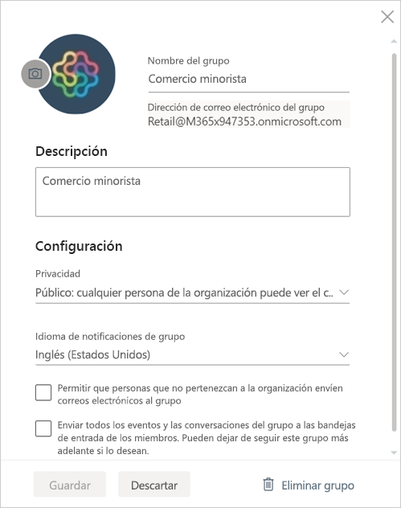

# Administración del área de trabajo de la aplicación en Power BI y Office 365
Como creador o administrador de un [área de trabajo de la aplicación en Power BI](service-create-distribute-apps.md) u Office 365, administra algunos aspectos de ella en Power BI. Otros aspectos que administra en Office 365. 

> [!NOTE]
> La versión preliminar de la nueva experiencia de áreas de trabajo cambiará la relación entre las áreas de trabajo de Power BI y los grupos de Office 365. Ya no creará automáticamente un grupo de Office 365 cada vez que cree una de las nuevas áreas de trabajo. Obtenga información sobre [la creación de nuevas áreas de trabajo (versión preliminar)](service-create-the-new-workspaces.md)

**En Power BI** , puede:

* Agregue o quite miembros del área de trabajo de la aplicación, incluido convertir a un miembro del área de trabajo en administrador.
* Edite el nombre del área de trabajo de la aplicación.
* Elimine el área de trabajo de la aplicación.

**En Office 365** puede:

* Agregar o quitar miembros del grupo del área de trabajo de la aplicación, así como convertir un miembro en administrador.
* Edite el nombre, imagen, descripción y otras opciones del grupo.
* Ver la dirección de correo electrónico del grupo.
* Eliminar el grupo.

Necesita una [licencia de Power BI Pro](service-features-license-type.md) para ser administrador o miembro de un área de trabajo de aplicación. Los usuarios de la aplicación necesitan también una licencia de Power BI Pro, a menos que el área de trabajo de la aplicación se encuentre en una capacidad de Power BI Premium. Para más información, lea [What is Power BI Premium?](service-premium-what-is.md) (¿Qué es Power BI Premium?)

## Edición del área de trabajo de la aplicación en Power BI
1. En el servicio Power BI, seleccione la flecha situada junto a **Áreas de trabajo** > seleccione el botón de puntos suspensivos ( **...** ) junto al nombre del área de trabajo > **Editar área de trabajo**. 
   
   
   
   > [!NOTE]
   > Solo verá **Editar el área de trabajo** si es un administrador del área de trabajo de la aplicación.
   > 
   > 
2. Aquí puede agregar o quitar miembros, cambiar el nombre o eliminar el área de trabajo de la aplicación. 
   
   
3. Seleccione **Guardar** o **Cancelar**.

## Edición de propiedades del área de trabajo de la aplicación de Power BI en Office 365
1. En el servicio Power BI, seleccione la flecha situada junto a **Áreas de trabajo** > seleccione el botón de puntos suspensivos ( **...** ) junto al nombre del área de trabajo > **Miembros**. 
   
   
   
   Se abre la vista de grupo de Outlook para Office 365 de su área de trabajo de la aplicación.
   
   Puede que tenga que iniciar sesión en la cuenta de trabajo.
2. Pulse el botón de puntos suspensivos ( **...** ) junto al nombre de un miembro para convertir ese miembro en administrador o eliminar el miembro del área de trabajo de la aplicación. 
   
   

## Agregar una imagen y establecer otras propiedades del área de trabajo en el grupo de Office 365
Cuando se distribuya la aplicación desde el área de trabajo de la aplicación, la imagen que agregue aquí será la imagen de la aplicación. Consulte la sección [Agregar una imagen a la aplicación](service-create-workspaces.md#add-an-image-to-your-office-365-app-workspace-optional) del artículo [Crear nuevas áreas de trabajo](service-create-workspaces.md).

1. En la vista de Outlook para Office 365 del área de trabajo de la aplicación, seleccione la imagen del grupo para editar las propiedades del área de trabajo de grupo.
   
   
2. Puede editar el nombre, la descripción y el idioma, agregar una imagen y establecer otras propiedades aquí.
   
   
3. Seleccione **Guardar** o **Descartar**.

## Pasos siguientes
* [Publicar aplicaciones con los paneles e informes de Power BI](service-create-distribute-apps.md)
* ¿Tiene más preguntas? [Pruebe la comunidad de Power BI](http://community.powerbi.com/)

