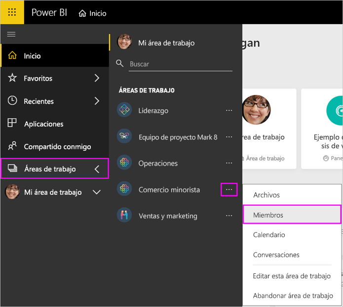

# Administración del área de trabajo en Power BI y Office 365

Como creador o administrador de un [área de trabajo de Power BI](service-create-distribute-apps.md) u Office 365, administrará algunos aspectos de ella en Power BI. Otros aspectos que administra en Office 365.

> [!NOTE]
> La versión preliminar de la nueva experiencia de áreas de trabajo cambiará la relación entre las áreas de trabajo de Power BI y los grupos de Office 365. Ya no creará automáticamente un grupo de Office 365 cada vez que cree una de las nuevas áreas de trabajo. Obtenga información sobre [la creación de las nuevas áreas de trabajo](service-create-the-new-workspaces.md).

En **Power BI** puede:

* Agregar o quitar miembros del área de trabajo y también convertir a un miembro del área de trabajo en administrador.
* Editar el nombre del área de trabajo.
* Eliminar el área de trabajo.

En **Office 365** puede:

* Agregar o quitar miembros de grupos del área de trabajo y también convertir a un miembro en propietario.
* Edite el nombre, imagen, descripción y otras opciones del grupo.
* Ver la dirección de correo electrónico del grupo.
* Eliminar el grupo.

Necesita una [licencia de Power BI Pro](service-features-license-type.md) para ser administrador o miembro de un área de trabajo. Los usuarios de la aplicación necesitan también una licencia de Power BI Pro, a menos que el área de trabajo se encuentre en una capacidad de Power BI Premium. Para más información, lea [What is Power BI Premium?](service-premium-what-is.md) (¿Qué es Power BI Premium?)

## Edición del área de trabajo en Power BI

1. En el servicio Power BI, seleccione la flecha situada junto a **Áreas de trabajo**, seleccione **Más opciones** (…) junto al nombre del área de trabajo y elija **Editar esta área de trabajo**.

   

   > [!NOTE]
   > Solo verá **Editar esta área de trabajo** si es administrador del área de trabajo.

1. Aquí puede cambiar el nombre del área de trabajo de la aplicación o eliminarla, y agregar o quitar miembros.

   

1. Seleccione **Guardar** o **Cancelar**.

## Edición de propiedades del área de trabajo de Power BI en Office 365

También puede editar aspectos de un área de trabajo directamente en Outlook para Office 365.

### Edición de los miembros del grupo del área de trabajo

1. En el servicio Power BI, seleccione la flecha situada junto a **Áreas de trabajo**, seleccione **Más opciones** (...) junto al nombre del área de trabajo y elija **Miembros**.

   

   Se abre la vista de grupo de Outlook para Office 365 del área de trabajo. Es posible que tenga que iniciar sesión en la cuenta de trabajo.

1. Seleccione el rol situado junto al nombre de un compañero de equipo para convertirlo en **Miembro** o **Propietario**. Seleccione la **X** para quitar a la persona del grupo.

   

### Adición de una imagen y establecimiento de otras propiedades del área de trabajo

Cuando se distribuye la aplicación desde el área de trabajo, la imagen que agrega aquí es la imagen de la aplicación. Consulte [Adición de una imagen al área de trabajo de Office 365](service-create-workspaces.md#add-an-image-to-your-office-365-workspace-optional) del artículo **Creación de las nuevas áreas de trabajo**.

1. En la vista de Outlook para Office 365 del área de trabajo, vaya a la pestaña **Acerca de** y seleccione **Editar**.

    
1. Puede editar el nombre, la descripción y el idioma de las notificaciones relacionadas con el grupo. Aquí también puede agregar una imagen y establecer otras propiedades.

   

1. Seleccione **Guardar** o **Descartar**.

## Pasos siguientes

* [Publicación de una aplicación en Power BI](service-create-distribute-apps.md)

* ¿Tiene más preguntas? [Pruebe la comunidad de Power BI](https://community.powerbi.com/)
