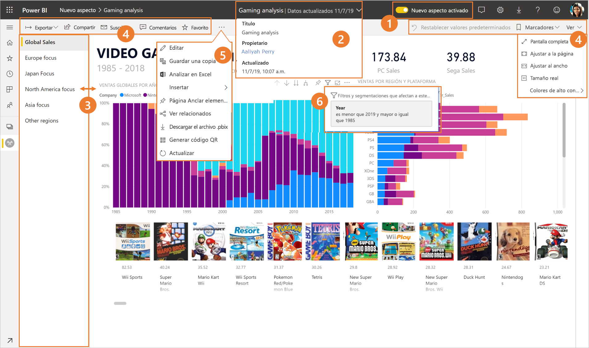
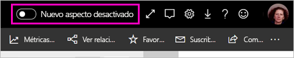
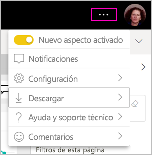
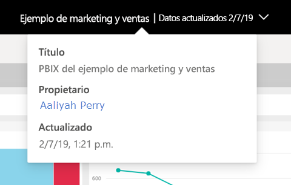
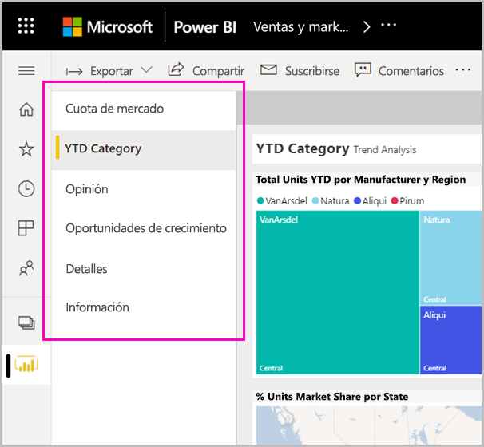
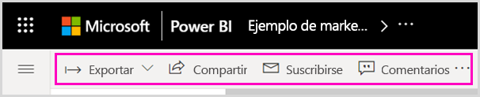
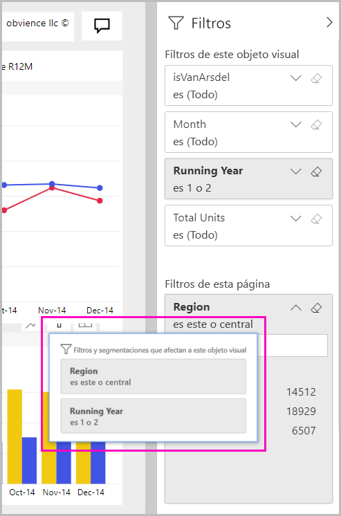

# Nuevo aspecto del servicio Power BI

El servicio Power BI (app.powerbi.com) tiene un nuevo aspecto que facilita la visualización de los informes y la interacción con ellos. El nuevo aspecto es más sencillo y se basa en su familiaridad con otros productos de Microsoft. En el servicio Power BI, hemos convertido el contenido del informe en el principal punto de atención al cambiar a un tema de color más claro y actualizar los iconos. Este es un resumen de lo que ha cambiado en el nuevo aspecto. Consulte las secciones numeradas para obtener más información:

¿Busca una acción específica? Vea [El nuevo aspecto: ¿Dónde están ahora las acciones?](service-new-look-where-actions.md)

## Paseo introductorio por los cambios

En esta animación se muestran en acción los cambios en el aspecto de los informes.

## 1. Participación en el nuevo aspecto

Cualquier usuario del servicio Power BI puede participar en el nuevo aspecto. Basta con cambiar el control deslizante de **Nuevo aspecto desactivado** a **Nuevo aspecto activado**.

Si tiene que volver a la vista anterior, solo tiene que cambiar el control deslizante de **Nuevo aspecto activado** a . Si no lo ve, seleccione el menú de puntos suspensivos en la esquina superior derecha.

## 2. Visualización de detalles del informe 

Vea rápidamente detalles tales como la fecha de última actualización y la información de contacto, directamente en el banner superior.  Abra el menú para ver otros detalles sobre el informe. Incluso puede enviar un correo electrónico al propietario del informe.

## 3. Lista vertical de páginas 
Los nombres de páginas del informe se encuentran ahora en una lista en un panel vertical. Son destacados, difíciles de pasar por alto y similares a la navegación en Word y PowerPoint. Puede aumentar o disminuir el resto del área de informe cambiando el tamaño del panel vertical.

## 4. Barra de acciones simplificada 

La barra de acciones mejorada de la parte superior incluye los comandos más relevantes, estratégicos para los consumidores de informes. Es más fácil exportar, suscribirse, colaborar con otras personas y profundizar a través de filtros y marcadores.

## 5. ¿Dónde están los comandos de informe?

No se ha quitado ninguna de las funciones del aspecto anterior. Puede ver los comandos adicionales, tales como editar, guardar una copia, etc., expandiendo los puntos suspensivos (menú ...) en la barra de acciones. Además, puede acceder a las métricas de uso desde la lista de contenido.

### ¿Dónde están las acciones del menú Archivo?

¿Busca las acciones del menú **Archivo**? Las acciones que estaban en el menú **Archivo** también están ahora en el menú **Más opciones** (...). 

## 6. Nueva experiencia de filtro

Las actualizaciones recientes, como la visualización de filtros aplicados y el panel de nuevos filtros, están disponibles de forma predeterminada con el nuevo aspecto. Aunque su diseñador de informes no haya actualizado a la experiencia de nuevos filtros, verá el panel nuevos filtros.

## Experiencia "nuevo aspecto" del panel 

Los paneles también tienen una barra de acciones simplificada, al igual que los informes y las aplicaciones, para que la experiencia sea coherente, a la vez que conservan las diferencias funcionales. Este es un tutorial de las acciones en un panel.
 

## Sin cambios en el modo de edición 

Hemos mantenido la experiencia de creación similar a la experiencia de Desktop. Los cambios del nuevo aspecto solo se aplican a la vista de lectura.

## Pasos siguientes

[Power BI para consumidores](consumer/end-user-consumer.md)
