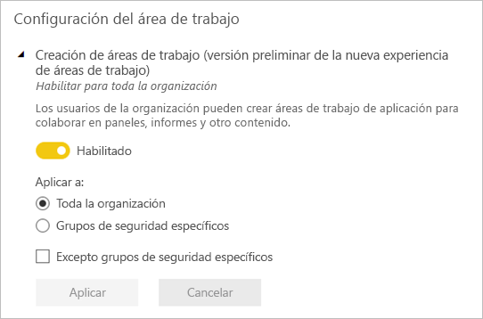
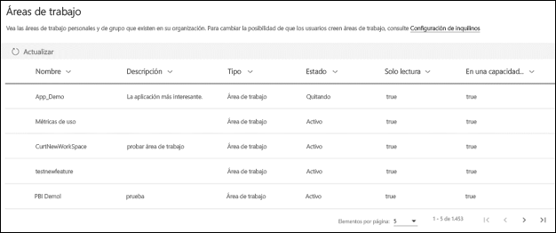

# Organizar el trabajo en las áreas de trabajo nuevo en Power BI

 *Las áreas de trabajo* son lugares para colaborar con compañeros para crear colecciones de paneles, informes e informes paginados. La nueva experiencia de área de trabajo le ayuda a administrar mejor el acceso al contenido. En este artículo se describe las nuevas áreas de trabajo, y cómo se diferencian de las áreas de trabajo clásicos.  Como con las áreas de trabajo clásicos, seguir usándolos para crear y distribuir aplicaciones. Obtenga información sobre cómo [crear una nueva experiencia de área de trabajo](service-create-the-new-workspaces.md).

La nueva experiencia de área de trabajo ha alcanzado la disponibilidad general (GA) y ahora es el área de trabajo predeterminada. Puede seguir crear y usar [las áreas de trabajo clásicos](service-create-workspaces.md) basado en grupos de Office 365. 

> [!NOTE]
> Para aplicar la seguridad de nivel de fila (RLS) para examinar el contenido de un área de trabajo de usuarios de Power BI Pro, seguir usando [las áreas de trabajo clásicos](service-create-workspaces.md). Seleccione el **miembros solo pueden ver contenido de Power BI** opción. También puede publicar una aplicación de Power BI a los usuarios o uso compartido para distribuir contenido. El rol de visor próximamente permitirá este escenario en el futuro en nuevas áreas de trabajo de experiencia de área de trabajo.

Con las nuevas áreas de trabajo, puede:

- Asignar roles de área de trabajo a grupos de usuarios: grupos de seguridad, listas de distribución, grupos de Office 365 y usuarios.
- Crear un área de trabajo en Power BI sin crear un grupo de Office 365.
- Usar roles de las áreas de trabajo más granulares para flexibilizar la administración de permisos en un área de trabajo.

Cuando crea una de las nuevas áreas de trabajo, no crea un grupo de Office 365 subyacente, asociado. Toda la administración del área de trabajo se realiza en Power BI, no en Office 365. En la nueva experiencia de área de trabajo, ahora puede agregar un grupo de Office 365 en la lista de acceso de área de trabajo para continuar con la administración del acceso de usuario al contenido a través de grupos de Office 365.

## Administrar áreas de trabajo de la experiencia de área de trabajo
Administración de áreas de trabajo de la experiencia de área de trabajo es ahora en Power BI, los administradores de Power BI decidir qué usuarios de una organización pueden crear áreas de trabajo. También puede administrar y recuperar el área de trabajo. Para ello que debe usar el portal de administración de Power BI o los CmdLets de PowerShell. Áreas de trabajo en función de los grupos de Office 365 clásico, administración persiste en el portal de administración de Office 365 y Azure Active Directory.

En **configuración de área de trabajo** en el portal de administración, los administradores pueden usar las áreas de trabajo crear (nueva experiencia de área de trabajo) que establecer para permitir todo el mundo o a nadie en una organización para crear nueva área de trabajo en áreas de experiencia. También pueden restringir la creación de estas áreas a miembros de grupos de seguridad específicos.

> [!NOTE]
> Las áreas de trabajo crear (nueva experiencia de área de trabajo) que establecer los valores predeterminados sólo para permitir que a los usuarios que pueden crear grupos de Office 365 para crear las nuevas áreas de trabajo en Power BI. Asegúrese de establecer un valor en el portal de administración de Power BI para asegurarse de que los usuarios adecuados pueden crear nueva área de experiencia de áreas de trabajo.

El [está disponible la lista de áreas de trabajo](service-admin-portal.md#workspaces) en el portal de administración de Power BI. 

## Nuevas áreas de trabajo en paralelo con las áreas de trabajo clásicos

Las áreas de trabajo nuevos, actualizados y áreas de trabajo clásicos existentes coexistan en paralelo y puede crear uno. La nueva experiencia de área de trabajo es el tipo de área de trabajo de forma predeterminada. Power BI sigue mostrando todos los grupos de Office 365 del usuario es miembro de en Power BI para evitar cambiar los flujos de trabajo existentes. Para obtener información sobre cómo crear una nueva área de trabajo, leer [crear nuevas áreas de trabajo](service-create-the-new-workspaces.md). Para obtener información sobre cómo crear un área de trabajo clásico, leer [crear las áreas de trabajo clásicos](service-create-workspaces.md).

## Roles en las nuevas áreas de trabajo

Para conceder acceso a un área de trabajo, agregar usuarios o grupos de usuarios a uno de los roles de área de trabajo: los miembros, los colaboradores o los administradores. Todos los miembros de un grupo de usuarios obtienen el rol que haya definido. Si es un individuo en varios grupos de usuarios, obtienen el máximo nivel de permiso proporcionado por los roles que están asignados.

Los roles le permiten administrar quién puede hacer qué en un área de trabajo, para que los equipos puedan colaborar. Las nuevas áreas de trabajo le permiten asignar roles a usuarios y grupos de usuarios: grupos de seguridad, grupos de Office 365 y listas de distribución. 

Al asignar roles a un grupo de usuarios, cada uno de ellos tiene acceso al contenido. Si anida grupos de usuarios, todos los usuarios contenidos tienen permiso. Un usuario que se encuentra en varios grupos de usuarios con distintos roles obtiene el nivel de permiso mayor concedido a ellos. 

Las nuevas áreas de trabajo ofrecen tres roles: administradores, miembros y colaboradores.

|Funcionalidad   | Administrador  | Miembro  | Colaborador  | 
|---|---|---|---|
| Actualizar y eliminar el área de trabajo.  | X  |   |   |
| Agregar o quitar usuarios, incluidos otros administradores.  | X  |   |   |
| Agregar miembros u otros usuarios con permisos inferiores.  |  X | X  |   |
| Publicar y actualizar una aplicación. |  X | X  |   |
| Compartir un elemento o compartir una aplicación. |  X | X  |   |
| Permitir que otros usuarios vuelvan a compartir elementos. |  X | X  |   |
| Crear, editar y eliminar contenido en el área de trabajo.  |  X | X  | X  |
| Publicar informes en el área de trabajo, eliminar contenido. |  X | X  | X  |
 
 
## Licencias
Todos los usuarios que agregue a un área de trabajo necesitan una licencia de Power BI Pro. En el área de trabajo, estos usuarios pueden colaborar en paneles e informes que planee publicar para un público más amplio, o incluso para toda la organización. Si quiere distribuir contenido a otros usuarios dentro de la organización, puede asignar licencias de Power BI Pro a los usuarios o colocar el área de trabajo en una capacidad de Power BI Premium.

> [!NOTE]
> Publicar informes en la nueva experiencia de área de trabajo tiene existente de cumplimiento más estricto licencias reglas. Los usuarios que intentan publicar desde Power BI Desktop u otros clientes herramientas sin una licencia Pro aparece el error "sólo los usuarios con licencias de Power BI Pro pueden publicar en esta área de trabajo".

## ¿En qué se diferencian las áreas de trabajo nuevas y las actuales?

Con las nuevas áreas de trabajo, algunas características se están rediseñando. Estos son los cambios que puede esperar a ser permanente. 

* Creación de estas áreas de trabajo no creará grupos de Office 365, como las áreas de trabajo clásico. Sin embargo, ahora puede usar un grupo de Office 365 para proporcionar a los usuarios acceso al área de trabajo mediante la asignación de un rol. 
* En las áreas de trabajo clásicos, puede agregar a sólo las personas a las listas de administración y los miembros. En las áreas de trabajo nuevas, puede agregar varios grupos de seguridad de AD, listas de distribución o grupos de Office 365 a estas listas para facilitar la administración de usuarios. 
- Puede crear un paquete de contenido organizativo de un área de trabajo clásico. pero no desde las áreas de trabajo nuevas.
- Puede consumir un paquete de contenido organizativo de un área de trabajo clásico. pero no desde las áreas de trabajo nuevas.

## Lista de contactos de área de trabajo
El nuevo **lista de contactos** característica le permite especificar qué usuarios reciben una notificación acerca de los problemas que se producen en el área de trabajo. De forma predeterminada, cualquier usuario o grupo especificado como un área de trabajo se notifica al administrador, pero se puede personalizar la lista. Los usuarios o grupos que aparecen en la lista de contactos se mostrará en la interfaz de usuario (UI) para ayudar a los usuarios obtención ayuda relacionada con el área de trabajo. 

Obtenga más información sobre la [establecer la lista de contactos de área de trabajo](service-create-the-new-workspaces.md#workspace-contact-list).

## OneDrive del área de trabajo
La característica de OneDrive del área de trabajo permite configurar un grupo de Office 365 está disponible para los usuarios del área de trabajo cuyo almacenamiento de archivo de biblioteca de documentos de SharePoint. El grupo debe crearse fuera de Power BI. 

Power BI no sincronizará los permisos de usuarios o grupos que están configurados para tener acceso de área de trabajo con la pertenencia al grupo de Office 365. Es el procedimiento recomendado administrar el acceso de área de trabajo a través del grupo de Office 365 mismo cuyo almacenamiento de archivo se configura en esta configuración. 

Obtenga información sobre cómo [establecer y obtener acceso a la instancia de OneDrive del área de trabajo](service-create-the-new-workspaces.md#workspace-onedrive).  
   
## La auditoría
Las siguientes actividades son auditadas por Power BI para nuevas áreas de trabajo de experiencia de área de trabajo.

| Nombre descriptivo |   Nombre de operación |
|---|---|
| Carpeta de Power BI creada | CreateFolder |
| Carpeta de Power BI eliminada | DeleteFolder |
| Carpeta de Power BI actualizada | UpdateFolder |
| Acceso a la carpeta de Power BI actualizado| UpdateFolderAccess |

Obtenga más información sobre [auditoría de Power BI](service-admin-auditing.md#activities-audited-by-power-bi).

## Limitaciones y consideraciones

Limitaciones que se deben tener en cuenta:

- Las áreas de trabajo pueden contener un máximo de 1000 conjuntos de datos o 1000 informes por cada conjunto de datos. 
- Una persona con una licencia de Power BI Pro puede ser un miembro de un 1000 áreas de trabajo máximo.
- No se admite Power BI publisher para Excel.

## Características del área de trabajo que funcionan otra forma

Algunas características funcionan de manera diferente en las áreas de trabajo actuales y en las áreas de trabajo nuevas. Estas diferencias son intencionadas, según los comentarios se ha enviado a los clientes y habilitar un enfoque más flexible para la colaboración con áreas de trabajo:

- Cumplimiento de licencias: Publicar informes en la nueva experiencia de área de trabajo aplica las reglas de las licencias existentes que requieren una licencia de Power BI Pro para los usuarios colaborar en áreas de trabajo o compartir contenido a otros usuarios en el servicio Power BI. Los usuarios sin una licencia Pro aparece el error "sólo los usuarios con licencias Powre BI Pro pueden publicar en esta área de trabajo".
- Posibilidad de que los miembros puedan volver a compartir o no: se ha reemplazado por el rol de Colaborador
- Áreas de trabajo de solo lectura: en lugar de conceder a los usuarios acceso de solo lectura a un área de trabajo, asigne los usuarios a un rol inminente Visor, que permite un acceso similar al de solo lectura al contenido de un área de trabajo.
- Ausencia del botón **Abandonar área de trabajo**.

## Preguntas más frecuentes

**Son vínculos a contenido existente afectadas por el área de trabajo nueva experimentan de GA**

No. Vínculos a los elementos existentes en las áreas de trabajo clásicos no se ven afectados por la nueva experiencia de área de trabajo. La disponibilidad general (GA) de la nueva experiencia de área de trabajo cambia el área de trabajo predeterminada se crea, pero no cambian las áreas de trabajo existentes. 

**Actualizado a la nueva experiencia de área de trabajo disponible con carácter general de las áreas de trabajo existentes**

No. La disponibilidad general nueva experiencia de área de trabajo solo cambia el tipo de área de trabajo predeterminado a la nueva experiencia de área de trabajo. Áreas de trabajo clásicos existentes que se basan en grupos de Office 365 permanecen sin cambios.

**Las áreas de trabajo todavía crean automáticamente para los grupos de Office 365**

Sí. Dado que se admiten ambos tipos de áreas de trabajo en paralelo, seguimos enumerar todos los grupos de Office 365 el usuario tiene acceso a en la lista de áreas de trabajo.

## Pasos siguientes
* [Crear las nuevas áreas de trabajo en Power BI](service-create-the-new-workspaces.md)
* [Crear las áreas de trabajo clásicos](service-create-workspaces.md)
* [Instalar y usar aplicaciones en Power BI](service-create-distribute-apps.md)
* ¿Tiene alguna pregunta? [Pruebe a preguntar a la comunidad de Power BI](http://community.powerbi.com/)
