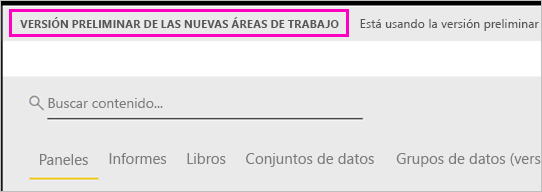

# Organizar el trabajo en las nuevas áreas de trabajo (versión preliminar) en Power BI

Las áreas de trabajo son lugares donde se colabora con compañeros para crear colecciones de paneles e informes. Después, estas colecciones se pueden agrupar en *aplicaciones*  y distribuirse por toda la organización o a grupos o usuarios específicos. Power BI presentará una nueva experiencia de áreas de trabajo como versión preliminar. 

Ahora, con la versión preliminar de las nuevas áreas de trabajo puede hacer lo siguiente:

- Asignar roles de área de trabajo a grupos de usuarios: grupos de seguridad, listas de distribución, grupos de Office 365 y usuarios.
- Crear un área de trabajo en Power BI sin crear un grupo de Office 365.
- Usar roles de las áreas de trabajo más granulares para flexibilizar la administración de permisos en un área de trabajo.

Obtenga información sobre cómo [crear una de las nuevas áreas de trabajo](service-create-the-new-workspaces.md).
 
Cuando crea una de las nuevas áreas de trabajo, no crea un grupo de Office 365 subyacente, asociado. Toda la administración del área de trabajo se realiza en Power BI, no en Office 365. Aún podrá agregar un grupo de Office 365 al área de trabajo para seguir administrando el acceso de usuarios al contenido a través de grupos de Office 365. Pero también puede usar grupos de seguridad, listas de distribución y agregar usuarios directamente en Power BI, lo que le ofrece una manera flexible de administrar el acceso al área de trabajo. Como la administración del área de trabajo está ahora en Power BI, los administradores de Power BI deciden qué usuarios de una organización pueden crear áreas de trabajo. En **Configuración del área de trabajo** en el portal de administración, los administradores pueden permitir que todo el mundo o nadie en una organización pueda crear áreas de trabajo. También pueden restringir la creación de estas áreas a miembros de grupos de seguridad específicos.

Obtenga más información sobre el [portal de administración de Power BI](service-admin-portal.md).

## Implementar nuevas áreas de trabajo

Durante este período de versión preliminar, las áreas de trabajo antiguas y nuevas pueden coexistir en paralelo y puede crear cualquiera de ellas. Cuando finalice la versión preliminar de las nuevas áreas de trabajo y estén disponibles con carácter general, las áreas de trabajo antiguas pueden seguir existiendo durante un tiempo. No podrá crearlas y deberá preparar la migración de las áreas de trabajo a la nueva infraestructura de áreas de trabajo. No se preocupe, tendrá varios meses para completar la migración.

## Roles en las nuevas áreas de trabajo

Agrega usuarios o grupos de usuarios a las nuevas áreas de trabajo como miembros, colaboradores o administradores. Todos los miembros de un grupo de usuarios obtienen el rol que haya definido. Si un usuario está en varios grupos de usuarios, obtiene el nivel de permiso mayor proporcionado por el rol.  Consulte [Roles en las nuevas áreas de trabajo](#roles-in-the-new-workspaces), más adelante en este artículo, para obtener una explicación de los distintos roles.

Todos los usuarios que agregue a un área de trabajo necesitan una licencia de Power BI Pro. En el área de trabajo, estos usuarios pueden colaborar en paneles e informes que planee publicar para un público más amplio, o incluso para toda la organización. Si quiere distribuir contenido a otros usuarios dentro de la organización, puede asignar licencias de Power BI Pro a los usuarios o colocar el área de trabajo en una capacidad de Power BI Premium.

Los roles le permiten administrar quién puede hacer qué en un área de trabajo, para que los equipos puedan colaborar. Las nuevas áreas de trabajo le permiten asignar roles a usuarios y grupos de usuarios: grupos de seguridad, grupos de Office 365 y listas de distribución. 

Al asignar roles a un grupo de usuarios, cada uno de ellos tiene acceso al contenido. Si anida grupos de usuarios, todos los usuarios contenidos tienen permiso. Un usuario que se encuentra en varios grupos de usuarios con distintos roles obtiene el nivel de permiso mayor concedido a ellos. 

Las nuevas áreas de trabajo ofrecen tres roles: administradores, miembros y colaboradores.

**Los administradores pueden:**

- Actualizar y eliminar el área de trabajo. 
- Agregar o quitar usuarios, incluidos otros administradores.
- Hacer lo mismo que los miembros.

**Los miembros pueden:** 

- Agregar miembros u otros usuarios con permisos inferiores.
- Publicar y actualizar una aplicación.
- Compartir un elemento o compartir una aplicación.
- Permitir que otros usuarios vuelvan a compartir elementos.
- Hacer lo mismo que los colaboradores.

**Los colaboradores pueden:** 

- Crear, editar y eliminar contenido en el área de trabajo. 
- Publicar informes en el área de trabajo, eliminar contenido.
- No pueden proporcionar acceso al contenido a nuevos usuarios. No pueden compartir contenido nuevo, pero pueden compartir con alguien con quien el área de trabajo, el elemento o la aplicación ya se ha compartido. 
- No pueden modificar a los miembros del grupo.
 
Se están creando flujos de trabajo de solicitud de acceso en todo el servicio para que los usuarios que no tienen acceso puedan solicitarlo. Los flujos de trabajo de solicitud de acceso existen actualmente para los paneles, informes y aplicaciones.

## Convertir las áreas de trabajo antiguas en nuevas áreas de trabajo

Durante el período de versión preliminar, no se pueden convertir automáticamente las áreas de trabajo antiguas en nuevas. Pero puede crear un área de trabajo nueva y publicar contenido en la nueva ubicación. 

Cuando las nuevas áreas de trabajo estén disponibles con carácter general, puede decidir migrar automáticamente las antiguas. Tendrá que migrarlas en algún momento después de que estén disponibles con carácter general.

## Preguntas más frecuentes sobre las aplicaciones de Power BI

### ¿En qué se diferencian las áreas de trabajo nuevas y las actuales?

Con las nuevas áreas de trabajo, algunas características se están rediseñando. Estos son algunos de los cambios que puede esperar que sean definitivos junto con la versión preliminar. 

* Al crear áreas de trabajo, no se crearán las entidades correspondientes en Office 365, como ocurre en las áreas de trabajo actuales. (Pero puede agregar un grupo de Office 365 al área de trabajo si le asigna un rol). 
* En las áreas de trabajo actuales solo puede agregar usuarios individuales a las listas de miembros y administradores. En las áreas de trabajo nuevas, puede agregar varios grupos de seguridad de AD, listas de distribución o grupos de Office 365 a estas listas para facilitar la administración de usuarios. 
- Puede crear un paquete de contenido de la organización desde un área de trabajo actual, pero no desde las áreas de trabajo nuevas.
- Puede usar un paquete de contenido de la organización desde un área de trabajo actual, pero no desde las áreas de trabajo nuevas.
- Durante la versión preliminar, algunas características todavía no están habilitadas para las nuevas áreas de trabajo. Para más información, vea la sección siguiente, [Características previstas de las nuevas áreas de trabajo](service-new-workspaces.md#planned-new-workspace-preview-features).

## Características previstas de las nuevas áreas de trabajo

Hasta que se publique la versión preliminar, seguimos desarrollando algunas características de versión preliminar de las áreas de trabajo nuevas, pero aún no están disponibles:

- Ausencia del botón **Abandonar área de trabajo**.
- Aún no se admiten las métricas de uso.
- Cómo funciona Premium: puede asignar y crear áreas de trabajo en una capacidad Premium, pero para mover un área de trabajo entre capacidades, vaya a la configuración del área de trabajo.
- Aún no se admite la inserción de elementos web de SharePoint.
- Ausencia del botón **OneDrive** para grupos de Office 365 en Get Data > Files (Obtener datos > Archivos).

## Características del área de trabajo que funcionan otra forma

Algunas características funcionan de manera diferente en las áreas de trabajo actuales y en las áreas de trabajo nuevas. Estas diferencias son intencionadas, con base en los comentarios recibidos de los clientes, y permitirán un enfoque más flexible para la colaboración con las áreas de trabajo:

- Posibilidad de que los miembros puedan volver a compartir o no: se ha reemplazado por el rol de Colaborador
- Áreas de trabajo de solo lectura: en lugar de conceder a los usuarios acceso de solo lectura a un área de trabajo, asigne los usuarios a un rol inminente Visor, que permite un acceso similar al de solo lectura al contenido de un área de trabajo.

## Problemas conocidos

Dado que esta es una característica de versión preliminar, hay algunas limitaciones que debe tener en cuenta. Se tiene conocimiento de los siguientes problemas y se están desarrollando sus correcciones:

- Es posible que los usuarios o grupos de usuarios con acceso gratuito que se agregan como destinatarios de las suscripciones a los correos electrónicos no reciban los correos electrónicos, aunque deberían. El problema se produce cuando una de las nuevas áreas de trabajo está en una capacidad Premium, pero el área de trabajo del usuario que crea la suscripción no se encuentra en una capacidad Premium. Si Mi área de trabajo está en una capacidad Premium, entonces los usuarios y grupos de usuarios con acceso gratuito recibirán los correos electrónicos.
- Después de mover un área de trabajo de una capacidad Premium a una capacidad compartida, en algunos casos, los usuarios y grupos de usuarios con acceso gratuito siguen recibiendo correos electrónicos, aunque no deberían. El problema se produce cuando Mi área de trabajo del usuario que crea la suscripción se encuentra en una capacidad Premium.

## Pasos siguientes
* [Crear nuevas áreas de trabajo (versión preliminar) en Power BI](service-create-the-new-workspaces.md)
* [Crear las áreas de trabajo actuales](service-create-workspaces.md)
* [Instalar y usar aplicaciones en Power BI](service-create-distribute-apps.md)
* ¿Tiene alguna pregunta? [Pruebe a preguntar a la comunidad de Power BI](http://community.powerbi.com/)
