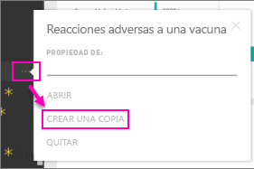

# Paquetes de contenido organizativo: Copia, actualización y acceso

Cuando se publica un paquete de contenido organizativo, todos los destinatarios ven el mismo panel, así como los mismos informes, libros de Excel, conjuntos de datos y datos (a menos que sea un origen de datos de SQL Server Analysis Services, también denominado SSAS).  [Solo el creador del paquete de contenido lo puede volver a editar y publicar](service-organizational-content-pack-manage-update-delete.md).  Sin embargo, todos los destinatarios pueden guardar una copia del paquete de contenido, que puede coexistir con el original.

Es distinto crear paquetes de contenido que compartir paneles o colaborar en ellos en un grupo. Lea [¿Cómo debo compartir paneles, informes e iconos?](service-how-to-collaborate-distribute-dashboards-reports.md) para decidir cuál es la mejor opción en su caso.

> [!NOTE]
> No se pueden crear ni instalar paquetes de contenido de la organización en la versión preliminar de las nuevas experiencias de áreas de trabajo. Ahora es un buen momento para actualizar los paquetes de contenido a aplicaciones, si todavía no ha empezado. Obtenga [más información sobre la nueva experiencia de áreas de trabajo](service-create-the-new-workspaces.md).
>

## Crear una copia de un paquete de contenido organizativo
Puede crear su propia copia del paquete de contenido, que no será visible para el resto de usuarios.

1. Seleccione los puntos suspensivos (...) junto al panel del paquete de contenido > Crear una copia.

    
2. Seleccione **Guardar**.  

Ahora ya tiene una copia que puede modificar. Nadie verá los cambios que realice.

> [!NOTE]
> Anteriormente, cada vez que instalaba un paquete de contenido o creaba una copia, aparecía un conjunto de datos nuevo en la lista de contenido del área de trabajo. Gracias a una actualización reciente, se ha simplificado la experiencia para mostrar un solo elemento con el nuevo icono del conjunto de datos al que se hace referencia:
>
> 
>

## Ayuda  Ya no puedo acceder al paquete de contenido
Esto puede ocurrir por varios motivos:

* **Cambios de pertenencia**:  los paquetes de contenido se publican en grupos de distribución de correo electrónico, grupos de seguridad y [grupos de Power BI basados en Office 365](https://support.office.com/article/Create-a-group-in-Office-365-7124dc4c-1de9-40d4-b096-e8add19209e9).  Si se le elimina de ese grupo, ya no tendrá acceso al paquete de contenido.
* **Cambios de distribución:** el creador del paquete de contenido cambia la distribución. Por ejemplo, si el paquete de contenido se publicó originalmente en toda la organización, pero el creador lo volvió a publicar para un público más reducido, es posible que ya no esté incluido.
* **Cambios de configuración de seguridad:** si el panel y los informes se conectan a orígenes de datos SSAS locales y se realizan cambios en la configuración de seguridad, es posible que se hayan revocado los permisos para ese servidor.

## ¿Cómo se actualizan los paquetes de contenido organizativos?
Cuando se crea el paquete de contenido, se hereda la configuración de actualización con el conjunto de datos.  Cuando crea una copia del paquete de contenido, la nueva versión conserva el vínculo al conjunto de datos original, así como su programación de actualización.

Consulte [Administración, actualización y eliminación de paquetes de contenido organizativos](service-organizational-content-pack-manage-update-delete.md).

## Pasos siguientes
* [Introducción a los paquetes de contenido organizativos](service-organizational-content-pack-introduction.md)
* [Creación de un grupo en Power BI](service-create-distribute-apps.md)
* ¿Tiene más preguntas? [Pruebe la comunidad de Power BI](http://community.powerbi.com/)
