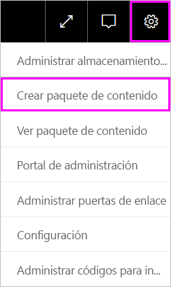
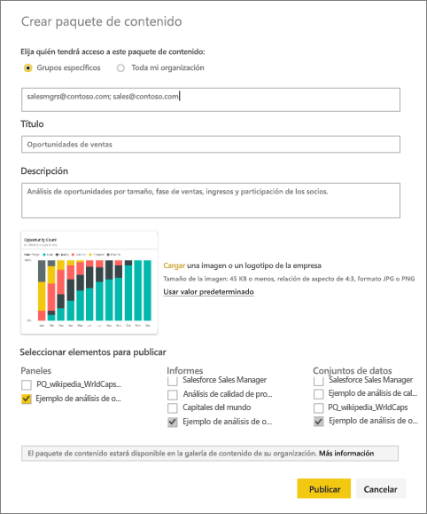
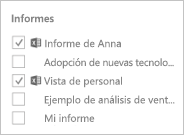
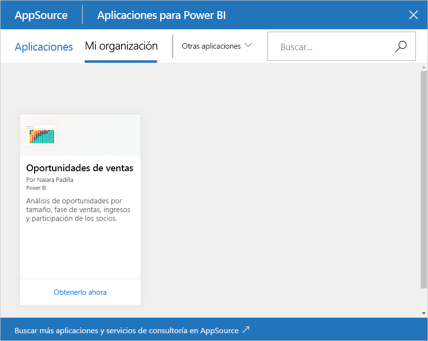

# Tutorial: Creación y publicación de un paquete de contenido organizativo de Power BI

En este tutorial, se crea un paquete de contenido organizativo, se concede acceso a un grupo específico y se publica en la biblioteca de paquetes de contenido de la organización en Power BI.

Es distinto crear paquetes de contenido que compartir paneles o colaborar en ellos en un grupo. Lea [Formas de compartir el trabajo en Power BI](service-how-to-collaborate-distribute-dashboards-reports.md) para decidir cuál es la mejor opción para su situación.

Crear un paquete de contenido de organización requiere una [cuenta de Power BI Pro](https://powerbi.microsoft.com/pricing) para usted y sus compañeros de trabajo.

> [!NOTE]
> No se pueden crear ni instalar paquetes de contenido de la organización en las nuevas experiencias de áreas de trabajo. Si todavía no ha empezado, ahora es un buen momento para actualizar los paquetes de contenido a aplicaciones. Obtenga [más información sobre la nueva experiencia de áreas de trabajo](service-create-the-new-workspaces.md).

## Creación y publicación de un paquete de contenido

Imagine que es el jefe de lanzamiento de Contoso y que se está preparando para el lanzamiento de un producto nuevo.  Ha creado un panel con informes que le gustaría compartir. Pueden resultar útiles para otros empleados que administran el lanzamiento. Quiere disponer de una forma para empaquetar el panel y los informes de forma que puedan usarlo sus compañeros.

¿Desea seguir adelante? En el [servicio Power BI](https://powerbi.com), vaya a **Mi área de trabajo**. Después, vaya a **Obtener datos** > **Ejemplos** > **Ejemplo de análisis de oportunidades** > **Conectar** para obtener una copia propia.

1. En el panel de navegación de la izquierda, seleccione **Áreas de trabajo** > **Mis áreas de trabajo**.

1. En la barra de navegación superior, seleccione el icono de engranaje  > **Crear paquete de contenido**.

   

1. En la ventana **Crear paquete de contenido**, escriba la información siguiente.  

   Tenga en cuenta que es posible que la biblioteca de paquetes de contenido de la organización se llene rápidamente. La biblioteca podría terminar con cientos de paquetes de contenido publicados para la organización o para grupos. Tómese tiempo para asignar un nombre descriptivo al paquete de contenido, agregar una buena descripción y seleccionar el público adecuado.  Use palabras que permitan que el paquete de contenido se pueda buscar fácilmente. Hará que resulte más fácil encontrarlo en el futuro.

      

    1. Seleccione **Grupos específicos**.

    1. Escriba las direcciones de correo electrónico completas de los usuarios, [grupos de Office 365](https://support.office.com/article/Create-a-group-in-Office-365-7124dc4c-1de9-40d4-b096-e8add19209e9), grupos de distribución o grupos de seguridad. Por ejemplo: salesmgrs@contoso.com; sales@contoso.com

        Para este tutorial, pruebe con la dirección de correo electrónico de su grupo.

    1. Llame al paquete de contenido *Oportunidades de ventas*.

        > [!TIP]
        > Considere incluir el nombre del panel en el nombre del paquete de contenido. De este modo, sus compañeros pueden encontrar más fácilmente el panel después de conectarse al paquete de contenido.

    1. Recomendado: agregue una descripción. Ayuda a los compañeros de trabajo a encontrar más fácilmente los paquetes de contenido que necesitan. Además de una descripción, agregue palabras clave que sus compañeros de trabajo puedan usar para buscar este paquete de contenido. Incluya información de contacto en caso de que sus compañeros de trabajo tengan una pregunta o necesiten ayuda.

    1. Cargue una imagen o un logotipo para facilitar a los miembros del grupo la búsqueda del paquete de contenido.

        Es más rápido buscar una imagen que buscar texto. En la captura de pantalla se muestra una imagen del icono del gráfico de columnas **Total de oportunidades**.

    1. Seleccione el panel **Ejemplo de análisis de oportunidades** para agregarlo al paquete de contenido.

        Power BI agrega automáticamente el informe y el conjunto de datos asociados. Si quiere, puede agregar otros.

       > [!NOTE]
       > Power BI solo muestra los paneles, informes, conjuntos de datos y libros que puede editar. Por tanto, la aplicación no muestra nada que se haya compartido con usted.

   1. Si tiene libros de Excel, los verá en **Informes**, con un icono de Excel. También puede agregarlos al paquete de contenido.

      

      > [!NOTE]
      > Si los miembros del grupo no pueden ver el libro de Excel, es posible que deba [compartirlo con ellos en OneDrive para la Empresa](https://support.office.com/article/Share-documents-or-folders-in-Office-365-1fe37332-0f9a-4719-970e-d2578da4941c).

1. Seleccione **Publicar** para agregar el paquete de contenido a la biblioteca de paquetes de contenido organizativos del grupo.  

   Verá un mensaje de operación correcta cuando se publique correctamente.

1. Cuando los miembros del grupo vayan a **Obtener datos** > **Paquetes de contenido de organización**, verán el paquete de contenido.

   

   > [!TIP]
   > La dirección URL que se muestra en el explorador es una dirección única para este paquete de contenido.  ¿Quiere comunicar a sus compañeros de trabajo este nuevo paquete de contenido?  Pegue la dirección URL en un correo electrónico.

1. Cuando los miembros del grupo seleccionan **Conectar**, pueden [ver el paquete de contenido y trabajar con él](service-organizational-content-pack-copy-refresh-access.md).

## Pasos siguientes

* [Paquetes de contenido organizativos en Power BI: introducción](service-organizational-content-pack-introduction.md).

* [Administración, actualización y eliminación de paquetes de contenido organizativos](service-organizational-content-pack-manage-update-delete.md).

* [Publicación de una aplicación en Power BI](service-create-distribute-apps.md).

* [¿Qué es OneDrive para la Empresa?](https://support.office.com/article/What-is-OneDrive-for-Business-187f90af-056f-47c0-9656-cc0ddca7fdc2)

* ¿Tiene más preguntas? [Pruebe la comunidad de Power BI](http://community.powerbi.com/)
