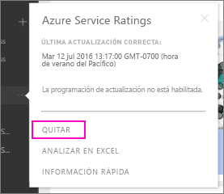

# Eliminación de la conexión a un paquete de contenido organizativo de Power BI

> [!NOTE]
> No se pueden crear paquetes de contenido de la organización ni instalarlos en las nuevas experiencias de áreas de trabajo. Ahora es un buen momento para actualizar los paquetes de contenido a aplicaciones, si todavía no ha empezado. Obtenga [más información sobre la nueva experiencia de áreas de trabajo](service-create-the-new-workspaces.md).
> 

Un compañero de trabajo creó un paquete de contenido. Lo ha detectado en AppSource y lo ha agregado al área de trabajo de Power BI. Ahora, ya no lo necesita.  ¿Cómo lo quita?

Para quitar un paquete de contenido, debe quitar su conjunto de datos.  

* En el panel de navegación, seleccione los puntos suspensivos situados a la derecha del conjunto de datos y haga clic en **Quitar \> Sí**.  
  
  

Al quitar el conjunto de datos se quitan todos los informes asociados y los paneles. Sin embargo, al quitar la conexión al paquete de contenido no se elimina el paquete de contenido de la instancia de AppSource de la organización.  Siempre puede volver a AppSource y volver a agregar el paquete de contenido al área de trabajo. Solo pueden [eliminar paquetes de contenido de AppSource](service-organizational-content-pack-manage-update-delete.md) sus creadores.

## Pasos siguientes
* [Introducción a los paquetes de contenido organizativos](service-organizational-content-pack-introduction.md) 
* [Creación y distribución de una aplicación en Power BI](service-create-distribute-apps.md) 
* [Conceptos básicos para los diseñadores en el servicio Power BI](service-basic-concepts.md)  
* ¿Tiene más preguntas? [Pruebe la comunidad de Power BI](https://community.powerbi.com/)

