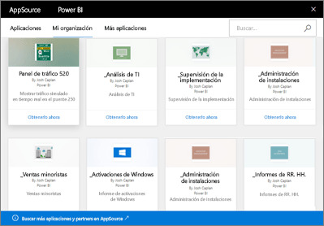

# Paquetes de contenido organizativos en Power BI: introducción
> [!NOTE]
> No se pueden crear paquetes de contenido de la organización ni instalarlos en la versión preliminar de las nuevas experiencias de áreas de trabajo. Ahora es un buen momento para actualizar los paquetes de contenido a aplicaciones, si todavía no ha empezado. Obtenga [más información sobre la nueva experiencia de áreas de trabajo](service-create-the-new-workspaces.md).
> 

¿Distribuye informes periódicamente por correo electrónico a su equipo? En su lugar, pruebe lo siguiente: empaquete los paneles, informes, libros de Excel y conjuntos de datos, y publíquelos en el equipo como *paquete de contenido organizativo*. Su equipo encontrará con facilidad los paquetes de contenido que cree, ya que todos ellos están en AppSource. Dado que son parte de Power BI, aprovechan todas las características de Power BI, como la exploración interactiva de datos, los nuevos objetos visuales, las preguntas y respuestas, la integración con otros orígenes de datos, la actualización de datos y mucho más.

No es lo mismo crear paquetes de contenido que compartir paneles o colaborar en ellos en un área de trabajo de aplicaciones. Lea [¿Cómo debo compartir paneles, informes e iconos?](service-how-to-collaborate-distribute-dashboards-reports.md) para decidir cuál es la mejor opción en su caso. 

En AppSource, puede explorar o buscar paquetes de contenido publicados en toda la organización o en los grupos de distribución o de seguridad, y en los [grupos de Office 365 a los que pertenece](https://support.office.com/article/Create-a-group-in-Office-365-7124dc4c-1de9-40d4-b096-e8add19209e9). Si no es miembro de un grupo específico, no verá los paquetes de contenido compartidos con ese grupo. Todos los miembros del grupo tienen el mismo permiso de solo lectura para tener acceso a los datos del paquete de contenido, los informes y los paneles (a menos que sea un origen de datos de SQL Server Analysis Services, también denominado SSAS, en cuyo caso los privilegios se heredan con el origen de datos).

Los paneles, informes y libros de Excel son de solo lectura, aunque puede copiar y usar los paneles e informes como punto de partida para crear su propia versión personalizada del paquete de contenido.

> [!NOTE]
> Los paquetes de contenido organizativos solo están disponibles si usted y sus compañeros tienen [licencias de Power BI Pro](service-features-license-type.md).
> 
> 

## ¿Qué es *AppSource*?
Al publicar un paquete de contenido de la organización, se agrega a AppSource.  Este repositorio centralizado facilita a los miembros que exploren y descubran paneles, informes y conjuntos de datos publicados para ellos.  

* Para ver AppSource, seleccione **Obtener datos** > **Mi organización** > **Obtener**.

## El ciclo de vida de un paquete de contenido organizativo
Cualquier usuario de Power BI Pro puede crear, publicar y acceder a los paquetes de contenido organizativos. Solo el creador del paquete de contenido puede modificar el libro y el conjunto de datos, programar la actualización y eliminarlo.

El ciclo de vida tiene un aspecto similar al siguiente:

1. En Power BI Pro, Nate crea un paquete de contenido y lo publica en el grupo de distribución Marketing. La configuración de actualización se hereda con el conjunto de datos y solo Nate puede cambiarla.
   
   > [!NOTE]
   > Si crea el paquete de contenido desde un [área de trabajo de aplicaciones de Power BI](service-create-distribute-apps.md) al que pertenece, aunque salga de dicho área de trabajo, el resto de usuarios del mismo pueden asumir su propiedad.
   > 
   > 
2. Nate envía un correo electrónico al grupo de distribución, informándoles acerca del nuevo paquete de contenido.
3. En Power BI Pro, Jane, miembro del grupo Marketing, busca este paquete de contenido en AppSource y se conecta a él. Ahora tiene una copia de solo lectura.  Ella sabe que es de solo lectura porque en el panel de navegación izquierdo aparece un icono de uso compartido a la izquierda del nombre del panel y el nombre del informe. Y cuando se selecciona el panel, un icono de candado avisa a Julia de que está viendo un panel de paquete de contenido. 
4. Supongamos que decide personalizarlo. Ahora tiene su propia copia de los paneles e informes. Su trabajo no afecta al origen, al paquete de contenido original o a otros miembros del grupo de distribución. Ahora trabaja en su propia copia de los paneles e informes.
5. Nuria realiza las actualizaciones en el panel y, cuando está listo, publica una nueva versión del paquete de contenido.
   
   * Julio, otro miembro del grupo de distribución, no personalizó el paquete de contenido original. Los cambios nuevos se aplican automáticamente a su versión del paquete de contenido.  
   * Jane personalizó el paquete de contenido. Recibe una notificación de que hay una nueva versión.  Puede ir a AppSource y obtener el paquete de contenido actualizado sin perder su versión personalizada. Ahora tendrá dos versiones: su versión personalizada y el paquete de contenido actualizado.
6. Imaginemos que Nate cambia la configuración de seguridad. Julio y Jane ya no tienen acceso al contenido. Digamos que se les ha eliminado del grupo de distribución Marketing.
   
   * Julio no personalizó el paquete de contenido original, por lo que el contenido se quita automáticamente. 
   * Jane personalizó el paquete de contenido. La próxima vez que abra el panel, todos los icono del paquete de contenido original habrán desaparecido, pero aún aparecerán los iconos que ancló desde otros informes (que todavía tiene permiso para usar). Los informes y el conjunto de datos asociados ya no están disponibles (y no aparecen en su panel de navegación izquierdo).
7. O bien, Nate elimina el paquete de contenido.
   
   * Julio no personalizó el paquete de contenido original, por lo que el contenido se quita automáticamente. 
   * Jane personalizó el paquete de contenido. La próxima vez que abra el panel, todos los icono del paquete de contenido original habrán desaparecido, pero aún aparecerán los iconos que ancló desde otros informes. Los informes y el conjunto de datos asociados ya no están disponibles (y no aparecen en su panel de navegación izquierdo).

## Seguridad de los datos
Todos los miembros del grupo de distribución tienen los mismos permisos con respecto a los datos que el creador del paquete de contenido. La única excepción son los conjuntos de datos tabulares de instancias locales de SQL Server Analysis Services (SSAS). Dado que los informes y paneles se conectan de forma dinámica al modelo SSAS local, se usan las credenciales de cada miembro individual del grupo de distribución para determinar a qué datos puede acceder.

## Pasos siguientes
* [Creación y publicación de un paquete de contenido organizativo](service-organizational-content-pack-create-and-publish.md)
* [Creación y distribución de una aplicación en Power BI](service-create-distribute-apps.md) 
* [Power BI: Conceptos básicos](consumer/end-user-basic-concepts.md)
* ¿Tiene más preguntas? [Pruebe la comunidad de Power BI](http://community.powerbi.com/)

