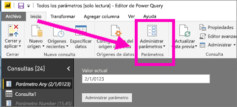
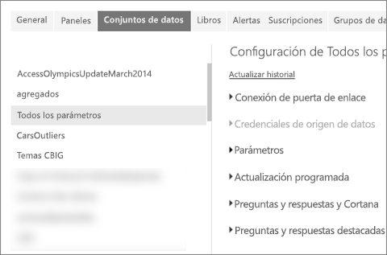
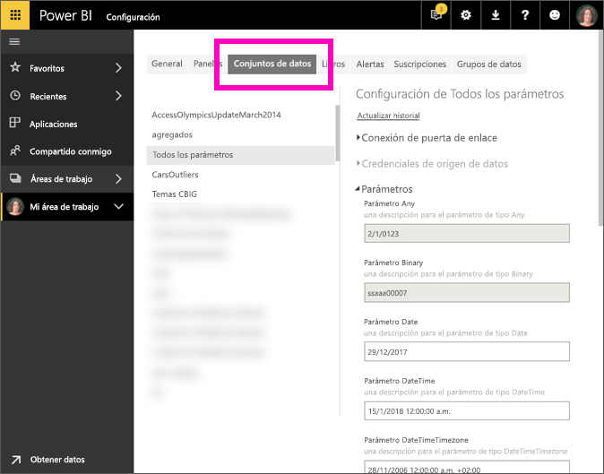

# Edición de la configuración de los parámetros en el servicio Power BI
Los creadores de informes agregan parámetros de consulta a los informes en Power BI Desktop. Estos parámetros les permiten establecer elementos de los informes como dependientes de uno o varios *valores* de parámetro. Por ejemplo, un creador de informes puede crear un parámetro que restrinja los datos a una única región o país, o bien un parámetro que defina qué formatos son aceptables en campos como los relativos a fechas, hora y texto.

## Revisión y edición de parámetros en el servicio Power BI

Como creador del informe, define los parámetros en Desktop. Al [publicar ese informe en el servicio Power BI](desktop-upload-desktop-files.md), la configuración de los parámetros y las selecciones se transfieren con él. Puede revisar y editar algunos valores de configuración de los parámetros en el servicio Power BI (no los parámetros que restringen los datos disponibles, pero sí aquellos que definen y describen los valores aceptables).

1. En el servicio Power BI, seleccione el icono de engranaje  y elija **Configuración**.

2. Seleccione la pestaña **Conjuntos de datos** y resalte un conjunto de datos de la lista. 
    
    

3. Expanda **Parámetros**.  Si el conjunto de datos seleccionado no tiene parámetros, verá un mensaje con un vínculo que lleva a más información sobre los parámetros de consulta. Pero si el conjunto de datos sí tiene parámetros, podrá verlos expandiendo el encabezado **Parámetros**. 

    

    Revise la configuración de los parámetros y realice los cambios que considere necesarios. Los campos atenuados no se pueden editar. 

## Pasos siguientes
Una manera directa de agregar parámetros simples es [modificar la dirección URL](service-url-filters.md).