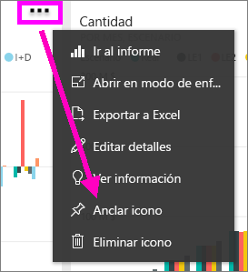
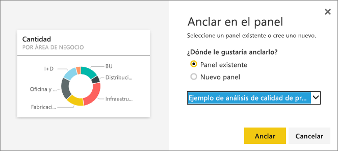

# Anclar un icono desde un panel a otro panel
Una forma de agregar un nuevo [icono del panel](consumer/end-user-tiles.md) es copiándolo desde otro panel. Cada uno de estos iconos, al hacer clic, es un vínculo que lleva a donde se creó, ya sea en Preguntas y respuestas o un informe. 

> [!NOTE]
> No puede anclar iconos desde paneles compartidos.

## Anclar un icono a otro panel
1. [Obtenga los datos](service-get-data.md). En este artículo se usa el [ejemplo de análisis de gastos de TI](sample-it-spend.md).
2. Abra un [panel](consumer/end-user-dashboards.md).
3. Mueva el puntero sobre el icono que quiere anclar, seleccione **Más opciones** (...) y, después, el **icono de anclaje**.  
   
   
4. Ancle el icono a un panel existente o a un nuevo panel. 
   
   * **Panel existente**: seleccione el nombre del panel en la lista desplegable.
   * **Nuevo panel**: escriba el nombre del nuevo panel.
   
   
5. Seleccione **Anclar**.
   Un mensaje de confirmación (cerca de la esquina superior derecha) le permitirá saber que se ha agregado la visualización al panel seleccionado como un icono.
   
   
6. Seleccione **Ir al panel** para ver el nuevo icono anclado. Allí puede [cambiar el nombre, cambiar el tamaño, vincular y mover](service-dashboard-edit-tile.md) la visualización anclada.

## Pasos siguientes
[Iconos en Power BI](consumer/end-user-tiles.md)  
[Paneles en Power BI](consumer/end-user-dashboards.md)  
¿Tiene más preguntas? [Pruebe la comunidad de Power BI](https://community.powerbi.com/)

