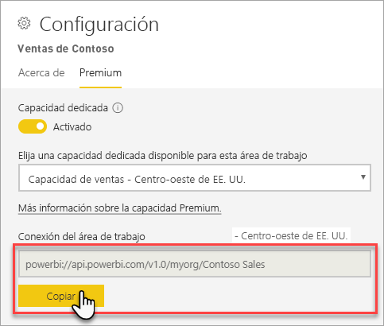
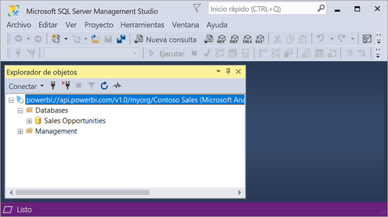

# Conectarse a conjuntos de datos con las aplicaciones cliente y herramientas (versión preliminar)

Power BI las áreas de trabajo y los conjuntos de datos de soporte técnico Premium *de sólo lectura* conexiones desde Microsoft y herramientas y aplicaciones cliente de terceros. 

> [!NOTE]
> En este artículo está pensado solo para presentar una conectividad de solo lectura a las áreas de trabajo de Power BI Premium y conjuntos de datos. Lo *no* diseñado para proporcionar información detallada sobre la programación, herramientas específicas y las aplicaciones, arquitectura y administración del área de trabajo y el conjunto de datos. Los temas que se describen aquí requieren un conocimiento sólido de administración y la arquitectura de base de datos de modelo tabular de Analysis Services.

## Protocolo

Power BI Premium usa el [XML for Analysis](https://docs.microsoft.com/bi-reference/xmla/xml-for-analysis-xmla-reference) protocolo (XMLA) para las comunicaciones entre las aplicaciones cliente y el motor que administra sus áreas de trabajo y los conjuntos de datos. Estas comunicaciones se realizan a través de lo que normalmente aparecen como puntos de conexión XMLA. XMLA es el mismo protocolo de comunicación utilizado por el motor de Analysis Services de Microsoft, que internamente, se ejecuta Power BI semántica modelado, gobierno, ciclo de vida y administración de datos. 

La mayoría de las aplicaciones cliente y las herramientas no explícitamente comunicarse con el motor mediante el uso de los puntos de conexión XMLA. En su lugar, usan las bibliotecas de cliente como MSOLAP, ADOMD y AMO como intermediario entre la aplicación cliente y el motor, que se comunica exclusivamente mediante XMLA.

## Herramientas compatibles

Estas herramientas admiten el acceso de solo lectura a las áreas de trabajo de Power BI Premium y conjuntos de datos:

**SQL Server Management Studio (SSMS)** -TraceEvent, MDX, XMLA y DAX admite las consultas. Requiere la versión 18,0. Descargar [aquí](https://docs.microsoft.com/sql/ssms/download-sql-server-management-studio-ssms). 

**SQL Server Profiler** -incluido con SSMS 18.0 (versión preliminar), esta herramienta proporciona seguimiento y depuración de eventos de servidor. Puede capturar y guardar datos acerca de cada evento a un archivo o tabla para analizarlos posteriormente. Aunque oficialmente en desuso para SQL Server Profiler continúa para incluirse en SSMS y sigue siendo compatible para Analysis Services y ahora, Power BI Premium. Para obtener más información, consulte [SQL Server Profiler](https://docs.microsoft.com/sql/tools/sql-server-profiler/sql-server-profiler).

**DAX Studio** : abierto, herramienta de la Comunidad para ejecutar y analizar DAX consultas en Analysis Services. Requiere la versión 2.8.2 o versiones posteriores. Para obtener más información, consulte [daxstudio.org](https://daxstudio.org/).

**Tablas dinámicas de Excel** -se requiere la versión de hacer clic para ejecutar de Office 16.0.11326.10000 o superior.

**Terceros** : incluyen aplicaciones de visualización de datos de cliente y herramientas que pueden conectarse a, la consulta y consumir conjuntos de datos en Power BI Premium. Mayoría de las herramientas requiere las versiones más recientes de las bibliotecas de cliente MSOLAP, pero algunas pueden utilizar ADOMD.

## Bibliotecas de cliente

Bibliotecas de cliente son necesarias para las aplicaciones cliente y herramientas para conectarse a las áreas de trabajo de Power BI Premium. También se admiten las mismas bibliotecas de cliente usadas para conectarse a Analysis Services en Power BI Premium. Las aplicaciones cliente de Microsoft, como Excel, SQL Server Management Studio (SSMS) y SQL Server Data Tools (SSDT) instalan las bibliotecas de cliente de tres y actualizan junto con las actualizaciones de aplicación normal. En algunos casos, especialmente con aplicaciones de terceros y herramientas, es posible que deba instalar versiones más recientes de las bibliotecas de cliente. Bibliotecas de cliente se actualizan mensualmente. Para obtener más información, consulte [bibliotecas de cliente para conectarse a Analysis Services](https://docs.microsoft.com/azure/analysis-services/analysis-services-data-providers).

## Conectarse a un área de trabajo Premium

Puede conectarse a las áreas de trabajo asignados a las capacidades Premium dedicada. Las áreas de trabajo asignados a una capacidad dedicada tienen una cadena de conexión en el formato de dirección URL. 

Para obtener la cadena de conexión de área de trabajo en Power BI, en **configuración de área de trabajo**, en el **Premium** ficha **conexión de área de trabajo**, haga clic en **copiar**.

Las conexiones de área de trabajo usan el formato de dirección URL siguiente para corregir un área de trabajo como si fuese un nombre de servidor de Analysis Services:   
`powerbi://api.powerbi.com/v1.0/[tenant name]/[workspace name]` 

Por ejemplo, `powerbi://api.powerbi.com/v1.0/contoso.com/Sales Workspace`
> [!NOTE]
> `[workspace name]` es de mayúsculas y minúsculas y pueden incluir espacios. 

### Para conectarse en SSMS

En **conectar al servidor** > **tipo de servidor**, seleccione **Analysis Services**. En **nombre del servidor**, escriba la dirección URL. En **autenticación**, seleccione **Active Directory - Universal compatible con MFA**y, a continuación, en **nombre de usuario**, escriba el identificador de usuario de la organización. 

Cuando se conecta, el área de trabajo se muestra como un servidor de Analysis Services y conjuntos de datos en el área de trabajo se muestran como bases de datos.  

### Catálogo inicial

Algunas herramientas, como SQL Server Profiler, es posible que deba especificar un *Initial Catalog*. Especifique un conjunto de datos (base de datos) en el área de trabajo. En **conectar al servidor**, haga clic en **opciones**. En el **conectar al servidor** cuadro de diálogo, en el **las propiedades de conexión** ficha **conectar con base de datos**, escriba el nombre del conjunto de datos.

### Nombre del área de trabajo duplicado

Al conectarse a un área de trabajo con el mismo nombre que otra área de trabajo, obtendrá el siguiente error: **No se puede conectar a powerbi://api.powerbi.com/v1.0/ [nombre del inquilino] / [nombre del área de trabajo].**

Para solucionar este error, además del nombre del área de trabajo, especifique el ObjectIDGuid, que se puede copiar desde el objectID del área de trabajo en la dirección URL. Anexe el valor de objectID para la dirección URL de conexión. Por ejemplo, 'powerbi://api.powerbi.com/v1.0/myorg/Contoso ventas - 9d83d204 82a9 4b36 98f2 a40099093830'

### Nombre del conjunto de datos duplicado

Al conectarse a un conjunto de datos con el mismo nombre que otro conjunto de datos en la misma área de trabajo, anexe el guid del conjunto de datos para el nombre del conjunto de datos. Puede obtener nombre de conjunto de datos *y* guid cuando se conecta al área de trabajo en SSMS. 

### Retraso en la que se muestran los conjuntos de datos

Al conectarse a un área de trabajo, los cambios de los conjuntos de datos nuevos, eliminados y cuyo nombre ha cambiado pueden tardar hasta 5 minutos en aparecer. 

### Conjuntos de datos no admitido

Los siguientes conjuntos de datos no son accesibles mediante el uso de los puntos de conexión XMLA. Estos conjuntos de datos *no* aparecen en el área de trabajo en SSMS o en otras herramientas: 

- Conjuntos de datos con una conexión dinámica con los modelos de Analysis Services. 
- Conjuntos de datos con datos de inserción mediante el uso de la API de REST.
- Conjuntos de datos de libro de Excel. 

No se admiten los siguientes conjuntos de datos en el servicio Power BI:   

- Conjuntos de datos con una conexión dinámica a un conjunto de datos de Power BI.

## Registros de auditoría 

Cuando las herramientas y aplicaciones cliente conectan a un área de trabajo, el acceso a través de extremos XMLA se registra en los registros de auditoría de Power BI en el **GetWorkspaces** operación. Para obtener más información, consulte [auditoría de Power BI](service-admin-auditing.md).

## Vea también

[Las referencias de Analysis Services](https://docs.microsoft.com/bi-reference/#pivot=home&panel=home-all)   
[SQL Server Management Studio](https://docs.microsoft.com/sql/ssms/sql-server-management-studio-ssms)   
[Protocolo Tabular de SQL Server Analysis Services](https://docs.microsoft.com/openspecs/sql_server_protocols/ms-ssas-t/b98ed40e-c27a-4988-ab2d-c9c904fe13cf)   
[Vistas de administración dinámica (DMV)](https://docs.microsoft.com/sql/analysis-services/instances/use-dynamic-management-views-dmvs-to-monitor-analysis-services)   

¿Tiene más preguntas? [Pruebe a preguntar a la comunidad de Power BI](https://community.powerbi.com/)
