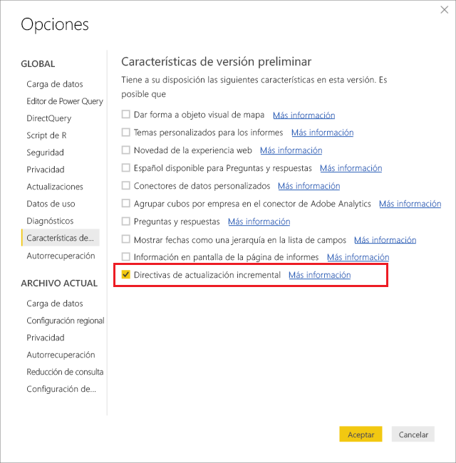
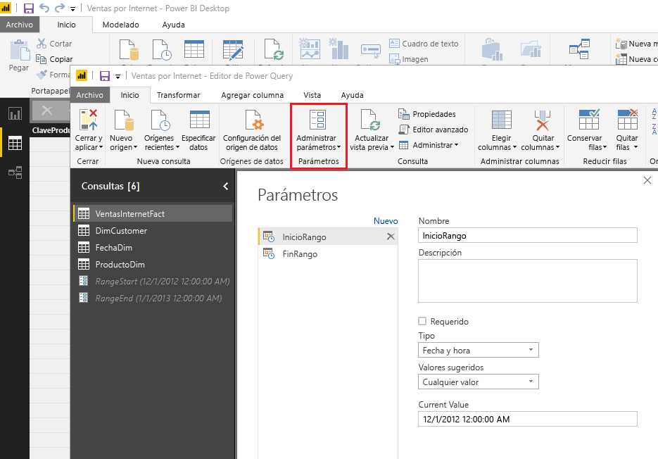
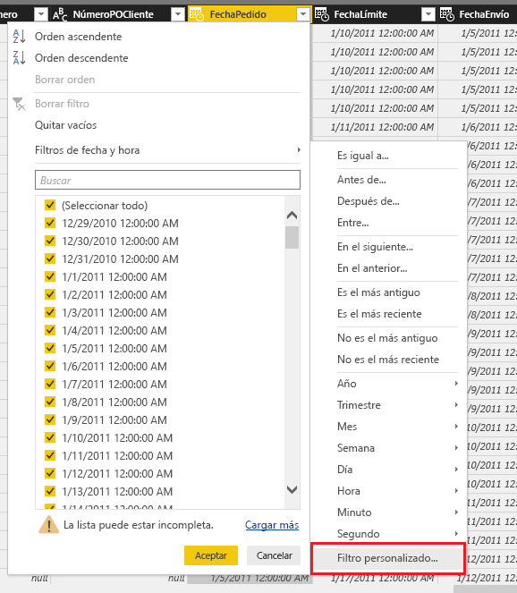
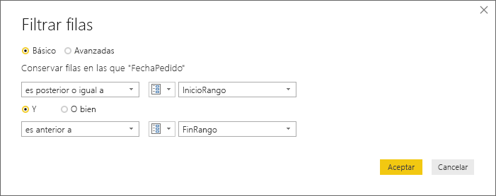
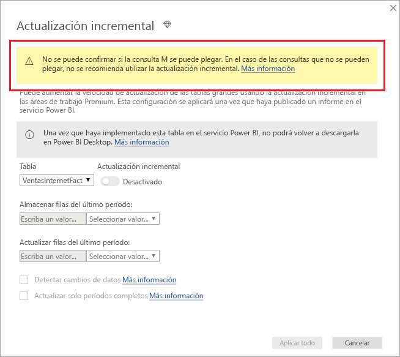
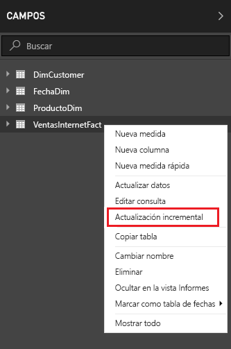
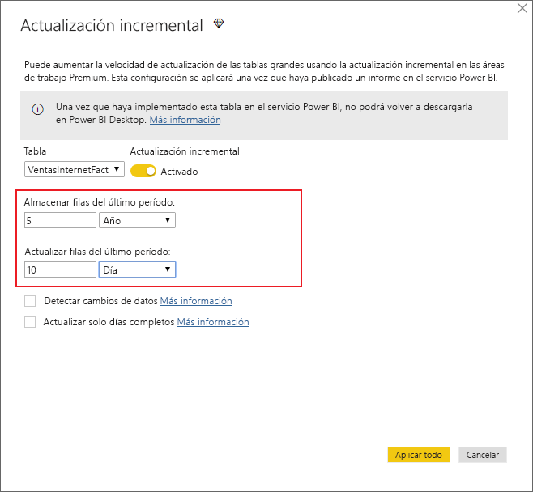
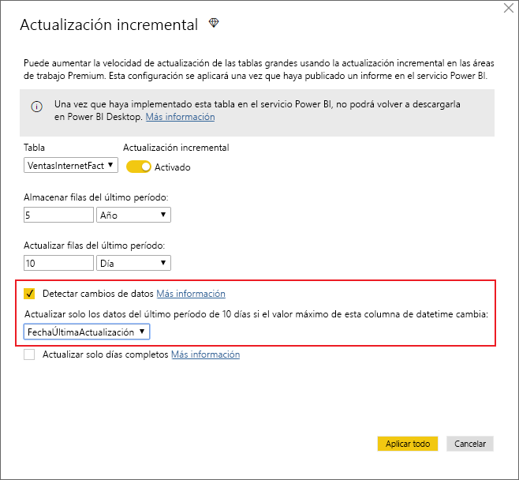
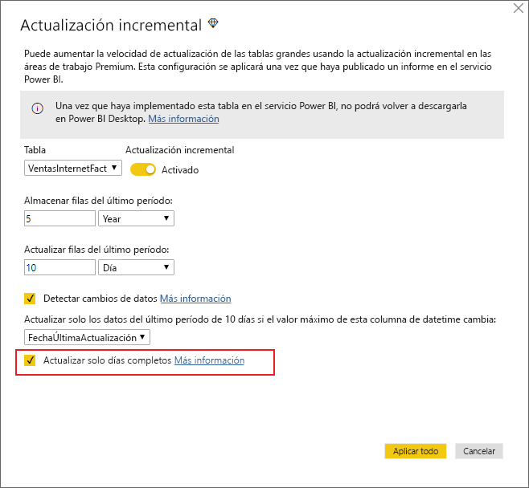
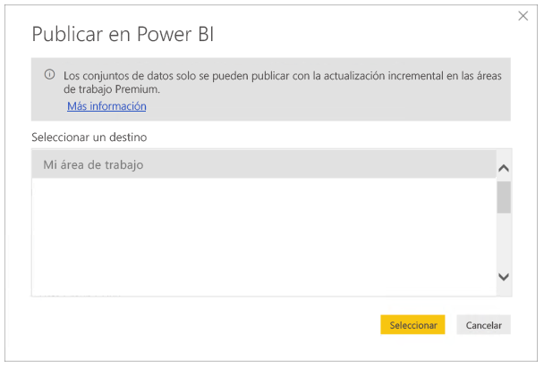

# <a name="incremental-refresh-in-power-bi-premium"></a>Actualizaciones incrementales en Power BI Premium

La actualización incremental permite usar conjuntos de datos muy grandes en el servicio Power BI Premium, lo que reporta las siguientes ventajas:

- **Las actualizaciones son más rápidas**: solo hay que actualizar los datos que se han modificado. Por ejemplo, se actualizan solo los últimos cinco días de un conjunto de datos de 10 años.

- **Las actualizaciones son más confiables**: ya no es necesario mantener conexiones de larga duración a sistemas de origen volátiles.

- **Se reduce el consumo de recursos**: al haber menos datos que actualizar, se reduce el consumo total de memoria y de otros recursos.

## <a name="configure-incremental-refresh"></a>Configuración de la actualización incremental

Las directivas de actualización incremental se definen en Power BI Desktop y se aplican cuando se publican en el servicio Power BI.

Para empezar, habilite las actualizaciones incrementales en **Características de versión preliminar**.



### <a name="filter-large-datasets-in-power-bi-desktop"></a>Filtrar conjuntos de datos grandes en Power BI Desktop

Es posible que los conjuntos de datos grandes (que pueden contener miles de millones de filas) no quepan en el modelo de Power BI Desktop, porque el archivo PBIX está limitado por los recursos de memoria disponibles en el equipo de escritorio. Por tanto, normalmente estos conjuntos de datos se filtran durante la importación. Este tipo de filtrado se aplica con independencia del uso de la actualización incremental. Para la actualización incremental, se filtra mediante los parámetros de fecha y hora de Power Query.

#### <a name="rangestart-and-rangeend-parameters"></a>Parámetros RangeStart y RangeEnd

Para la actualización incremental, los conjuntos de datos se filtran mediante los parámetros de fecha y hora de Power Query con los nombres reservados **RangeStart** y **RangeEnd** (que distinguen mayúsculas de minúsculas). Estos parámetros se usan para filtrar los datos importados en Power BI Desktop y también para particionar de forma dinámica los datos en intervalos una vez publicados en el servicio Power BI. El servicio sustituye los valores de parámetro para filtrar por cada partición. Una vez publicados, el servicio Power BI reemplaza automáticamente los valores de parámetro, No hay necesidad de definirlos en la configuración del conjunto de datos del servicio. Una vez publicados, el servicio Power BI reemplaza automáticamente los valores de parámetro, 

Para definir los parámetros con valores predeterminados, haga clic en **Administrar parámetros** en el editor de Power Query.



Con los parámetros definidos, después puede aplicar el filtro si selecciona la opción de menú **Filtro personalizado** para una columna.



Procure filtrar las filas en las que el valor de la columna sea *igual o posterior a* **RangeStart** y *anterior a* **RangeEnd**.



> [!TIP]
> Aunque el tipo de datos de los parámetros debe ser fecha y hora, se pueden convertir para que coincidan con los requisitos del origen de datos. Por ejemplo, la siguiente función de Power Query convierte un valor de fecha y hora para que aparezca como una clave suplente de enteros con la forma *ddmmaaaa*, algo habitual en los almacenamientos de datos. Se puede llamar a la función durante el paso de filtrado.
>
> `(x as datetime) => Date.Year(x)*10000 + Date.Month(x)*100 + Date.Day(x)`

Seleccione **Cerrar y aplicar** en el editor de Power Query. Ahora deberíamos tener un subconjunto del conjunto de datos en Power BI Desktop.

#### <a name="filter-date-column-updates"></a>Filtrado de las actualizaciones de columna de fecha

El filtro de la columna de fecha se usa para particionar de forma dinámica los datos en intervalos en el servicio Power BI. La actualización incremental no está diseñada para admitir casos en los que la columna de fecha filtrada se actualiza en el sistema de origen. Una actualización se interpretará como una inserción y una eliminación, no como una actualización real. Si la eliminación se produce en el intervalo histórico y no en el intervalo incremental, no se seleccionará. Esto puede provocar errores de actualización de datos debido a conflictos de clave de partición.

#### <a name="query-folding"></a>Plegado de consultas

Es importante que los filtros de partición se inserten en el sistema de origen cuando las consultas se envían para las operaciones de actualización. La transferencia del filtrado significa que el origen de datos debe admitir el plegado de consultas. La mayoría de orígenes de datos compatibles con las consultas SQL admiten el plegado de consultas. Pero los orígenes de datos como los archivos sin formato, los blobs y las fuentes web y de OData normalmente no lo hacen. En casos en los que el filtro no es compatible con el back-end de origen de datos, no se puede realizar la transferencia. En tales casos, el motor de mashup compensa y aplica el filtro localmente, lo cual puede requerir la recuperación del conjunto de datos completo desde el origen de datos. Esto puede provocar que una actualización incremental sea muy lenta y el proceso puede quedarse sin recursos en el servicio Power BI o en la puerta de enlace de datos local, si se utiliza.

Dados los diversos niveles de compatibilidad con el plegado de consultas para cada origen de datos, se recomienda comprobar que la lógica de filtro se incluye en las consultas de origen. Para facilitar esta tarea, Power BI Desktop intenta realizar esta comprobación de forma automática. Si no lo puede comprobar, se muestra una advertencia en el cuadro de diálogo de la actualización incremental al definir la directiva de actualización incremental. Los orígenes de datos basados en SQL como SQL, Oracle y Teradata pueden depender de esta advertencia. Es posible que otros orígenes de datos no puedan ejecutar la comprobación sin realizar el seguimiento de las consultas. Si Power BI Desktop no puede realizar la confirmación, se muestra la advertencia siguiente.

 

### <a name="define-the-refresh-policy"></a>Definir la directiva de actualización

La actualización incremental está disponible en el menú contextual de las tablas, excepto en los modelos de conexión dinámica.



#### <a name="incremental-refresh-dialog"></a>Cuadro de diálogo Actualización incremental

Se abre el cuadro de diálogo Actualización incremental. Use el botón de alternancia para habilitar o deshabilitar el cuadro de diálogo.


> [!NOTE]
> Si la expresión de Power Query relativa a la tabla no hace referencia a los parámetros con nombres reservados, el botón de alternancia se deshabilita.

En el texto del encabezado se explica lo siguiente:

- La actualización incremental solo se admite para las áreas de trabajo de las capacidades Premium. Las directivas de actualización se definen en Power BI Desktop y se aplican por medio de operaciones de actualización en el servicio.

- Si descarga el archivo PBIX que contiene una directiva de actualización incremental desde el servicio Power BI, no se podrá abrir en Power BI Desktop. Aunque es posible que esto se admita en el futuro, recuerde que estos conjuntos de datos pueden crecer tanto que sea poco práctico descargarlos y abrirlos en un equipo de escritorio convencional.

#### <a name="refresh-ranges"></a>Frecuencias de actualización

En el ejemplo siguiente se define una directiva de actualización para almacenar los datos de cinco años naturales completos más los datos del año actual hasta la fecha de hoy y actualizar de forma incremental 10 días de datos. La primera operación de actualización carga los datos históricos. Las actualizaciones posteriores son incrementales y (si se han programado para ejecutarse a diario) realizan las operaciones siguientes:

- Se agrega un nuevo día de datos.

- Se actualizan 10 días hasta la fecha actual.

- Se quitan los años naturales con una antigüedad de más de cinco años con respecto a la fecha actual. Por ejemplo, si la fecha actual es el día 1 de enero de 2019, se quitará el año 2013.

La primera actualización en el servicio Power BI puede tardar más en importar los cinco años naturales enteros, pero las siguientes finalizarán en un tiempo mucho menor.



> [!NOTE]
> Es posible que todo lo que necesite sea la definición de estas frecuencias, en cuyo caso puede ir directamente al paso de publicación siguiente. Las listas desplegables adicionales se corresponden con características avanzadas.

### <a name="advanced-policy-options"></a>Opciones avanzadas de directiva

#### <a name="detect-data-changes"></a>Detectar cambios de datos

Una actualización incremental de 10 días es más eficaz que una actualización completa de cinco años. Pero es posible hacerlo incluso mejor. Si activa la casilla **Detectar cambios de datos**, puede seleccionar una columna de fecha y hora y usarla para identificar y actualizar solo los días donde los datos hayan cambiado. Aquí se da por hecho que esta columna existe en el sistema de origen, que se suele usar con fines de auditoría. **Esta columna no debe ser la misma que la usada para dividir los datos con los parámetros RangeStart/RangeEnd.** El valor máximo de esta columna se evalúa para cada uno de los períodos en la frecuencia incremental. Si no ha cambiado desde la última actualización, no es necesario actualizar período. En el ejemplo, esto podría reducir aún más los días actualizados de forma incremental de 10 a aproximadamente 2.



> [!TIP]
> El diseño actual requiere que la columna que detecta los cambios de datos sea persistente y esté almacenada en la memoria caché. Puede que quiera sopesar el uso de una de las siguientes técnicas para reducir la cardinalidad y el consumo de memoria.
>
> Durante la actualización solo debe persistir el valor máximo de esta columna, posiblemente usando una función de Power Query.
>
> Reduzca la precisión a un nivel que sea aceptable para sus requisitos de frecuencia de actualización.
>
> Tenemos previsto permitir en el futuro que se puedan definir consultas personalizadas para detectar cambios de datos. De este modo, se podrá prescindir por completo del valor de columna persistente.

#### <a name="only-refresh-complete-periods"></a>Actualizar solo períodos completos

Supongamos que nuestra actualización está programada para ejecutarse todas las mañanas a las 4:00 A.M. Si aparecen datos en el sistema de origen durante esas 4 horas, probablemente no quiera tenerlos en cuenta. Algunas métricas empresariales (como, por ejemplo, los barriles por día en el sector petrolífero) no tienen sentido en días parciales.

Pensemos en otro ejemplo en el que hay que actualizar los datos de un sistema financiero donde los datos del mes anterior se aprueban el día 12 del mes en curso. Puede establecer la frecuencia incremental en 1 mes y programar la actualización para que se ejecute el día 12 del mes. Así, con esta opción activada, los datos de enero se actualizarían el 12 de febrero.



> [!NOTE]
> Las operaciones de actualización del servicio se ejecutan según la hora UTC. Esto puede determinar la fecha de vigencia y repercutir en los períodos completos. Tenemos previsto incluir la posibilidad de invalidar la fecha de vigencia en las operaciones de actualización.

## <a name="publish-to-the-service"></a>Publicar en el servicio

Puesto que la actualización incremental es una característica única de Premium, el cuadro de diálogo Publicar solo permite seleccionar un área de trabajo de la capacidad Premium.



Ahora podemos actualizar el modelo. La primera actualización puede tardar más tiempo en importar los datos históricos, mientras que las siguientes serán bastante más rápidas, ya que serán actualizaciones incrementales.

## <a name="query-timeouts"></a>Tiempos de espera de las consultas

En este artículo de [solución problemas de actualización](https://docs.microsoft.com/power-bi/refresh-troubleshooting-refresh-scenarios) se explica que las operaciones de actualización en el servicio Power BI están sujetas a tiempos de espera. Las consultas también pueden verse limitadas por el tiempo de espera predeterminado del origen de datos. La mayoría de los orígenes relacionales permiten invalidar los tiempos de espera en la expresión. Por ejemplo, en la siguiente expresión se usa la [función de acceso a datos de SQL Server](https://msdn.microsoft.com/query-bi/m/sql-database) para establecerla en 2 horas. Cada período definido por los intervalos de directiva envía una consulta que respeta el valor de tiempo de espera del comando.

```
let
    Source = Sql.Database("myserver.database.windows.net", "AdventureWorks", [CommandTimeout=#duration(0, 2, 0, 0)]),
    dbo_Fact = Source{[Schema="dbo",Item="FactInternetSales"]}[Data],
    #"Filtered Rows" = Table.SelectRows(dbo_Fact, each [OrderDate] >= RangeStart and [OrderDate] < RangeEnd)
in
    #"Filtered Rows"
```

## <a name="limitations"></a>Limitaciones

En estos momentos, [modelos compuestos](desktop-composite-models.md), actualización incremental es compatible con SQL, Oracle, y solo los orígenes de datos de Teradata.
