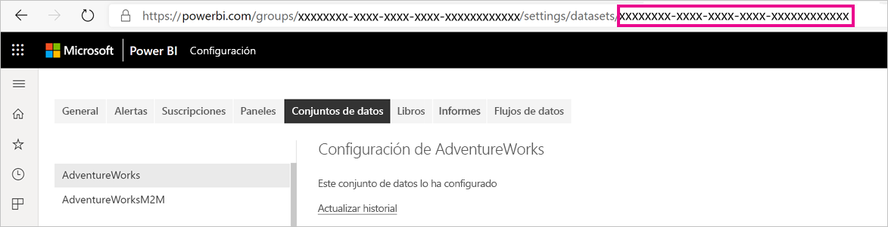
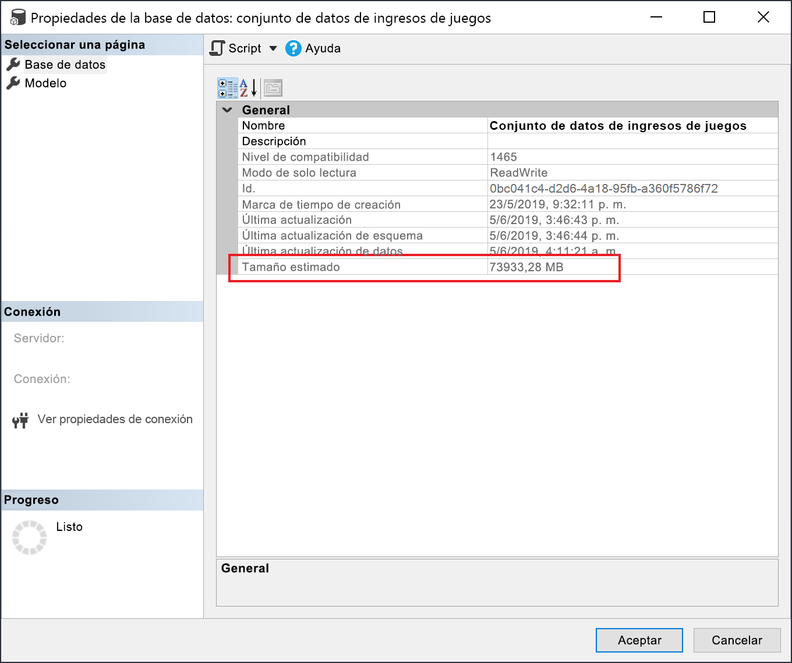

# <a name="large-models-in-power-bi-premium-preview"></a>Modelos grandes en Power BI Premium (versión preliminar)

Los conjuntos de datos de Power BI pueden almacenar datos en una memoria caché en memoria muy comprimida para optimizar el rendimiento de las consultas. Esto permite una rápida interactividad del usuario en grandes conjuntos de datos. La característica de modelos grandes permite que los conjuntos de datos de Power BI Premium tenga más de 10 GB de tamaño. En su lugar, el tamaño del conjunto de datos está limitado por el tamaño de la capacidad de Power BI Premium. Esto es similar a la forma en que Azure Analysis Services funciona en cuanto a las limitaciones de tamaño del modelo. Para más información sobre las capacidades de Power BI Premium, consulte Nodos de capacidad. Puede configurar modelos grandes para todas las SKU Premium P y Embedded A, pero solo funcionan con las [nuevas áreas de trabajo](service-create-the-new-workspaces.md).

Los modelos grandes no afectan al tamaño de carga de PBIX, que sigue estando limitado a 10 GB. En su lugar, los conjuntos de datos crecen más de 10 GB en el servicio al actualizarse. Puede usar la actualización incremental para configurar un conjunto de datos para que crezca más de 10 GB.

## <a name="enable-large-models"></a>Habilitación de modelos grandes

Para crear un conjunto de datos que crezca más de 10 GB, siga estos pasos:

1. Cree un conjunto de datos en Power BI Desktop y configure una [actualización incremental](service-premium-incremental-refresh.md).

1. Publique el conjunto de datos en el servicio Power BI Premium.

1. Ejecute los cmdlets de PowerShell siguientes para habilitar el conjunto de datos para modelos grandes. Estos cmdlets hacen que Power BI almacene el conjunto de datos en Azure Files Premium y no aplique el límite de 10 GB.

1. Invoque una actualización para cargar los datos históricos basada en la directiva de actualización incremental. La primera actualización podría tardar bastante tiempo en cargar el historial. Las actualizaciones posteriores serán más rápidas porque son incrementales.

### <a name="powershell-cmdlets"></a>Cmdlets de PowerShell

En la versión actual de los modelos grandes, habilite el conjunto de datos para almacenarlos en Azure Files Premium mediante los cmdlets de PowerShell. Debe tener privilegios de administrador de áreas de trabajo y de la capacidad para ejecutar los cmdlets de PowerShell.

1. Busque el identificador del conjunto de datos (GUID). En la pestaña **Conjuntos de datos** del área de trabajo, en la configuración del conjunto de datos, puede ver el identificador en la dirección URL.

    

1. En un símbolo del sistema de administrador de PowerShell, instale el módulo [MicrosoftPowerBIMgmt](/powershell/module/microsoftpowerbimgmt.data/).

    ```powershell
    Install-Module -Name MicrosoftPowerBIMgmt
    ```

1. Ejecute los siguientes cmdlets para iniciar sesión y comprobar el modo de almacenamiento del conjunto de datos.

    ```powershell
    Login-PowerBIServiceAccount

    (Get-PowerBIDataset -Scope Organization -Id <Dataset ID> -Include actualStorage).ActualStorage
    ```

    La respuesta será la siguiente. El modo de almacenamiento es ABF (archivo de copia de seguridad de Analysis Services), que es el valor predeterminado.

    ```
    Id                   StorageMode

    --                   -----------

    <Dataset ID>         Abf
    ```

1. Ejecute los siguientes cmdlets para establecer el modo de almacenamiento en Azure Files Premium y compruébelo. La conversión a Azure Files Premium puede tardar unos segundos.

    ```powershell
    Set-PowerBIDataset -Id <Dataset ID> -TargetStorageMode PremiumFiles

    (Get-PowerBIDataset -Scope Organization -Id <Dataset ID> -Include actualStorage).ActualStorage
    ```

    La respuesta será la siguiente. El modo de almacenamiento ahora está establecido en Azure Files Premium.

    ```
    Id                   StorageMode
    
    --                   -----------
    
    <Dataset ID>         PremiumFiles
    ```

Puede comprobar el estado de las conversiones del conjunto de datos hacia y desde Azure Files Premium con el cmdlet [Get-PowerBIWorkspaceMigrationStatus](/powershell/module/microsoftpowerbimgmt.workspaces/get-powerbiworkspacemigrationstatus).

## <a name="dataset-eviction"></a>Expulsión del conjunto de datos

Power BI usa la administración dinámica de la memoria para expulsar los conjuntos de datos inactivos de la memoria. Power BI expulsa los conjuntos de datos para poder cargar otros conjuntos de datos para direccionar las consultas de los usuarios. La administración dinámica de la memoria permite que la suma de los tamaños de los conjunto de datos sea bastante mayor que la memoria disponible en la capacidad, pero debe caber un solo conjunto de datos en la memoria. Para más información sobre la administración dinámica de la memoria, consulte [Funcionamiento de las capacidades](service-premium-what-is.md#how-capacities-function).

Tenga en cuenta el impacto de la expulsión en los modelos grandes. A pesar de los tiempos de carga de conjuntos de datos relativamente rápidos, los usuarios podrían notar un retraso considerable si tienen que esperar a que se recarguen los conjuntos de datos grandes expulsados. Por esta razón, en su forma actual, se recomienda usar la característica de modelos grandes principalmente para las capacidades dedicadas a los requisitos de inteligencia empresarial en lugar de a entornos mixtos con requisitos de inteligencia empresarial con características de autoservicio. Las capacidades dedicadas a los requisitos de inteligencia empresarial son menos propensas a desencadenar expulsiones y por lo que no necesitan volver a cargar los conjuntos de datos con tanta frecuencia. Por otro lado, las capacidades de inteligencia empresarial con características de autoservicio pueden tener muchos conjuntos de datos pequeños que se cargan con más frecuencia dentro y fuera de la memoria.

## <a name="checking-dataset-size"></a>Comprobación del tamaño del conjunto de datos

Después de cargar los datos históricos, puede usar [SSMS](https://docs.microsoft.com/sql/ssms/download-sql-server-management-studio-ssms) a través del [punto de conexión de XMLA](service-premium-connect-tools.md) para comprobar el tamaño estimado del conjunto de datos en la ventana de propiedades del modelo.



Para comprobar el tamaño del conjunto de datos, también puede ejecutar las siguientes consultas DMV desde SSMS. Sume las columnas DICTIONARY\_SIZE y USED\_SIZE de la salida para ver el tamaño del conjunto de datos en bytes.

```sql
SELECT * FROM SYSTEMRESTRICTSCHEMA
($System.DISCOVER_STORAGE_TABLE_COLUMNS,
 [DATABASE_NAME] = '<Dataset Name>') //Sum DICTIONARY_SIZE (bytes)

SELECT * FROM SYSTEMRESTRICTSCHEMA
($System.DISCOVER_STORAGE_TABLE_COLUMN_SEGMENTS,
 [DATABASE_NAME] = '<Dataset Name>') //Sum USED_SIZE (bytes)
```

## <a name="current-feature-restrictions"></a>Restricciones actuales de la característica

Tenga en cuenta las siguientes restricciones cuando use modelos grandes:

- **Cifrado BYOK (Bring Your Own Key)** : los conjuntos de datos habilitados para Files Premium no se cifran mediante [BYOK](service-encryption-byok.md).
- **Compatibilidad con múltiples ubicaciones geográficas**: los conjuntos de datos habilitados para Files Premium producirán errores en las capacidades en las que también tengan habilitadas [múltiples ubicaciones geográficas](service-admin-premium-multi-geo.md).

- **Descarga en Power BI Desktop**: si un conjunto de datos se almacena en Files Premium, se producirá un error al [descargar como archivo .pbix](service-export-to-pbix.md).
- **Regiones admitidas**: los modelos grandes se admiten en las siguientes regiones.
  - Este de Australia
  - Sudeste de Australia
  - Centro de EE. UU.
  - Asia Oriental
  - Este de EE. UU.
  - Este de EE. UU. 2
  - Este de Japón
  - Oeste de Japón
  - Centro de Corea del Sur
  - Sur de Corea del Sur
  - Centro y norte de EE. UU.
  - Europa del Norte
  - Centro-sur de EE. UU.
  - Sudeste Asiático
  - Sur de Reino Unido
  - Oeste de Reino Unido
  - Europa Occidental
  - Oeste de EE. UU.
  - Oeste de EE. UU. 2