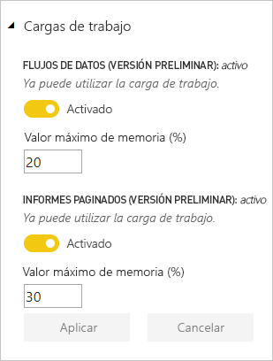
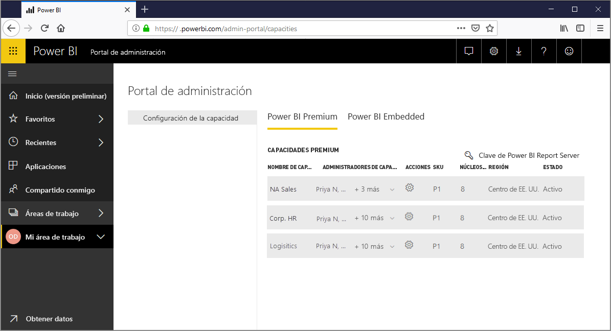
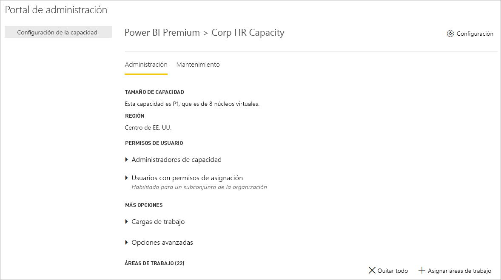
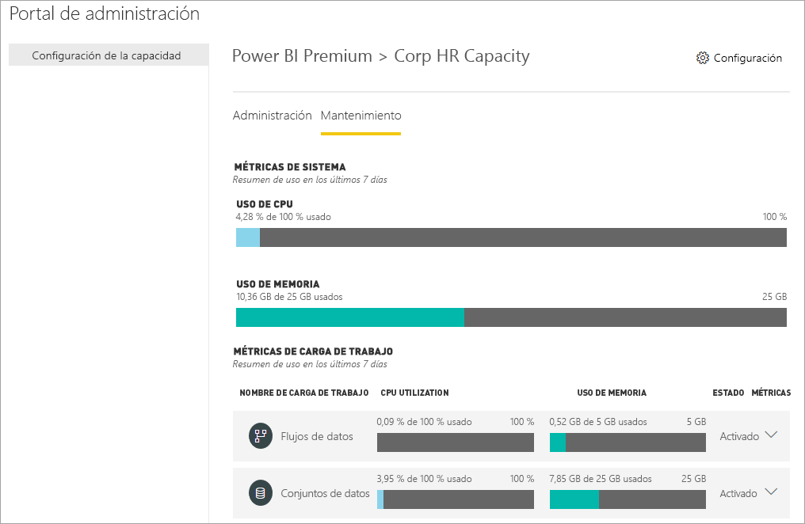
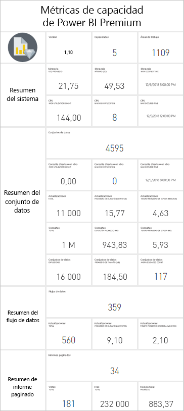
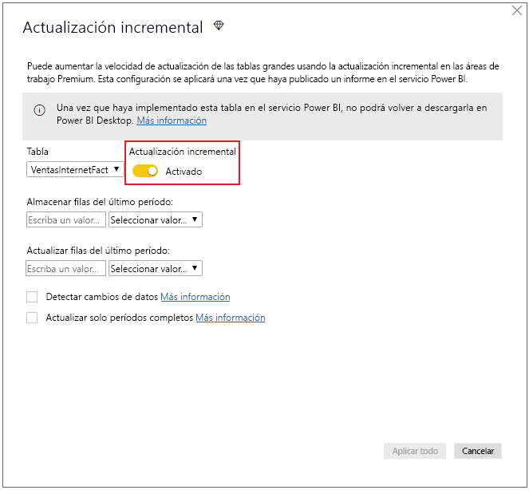
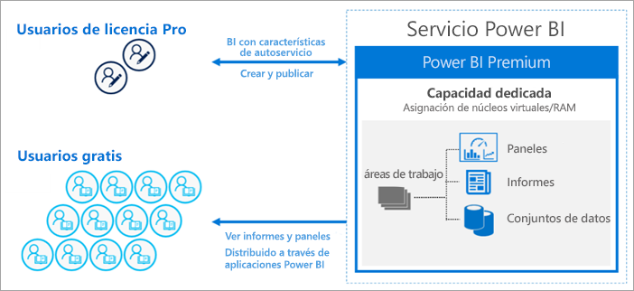
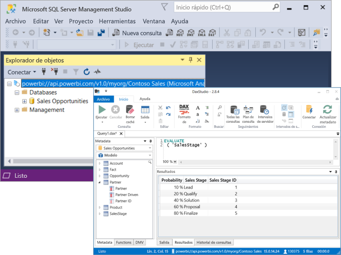

# ¿Qué es Power BI Premium?

Power BI Premium proporciona recursos dedicados y mejorados para ejecutar el servicio Power BI en la organización. Por ejemplo:

> [!div class="checklist"]
> * Mayor escalabilidad y rendimiento
> * Flexibilidad de otorgar licencias por capacidad
> * Unificar la inteligencia empresarial y las características de autoservicio
> * Ampliar la inteligencia empresarial local con Power BI Report Server
> * Admitir la residencia de datos por región (Multi-Geo)
> * Compartir datos con cualquier usuario sin tener que comprar una licencia por usuario

En este artículo se presentan las características principales de Power BI Premium. Si es necesario, se proporcionan vínculos a otros artículos con información más detallada.

## Suscripciones y licencias

Power BI Premium es una suscripción de Office 365 de nivel de inquilino disponible en dos familias de SKU (referencia de almacén):

- SKU **EM** (EM1-EM3) para la inserción, que requieren un compromiso anual que se factura mensualmente. Las SKU EM1 y EM2 solo están disponibles a través de planes de licencias por volumen. No se pueden comprar directamente.
- SKU **P** (P1-P3) para la inserción y las funciones empresariales, que requieren un compromiso mensual o anual, se facturan mensualmente e incluyen una licencia para instalar Power BI Report Server en el entorno local.

Un enfoque alternativo consiste en comprar una suscripción a **Azure Power BI Embedded**, que tiene una sola familia de SKU **A** (A1-A6) únicamente para fines de inserción y pruebas de capacidad. Todas las SKU proporcionan núcleos virtuales para crear las capacidades, pero las SKU EM están restringidas para la inserción a menor escala. Las SKU EM1, EM2, A1 y A2 que tienen menos de cuatro núcleos virtuales no se ejecutan en una infraestructura dedicada.

Aunque este artículo se centra en las SKU P, gran parte de lo que se describe también es relevante para las SKU A. A diferencia de las SKU de suscripción Premium, las de Azure no requieren ningún compromiso de tiempo y se facturan por hora. Ofrecen elasticidad completa que permite escalar y reducir verticalmente, pausar, reanudar y eliminar. 

Azure Power BI Embedded queda fuera del ámbito de este artículo, pero se describe en la sección [Enfoques de pruebas](service-premium-capacity-optimize.md#testing-approaches) del artículo Optimización de las capacidades Premium como una opción práctica y económica para probar y medir cargas de trabajo. Para obtener más información sobre las SKU de Azure, vea [Documentación de Azure Power BI Embedded](https://azure.microsoft.com/services/power-bi-embedded/).

### Compra

Los administradores compran las suscripciones de Power BI Premium en el Centro de administración de Microsoft 365. En concreto, solo los administradores globales de Office 365 o los administradores de facturación pueden comprar las SKU. Una vez compradas, el inquilino recibe un número correspondiente de núcleos virtuales para asignar a las capacidades, lo que se conoce como *agrupación de núcleos virtuales*. Por ejemplo, la compra de una SKU P3 proporciona al inquilino 32 núcleos virtuales. Para más información, vea [Adquisición de Power BI Premium](service-admin-premium-purchase.md).

## Capacidades dedicadas

Con Power BI Premium, se obtienen *capacidades dedicadas*. A diferencia de una capacidad compartida donde las cargas de trabajo se ejecutan en recursos informáticos compartidos con otros clientes, una capacidad dedicada es para uso exclusivo de una organización. Se aísla con recursos informáticos dedicados que proporcionan un rendimiento confiable y coherente para el contenido hospedado. 

Las áreas de trabajo residen dentro de las capacidades. Cada usuario de Power BI tiene un área de trabajo personal que se conoce como **Mi área de trabajo**. Pueden crearse áreas de trabajo adicionales, llamadas **áreas de trabajo de la aplicación** para posibilitar la colaboración. De forma predeterminada, las áreas de trabajo, incluidas las personales, se crean en la capacidad compartida. Cuando tiene capacidades Premium, Mis áreas de trabajo y las áreas de trabajo de la aplicación se pueden asignar a las capacidades Premium.

### Nodos de capacidad

Como se describe en la sección [Suscripciones y licencias](#subscriptions-and-licensing), hay dos familias de SKU de Power BI Premium: **EM** y **P**. Todas las SKU de Power BI Premium están disponibles como *nodos* de capacidad, que representan una cierta cantidad de recursos que consta de procesador, memoria y almacenamiento. Además de los recursos, cada SKU tiene límites operativos en cuanto al número de conexiones de DirectQuery y dinámicas por segundo, y el número de actualizaciones del modelo paralelas.

El procesamiento se consigue mediante un número determinado de núcleos virtuales, que se divide por igual entre el back-end y el front-end.

Los **núcleos virtuales de back-end** son responsables de funciones básicas de Power BI, como el procesamiento de consultas, la administración de caché, la ejecución de servicios R, la actualización del modelo, el procesamiento de lenguaje natural (Preguntas y respuestas) y la representación de informes e imágenes en el lado servidor. A los núcleos virtuales de back-end se les asigna una cantidad fija de memoria que se usa principalmente para hospedar modelos, también conocidos como "conjuntos de datos activos".

Los **núcleos virtuales de front-end** son responsables de la administración de documentos de informes, paneles y servicios web, la administración de derechos de acceso, la programación, las API, las cargas y descargas, y en general de todo lo relacionado con las experiencias del usuario.

El almacenamiento se establece en **100 TB por nodo de capacidad**.

Los recursos y los límites de cada SKU Premium (y la SKU A de tamaño equivalente) se describen en la tabla siguiente:

| Nodos de capacidad | Total de núcleos virtuales | Núcleos virtuales de back-end | RAM (GB) | Núcleos virtuales de front-end | Límites de conexiones dinámicas/DirectQuery (por segundo) | Paralelismo de actualización de modelo |
| --- | --- | --- | --- | --- | --- | --- |
| EM1/A1 | 1 | 0,5 | 2.5 | 0,5 | 3,75 | 1 |
| EM2/A2 | 2 | 1 | 5 | 1 | 7,5 | 2 |
| EM3/A3 | 4 | 2 | 10 | 2 | 15 | 3 |
| P1/A4 | 8 | 4 | 25 | 4 | 30 | 6 |
| P2/A5 | 16 | 8 | 50 | 8 | 60 | 12 |
| P3/A6 | 32 | 16 | 100 | 16 | 120 | 24 |
| | | | | | | |

### Cargas de trabajo de capacidad

Las cargas de trabajo de capacidad son servicios disponibles para los usuarios. De forma predeterminada, las capacidades Premium y de Azure solo admiten una carga de trabajo de conjunto de datos asociada con la ejecución de consultas de Power BI. La carga de trabajo de conjunto de datos no se puede deshabilitar. Se pueden habilitar cargas de trabajo adicionales para [IA (Cognitive Services)](https://powerbi.microsoft.com/blog/easy-access-to-ai-in-power-bi-preview/), [Flujos de datos](service-dataflows-overview.md#dataflow-capabilities-on-power-bi-premium) e [Informes paginados](paginated-reports-save-to-power-bi-service.md). Estas cargas de trabajo solo se admiten en las suscripciones Premium. 

Cada carga de trabajo adicional permite configurar la memoria máxima (como un porcentaje de la memoria total disponible) que puede usar la carga de trabajo. Los valores predeterminados para la memoria máxima se determinan por SKU. Puede maximizar los recursos disponibles de la capacidad si habilita solo las cargas de trabajo adicionales cuando se usan. Y puede cambiar la configuración de memoria solo cuando disponga de una configuración predeterminada específica que no cumpla los requisitos de recursos de la capacidad. Los administradores de la capacidad pueden habilitar y configurar cargas de trabajo para una capacidad mediante la **configuración de la capacidad** en el [Portal de administración](service-admin-portal.md), o bien con las [API REST de las capacidades](https://docs.microsoft.com/rest/api/power-bi/capacities).  

Para más información, vea [Configuración de cargas de trabajo en una capacidad Premium](service-admin-premium-workloads.md). 

### Cómo funcionan las capacidades

En todo momento, el servicio Power BI realiza un uso óptimo de los recursos de capacidad, aunque sin superar los límites impuestos en la capacidad.

Las operaciones de capacidad se clasifican como *interactivas* o *en segundo plano*. Las operaciones interactivas incluyen la representación de solicitudes y la respuesta a interacciones del usuario (filtrado, preguntas y respuestas, etc.). Por lo general, las consultas del modelo de importación consumen muchos recursos de memoria, mientras que las de los modelos de DirectQuery y conexión dinámica consumen mucha CPU. Las operaciones en segundo plano incluyen las actualizaciones de flujos de datos y del modelo de importación, y el almacenamiento en caché de consultas de panel.

Es importante comprender que las operaciones interactivas siempre tienen prioridad sobre las operaciones en segundo plano para garantizar la mejor experiencia del usuario posible. Si no hay recursos suficientes, las operaciones en segundo plano se agregan a una cola para su procesamiento cuando se liberen los recursos. El servicio Power BI puede detener a mitad del proceso las operaciones en segundo plano, como las actualizaciones del conjunto de datos, y agregarlas a una cola.

Los modelos de importación se deben cargar en memoria en su totalidad para que se puedan consultar o actualizar. El servicio Power BI administra el uso de la memoria mediante sofisticados algoritmos para garantizar el máximo uso de la memoria disponible, y puede provocar la asignación excesiva de la capacidad: Aunque una capacidad puede almacenar muchos modelos de importación (hasta 100 TB por capacidad Premium), cuando su almacenamiento en disco combinado supera la memoria compatible (y se necesita memoria adicional para las consultas y la actualización), no se podrán cargar todos en memoria al mismo tiempo.

Por tanto, los modelos de importación se cargan en la memoria y se quitan de ella en función del uso. Un modelo de importación se carga cuando se consulta (operación interactiva) y todavía no está en la memoria, o bien cuando se va a actualizar (operación en segundo plano).

La eliminación de un modelo de la memoria se denomina *expulsión*. Es una operación que Power BI puede realizar rápidamente según el tamaño de los modelos. Si la capacidad no experimenta presión de memoria, los modelos simplemente se cargan en memoria y permanecerán allí. Pero cuando no hay memoria suficiente disponible para cargar un modelo, el servicio Power BI primero tiene que liberar memoria. Para liberar memoria, detecta los modelos que han quedado inactivos mediante la búsqueda de los que no se han usado en los últimos tres minutos \[[1](#endnote-1)\] y después los expulsa. Si no hay ningún modelo inactivo para expulsar, el servicio Power BI busca los que se han cargado para las operaciones en segundo plano. Como último recurso, después de 30 segundos de intentos fallidos \[[1](#endnote-1)\], se produce un error en la operación interactiva. En este caso, se notifica el error al usuario del informe con una sugerencia de que vuelva a intentarlo en breve. En algunos casos, es posible que los modelos se descarguen de la memoria debido a operaciones de servicio.

Es importante resaltar que la expulsión del conjunto de datos es un comportamiento normal y esperado. El objetivo es maximizar el uso de memoria mediante la carga y descarga de modelos cuyos tamaños combinados pueden superar la memoria disponible. Esto es así de forma predeterminada y es completamente transparente para los usuarios del informe. Las tasas de expulsión altas no significan necesariamente que la capacidad no tenga los recursos suficientes. Pero pueden convertirse en un problema si la capacidad de respuesta de la consulta o la actualización se ve afectada debido a las altas tasas de expulsión.

En las actualizaciones de modelos de importación siempre se usa mucha memoria, ya que los modelos se deben cargar en la memoria. Se necesita memoria adicional para el procesamiento. Una actualización completa puede usar aproximadamente el doble de memoria requerida por el modelo. Esto garantiza que el modelo se pueda consultar incluso mientras se procesa, porque se envían consultas al modelo existente, hasta que se haya completado la actualización y los datos del modelo nuevo están disponibles. La actualización incremental requerirá menos memoria y se completará más rápidamente, por lo que puede reducir significativamente la presión sobre los recursos de la capacidad. Las actualizaciones también pueden hacer un uso intensivo de la CPU para los modelos, especialmente aquellos con transformaciones complejas de Power Query, o bien tablas o columnas calculadas que son complejas o se basan en tablas de gran tamaño.

Las actualizaciones, como las consultas, requieren que el modelo se cargue en memoria. Si no hay suficiente memoria, el servicio Power BI intentará expulsar los modelos inactivos, y si esto no es posible (porque todos los modelos estén activos), el trabajo de actualización se pone en cola. Las actualizaciones normalmente consumen mucha CPU, incluso mucho más que las consultas. Por este motivo, hay límites de capacidad en cuanto al número de actualizaciones simultáneas, que se establece en 1,5 veces el número de núcleos de virtuales de back-end, redondeado al alza. Si hay demasiadas actualizaciones simultáneas, una actualización programada se pondrá en cola. Cuando se producen estas situaciones, la actualización tarda más tiempo en completarse. Las actualizaciones a petición, como las que desencadena una solicitud de usuario o una llamada de API, se volverán a intentar tres veces \[[1](#endnote-1)\]. Si sigue sin haber recursos suficientes, se producirá un error en la actualización.

Notas de la sección:   
\[1\] Sujeto a cambios.

### Compatibilidad con regiones

Al crear una capacidad, los administradores globales de Office 365 y los administradores del servicio Power BI pueden especificar una región donde residirán las áreas de trabajo asignadas a la capacidad. Esto se conoce como **Multi-Geo**. Con Multi-Geo, las organizaciones pueden cumplir los requisitos de residencia de datos mediante la implementación de contenido en los centros de datos de una región específica, incluso si es distinta de la región en la que reside la suscripción a Office 365. Para más información, vea [Compatibilidad de Multi-Geo con Power BI Premium](service-admin-premium-multi-geo.md).

### Administración de capacidades

La administración de las capacidades Premium implica las tareas de crear o eliminar capacidades, asignar administradores y áreas de trabajo, configurar cargas de trabajo, supervisar y realizar ajustes para optimizar el rendimiento de la capacidad. 

Los administradores globales de Office 365 y los administradores del servicio Power BI pueden crear capacidades Premium a partir de los núcleos virtuales disponibles, o bien modificar capacidades Premium existentes. Cuando se crea una capacidad, se especifican el tamaño de la capacidad y la región geográfica, y se asigna al menos un administrador. 

Cuando se crean capacidades, la mayoría de las tareas administrativas se realizan en el [Portal de administración](service-admin-portal.md).

Los administradores de capacidad pueden asignar áreas de trabajo a la capacidad, administrar permisos de usuario y asignar otros administradores. Los administradores de capacidad también pueden configurar cargas de trabajo, ajustar las asignaciones de memoria y, si es necesario, reiniciar una capacidad, para restablecer las operaciones en caso de una sobrecarga de la capacidad.

Los administradores de capacidad también pueden asegurarse de que una capacidad se ejecuta sin problemas. Pueden supervisar el estado de la capacidad directamente en el Portal de administración o mediante la aplicación Métricas de capacidad de Premium.

Para más información sobre la creación de capacidades y la asignación de administradores y áreas de trabajo, vea [Administración de las capacidades Premium](service-premium-capacity-manage.md). Para más información sobre los roles, vea [Roles de administrador relacionados con Power BI](service-admin-administering-power-bi-in-your-organization.md#administrator-roles-related-to-power-bi).

### Supervisión

La supervisión de las capacidades Premium proporciona a los administradores una descripción del funcionamiento de las capacidades. Las capacidades se pueden supervisar mediante el Portal de administración o con la aplicación [Power BI Premium Capacity Metrics](https://app.powerbi.com/groups/me/getapps/services/capacitymetrics).

La supervisión en el portal proporciona una vista rápida con métricas generales en las que se indica el promedio de cargas colocadas y recursos usados por la capacidad en los últimos siete días. 

La aplicación **Power BI Premium Capacity Metrics** proporciona la información más detallada sobre el rendimiento de las capacidades. La aplicación proporciona un panel general e informes más detallados.

Desde el panel de la aplicación puede hacer clic en una celda de la métrica para abrir un informe detallado. Los informes proporcionan métricas detalladas y capacidad de filtrado para explorar en profundidad la información más importante necesaria para que las capacidades sigan funcionando sin problemas.

Para más información sobre la supervisión de capacidades, vea [Supervisión de capacidades en el portal de administración](service-admin-premium-monitor-portal.md) y [Supervisión de capacidades Premium con la aplicación](service-admin-premium-monitor-capacity.md).

### Optimización de las capacidades

El uso óptimo de las capacidades es fundamental para garantizar que los usuarios obtienen el rendimiento y que se obtiene el máximo partido de la inversión en Premium. Mediante la supervisión de métricas clave, los administradores pueden determinar la mejor forma de solucionar los cuellos de botella y tomar las medidas necesarias. Para más información, vea [Optimización de las capacidades Premium](service-premium-capacity-optimize.md) y [Escenarios de las capacidades Premium](service-premium-capacity-scenarios.md).

### API REST de las capacidades

Las API REST de Power BI incluyen una colección de [API de capacidades](https://docs.microsoft.com/rest/api/power-bi/capacities). Con las API, los administradores pueden administrar mediante programación muchos aspectos de las capacidades Premium, incluidas la habilitación y deshabilitación de cargas de trabajo, la asignación de áreas de trabajo a una capacidad y mucho más.

## Conjuntos de datos de gran tamaño

En función de la SKU, Power BI Premium permite cargar archivos de modelo de Power BI Desktop (.pbix) con un tamaño máximo de **10 GB**. Después de cargarlo, el modelo se puede publicar en un área de trabajo asignada a una capacidad Premium. Después, el conjunto de datos se puede actualizar hasta un tamaño de **12 GB**.

### Consideraciones de tamaño

Los modelos de gran tamaño pueden consumir muchos recursos. Debe tener al menos una SKU P1 para cualquier modelo superior a 1 GB. Aunque la publicación de modelos grandes en áreas de trabajo respaldadas por SKU A hasta A3 podría funcionar, no sucede lo mismo con su actualización.

La tabla siguiente describe las SKU recomendadas para diversos tamaños de .pbix:

   |SKU  |Tamaño de .pbix   |
   |---------|---------|
   |P1    | < 3 GB        |
   |P2    | < 6 GB        |
   |P3, P4, P5    | hasta 10 GB   |

La SKU A4 de Power BI Embedded es igual a SKU P1, A5 = P2 y A6 = P3. La publicación de grandes modelos para SKU A y EM podría devolver errores que no son específicos del error de limitación de tamaño de modelo en la capacidad compartida. Los errores de actualización de modelos grandes en A y SKU EM es probable que apunten a errores relativos a los tiempos de espera. 

Los archivos .pbix representan datos en un *estado muy comprimido*. Los datos probablemente se expandirán varias veces al cargarse en memoria y, a partir de ahí, podrían expandirse varias veces más durante la actualización de datos.

La actualización programada de conjuntos de datos grandes puede tardar mucho tiempo y hacer un uso intensivo de los recursos. Es importante no programar demasiadas actualizaciones superpuestas. Se recomienda configurar la [actualización incremental](service-premium-incremental-refresh.md), ya que es más rápida y fiable, y consume menos recursos.

La carga inicial de informes de grandes conjuntos de datos puede tardar mucho si ha pasado un tiempo desde la última vez que se ha usado el conjunto de datos. Una barra de carga para los informes de carga larga muestra el progreso de carga.

Aunque las restricciones de memoria y tiempo por consulta son mucho mayores en la capacidad Premium, se recomienda usar filtros y segmentaciones para que los objetos visuales muestren únicamente lo necesario.

## Actualización incremental

La actualización incremental proporciona una parte integral de la presencia y el mantenimiento de grandes conjuntos de datos en Power BI Premium. La actualización incremental tiene muchas ventajas, por ejemplo, las actualizaciones son más rápidas porque solo hay que actualizar los datos que hayan cambiado. Las actualizaciones son más confiables, ya que no es necesario mantener conexiones de larga duración a orígenes de datos volátiles. Se reduce el consumo de recursos porque, al haber menos datos que actualizar, se reduce el consumo total de memoria y de otros recursos. Las directivas de actualización incremental se definen en **Power BI Desktop** y se aplican cuando se publican en un área de trabajo de una capacidad Premium. 

Para más información, vea [Actualizaciones incrementales en Power BI Premium](service-premium-incremental-refresh.md).

## Informes paginados

Los informes paginados, compatibles con las SKU P1-P3 y A4-A6, se basan en la tecnología de lenguaje RDL (Report Definition Language) de SQL Server Reporting Services. Aunque se basen en la tecnología RDL, no es lo mismo que Power BI Report Server, que es una plataforma de informes descargable que se puede instalar en el entorno local, y que también se incluye con Power BI Premium. Los informes paginados se formatean para ajustarse a una página que se puede imprimir o compartir. Los datos se muestran en una tabla, incluso si esta abarca varias páginas. Mediante el uso de la aplicación de escritorio de Windows gratuita [**Generador de informes de Microsoft Power BI**](https://go.microsoft.com/fwlink/?linkid=2086513), los usuarios pueden crear informes paginados y publicarlos en el servicio.

En Power BI Premium, los informes paginados son una carga de trabajo que se debe habilitar para una capacidad mediante el portal de administración. Los administradores de capacidad pueden habilitar y después especificar la cantidad de memoria como un porcentaje del total de recursos de memoria de la capacidad. A diferencia de otros tipos de carga de trabajo, Premium ejecuta los informes paginados en un espacio contenido dentro de la capacidad. Se usa la memoria máxima especificada para este espacio, con independencia de si la carga de trabajo está o no activa. El valor predeterminado es 20 %. 

Para más información, vea [¿Qué son los informes paginados en Power BI Premium?](paginated-reports-report-builder-power-bi.md) Para más información sobre cómo habilitar la carga de trabajo de informes paginados, vea [Configuración de cargas de trabajo en una capacidad Premium](service-admin-premium-workloads.md).

## Power BI Report Server
 
Power BI Report Server, que se incluye con Power BI Premium, es un servidor de informes *local* con un portal web. Puede crear el entorno de BI en almacenamiento local y distribuir los informes detrás del firewall de la organización. Report Server proporciona a los usuarios acceso a informes enriquecidos e interactivos, así como a funciones de creación de informes empresariales de SQL Server Reporting Services. Los usuarios pueden explorar datos visuales y descubrir rápidamente patrones para tomar mejores decisiones con más rapidez. Report Server proporciona gobernanza bajo sus propias condiciones. Cuando llegue el momento, Power BI Report Server facilita la migración a la nube, donde la organización puede aprovechar al máximo toda la funcionalidad de Power BI Premium.

Para más información, vea [Power BI Report Server](report-server/get-started.md).

## Uso compartido de contenido ilimitado

Con Premium, todos los usuarios dentro o fuera de la organización pueden ver el contenido de Power BI, incluidos los informes paginados e interactivos, sin necesidad de comprar licencias individuales. 

Premium permite una amplia distribución de contenido por parte de los usuarios de Pro sin solicitar licencias Pro a los destinatarios que ven el contenido. Las licencias Pro son necesarias para los creadores de contenido. Los creadores se conectan a orígenes de datos, modelan los datos y crean paneles e informes que se empaquetan como aplicaciones del área de trabajo. 

Para más información, vea [Licencias de Power BI](service-admin-licensing-organization.md).

## Conectividad de herramientas (versión preliminar)

De forma interna, el **motor Vertipaq de Analysis Services** probado por Microsoft impulsa los conjuntos de datos de Power BI. Analysis Services proporciona la capacidad de programación y compatibilidad con herramientas y aplicaciones cliente a través de las bibliotecas de cliente y las API que admiten el protocolo XMLA de estándar abierto. En la actualidad, los conjuntos de datos de Power BI Premium admiten conexiones *de solo lectura* desde herramientas y aplicaciones cliente de Microsoft y de terceros a través de **puntos de conexión XMLA**. 

Herramientas de Microsoft como SQL Server Management Studio y SQL Server Profiler, y aplicaciones de terceros como DAX Studio y aplicaciones de visualización de datos, se pueden conectar a conjuntos de datos Premium y consultarlos mediante XMLA, MDX, DAX, DMV y eventos de seguimiento. 

Para más información, vea [Conexión a conjuntos de datos con herramientas y aplicaciones cliente](service-premium-connect-tools.md).

## Pasos siguientes

> [!div class="nextstepaction"]
> [Administración de las capacidades Premium](service-premium-capacity-manage.md)

¿Tiene más preguntas? [Pruebe a preguntar a la comunidad de Power BI](https://community.powerbi.com/)

||||||
