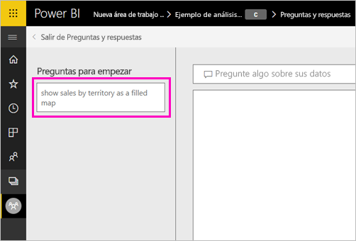
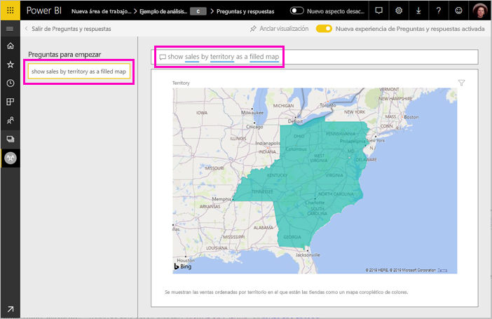

# Crear las preguntas destacadas para Preguntas y respuestas de Power BI
Si tiene un conjunto de datos, puede agregarle sus propias preguntas destacadas. Preguntas y respuestas de Power BI mostrará esas preguntas a los compañeros que consumen informes basados en ese conjunto de datos.  Las preguntas destacadas proporcionan a los compañeros ideas acerca de los tipos de preguntas que pueden hacer sobre el conjunto de datos. Usted elige las preguntas destacadas que agrega: puede agregar preguntas comunes, preguntas que muestren resultados interesantes o preguntas difíciles de expresar.

> [!NOTE]
> Las preguntas destacadas de Preguntas y respuestas están disponibles para su uso en la [aplicación Microsoft Power BI para iOS en dispositivos iPad, iPhone y iPod Touch](consumer/mobile/mobile-apps-ios-qna.md), y en Preguntas y respuestas de Power BI Desktop. La creación de preguntas solo está disponible en el servicio Power BI (app.powerbi.com).
> 

## Creación de una pregunta destacada

Este artículo usa el [ejemplo de análisis de minoristas](sample-datasets.md). Siga estas instrucciones paso a paso para intentar explorar un conjunto de datos por su cuenta.

1. Seleccione el cuadro de preguntas y respuestas en el panel.   Observe que Preguntas y respuestas ya se usó para ver una lista de términos que aparecen en el conjunto de datos.
2. Para agregar a esta lista, seleccione el icono de engranaje de la esquina superior derecha de Power BI.  
   
3. Seleccione **Configuración** &gt; **Conjuntos de datos** &gt; **Ejemplo de análisis de minoristas** &gt; **Preguntas y respuestas destacadas**.  
4. Seleccione **Agregar una pregunta**.
   
   
5. Escriba la pregunta en el cuadro de texto y seleccione **Aplicar**.   También puede seleccionar **Agregar una pregunta**para agregar otra pregunta.  
   
6. Vuelva al panel de Power BI para recuperar el Ejemplo de análisis de venta directa y coloque el cursor en el cuadro de pregunta de Preguntas y respuestas.   
   
7. La nueva pregunta destacada, **Ventas por territorio como mapa**, es la primera de la lista. Selecciónela.  
8. La respuesta se muestra como una visualización de mapa coroplético.  
   

## Pasos siguientes

- [Preguntas y respuestas para consumidores](consumer/end-user-q-and-a.md)  
- [Uso de Preguntas y respuestas en paneles e informes](power-bi-tutorial-q-and-a.md)  
- [Conceptos básicos para los diseñadores en el servicio Power BI](service-basic-concepts.md)  

¿Tiene más preguntas? [Pruebe la comunidad de Power BI](https://community.powerbi.com/)

