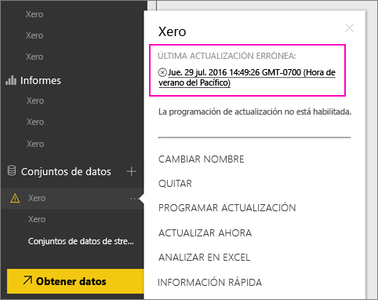
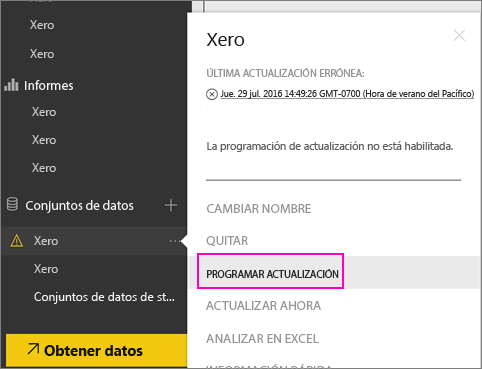
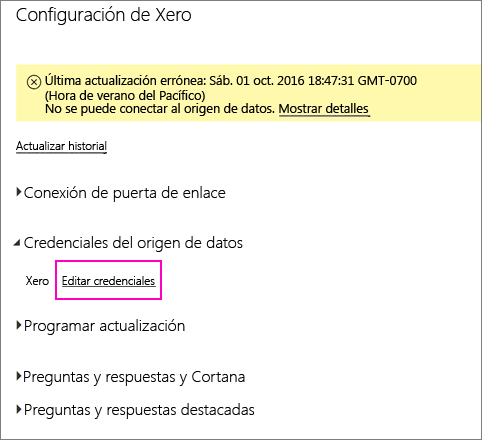
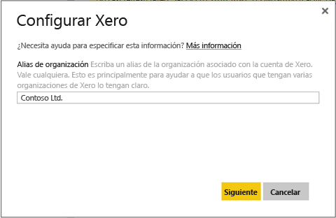
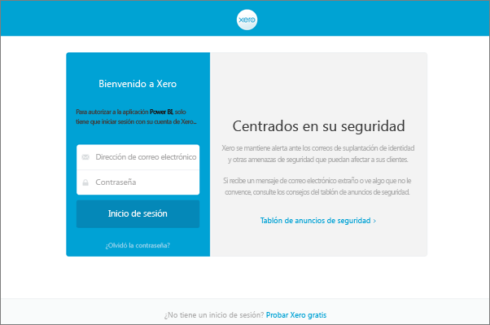
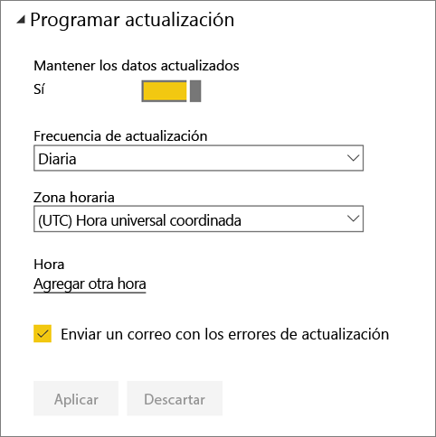
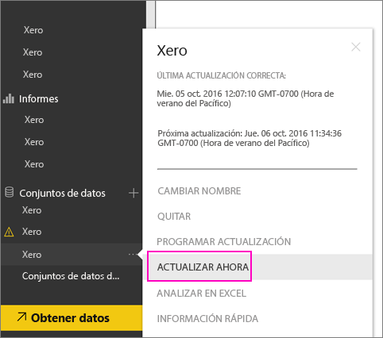

# Actualización de las credenciales del paquete de contenido de Xero después de un error de actualización
Si usa el paquete de contenido de Xero Power BI, quizás haya experimentado algunos problemas con la actualización diaria del paquete de contenido debido a un incidente reciente con el servicio de Power BI.

Puede ver si el paquete de contenido se actualiza correctamente comprobando el estado de la última actualización para el conjunto de datos Xero como se muestra en la captura de pantalla que aparece a continuación.

Si ve que se produce el error de actualización indicado anteriormente, siga estos pasos para renovar sus credenciales del paquete de contenido.

1. Haga clic en los puntos suspensivos (...) junto a su conjunto de datos Xero y, después, haga clic en **Programar actualización**. Se abre la página de configuración para el paquete de contenido de Xero.
   
    
2. En la página **Configuración de Xero**, seleccione **Credenciales del origen de datos** > **Editar credenciales**.
   
    
3. Escriba el nombre de su organización > **Siguiente**.
   
    
4. Inicie sesión con su cuenta de Xero.
   
    
5. Ahora que sus credenciales están actualizadas, asegurémonos de que se establece la ejecución diaria de la programación de actualización. Para ello, haga clic en los puntos suspensivos (...) junto a su conjunto de datos Xero y, después, haga clic en **Programar actualización** de nuevo.
   
    
6. También puede actualizar el conjunto de datos inmediatamente. Haga clic en los puntos suspensivos (...) junto a su conjunto de datos Xero y, después, haga clic en **Actualizar ahora**.
   
    

Si sigue teniendo problemas de actualización, no dude en ponerse en contacto con nosotros en [http://support.powerbi.com](http://support.powerbi.com) 

Para obtener más información sobre el paquete de contenido de Xero para Power BI, consulte la [página de ayuda del paquete de contenido de Xero](service-connect-to-xero.md).

### Pasos siguientes
* ¿Tiene más preguntas? [Pruebe la comunidad de Power BI](http://community.powerbi.com/)

