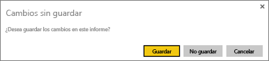
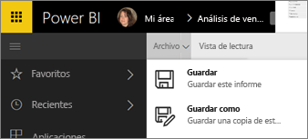

# Almacenamiento de un informe en el servicio Power BI y en Power BI Desktop
Después de cambiar un informe en Power BI, puede guardarlo, guardarlo con un nombre nuevo o simplemente cerrarlo sin guardar los cambios. Supongamos que abre el informe, crea una visualización y la ancla al panel. Si la cierra ahora sin guardar los cambios, el icono permanecerá el panel, pero la visualización no se guarda en el informe. Al hacer clic en ese icono en el panel, se abre el informe, pero la visualización ya no existe.

> [!TIP]
> Preste atención al área de trabajo activa para encontrar el informe guardado. El informe se guarda en el área de trabajo activa.
> 
> 

### Para guardar un informe:
1. Si intenta salir de un informe y el informe tiene cambios, Power Bi mostrará un mensaje.
   
   
2. Otra manera de guardar el informe consiste en seleccionar **ARCHIVO**\>**Guardar** o **Guardar como**. Si se encuentra en [Vista de lectura](service-reading-view-and-editing-view.md) solo verá la opción de Guardar como. 
   
   
3. Si se trata de un nuevo informe (Guardar) o una nueva versión de un informe existente (Guardar como), asígnele un nombre descriptivo.  **El informe se agregará al área de trabajo activa**.
   
    

### Pasos siguientes
Más información sobre [informes de Power BI](service-reports.md)

[Power BI: Conceptos básicos](service-basic-concepts.md)

¿Tiene más preguntas? [Pruebe la comunidad de Power BI](http://community.powerbi.com/)

