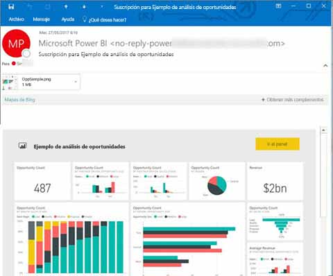
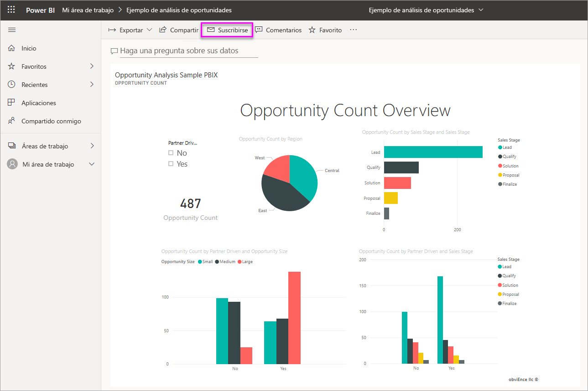
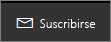
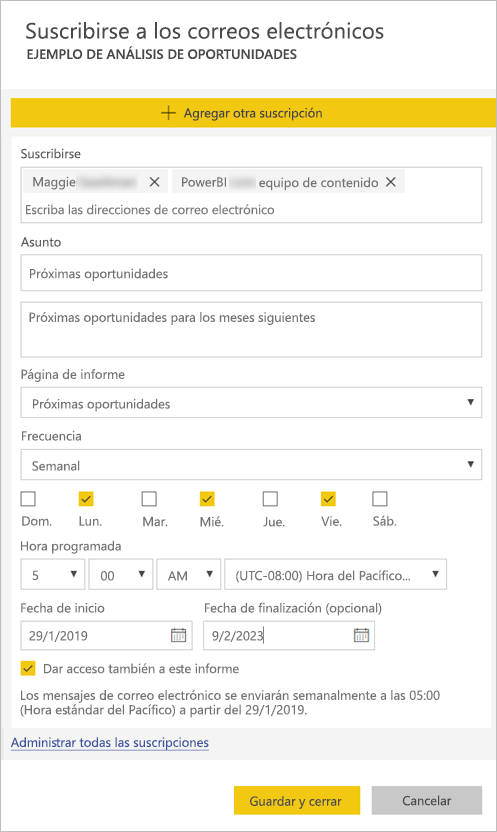
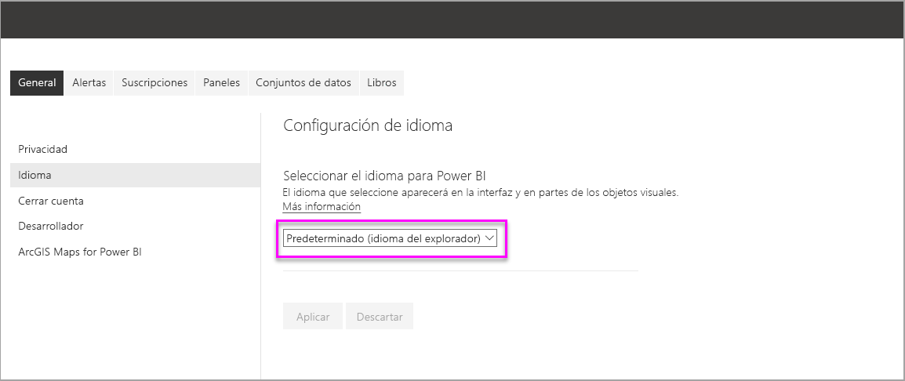
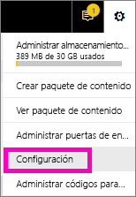
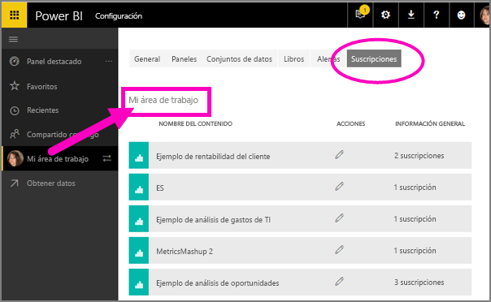

# Suscripción personal y de otros usuarios a informes y paneles en el servicio Power BI

Tanto usted como sus compañeros de trabajo pueden suscribirse a las páginas del informe, paneles e informes paginados que más le interesen. Power BI envía por correo una instantánea a la bandeja de entrada. Puede indicarle a Power BI la frecuencia con la que quiere recibir los mensajes de correo electrónico: cada día, cada semana, cada hora, cada mes o una vez al día después de la actualización de los datos iniciales.  Si se elige la frecuencia diaria, semanal, mensual u horaria, puede elegir la hora a la que le gustaría que se ejecute la suscripción.  En resumen, puede establecer hasta 24 suscripciones distintas por día para cada página de informe y panel.

 

Solo se pueden crear suscripciones en el servicio Power BI. Recibirá un correo electrónico con una instantánea de la página del informe o panel, con un vínculo para abrir el informe o panel. En los dispositivos móviles con aplicaciones de Power BI instaladas, al hacer clic en este vínculo, se inicia la aplicación de Power BI, en lugar de abrir el informe o el panel en el sitio web de Power BI.

## Requisitos

La **creación** de una suscripción puede hacerse por:

- Usuarios con una licencia de Power BI Pro
- Los usuarios que ven contenido en un área de trabajo o aplicación Premium también pueden suscribirse al contenido que se encuentra allí, incluso sin una licencia Power BI Pro.

No necesita permisos de edición para el contenido (panel o informe) para crear una suscripción personal, pero debe tener permisos de edición para crear una para otro usuario. 

## Suscripción a un panel, una página del informe o un informe paginado

El proceso de suscripción a un panel, un informe o un informe paginado es similar. El mismo botón permite suscribirse a los paneles e informes del servicio Power BI.

La suscripción a informes paginados varía un poco. Para obtener más información, consulte [Suscripción personal y de otros usuarios a un informe paginado en el servicio Power BI](paginated-reports-subscriptions.md).
 
.

1. Abra el panel o el informe.
2. En la barra de menús superior, haga clic en **Suscribirse** o en el icono de sobre .
   
   

3. Use el control deslizante amarillo para activar y desactivar la suscripción.  Aunque el control deslizante se establezca en **desactivado**, la suscripción no se elimina. Para eliminarla, seleccione el icono de papelera.

4. El correo electrónico ya está en la bandeja **Suscribirse**. También puede agregar otras direcciones de correo electrónico a la suscripción, pero solo en el mismo dominio. Si el informe o el panel está hospedado en la [capacidad Premium](service-premium-what-is.md), puede suscribir otras direcciones de correo electrónico y alias de grupo. Si el informe o el panel no está hospedado en la capacidad Premium, puede suscribir a otros usuarios, pero también deberán tener licencias de Power BI Pro. Para obtener más detalles, vea [Consideraciones y solución de problemas](#considerations-and-troubleshooting). 

5. Rellene el **asunto** del correo electrónico y los detalles del **mensaje**. 

5. Seleccione una **Frecuencia** para la suscripción: **Diaria**, **Horaria**, **Semanal**, **Mensual** o **Tras la actualización de los datos (una vez al día)** .  Para recibir el correo electrónico de la suscripción solo en días específicos, seleccione **Horaria** o **Semanal**, y elija los días en que quiera recibirla.  Por ejemplo, si quiere recibir el correo de suscripción solo los días laborables, seleccione **Semanal** y desactive las casillas de **Sáb.** y **Dom.** .  Si selecciona **Mensual**, escriba los días del mes en los que quiere recibir el correo de suscripción.  

6. Si elige **Diaria**, **Horaria**, **Mensual** o **Semanal**, también puede elegir una **Hora programada** para la suscripción.  Puede hacer que se ejecute a la hora, o bien pasados 15, 30 o 45 minutos.  Seleccione por la mañana (a. m.) o por la tarde/noche (p. m.). También puede especificar la zona horaria.  Si especifica **Horaria**, seleccione la **Hora programada** en que quiera que se inicie la suscripción, y se ejecutará cada hora a partir de entonces.

7. De forma predeterminada, la fecha de inicio para la suscripción es la fecha en la que la ha creado. Tiene la opción de seleccionar una fecha de finalización. Si no establece una fecha de finalización, automáticamente será un año después de la fecha de inicio. Puede cambiarla a cualquier fecha en el futuro (hasta el año 9999) en cualquier momento antes de que finalice la suscripción. Cuando una suscripción alcanza una fecha de finalización, se detiene hasta que vuelva a habilitarla. Recibirá notificaciones antes de la fecha de finalización programada para preguntarle si quiere ampliarla.    

    En la captura de pantalla siguiente, tenga en cuenta que, cuando se suscribe a un informe, realmente se está suscribiendo a una de sus *páginas*.  Para suscribirse a más de una página de un informe, seleccione **Agregar otra suscripción** y seleccione una página diferente. 
      
     

7. Haga clic en **Guardar y cerrar**. Los que se hayan suscrito reciben un correo electrónico y una instantánea de la página de panel o informe para la frecuencia y la hora que se hayan seleccionado. En total, puede crear hasta 24 suscripciones por informe o panel, y pueden proporcionar destinatarios, horas y frecuencias únicos para cada suscripción.  Todas las suscripciones establecidas en **Tras la actualización de los datos** para el informe o panel solo enviarán un correo electrónico después de la primera actualización programada.   
      
   > [!TIP]
   > ¿Quiere enviar el correo electrónico desde una suscripción al instante o a petición en cualquier momento? Haga clic en **Ejecutar ahora** para las suscripciones del panel o informe que quiera enviar. Verá una notificación en la que se indica que hay un correo electrónico en camino para todos los usuarios de esa suscripción concreta.  Esta acción no cuenta para el límite de 24 ejecuciones de suscripción programadas al día por informe o panel. Esto NO desencadena una actualización de datos del conjunto de datos subyacente. 
   > 
   > 
   
## Idiomas de correo electrónico

En el correo electrónico y la instantánea se usa el idioma establecido en la configuración de Power BI (vea [Idiomas y países o regiones admitidos para Power BI](supported-languages-countries-regions.md)). Si no se ha definido ningún idioma, Power BI usa el idioma de acuerdo con la configuración regional del explorador actual. Para ver o establecer las preferencias de idioma, seleccione el icono de engranaje  > **Configuración > General > Idioma**. 

## Administrar sus suscripciones
Solo la persona que haya creado la suscripción podrá administrarla.  Hay dos rutas de acceso a la pantalla en la que se administran las suscripciones.  El primer paso es seleccionar **Administrar todas las suscripciones** en el cuadro de diálogo **Subscribirse a correos electrónicos** (vea el paso 4 anterior). La segunda es seleccionar el icono de engranaje de Power BI  en la barra de menús superior y elegir **Configuración**.

Las suscripciones concretas que se muestran dependen del área de trabajo que está activa en ese momento.  Para ver a la vez todas las suscripciones de todas las áreas de trabajo, asegúrese de que **Mi área de trabajo** está activa. Para entender las áreas de trabajo, consulte [Áreas de trabajo de Power BI](service-create-workspaces.md).

Una suscripción finaliza si expira la licencia de Pro, el propietario elimina el panel o el informe, o bien se elimina la cuenta de usuario que se ha usado para crear la suscripción.

## Consideraciones y solución de problemas

* Es posible que los paneles con más de 25 iconos anclados, o bien con 4 páginas de informes activos ancladas, no se representen totalmente en los correos electrónicos de la suscripción enviados a los usuarios.  Las suscripciones a los paneles a través de estos números de iconos no están bloqueadas. Sin embargo, si se tienen incidencias se consideran no compatibles. Considere la posibilidad de modificarlas según corresponda para que estén comprendidas entre un rango admitido.
* En raras ocasiones, puede que las suscripciones de correo tarden más de quince minutos en entregarse a los destinatarios. Si esto ocurre, se recomienda ejecutar la actualización de datos y la suscripción de correo electrónico a otras horas para garantizar la entrega puntual. Si la incidencia persiste, póngase en contacto con el soporte técnico de Power BI.
* En las suscripciones de correo de panel, si se ha aplicado la seguridad de nivel de fila (RLS) a algún icono, ese icono no se muestra.  
* En cuanto a las suscripciones de correo de informe, si el conjunto de datos usa RLS, podrá crear una suscripción para usted. No puede suscribir a otros usuarios a un informe en el que se haya aplicado la seguridad de nivel de fila (RLS), excepto si usa un informe paginado, lo que le permitirá enviar la suscripción a otros usuarios mediante el uso de su contexto de seguridad. 
* Las suscripciones a una página del informe están asociadas con el nombre de la página del informe. Si se suscribe a una página del informe y después cambia el nombre, tendrá que volver a crear la suscripción.
* Su organización puede configurar ciertos parámetros en Azure Active Directory que limitan la capacidad de usar las suscripciones de correo electrónico en Power BI.  Estas limitaciones incluyen, entre otras, la autenticación multifactor o restricciones de intervalo de IP al acceder a los recursos.
* Actualmente, en las suscripciones por correo electrónico de informes o paneles que usen conjuntos de datos de conexiones activas, no se permite suscribir a usuarios distintos del suyo, excepto si usa un informe paginado, lo que le permitirá enviar la suscripción a otros usuarios mediante el uso de su contexto de seguridad. 
* Las suscripciones de correo electrónico no admiten la mayoría de los [objetos visuales personalizados](power-bi-custom-visuals.md).  La única excepción son esos objetos visuales personalizados que se han [certificado](power-bi-custom-visuals-certified.md).  
* En la actualidad, las suscripciones de correo electrónico no admiten los objetos visuales personalizados con la tecnología de R.  
* Las suscripciones de correo electrónico se envían con los estados de segmentación y filtros predeterminados del informe. En el correo electrónico no se muestran los cambios en los valores predeterminados que realice tras suscribirse.  Los informes paginados admiten esta función y le permiten establecer valores de parámetros específicos por suscripción.   
* Para las suscripciones de paneles en concreto, todavía no se admiten ciertos tipos de iconos.  Entre estos se incluyen: transmisión en secuencias de mosaicos, iconos de vídeo, iconos de contenido web personalizado.     
* Si comparte un panel con un compañero de trabajo fuera de su inquilino, tampoco puede crear una suscripción para él. Por tanto, si es aaron@xyz.com, podrá compartir con anyone@ABC.com, pero todavía no podrá suscribir a anyone@ABC.com, y ese usuario no podrá suscribirse al contenido compartido.      
* Power BI detiene de forma automática la actualización en los conjuntos de datos asociados con los paneles e informes que no se han visitado en más de dos meses.  Pero si agrega una suscripción a un panel o informe, no se detiene incluso si no recibe visitas.    
* Si no recibe los mensajes de correo electrónico de suscripción, asegúrese de que el nombre principal de usuario (UPN) puede recibirlos. 
* Si el panel o el informe están en la capacidad Premium, puede usar el alias de correo electrónico del grupo para las suscripciones en lugar de suscribir las direcciones de correo electrónico de sus compañeros de trabajo de una en una. Los alias se basan en el directorio actual de Active Directory. 

## Pasos siguientes

- [Suscripción personal y de otros usuarios a un informe paginado en el servicio Power BI](paginated-reports-subscriptions.md)
- ¿Tiene más preguntas? [Pruebe a preguntar a la comunidad de Power BI](http://community.powerbi.com/)    
- [Leer la entrada del blog](https://powerbi.microsoft.com/blog/introducing-dashboard-email-subscriptions-a-360-degree-view-of-your-business-in-your-inbox-every-day/)
