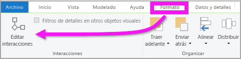
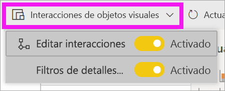
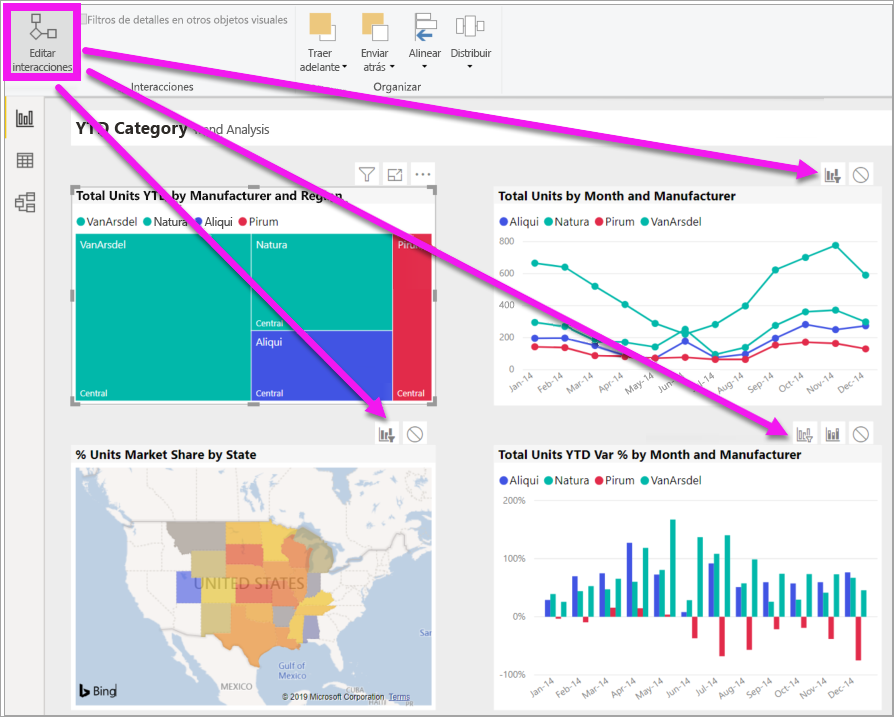

# Cambiar cómo interactúan los objetos visuales en un informe de Power BI
Si tiene permisos de edición de un informe, puede usar las **Interacciones de objetos visuales** para cambiar cómo afectan las visualizaciones de una página de informe entre sí. 

## Introducción a las interacciones de objetos visuales
De forma predeterminada, las visualizaciones en una página de informe pueden usarse para el filtro cruzado y el resaltado cruzado de las otras visualizaciones en la página.
Por ejemplo, la selección de un estado en una visualización de mapa resalta el gráfico de columnas y filtra el gráfico de líneas para mostrar solo los datos aplicables a ese estado.
Consulte [Filtros y resaltado en informes de Power BI](power-bi-reports-filters-and-highlighting.md). Si tiene una visualización compatible con la [obtención de detalles](consumer/end-user-drill.md), de manera predeterminada, la obtención de detalles de una visualización no afecta a otras visualizaciones de la página de informe. Estos comportamientos se pueden reemplazar, así como se pueden establecer interacciones, en cada visualización, individualmente.

En este artículo se muestra cómo usar las **interacciones de objetos visuales** de Power BI Desktop. El proceso es el mismo de la [Vista de edición](service-interact-with-a-report-in-editing-view.md) del servicio Power BI. Si solo tiene acceso de Vista de lectura o si el informe se le compartió, no podrá cambiar la configuración de las interacciones de objetos visuales.

Los términos *filtro cruzado* y *resaltado cruzado* se usan para distinguir el comportamiento que aquí se describe de lo que sucede cuando se usa el panel **Filtros** para *filtrar* y *resaltar* visualizaciones.  

> [!NOTE]
> En este vídeo se usan versiones anteriores de Power BI Desktop y del servicio Power BI. 
>
>

<iframe width="560" height="315" src="https://www.youtube.com/embed/N_xYsCbyHPw?list=PL1N57mwBHtN0JFoKSR0n-tBkUJHeMP2cP" frameborder="0" allowfullscreen></iframe>

## Habilitación de los controles de interacción de objetos visuales
Si tiene permisos de edición para un informe, puede activar los controles de interacción de objetos visuales y, a continuación, personalizar el modo en que las visualizaciones de la página del informe se filtran y resaltan entre sí. 

1. Seleccione una visualización para activarla.  
2. Muestre las opciones de **Interacciones de objetos visuales**.
    

    - En Escritorio, seleccione **Formato > Interacciones**.

        

    - En el servicio Power BI, abra el informe en la Vista de edición y seleccione la lista desplegable de la barra de menús del informe.

        

3. Para mostrar los controles de interacción de objetos visuales, seleccione **Editar interacciones**. Power BI agrega iconos de filtro y de resaltado a todas las demás visualizaciones de la página de informe. Podemos ver que el mapa de árbol aplica un filtrado cruzado al gráfico de líneas y al mapa, y que aplica un resaltado cruzado al gráfico de columnas. Ahora puede cambiar el modo en que la visualización seleccionada interactúa con las otras visualizaciones en la página del informe.
   
    

## Cambio del comportamiento de la interacción
Familiarícese con el modo en que las visualizaciones interactúan mediante la selección de cada visualización de la página del informe, una a la vez.  Seleccione un punto de datos, una barra o una forma y observe el impacto en las otras visualizaciones. Si el comportamiento que ve no es el esperado, puede cambiar las interacciones. Estos cambios se guardan con el informe, de modo que usted y los consumidores del informe tendrán la misma experiencia de interacción de objetos visuales.

Para comenzar, seleccione una visualización para activarla.  Observe que todas las demás visualizaciones de la página muestran ahora iconos de interacción. El icono en negrita es el que se está aplicando. A continuación, determine qué efecto quiere que tenga la **visualización seleccionada** sobre los demás.  Opcionalmente, repita el proceso para todas las otras visualizaciones en la página del informe.

Si la visualización seleccionada:
   
   * debe aplicar un filtrado cruzado a las demás visualizaciones de la página, seleccione el icono de **filtro** en la esquina superior derecha del  de esa visualización.
   * debe aplicar un resaltado cruzado a una de las otras visualizaciones de la página, seleccione el icono de **resaltado** .
   * no tiene ningún efecto sobre una de las otras visualizaciones de la página, seleccione el icono de **sin efecto** .

## Cambio de las interacciones de las visualizaciones más detalladas
[Ciertas visualizaciones de Power BI se pueden explorar](consumer/end-user-drill.md). De manera predeterminada, cuando se explora una visualización, no tiene ningún impacto en las demás visualizaciones de la página del informe. Pero ese comportamiento se puede modificar. 

> [!TIP]
> Pruébelo usted mismo con el [archivo PBIX de ejemplo de recursos humanos](https://download.microsoft.com/download/6/9/5/69503155-05A5-483E-829A-F7B5F3DD5D27/Human%20Resources%20Sample%20PBIX.pbix). Hay un gráfico de columnas con una exploración en profundidad en la pestaña **Nuevas contrataciones**.
>

1. Seleccione el objeto visual detallado para activarlo. 

2. Seleccione el icono de exploración en profundidad para activar la exploración en profundidad.

    

2. En la barra de menús, seleccione **Formato** > **Filtros de detalles en otros objetos visuales**.  Ahora, al explorar una visualización, las demás visualizaciones de la página de informes cambiarán para reflejar la selección de obtención de detalles actual. 

    

3. Si el comportamiento que ve no es el esperado, puede cambiar las interacciones [como se ha descrito anteriormente](#change-the-interaction-behavior).
    
## Pasos siguientes
[Filtrado y resaltado en informes de Power BI](power-bi-reports-filters-and-highlighting.md)