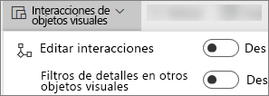
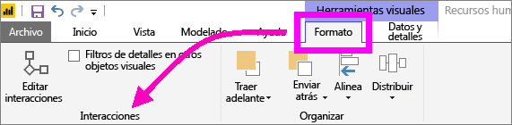
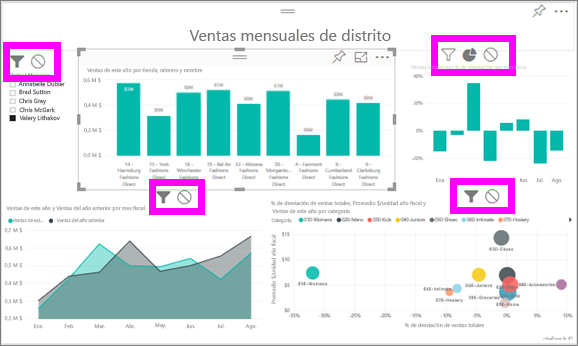

# Interacciones de visualización en un informe de Power BI
Si tiene permisos de edición de un informe, puede usar las **Interacciones de objetos visuales** para cambiar cómo afectan las visualizaciones de una página de informe entre sí. 

De forma predeterminada, las visualizaciones en una página de informe pueden usarse para el filtro cruzado y el resaltado cruzado de las otras visualizaciones en la página.
Por ejemplo, la selección de un estado en una visualización de mapa resalta el gráfico de columnas y filtra el gráfico de líneas para mostrar solo los datos aplicables a ese estado.
Consulte [Filtros y resaltado en informes de Power BI](power-bi-reports-filters-and-highlighting.md). Si tiene una visualización compatible con la [obtención de detalles](power-bi-visualization-drill-down.md), de manera predeterminada, la obtención de detalles de una visualización no afecta a otras visualizaciones de la página de informe. Estos comportamientos se pueden reemplazar, así como se pueden establecer interacciones, en cada visualización, individualmente.

En este artículo se le enseña a usar **interacciones de objetos visuales** en el servicio Power BI [Vista de edición](service-interact-with-a-report-in-editing-view.md) y en Power BI Desktop. Si alguien ha compartido un informe con usted, no podrá cambiar la configuración de interacciones de objetos visuales.

> [!NOTE]
> Los términos *filtro cruzado* y *resaltado cruzado* se usan para distinguir el comportamiento que aquí se describe de lo que sucede cuando se usa el panel **Filtros** para filtrar y resaltar visualizaciones.  
> 
> 

<iframe width="560" height="315" src="https://www.youtube.com/embed/N_xYsCbyHPw?list=PL1N57mwBHtN0JFoKSR0n-tBkUJHeMP2cP" frameborder="0" allowfullscreen></iframe>

1. Seleccione una visualización para activarla.  
2. Muestre las opciones de **Interacciones de objetos visuales**.
    - En el servicio Power BI, seleccione el menú desplegable de la barra de menús de informes.

       

    - En Escritorio, seleccione **Formato > Interacciones**.

        

3. Para activar los controles de interacción de objetos visuales, seleccione **Editar interacciones**. Power BI agrega iconos de filtro cruzado y de resaltado cruzado a todas las demás visualizaciones de la página de informe.
   
    
3. Determine el impacto que tendrá la visualización seleccionada en las otras.  Opcionalmente, repita el proceso para todas las otras visualizaciones en la página del informe.
   
   * Si debe aplicar un filtro cruzado a la visualización, seleccione el icono de **filtro** .
   * Si debe aplicar un resaltado cruzado a la visualización, seleccione el icono de **resaltado** .
   * Si no debe tener ningún impacto, seleccione el icono de **sin impacto** .

4. Para activar los controles de obtención de detalles, seleccione **Filtros de detalles en otros objetos visuales**.  Ahora, al explorar una visualización, las demás visualizaciones de la página de informes cambiarán para reflejar la selección de obtención de detalles actual. 

   

### Pasos siguientes
[Uso de filtros de informe](power-bi-how-to-report-filter.md)

[Filtrado y resaltado en informes](power-bi-reports-filters-and-highlighting.md)

[Power BI: Conceptos básicos](service-basic-concepts.md)

¿Tiene más preguntas? [Pruebe la comunidad de Power BI](http://community.powerbi.com/)

