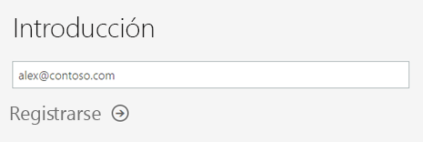
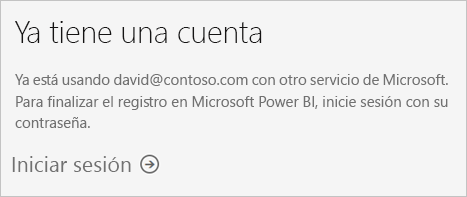
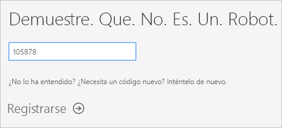
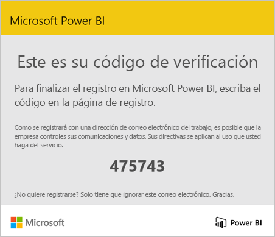
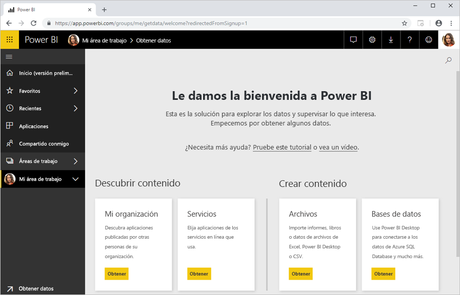

# Registro en Power BI como usuario individual

Power BI puede convertirse en su herramienta personal de análisis y visualización de datos, así como actuar como el motor de análisis y de decisión que dé impulso a proyectos en grupo, divisiones o empresas enteras. En este artículo se explica cómo registrarse en Power BI como usuario individual. Si es un administrador de Power BI, consulte [Licencias de Power BI en la organización](service-admin-licensing-organization.md).

## Direcciones de correo electrónico admitidas

Antes de comenzar el proceso de registro, es importante que conozca los tipos de direcciones de correo electrónico que puede usar para registrarse en Power BI:

* Power BI requiere que use una dirección de correo electrónico profesional o educativa para registrarse. No puede registrarse con direcciones de correo electrónico de proveedores de telecomunicaciones o de servicios de correo electrónico de consumidor. Esto incluye outlook.com, hotmail.com o gmail.com, entre otras.

* Una vez que se haya registrado, puede [invitar a usuarios](https://docs.microsoft.com/azure/active-directory/active-directory-b2b-what-is-azure-ad-b2b) para que vean su contenido de Power BI con cualquier dirección de correo electrónico, incluso con cuentas personales.

* Puede registrarse en Power BI con direcciones .gov o .mil, pero se requiere otro proceso. Consulte [Inscribir una organización de la Administración Pública de Estados Unidos en el servicio Power BI](service-govus-signup.md) para más información.

## Registrarse para obtener una cuenta de Power BI

Siga estos pasos para registrarse para obtener una prueba de Power BI. Una vez completado este proceso, tendrá una licencia de Power BI (gratis) que puede usar para probar Power BI por su cuenta mediante Mi área de trabajo, usar contenido de un área de trabajo de Power BI asignada a una capacidad de Power BI Premium o iniciar una prueba de Power BI Pro individual. Para obtener más información, vea [Características de Power BI por tipo de licencia](service-features-license-type.md). 

1. Vaya a la [página de registro](https://signup.microsoft.com/signup?sku=a403ebcc-fae0-4ca2-8c8c-7a907fd6c235).

1. Escriba su dirección de correo electrónico y haga clic en **Suscribirse**.

    

1. Si recibe un mensaje similar a este, elija una opción para recibir un código de verificación y, después, continúe con el siguiente paso de este procedimiento.

    

    Si recibe un mensaje similar a este, complete los pasos para iniciar sesión y usar Power BI.

    

1. Escriba el código que ha recibido y haga clic en **Suscribirse**.

    

1. Compruebe si tiene algún mensaje similar a este en su correo electrónico.

    

1. En la siguiente pantalla, escriba su información y el código de verificación del correo electrónico. Seleccione una región, consulte las directivas que están vinculadas desde esta pantalla y, después, haga clic en **Iniciar**.

    

1. Se le dirige a la [página de inicio de sesión de Power BI](https://powerbi.microsoft.com/landing/signin/) y ya puede empezar a usar Power BI.

    

## Expiración de la prueba

Después de completar el proceso, puede registrarse para obtener una prueba de evaluación gratuita de Power BI Pro en el servicio Power BI. Cuando expire el período de evaluación gratuita, la licencia volverá a cambiar a una licencia de Power BI (gratis). Después de que esto suceda, ya no tendrá acceso a las características que requieren una licencia de Power BI Pro. Para obtener más información, vea [Características por tipo de licencia](service-features-license-type.md).

Si solo necesita una licencia de Power BI (gratis), ya no tiene que hacer nada más. Para poder aprovechar las características de Power BI Pro, póngase en contacto con su administrador de TI para comprar una licencia de Power BI Pro.

## Solución de problemas con el proceso de registro

En la mayoría de los casos, puede registrarse en Power BI si sigue el proceso descrito. En la tabla siguiente se describen algunos de los problemas que pueden impedir que se registre junto con posibles soluciones.

| Síntoma o mensaje de error | Causa y solución alternativa |
| ----------------------- | -------------------- |
| <strong>Direcciones de correo electrónico personales (por ejemplo nancy@gmail.com)</strong> Recibirá un mensaje parecido a este durante el registro:    *Escribió una dirección de correo electrónico personal: escriba su dirección de correo electrónico de trabajo para que podamos almacenar con seguridad los datos de su compañía.*    o bien    *Escribió una dirección de correo electrónico personal. Escriba la dirección de trabajo para que podamos conectarle con otras personas de su empresa. Y no se preocupe. No compartiremos su dirección con nadie.* | Power BI no admite direcciones de correo electrónico de proveedores de telecomunicaciones o servicios de correo electrónico de consumidor.    Para finalizar el registro, inténtelo de nuevo mediante una dirección de correo electrónico asignada, profesional o educativa.    Si todavía no puede suscribirse pero puede completar un proceso de instalación más avanzado, [regístrese para obtener una nueva suscripción de prueba de Office 365 y use ese correo electrónico para suscribirse](service-admin-signing-up-for-power-bi-with-a-new-office-365-trial.md).    También puede hacer que un usuario existente [le invite](service-admin-azure-ad-b2b.md). |
| **Registro de autoservicio deshabilitado**: Recibirá un mensaje parecido a este durante el registro:    *No podemos completar la suscripción. El departamento de TI desactivó la suscripción de Microsoft Power BI. Póngase en contacto con ellos para completar la suscripción.*    o bien    *Escribió una dirección de correo electrónico personal. Escriba la dirección de trabajo para que podamos conectarle con otras personas de su empresa. Y no se preocupe. No compartiremos su dirección con nadie.* | El administrador de TI de su organización ha deshabilitado la suscripción de autoservicio para Power BI.    Para finalizar el registro, póngase en contacto con su administrador de TI y pídale que [siga las instrucciones para habilitar el registro](service-admin-licensing-organization.md#enable-or-disable-individual-user-sign-up-in-azure-active-directory).    También puede experimentar este problema si se [ha suscrito a Office 365 a través de un asociado](service-admin-syndication-partner.md). |
| **La dirección de correo electrónico no es un identificador de Office 365** Recibirá un mensaje parecido a este durante el registro:    *No lo hemos encontrado en contoso.com.  ¿Usa un identificador diferente en el trabajo o en el colegio?    Pruebe a iniciar sesión con el identificador y, si no funciona, póngase en contacto con el departamento de TI.* | Su organización usa identificadores para iniciar sesión en Office 365 y otros servicios de Microsoft que son diferentes de su dirección de correo electrónico.  Por ejemplo, su dirección de correo electrónico podría ser Nancy.Smith@contoso.com pero el identificador es nancys@contoso.com.    Para finalizar el registro, use el identificador que su organización le haya asignado para iniciar sesión en Office 365 u otros servicios Microsoft.  Si no sabe cuál es, póngase en contacto con el administrador de TI.    Si todavía no puede suscribirse pero puede completar un proceso de instalación más avanzado, [regístrese para obtener una nueva suscripción de prueba de Office 365 y use ese correo electrónico para suscribirse](service-admin-signing-up-for-power-bi-with-a-new-office-365-trial.md). |

## Pasos siguientes

[Adquisición de Power BI Pro](service-admin-purchasing-power-bi-pro.md)  
[Acuerdo de servicio de Power BI para usuarios individuales](https://powerbi.microsoft.com/terms-of-service/)  

¿Tiene más preguntas? [Pruebe a preguntar a la comunidad de Power BI](https://community.powerbi.com/)
